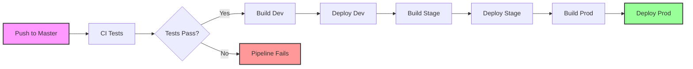
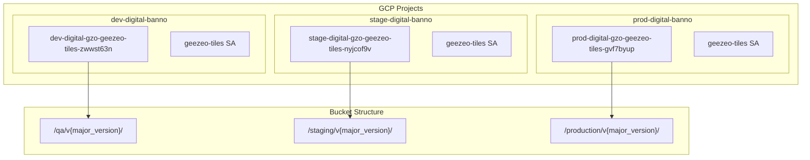
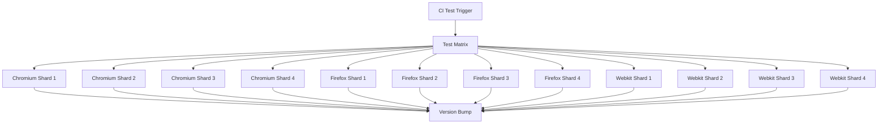

# Responsive Tiles GitHub Actions & GCS Configuration Analysis

## TLDR Section

- **3-Stage Deployment Pipeline**: Automated sequential deployment from dev → stage → prod with GCS bucket isolation
- **Workload Identity Federation**: Secure GCP authentication without storing service account keys
- **Environment-Specific Buckets**: Each environment has unique GCS buckets with cryptographic suffixes for security
- **Playwright Testing Matrix**: Parallel testing across 3 browsers with 4-way sharding for performance

## Detailed Documentation

### Workflow Inventory

#### 1. deployment.yml (Main Orchestrator)
- **Purpose**: Main deployment workflow orchestrating the complete CI/CD pipeline
- **Trigger**: Push to master branch or manual workflow dispatch
- **Flow**: Sequential deployment through dev → stage → prod environments
- **Concurrency**: Cancels in-progress runs when new pushes occur

#### 2. workflow-tiles-build-deploy.yml (Reusable Build/Deploy)
- **Purpose**: Reusable workflow for building and deploying tiles to GCS
- **Type**: Called workflow (workflow_call)
- **Functions**:
  - Node.js setup and dependency installation
  - Linting and building the application
  - Artifact staging and GCS upload
  - Slack notifications for deployment status

#### 3. workflow-tiles-ci-test.yml (Testing Pipeline)
- **Purpose**: Automated testing with Playwright across multiple browsers
- **Type**: Called workflow (workflow_call)
- **Features**:
  - Matrix testing: 3 browsers × 4 shards = 12 parallel jobs
  - Auto version bumping on successful tests
  - Playwright dependency management

### GCP Configurations

#### Environment-Specific Parameters

| Environment | GCP Project ID | Hosting Bucket | Bucket Suffix | Deploy Folder |
|-------------|---------------|----------------|---------------|---------------|
| **Dev** | dev-digital-banno | dev-digital-gzo-geezeo-tiles-zwwst63n | zwwst63n | qa |
| **Stage** | stage-digital-banno | stage-digital-gzo-geezeo-tiles-nyjcof9v | nyjcof9v | staging |
| **Prod** | prod-digital-banno | prod-digital-gzo-geezeo-tiles-gvf7byup | gvf7byup | production |

#### Security Configurations

1. **Workload Identity Federation**
   - Provider: `projects/423509969265/locations/global/workloadIdentityPools/gha-cldteam-pool-58a241b9/providers/gha-cldteam-provid-58a241b9`
   - Service Account Pattern: `geezeo-tiles@{gcp_project_id}.iam.gserviceaccount.com`
   - Token Format: Access token for GCS operations

2. **GitHub Permissions**
   ```yaml
   permissions:
     actions: read
     checks: write
     contents: write
     id-token: write  # Required for Workload Identity
   ```

3. **Bucket Security**
   - Unique cryptographic suffixes per environment
   - Service account-based access control
   - Environment-specific project isolation

### Integration Points

1. **GitHub Actions → GCP**
   - Authentication via Workload Identity Federation
   - Direct upload to GCS using google-github-actions/upload-cloud-storage
   - Version-based folder structure: `{bucket}/{deploy_folder}/v{major_version}`

2. **Build → Deploy Handoff**
   - Artifact staging through GitHub Actions artifacts
   - Run ID tracking for artifact retrieval
   - Version tag propagation from package.json

3. **Monitoring & Notifications**
   - Optional Slack integration for deployment notifications
   - Deployment status tracking with success/failure messages

## Visual Documentation

### Deployment Pipeline Flow


### GCS Bucket Architecture


### Testing Matrix Strategy


## Parameterization

### Configurable Inputs

#### Build/Deploy Workflow Parameters
```yaml
inputs:
  gcp_environment_name:     # Environment name (dev/stage/prod)
  environment:              # GitHub environment
  node_base_version:        # Node.js version (default: 14.20.1)
  content_paths:            # Artifact paths (default: dist/)
  project_name:             # Application name (default: tiles)
  slack_channel:            # Optional Slack channel ID
  service_account_name:     # GCP SA name (default: geezeo-tiles)
  env_vars:                 # Comma-separated env vars
  gcp_project_id:           # GCP project ID
  gcp_hosting_bucket:       # GCS bucket name
  gcp_bucket_project_id:    # Bucket's project ID
```

#### Environment Variables Format
```
DEPLOY_FOLDER:'qa',ENV:'development',BUCKET_SUFFIX:'zwwst63n',DEPLOY_BUCKET_SUFFIX:'zwwst63n',NODE_ENV:'production'
```

### Default Values
- Node.js Version: 14.20.1
- Content Paths: dist/
- Project Name: tiles
- Service Account: geezeo-tiles
- Test Shards: 4 per browser
- Test Browsers: chromium, firefox, webkit

## AI Memory Optimization

### Quick Reference Headers

#### **[GCP-BUCKETS]** Environment Bucket Mapping
- Dev: `dev-digital-gzo-geezeo-tiles-zwwst63n`
- Stage: `stage-digital-gzo-geezeo-tiles-nyjcof9v`
- Prod: `prod-digital-gzo-geezeo-tiles-gvf7byup`

#### **[GCP-PROJECTS]** Project IDs
- Dev: `dev-digital-banno`
- Stage: `stage-digital-banno`
- Prod: `prod-digital-banno`

#### **[WORKLOAD-IDENTITY]** Authentication
- Pool: `gha-cldteam-pool-58a241b9`
- Provider: `gha-cldteam-provid-58a241b9`
- Project Number: `423509969265`

#### **[DEPLOYMENT-FLOW]** Pipeline Stages
1. CI Tests (Playwright matrix)
2. Dev Build & Deploy
3. Stage Build & Deploy
4. Prod Build & Deploy

#### **[VERSIONING]** Deployment Structure
- Pattern: `{bucket}/{environment}/v{major_version}/`
- Version Source: package.json
- Major Version Extraction: `jq -r '.version' | cut -d. -f1`

### Cross-References
- **Security**: See [WORKLOAD-IDENTITY] for authentication details
- **Buckets**: See [GCP-BUCKETS] for environment-specific storage
- **Pipeline**: See [DEPLOYMENT-FLOW] for execution order
- **Parameters**: See Configurable Inputs section for customization options