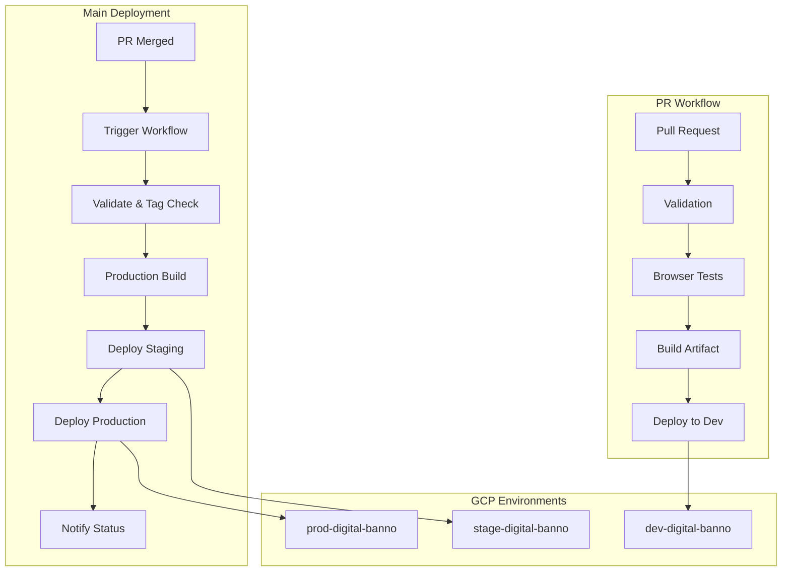
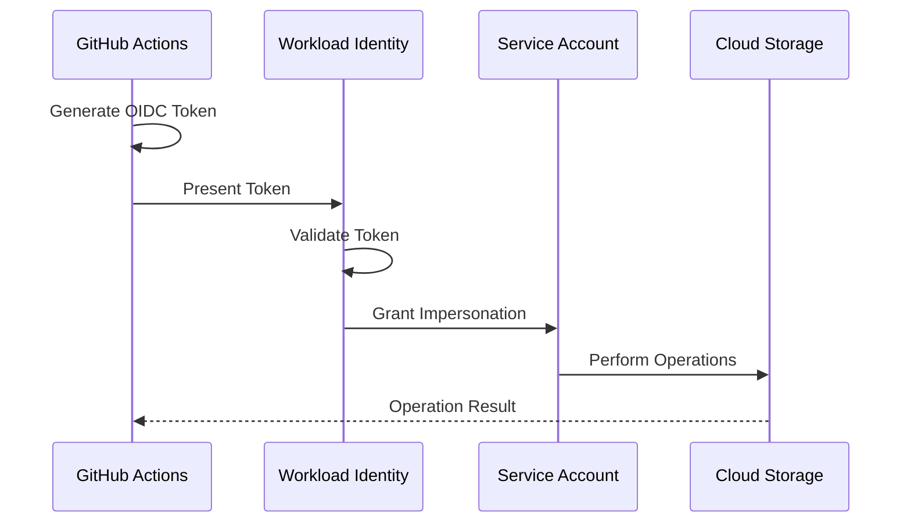
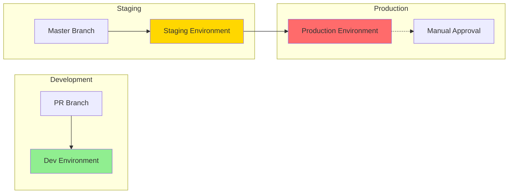

# GitHub Actions Workflows and GCP Configuration Analysis

## TLDR Section

- **3 Workflows**: PR validation with dev deployment, main branch deployment to staging/production, and post-merge trigger workflow
- **3 GCP Projects**: `dev-digital-banno` (development), `stage-digital-banno` (staging), `prod-digital-banno` (production)
- **Workload Identity Federation**: Uses standardized pool/provider across all environments for keyless authentication
- **Progressive Deployment**: PR → Dev → Staging → Production with automated gates and manual approval for production

## Detailed Documentation

### 1. Workflow Inventory

#### 1.1 PR Validation & Development Deployment (`pr-workflow.yml`)
- **Trigger**: Pull requests to master (opened, synchronize)
- **Purpose**: Validate code quality, run tests, and deploy to development environment
- **Jobs**:
  - `validation`: Linting, build checks, version consistency
  - `tests`: Playwright browser tests (Chromium, Firefox)
  - `build`: Create deployment artifacts
  - `deploy-dev`: Deploy to development GCS bucket

#### 1.2 Main Deployment Workflow (`main-deployment.yml`)
- **Trigger**: Push to master branch or manual workflow dispatch
- **Purpose**: Progressive deployment through staging to production
- **Jobs**:
  - `validate`: Version verification, linting, git tag check
  - `build`: Production build creation
  - `deploy-staging`: Deploy to staging environment
  - `deploy-production`: Deploy to production (requires staging success)
  - `notify`: Deployment summary and status reporting

#### 1.3 Post-Merge Deployment (`merged-workflow.yml`)
- **Trigger**: PR closed event on master branch (only if merged)
- **Purpose**: Automatically trigger main deployment workflow after PR merge
- **Jobs**:
  - `deploy-if-merged`: Triggers main-deployment.yml via workflow dispatch

### 2. GCP Configuration

#### 2.1 Environment Matrix

| Environment | GCP Project ID | GCS Bucket | Service Account |
|-------------|----------------|------------|-----------------|
| Development | `dev-digital-banno` | `dev-digital-gzo-geezeo-tiles-zwwst63n` | `geezeo-tiles@dev-digital-banno.iam.gserviceaccount.com` |
| Staging | `stage-digital-banno` | `stage-digital-gzo-geezeo-tiles-nyjcof9v` | `geezeo-tiles@stage-digital-banno.iam.gserviceaccount.com` |
| Production | `prod-digital-banno` | `prod-digital-gzo-geezeo-tiles-gvf7byup` | `geezeo-tiles@prod-digital-banno.iam.gserviceaccount.com` |

#### 2.2 Workload Identity Federation
- **Pool**: `projects/423509969265/locations/global/workloadIdentityPools/gha-cldteam-pool-58a241b9`
- **Provider**: `gha-cldteam-provid-58a241b9`
- **Purpose**: Keyless authentication from GitHub Actions to GCP

#### 2.3 Storage Structure
All environments use consistent path structure:
- Main application: `gs://<bucket>/<environment>/v2/`
- Documentation: `gs://<bucket>/<environment>/v2/docs/`

### 3. Security Configuration

#### 3.1 GitHub Permissions
- **PR Workflow**: `contents:read`, `id-token:write`, `pull-requests:write`
- **Main Deployment**: `contents:read`, `id-token:write`, `actions:read`, `checks:write`
- **Merge Trigger**: `contents:read`, `id-token:write`, `actions:write`, `pull-requests:write`

#### 3.2 Authentication Flow
1. GitHub Actions requests OIDC token
2. Token exchanged with Workload Identity Pool
3. Service account impersonation granted
4. GCS operations performed with service account credentials

### 4. Integration Points

#### 4.1 Version Management
- Single source of truth: `package.json`
- Version extracted via: `node -p "require('./package.json').version"`
- Git tags required for production releases

#### 4.2 Build System
- Node.js 20.18.1 (standardized across all workflows)
- NPM for dependency management
- Webpack for production builds
- Playwright for browser testing

#### 4.3 Deployment URLs
- **Development**: `https://geezeo.geezeo.banno-development.com/qa/v2/index.html`
- **Staging**: `https://stage-digital-gzo-geezeo-tiles-nyjcof9v.storage.googleapis.com/staging/v2/index.html`
- **Production**: `https://prod-digital-gzo-geezeo-tiles-gvf7byup.storage.googleapis.com/production/v2/index.html`

## Visual Documentation

### Deployment Flow Diagram



### Authentication Architecture



### Environment Promotion Path



## Parameterization

### Configurable Inputs

#### Environment Variables
```yaml
# Base configuration
NODE_VERSION: "20.18.1"
DEPLOY_FOLDER: "qa|staging|production"
ENV: "development|staging|production"

# GCP configuration
GCP_PROJECT_ID: "${environment}-digital-banno"
GCP_HOSTING_BUCKET: "${environment}-digital-gzo-geezeo-tiles-${suffix}"
SERVICE_ACCOUNT: "geezeo-tiles@${GCP_PROJECT_ID}.iam.gserviceaccount.com"

# Workload Identity (shared across environments)
WORKLOAD_IDENTITY_PROVIDER: "projects/423509969265/locations/global/workloadIdentityPools/gha-cldteam-pool-58a241b9/providers/gha-cldteam-provid-58a241b9"
```

#### Workflow Inputs
```yaml
# Manual workflow dispatch
workflow_dispatch:
  inputs:
    environment:
      description: 'Target environment'
      required: true
      type: choice
      options:
        - development
        - staging
        - production
```

### Default Values

| Parameter | Default | Notes |
|-----------|---------|-------|
| `NODE_VERSION` | `20.18.1` | Standardized across all workflows |
| `ARTIFACT_RETENTION` | `30 days` (production), `7 days` (PR) | Artifact cleanup policy |
| `PLAYWRIGHT_TIMEOUT` | `120000ms` | CI test timeout |
| `CONCURRENCY_GROUP` | `${{ github.repository }}-${{ github.ref }}` | Prevents parallel deployments |

## AI Memory Optimization

### Quick Reference Headers

#### 🚀 Deployment Commands
- **Trigger PR Build**: Open/update PR to master
- **Deploy to Production**: Push to master with proper git tag
- **Manual Deploy**: Use workflow dispatch on `main-deployment.yml`

#### 🔧 Environment URLs
- **Dev**: `https://geezeo.geezeo.banno-development.com/qa/v2/index.html`
- **Stage**: `https://stage-digital-gzo-geezeo-tiles-nyjcof9v.storage.googleapis.com/staging/v2/index.html`
- **Prod**: `https://prod-digital-gzo-geezeo-tiles-gvf7byup.storage.googleapis.com/production/v2/index.html`

#### 🔐 Security Contexts
- **Workload Identity Pool**: `gha-cldteam-pool-58a241b9`
- **Service Account Pattern**: `geezeo-tiles@${project}.iam.gserviceaccount.com`
- **Required Permissions**: `id-token:write` for all deployments

#### 📦 Build Artifacts
- **PR Artifacts**: `tiles-pr-${PR_NUMBER}-${VERSION}`
- **Production Artifacts**: `tiles-production-${VERSION}`
- **Retention**: 7 days (PR), 30 days (production)

### Cross-Reference Links

- **Related Configurations**:
  - See `webpack.config.js` for build configuration
  - See `package.json` for version management
  - See `playwright.config.js` for test configuration

- **External Dependencies**:
  - GitHub Actions: `actions/checkout@v4`, `actions/setup-node@v4`
  - GCP Actions: `google-github-actions/auth@v2`, `google-github-actions/setup-gcloud@v2`
  - Utility Actions: `actions/github-script@v7`, `actions/upload-artifact@v4`

### Troubleshooting Quick Guide

| Issue | Solution |
|-------|----------|
| "Resource not accessible" | Check WORKFLOW_PAT secret configuration |
| Version mismatch | Run `npm run prepare-release` locally |
| Deployment verification fails | Check GCS bucket permissions and paths |
| Playwright tests timeout | Increase PLAYWRIGHT_TIMEOUT in workflow |
| Workload Identity fails | Verify service account bindings in GCP IAM |

## Summary

The responsive-tiles project uses a sophisticated CI/CD pipeline with:
- **3-stage deployment**: Development → Staging → Production
- **Automated testing**: Browser tests on PR, build validation
- **Secure authentication**: Workload Identity Federation (no keys)
- **Progressive deployment**: Automatic staging, manual production approval
- **Version control**: Git tags required for production releases
- **Comprehensive monitoring**: Status comments, deployment summaries, artifact retention

This setup ensures code quality, security, and reliable deployments while maintaining flexibility for different deployment scenarios.