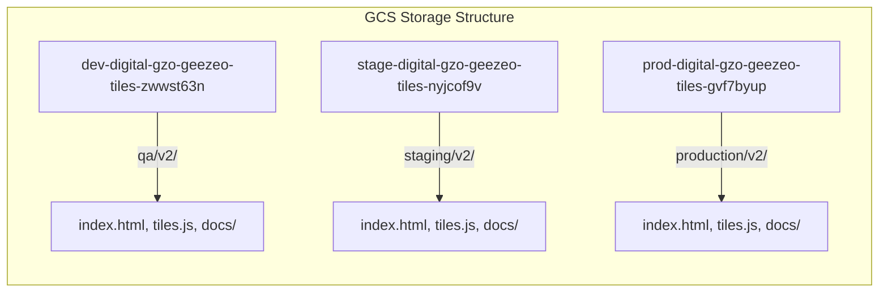
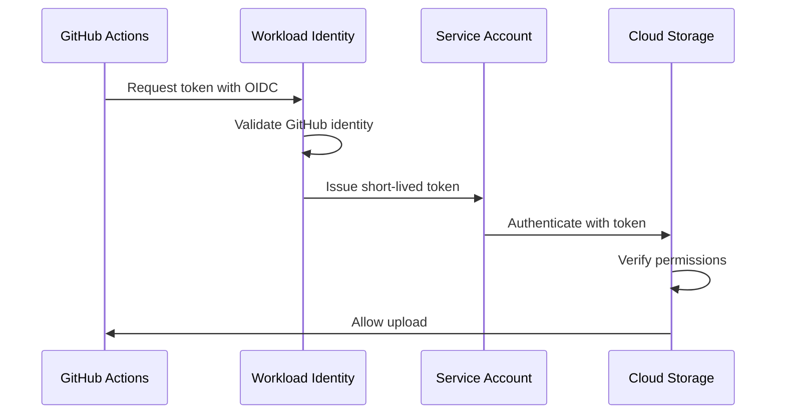

# GitHub Actions Workflows and GCS Configuration Analysis - New Implementation

## TLDR Section

- **Two-Workflow Architecture**: Separate PR validation pipeline and progressive deployment workflow for cleaner separation of concerns
- **Enhanced PR Process**: Automated dev deployments on PR with comprehensive testing, version validation, and deployment comments
- **Progressive Deployment**: Build-once-deploy-many pattern with sequential dev → staging → production deployments
- **Improved Security**: Workload Identity Federation across all environments with environment-specific service accounts

## Detailed Documentation

### Workflow Inventory

#### 1. PR Pipeline (`pr-pipeline.yml`)
**Purpose**: Comprehensive validation and testing for pull requests with automatic development deployment

**Key Features**:
- Triggered on pull requests to master branch
- Runs full validation suite (linting, build checks, tests)
- Automatic deployment to development environment for PR preview
- GitHub PR comment integration for deployment status updates
- Playwright test execution with HTML reports

**Jobs Structure**:
1. `validate-and-test`: Core validation and testing phase
2. `deploy-to-dev`: Automatic deployment to development for PR preview

#### 2. Progressive Deployment Pipeline (`progressive-deployment.yml`)
**Purpose**: Production deployment workflow with build-once-deploy-many pattern

**Key Features**:
- Triggered on push to master or manual workflow dispatch
- Single build artifact used across all environments
- Sequential deployment with environment approvals
- Comprehensive deployment summary with status tracking
- Version validation including git tag verification

**Jobs Structure**:
1. `build-once`: Single build creation with artifact caching
2. `deploy-development`: Automated development deployment
3. `deploy-staging`: Staging deployment (depends on dev success)
4. `deploy-production`: Production deployment (requires approval)
5. `deployment-summary`: Consolidated deployment report

### GCP Configurations

#### Environment Matrix

| Environment | Service Account | GCS Bucket | Path | URL |
|-------------|----------------|------------|------|-----|
| Development | geezeo-tiles@dev-digital-banno.iam.gserviceaccount.com | dev-digital-gzo-geezeo-tiles-zwwst63n | qa/v2 | https://dev-digital-gzo-geezeo-tiles-zwwst63n.storage.googleapis.com/qa/v2/index.html |
| Staging | geezeo-tiles@stage-digital-banno.iam.gserviceaccount.com | stage-digital-gzo-geezeo-tiles-nyjcof9v | staging/v2 | https://stage-digital-gzo-geezeo-tiles-nyjcof9v.storage.googleapis.com/staging/v2/index.html |
| Production | geezeo-tiles@prod-digital-banno.iam.gserviceaccount.com | prod-digital-gzo-geezeo-tiles-gvf7byup | production/v2 | https://prod-digital-gzo-geezeo-tiles-gvf7byup.storage.googleapis.com/production/v2/index.html |

#### Security Configuration

**Workload Identity Federation**:
- Pool: `gha-cldteam-pool-58a241b9`
- Provider: `gha-cldteam-provid-58a241b9`
- Project: `423509969265`
- Full Provider Path: `projects/423509969265/locations/global/workloadIdentityPools/gha-cldteam-pool-58a241b9/providers/gha-cldteam-provid-58a241b9`

### Integration Points

#### 1. GitHub Integration
- **PR Comments**: Automated deployment status updates via GitHub API
- **Status Checks**: Integration with GitHub checks API
- **Environment Protection**: GitHub environments for staging/production approvals
- **Artifact Management**: GitHub Actions artifacts for build persistence

#### 2. GCS Integration
- **Authentication**: Workload Identity Federation for keyless auth
- **Upload Method**: `google-github-actions/upload-cloud-storage@v2`
- **Verification**: Post-deployment gsutil verification checks
- **Path Structure**: Environment-specific paths with v2 versioning

#### 3. Testing Integration
- **Playwright**: Chromium and Firefox browser testing
- **Caching**: Browser binary caching for performance
- **Reporting**: HTML reports with GitHub Actions integration
- **Artifacts**: Test result persistence for debugging

## Visual Documentation

### Deployment Flow Diagram

```mermaid
graph TB
    subgraph "PR Pipeline"
        PR[Pull Request] --> VAL[Validate & Test]
        VAL --> |Success| DEVPR[Deploy to Dev]
        DEVPR --> COMMENT[Update PR Comment]
    end
    
    subgraph "Progressive Deployment"
        PUSH[Push to Master] --> BUILD[Build Once]
        BUILD --> |Artifact| DEV[Deploy Development]
        DEV --> |Success| STAGE[Deploy Staging]
        STAGE --> |Approval| PROD[Deploy Production]
        PROD --> SUMMARY[Deployment Summary]
    end
```



### GCS Bucket Architecture



### Security Flow



## Parameterization

### Configurable Inputs

#### PR Pipeline Parameters
```yaml
inputs:
  node_version:
    default: '20.x'
    description: 'Node.js version for builds'
  
  artifact_retention:
    default: 7
    description: 'Days to retain build artifacts'
    
  browsers:
    default: 'chromium firefox'
    description: 'Playwright browsers to test'
```

#### Progressive Deployment Parameters
```yaml
inputs:
  build_retention:
    default: 30
    description: 'Days to retain production build artifacts'
    
  version_check:
    default: true
    description: 'Enforce git tag version validation'
    
  deployment_timeout:
    default: 300
    description: 'Timeout in seconds for deployment verification'
```

### Environment Variables
```yaml
env:
  # Build Configuration
  NODE_ENV: production
  WEBPACK_MODE: production
  
  # GCS Configuration
  GCLOUD_PROJECT: ${{ matrix.project_id }}
  GCS_BUCKET: ${{ matrix.bucket_name }}
  
  # Deployment Configuration
  DEPLOY_PATH: ${{ matrix.deploy_path }}
  VERSION_TAG: v${{ needs.build-once.outputs.version }}
```

## AI Memory Optimization

### Quick Reference Headers

#### Workflow Types
- **PR Validation**: `pr-pipeline.yml` - Testing and dev preview
- **Production Deploy**: `progressive-deployment.yml` - Master branch deployments

#### Environment Mapping
- **Development**: `dev-digital-banno` → `zwwst63n` bucket → `qa/v2` path
- **Staging**: `stage-digital-banno` → `nyjcof9v` bucket → `staging/v2` path  
- **Production**: `prod-digital-banno` → `gvf7byup` bucket → `production/v2` path

#### Key Service Accounts
- **Dev SA**: `geezeo-tiles@dev-digital-banno.iam.gserviceaccount.com`
- **Stage SA**: `geezeo-tiles@stage-digital-banno.iam.gserviceaccount.com`
- **Prod SA**: `geezeo-tiles@prod-digital-banno.iam.gserviceaccount.com`

#### Critical Identifiers
- **WIF Provider**: `projects/423509969265/locations/global/workloadIdentityPools/gha-cldteam-pool-58a241b9/providers/gha-cldteam-provid-58a241b9`
- **Node Version**: `20.x`
- **Actions Versions**: `actions/checkout@v4`, `google-github-actions/*@v2`

### Cross-References
- Original workflows: `/-analysis/responsive-tiles-workflows/original/`
- Current workflows: `/-analysis/responsive-tiles-workflows/current/`
- Related analysis: `/gcs-github-configurations-analysis.md`
- GitHub Actions docs: https://docs.github.com/en/actions
- GCS docs: https://cloud.google.com/storage/docs

## Implementation Checklist

### PR Pipeline Setup
- [ ] Configure branch protection rules for master
- [ ] Set up development environment in GitHub
- [ ] Enable PR comment permissions for bot
- [ ] Configure Playwright browser caching
- [ ] Test artifact upload/download flow

### Progressive Deployment Setup
- [ ] Create GitHub environments (staging, production)
- [ ] Configure environment protection rules
- [ ] Set up approval workflows for production
- [ ] Verify all service accounts have correct permissions
- [ ] Test workload identity federation for each environment

### GCS Configuration
- [ ] Verify bucket permissions for each service account
- [ ] Configure CORS if needed for direct browser access
- [ ] Set up CDN/load balancer for production URLs
- [ ] Enable versioning on production bucket
- [ ] Configure lifecycle policies for old deployments

### Monitoring & Alerts
- [ ] Set up deployment failure notifications
- [ ] Configure GCS upload monitoring
- [ ] Create dashboards for deployment metrics
- [ ] Set up alerts for failed deployments
- [ ] Configure cost monitoring for GCS usage