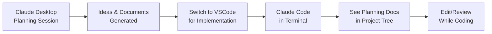
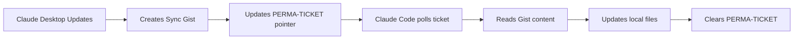

# PromptSync Professional Roadmap - Session 3 Complete Discussion
*Date: January 10, 2025*

## 🎯 Session Overview

This session focused on:
1. Getting back on track with the PromptSync Professional Roadmap
2. Updating progress tracking artifacts
3. Designing a synchronization system between Claude Desktop and Claude Code
4. Creating a hybrid approach using a PERMA-TICKET as a sync beacon

## 📊 Session 3 Accomplishments

### What We Updated
1. ✅ Updated Progress Tracker to reflect Session 2 achievements
2. ✅ Confirmed Act 1 is 100% complete (20 items)
3. ✅ Created Sync Guardian artifact for tracking synchronization
4. ✅ Designed hybrid sync approach with PERMA-TICKET

### Current Project Status
- **Act 1**: ✅ Complete (20/20 items)
- **Act 2**: ⏳ Ready to add (0/9 items)
- **Act 3**: ⏳ Pending (0/9 items)  
- **Act 4**: ⏳ Pending (0/9 items)
- **Overall**: 42% complete (20/47 items)

## 🔄 The Synchronization Challenge

### The Problem
- Planning happens in Claude Desktop (web interface)
- Implementation happens in Claude Code (VSCode terminal)
- Need to sync artifacts between these environments without manual copy/paste

### Initial Sync Guardian Approach
Created a comprehensive tracking system that:
- Maps artifacts to local files
- Provides sync protocols for CRUD operations
- Tracks sync status with manual instructions

### File Structure Discovered
```
fi-toolbox/
├── .claude/
│   ├── commands/
│   │   ├── ps-load-next.md
│   │   └── sync-state.md
│   ├── prompts/
│   │   ├── promptsync-progress.md
│   │   └── promptsync-roadmap.md
│   └── scripts/
│       └── ps-sync.sh
```

## 🚀 The PERMA-TICKET Innovation

### Original Concept
Use a permanent GitHub Project ticket as a message queue between Claude instances:
- Single item rule (one message at a time)
- Flow direction indicator
- Auto-check on startup
- Process and clear pattern

### Evolution to Hybrid Approach
After discussion, we refined this to use the PERMA-TICKET as a **notification beacon** rather than a data carrier.

## 📐 The Hybrid Architecture

### Workflow Pattern


### Sync Flow


### PERMA-TICKET Structure
```markdown
Title: 🔄 SYNC-BEACON [DO NOT CLOSE]
Status: 📬 Desktop→Code Update Available

Body:
---
LAST_UPDATE: Planning Session 3 - PromptSync Roadmap
TIMESTAMP: 2025-01-10T10:45:00Z
DIRECTION: Desktop→Code
FILES_UPDATED:
  - promptsync-progress.md
  - promptsync-roadmap.md
  - act-2-implementation-notes.md
ACTION: Run `ps-sync pull` in Claude Code
---
```

### Enhanced Folder Structure
```
fi-toolbox/
├── .claude/
│   ├── planning/          # Desktop artifacts go here
│   │   ├── promptsync-progress.md
│   │   ├── promptsync-roadmap.md
│   │   └── session-notes/
│   ├── implementation/    # Code artifacts go here
│   │   ├── current-work.md
│   │   └── test-results.md
│   └── sync/             # Sync mechanism
│       ├── manifest.json  # What needs syncing
│       └── ps-sync.sh    # Sync script
```

## 💡 Key Insights from Discussion

### Why This Approach Works
1. **No Context Switching** - Files appear right in VSCode
2. **Natural Progression** - Planning→Implementation is seamless
3. **Full History** - Git tracks everything in `.claude/`
4. **Visual Feedback** - See sync status in GitHub Projects
5. **Offline Capable** - Files are local, sync when ready

### Alternative Approaches Considered
1. **GitHub Gist as Sync File** - Better for text storage with version history
2. **Sync Branch in Repo** - Natural Git workflow with full diffs
3. **Pure PERMA-TICKET** - Simple but limited by field sizes
4. **Convention-Based** - Time-based checkpoints with session notes

## 🎬 Next Actions

### Immediate (This Session)
1. Add Act 2 items to the GitHub Project (9 tickets)
2. Create the PERMA-TICKET in the project
3. Set up initial sync script structure

### Short Term
1. Implement ps-sync script
2. Test Desktop→Code sync flow
3. Add file watchers for automatic sync

### Long Term
1. Complete Acts 3 and 4 loading
2. Create Board and Timeline views
3. Set up automation rules
4. Build full bidirectional sync

## 📝 Session Commands Reference

### Check Project Status
```bash
cd /Users/LenMiller/code/banno/fi-toolbox
ps-sync status
```

### Manual Sync Process
```bash
# Backup current state
cp .claude/prompts/promptsync-progress.md .claude/prompts/promptsync-progress.backup

# Pull updates from Desktop
ps-sync pull

# Verify changes
diff .claude/prompts/promptsync-progress.backup .claude/prompts/promptsync-progress.md
```

### Starting Claude Code with Auto-Sync
```bash
# Add to .zshrc or .bashrc
alias claude-code='ps-sync pull && claude-code'
```

## 🔧 Technical Specifications

### ps-sync Script Structure
```bash
#!/bin/bash
case "$1" in
  "status")
    # Check PERMA-TICKET for updates
    gh issue view 47 --repo lennylmiller/promptsync-roadmap
    ;;
  "pull")
    # Pull updates from Desktop
    ;;
  "push")
    # Push updates to Desktop
    ;;
  "watch")
    # Auto-pull when changes detected
    ;;
esac
```

### VSCode Integration
```json
// .vscode/tasks.json
{
  "type": "shell",
  "command": "ps-sync watch",
  "runOptions": {"runOn": "folderOpen"}
}
```

## 📚 Artifacts Created This Session

1. **PromptSync Progress Tracker & Session Strategy** (Updated)
   - Added Session 3 status
   - Updated completion percentages
   - New "Two-Act Focus" strategy

2. **PromptSync Sync Guardian** (New)
   - Complete sync mapping system
   - CRUD operation protocols
   - Session sync log
   - Manual sync instructions

## 🎯 Summary

This session successfully:
- Got us back on track with clear next steps
- Solved the synchronization challenge with an elegant hybrid approach
- Created a practical workflow that matches your planning→implementation pattern
- Set up a foundation for seamless artifact management

The PERMA-TICKET beacon approach is a creative solution that leverages existing infrastructure while avoiding the complexity of full message passing. Combined with local file management and simple scripts, it provides a robust sync mechanism without over-engineering.

---

*End of Session 3 Discussion*