# Responsive Tiles Toolbox: Comprehensive Architectural Analysis (PlantUML Edition)

## Table of Contents
1. [Introduction](#introduction)
2. [System Overview](#system-overview)
3. [UML Class Diagrams](#uml-class-diagrams)
4. [UML Sequence Diagrams](#uml-sequence-diagrams)
5. [UML State Diagrams](#uml-state-diagrams)
6. [UML Component Diagrams](#uml-component-diagrams)
7. [UML Activity Diagrams](#uml-activity-diagrams)
8. [UML Deployment Diagram](#uml-deployment-diagram)
9. [Data Flow Analysis](#data-flow-analysis)
10. [Technology Migration Considerations](#technology-migration-considerations)

## Introduction

This document provides a comprehensive architectural analysis of the Responsive Tiles Toolbox using PlantUML diagrams. PlantUML offers several advantages over other diagramming tools:
- Text-based diagram definitions that can be version controlled
- Consistent styling and layout algorithms
- Rich support for all UML diagram types
- Ability to generate various output formats (PNG, SVG, PDF)

The analysis uses various UML diagrams to illustrate both static and dynamic aspects of the system, serving as a foundation for migrating to a different technology stack.

## System Overview

The Responsive Tiles Toolbox is a single-page application that allows developers to:
- Test financial UI components in isolation or as a complete application
- Configure components in real-time using a JSON editor
- Switch between different viewing modes (desktop/mobile)
- Authenticate with JWT tokens for realistic user data testing
- Share configurations via compressed URLs

Let's dive deep into the architecture using PlantUML diagrams, with each diagram accompanied by a Socratic teaching approach.

## UML Class Diagrams

### Understanding Class Diagrams: The Static Structure

Before examining the toolbox's class structure, let's consider: What makes a good class diagram? PlantUML helps us create clear hierarchies with its automatic layout engine, and we can use colors and notes to highlight important patterns.

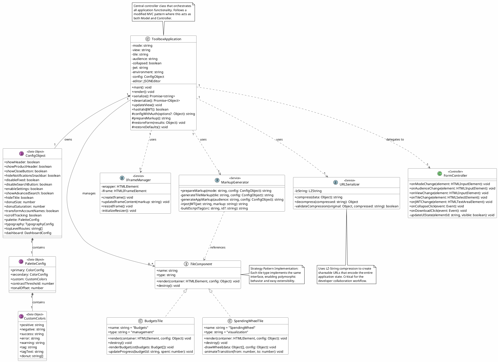

### Reflecting on the Class Structure

Now that we've visualized the class structure with PlantUML, let's explore some key insights:

1. **Why do we use stereotypes like `<<Data Object>>` and `<<Service>>`?**
   - PlantUML stereotypes help categorize classes visually
   - Data Objects (orchid) contain state but minimal behavior
   - Services (light blue) provide functionality without maintaining state
   - Controllers (light green) coordinate between services and UI

2. **What does the composition vs. aggregation tell us?**
   - `*--` (filled diamond) shows ownership - ConfigObject is owned by ToolboxApplication
   - `..>` (dashed arrow) shows usage without ownership - services are shared
   - This distinction is crucial for memory management and lifecycle

3. **How does PlantUML's layout help us understand the architecture?**
   - Related classes are automatically grouped
   - The vertical hierarchy shows dependencies flowing downward
   - Interface implementations are clearly distinguished

## UML Sequence Diagrams

### Understanding Sequence Diagrams: The Dynamic Interactions

PlantUML excels at sequence diagrams with its ability to handle complex interactions, automatic spacing, and support for various message types. Let's examine the key workflows:

### 1. Application Initialization Sequence

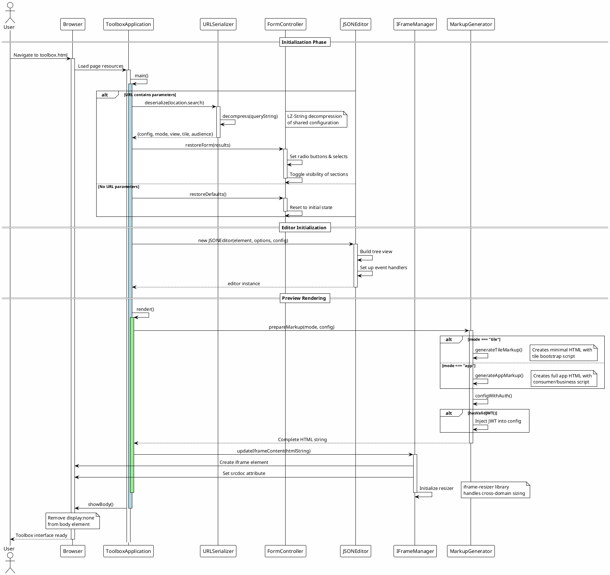

### 2. Real-time Configuration Update Sequence

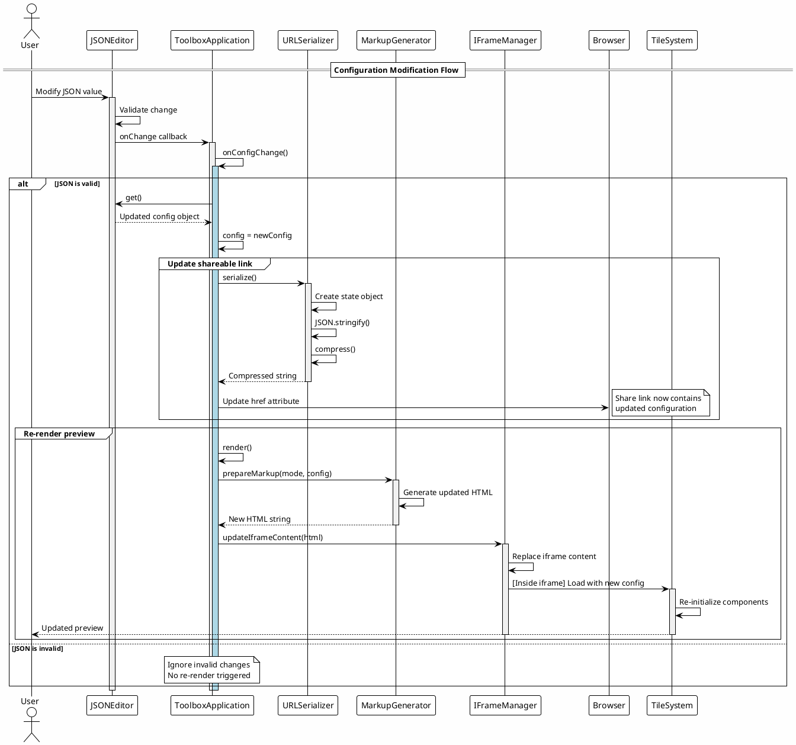

### 3. JWT Authentication Flow with Error Handling

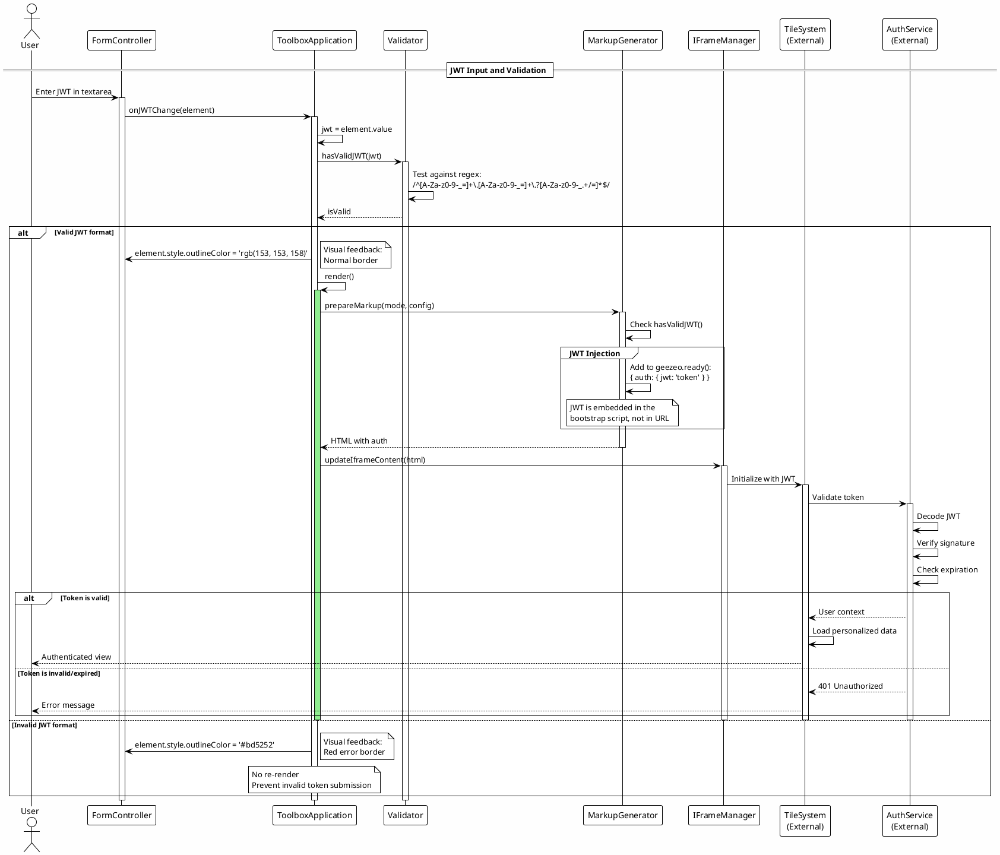

### Reflecting on PlantUML Sequence Diagrams

Consider how PlantUML enhances our understanding:

1. **How do activation bars improve readability?**
   - PlantUML's activation bars show the lifecycle of each operation
   - Nested activations (like the `#LightBlue` highlighting) show sub-processes
   - This helps identify potential performance bottlenecks

2. **What do the grouped sections tell us?**
   - PlantUML's `group` blocks logically organize related operations
   - This reveals the transactional nature of certain operations
   - It helps identify what must succeed together

3. **Why are external systems marked differently?**
   - The `(External)` notation clarifies system boundaries
   - This is crucial for understanding integration points
   - It helps identify where mock implementations might be needed

## UML State Diagrams

### Understanding State Diagrams: The Behavioral States

PlantUML's state diagram support includes advanced features like composite states, concurrent regions, and history states. Let's explore the toolbox's state machines:

### 1. Application State Machine with Concurrent Regions

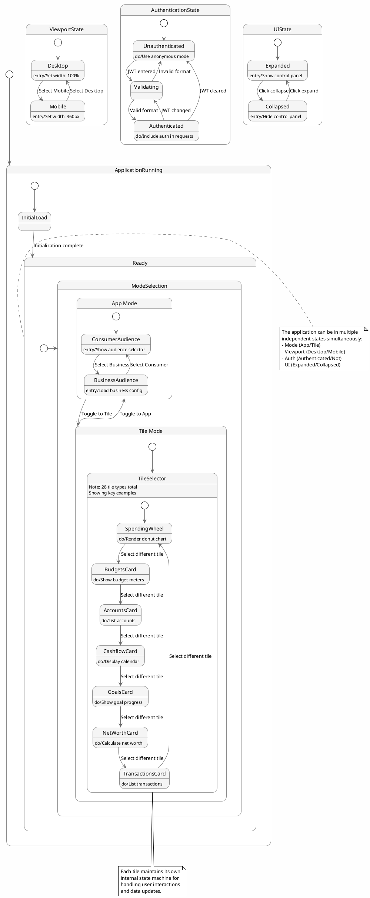

### 2. Configuration Editor State Machine with Error Handling

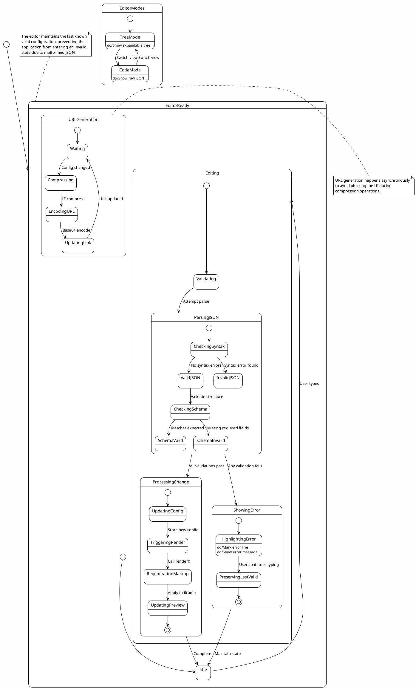

### 3. Tile Component Lifecycle State Machine

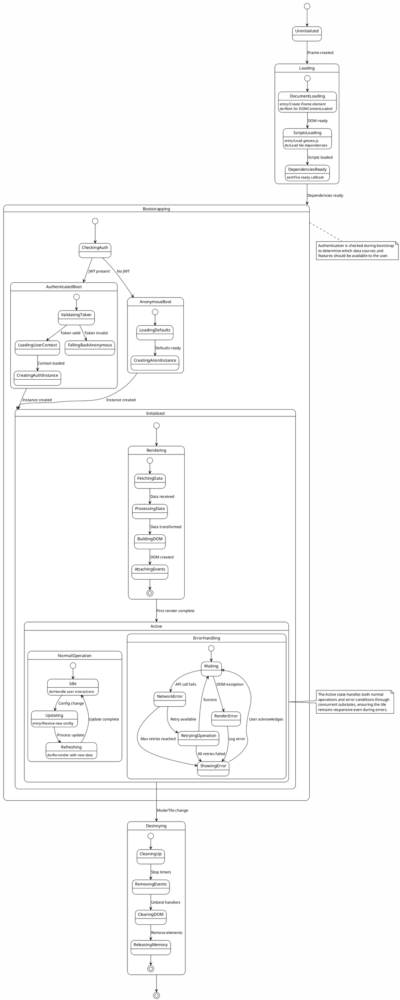

### Reflecting on PlantUML State Diagrams

Let's examine what PlantUML's state diagram features reveal:

1. **How do concurrent regions (--) improve our understanding?**
   - PlantUML's concurrent region notation shows orthogonal states
   - This reveals that mode, view, auth, and UI states are independent
   - It helps identify potential state explosion issues

2. **What do entry/exit/do actions tell us?**
   - Entry actions show initialization requirements
   - Do actions indicate ongoing processes
   - Exit actions reveal cleanup needs
   - This level of detail is crucial for implementation

3. **Why are choice states (`<<choice>>`) important?**
   - They make decision points explicit
   - They show branching logic visually
   - This helps identify all possible paths through the system

## UML Component Diagrams

### Understanding Component Diagrams: The System Architecture

PlantUML's component diagrams excel at showing system architecture with clear boundaries and interfaces. Let's visualize the toolbox's component structure:

```plantuml
@startuml
!theme plain
skinparam backgroundColor #FEFEFE
skinparam component {
    BackgroundColor #F0F8FF
    BorderColor #4682B4
}
skinparam interface {
    BackgroundColor #FFE4B5
    BorderColor #DEB887
}

package "Browser Environment" {
    package "Toolbox Application" #LightBlue {
        component [UI Layer] as UI
        component [Controller Layer] as Controller
        component [State Management] as State
        component [Serialization Service] as Serializer
        
        interface "IStateManager" as IState
        interface "ISerializer" as ISerial
        
        UI --> Controller
        Controller --> IState
        Controller --> ISerial
        State -up- IState
        Serializer -up- ISerial
    }
    
    package "Configuration Editor" #LightGreen {
        component [JSON Editor Core] as JSONEditor
        component [Tree View] as TreeView
        component [Code View] as CodeView
        component [Schema Validator] as Validator
        component [Color Picker Widget] as ColorPicker
        
        interface "IEditor" as IEditor
        interface "IValidator" as IValidator
        
        JSONEditor -up- IEditor
        JSONEditor --> TreeView
        JSONEditor --> CodeView
        JSONEditor --> IValidator
        Validator -up- IValidator
        JSONEditor --> ColorPicker
        
        note bottom of Validator
            Validates against implicit schema:
            - Required fields
            - Type checking
            - Value constraints
        end note
    }
    
    package "Preview System" #LightCoral {
        component [IFrame Manager] as IFrameManager
        component [Markup Generator] as MarkupGen
        component [Template Engine] as Templates
        component [IFrame Resizer] as Resizer
        
        interface "IPreview" as IPreview
        interface "IMarkup" as IMarkup
        
        IFrameManager -up- IPreview
        MarkupGen -up- IMarkup
        MarkupGen --> Templates
        IFrameManager --> Resizer
    }
    
    package "External Libraries" #LightGray {
        component [LZ-String] as LZString
        component [Font Awesome] as FontAwesome
        component [Normalize.css] as Normalize
        component [iframe-resizer] as IFrameResizerLib
        
        note top of LZString
            Compression library for
            URL state serialization
        end note
    }
    
    ' Main application connections
    Controller ..> IEditor : uses
    Controller ..> IPreview : uses
    Controller ..> IMarkup : uses
    
    ' External library connections
    Serializer ..> LZString : uses
    UI ..> FontAwesome : uses
    UI ..> Normalize : uses
    Resizer ..> IFrameResizerLib : wraps
}

package "Tile System Runtime" <<Cloud>> #Wheat {
    component [Geezeo Loader] as GeezeoLoader
    component [Tile Factory] as TileFactory
    component [Tile Registry] as Registry
    component [Auth Service] as AuthService
    component [Data Service] as DataService
    
    database "Tile Components" as TileDB {
        component [SpendingWheel]
        component [Budgets]
        component [Accounts]
        component [CashFlow]
        component [Goals]
        component [NetWorth]
        note bottom
            28 tile types total
        end note
    }
    
    GeezeoLoader --> TileFactory
    TileFactory --> Registry
    Registry --> TileDB
    TileFactory --> AuthService
    TileFactory --> DataService
}

' Cross-boundary connections
IFrameManager ..> GeezeoLoader : loads
MarkupGen ..> AuthService : configures

' Interface definitions shown separately for clarity
package "Interface Contracts" <<Rectangle>> #F0E68C {
    interface IToolboxConfig {
        mode: string
        view: string
        tile: string
        audience: string
        jwt?: string
        config: object
    }
    
    interface ITileInstance {
        render(container, config)
        destroy()
        update(config)
    }
    
    interface IFrameContent {
        srcdoc: string
        sandbox?: string
        allow?: string
    }
}

State ..> IToolboxConfig : manages
TileFactory ..> ITileInstance : creates
IFrameManager ..> IFrameContent : uses

@enduml
```

### Component Communication Patterns

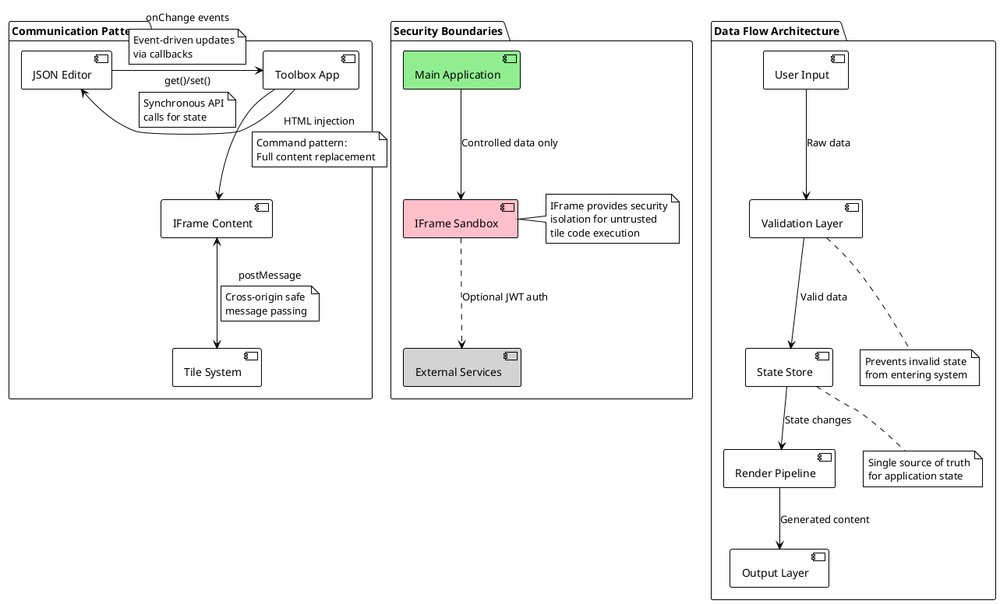

### Reflecting on Component Architecture

PlantUML's component diagrams reveal architectural insights:

1. **Why are interfaces explicitly shown?**
   - PlantUML's interface notation clarifies contracts between components
   - This is essential for identifying replacement points during migration
   - Each interface represents a seam where new technology can be inserted

2. **What do the package boundaries tell us?**
   - Clear separation of concerns into logical groups
   - Color coding helps identify different architectural layers
   - The `<<Cloud>>` stereotype shows external/runtime dependencies

3. **How do the communication patterns inform migration strategy?**
   - Event-driven patterns can map to modern state management (Redux, MobX)
   - Message passing indicates where API boundaries exist
   - Direct API calls show tightly coupled components that may need refactoring

## UML Activity Diagrams

### Understanding Activity Diagrams: The User Workflows

PlantUML's activity diagrams support complex flows with swimlanes, parallel activities, and detailed decision logic. Let's map the user workflows:

### 1. Comprehensive Developer Testing Workflow

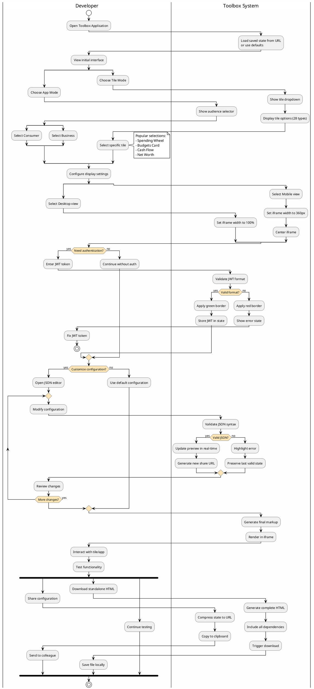

### 2. Configuration Sharing and Collaboration Workflow

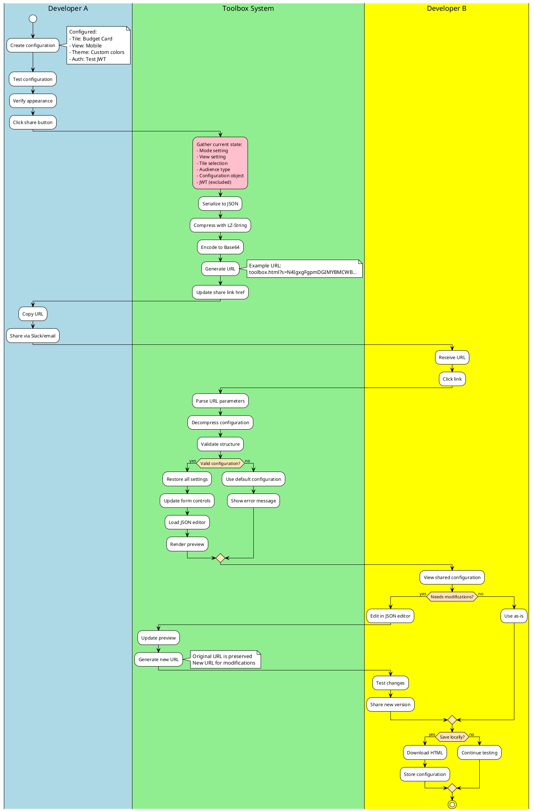

### 3. Error Handling and Recovery Workflow

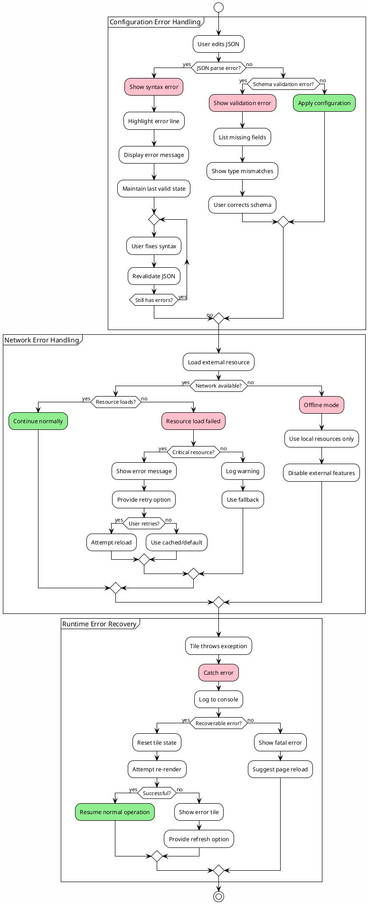

### Reflecting on Activity Diagrams

PlantUML's activity diagram features provide insights:

1. **How do swimlanes clarify responsibilities?**
   - PlantUML's `|Name|` notation clearly shows who/what performs each action
   - This separation helps identify API boundaries
   - It's essential for understanding client-server splits in new architectures

2. **What do the parallel flows (fork/join) tell us?**
   - Multiple end-user actions can happen simultaneously
   - The system must handle concurrent operations gracefully
   - This informs decisions about state management in the new stack

3. **Why are error paths explicitly modeled?**
   - PlantUML's color coding (#Pink for errors) makes failure paths visible
   - Every decision point has a failure branch
   - This ensures robust error handling in the migration

## UML Deployment Diagram

### Understanding Deployment Diagrams: The Physical Architecture

PlantUML's deployment diagrams show the physical topology with nodes, artifacts, and communication paths:

```plantuml
@startuml
!theme plain
skinparam backgroundColor #FEFEFE
skinparam node {
    BackgroundColor #F0F8FF
    BorderColor #4682B4
}

node "Developer Workstation" as dev {
    component "Web Browser" as browser {
        artifact "Toolbox SPA" as spa
        artifact "JSON Editor" as editor
        artifact "Preview IFrame" as iframe
    }
    
    component "Local Storage" as storage {
        artifact "Cached Assets" as cache
        artifact "Browser Storage" as local
    }
    
    browser --> storage : Cache API
}

node "CDN Infrastructure" <<Cloud>> as cdn {
    component "Font Awesome CDN" as fa {
        artifact "Icon Fonts" as icons
        artifact "CSS Files" as facss
    }
    
    component "NPM CDN (jsDelivr)" as npm {
        artifact "iframe-resizer" as resizer
        artifact "Version 4.2.10" as version
    }
    
    note bottom of cdn
        External CDNs provide:
        - Global distribution
        - Browser caching
        - Version stability
    end note
}

node "Application Server" <<Web Server>> as server {
    component "Static File Server" as static {
        artifact "toolbox.html" as html
        artifact "toolbox.js" as js
        artifact "toolbox.css" as css
    }
    
    component "Tile Assets" as tiles {
        artifact "tiles.js" as tilesjs
        artifact "consumer.js" as consumer
        artifact "business.js" as business
    }
    
    component "API Endpoints" as api {
        artifact "Mock Data API" as mock
        artifact "Image Assets" as images
    }
    
    static --> tiles : Serves
    static --> api : Routes
}

node "External Services" <<Cloud>> as external {
    component "Geezeo Platform" as geezeo {
        artifact "Authentication API" as auth
        artifact "Data Services" as data
        artifact "User Context" as context
    }
    
    component "Analytics Services" as analytics {
        artifact "Google Analytics" as ga
        artifact "WebTrends" as wt
    }
}

' Communication paths
browser ..> cdn : HTTPS/CDN\n(Font loading)
browser --> server : HTTPS\n(Application files)
iframe ..> external : HTTPS/REST\n(When authenticated)
browser ..> analytics : HTTPS\n(Usage tracking)

' Deployment specifications
note right of server
    **Server Requirements:**
    - Node.js runtime
    - Express/Static server
    - HTTPS enabled
    - CORS headers configured
    - Gzip compression
end note

note left of browser
    **Browser Requirements:**
    - ES2015+ support
    - LocalStorage API
    - IFrame support
    - CORS enabled
end note

note top of external
    **Integration Points:**
    - JWT authentication
    - RESTful APIs
    - JSON responses
    - Rate limiting
end note

@enduml
```

### Network Communication Patterns

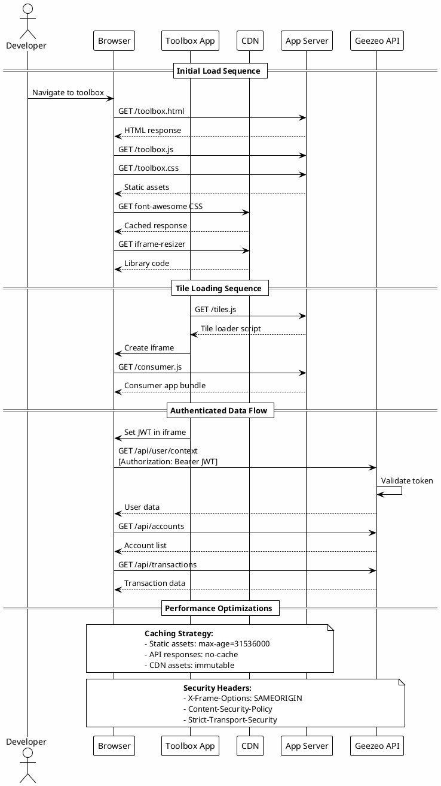

### Reflecting on Deployment Architecture

PlantUML's deployment diagrams reveal:

1. **What do the `<<stereotypes>>` tell us about infrastructure?**
   - `<<Cloud>>` indicates external, managed services
   - `<<Web Server>>` shows traditional hosting requirements
   - These stereotypes help identify cloud-native opportunities

2. **How do artifact relationships show dependencies?**
   - PlantUML clearly shows which artifacts are bundled together
   - This helps identify build and deployment units
   - Critical for containerization strategies

3. **Why are communication protocols explicitly labeled?**
   - HTTPS/REST/CDN labels show integration patterns
   - This identifies security requirements
   - Essential for API gateway and service mesh decisions

## Data Flow Analysis

### Understanding Data Flow with PlantUML

PlantUML can effectively show data flow using various diagram types. Let's visualize how data moves through the system:

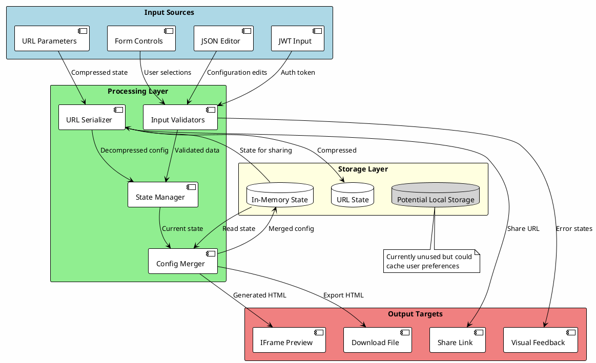

### Data Transformation Pipeline

```plantuml
@startuml
!theme plain
skinparam backgroundColor #FEFEFE
skinparam activity {
    DiamondBackgroundColor #FFE4B5
}

partition "Input Processing" {
    (*) --> "Receive user input"
    
    if "Input type?" then
        -->[Form change] "Extract form values"
        --> "Create state update"
    else
        -->[JSON edit] "Parse JSON text"
        if "Valid JSON?" then
            -->[yes] "Extract config object"
            --> "Create state update"
        else
            -->[no] "Generate error"
            --> "Show error feedback"
            --> (*)
        endif
    else
        -->[URL parameter] "Decompress string"
        --> "Parse state object"
        --> "Create state update"
    endif
}

partition "State Management" {
    "Create state update" --> "Merge with current state"
    --> "Apply defaults"
    --> "Validate combined state"
    
    if "State valid?" then
        -->[yes] "Update application state"
        --> "Trigger re-render"
    else
        -->[no] "Rollback to previous"
        --> "Log validation error"
        --> (*)
    endif
}

partition "Output Generation" {
    "Trigger re-render" --> "Generate markup"
    
    fork
        --> "Update iframe"
        --> "Preview ready"
    fork again
        --> "Compress state"
        --> "Update URL"
        --> "Share link ready"
    fork again
        --> "Update UI feedback"
        --> "Controls updated"
    end fork
    
    --> (*)
}

@enduml
```

## Technology Migration Considerations

### Migration Architecture Comparison

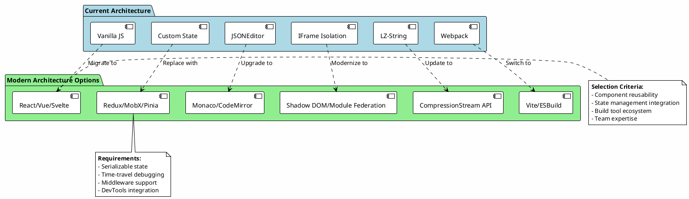

### Migration Decision Tree

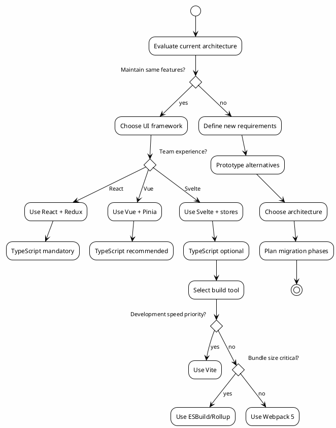

## Conclusion

This PlantUML-based analysis provides a comprehensive view of the Responsive Tiles Toolbox architecture. The use of PlantUML offers several advantages:

1. **Text-based diagrams** can be version controlled alongside code
2. **Consistent styling** across all diagram types
3. **Rich notation** for complex relationships and states
4. **Export flexibility** to various formats

The detailed UML diagrams reveal:
- **Clear separation of concerns** in the class structure
- **Well-defined interaction patterns** in the sequences
- **Robust state management** in the state machines
- **Modular component architecture** in the component diagrams
- **Comprehensive error handling** in the activity flows
- **Scalable deployment topology** in the deployment diagrams

For your technology migration, these PlantUML diagrams serve as:
- **Documentation** of current behavior to preserve
- **Blueprints** for the new architecture
- **Test specifications** for validation
- **Communication tools** for the development team

The Socratic questioning approach throughout helps ensure that architectural decisions are well-reasoned and that the migration preserves the essential qualities that make the toolbox valuable while modernizing the technology stack.