# Responsive Tiles Toolbox: Comprehensive Architectural Analysis

## Table of Contents
1. [Introduction](#introduction)
2. [System Overview](#system-overview)
3. [UML Class Diagrams](#uml-class-diagrams)
4. [UML Sequence Diagrams](#uml-sequence-diagrams)
5. [UML State Diagrams](#uml-state-diagrams)
6. [UML Component Diagrams](#uml-component-diagrams)
7. [UML Activity Diagrams](#uml-activity-diagrams)
8. [UML Deployment Diagram](#uml-deployment-diagram)
9. [Data Flow Analysis](#data-flow-analysis)
10. [Technology Migration Considerations](#technology-migration-considerations)

## Introduction

This document provides a comprehensive architectural analysis of the Responsive Tiles Toolbox, a sophisticated development and testing environment for financial UI components. The analysis uses various UML diagrams to illustrate both static and dynamic aspects of the system, serving as a foundation for migrating to a different technology stack.

## System Overview

The Responsive Tiles Toolbox is a single-page application that allows developers to:
- Test financial UI components in isolation or as a complete application
- Configure components in real-time using a JSON editor
- Switch between different viewing modes (desktop/mobile)
- Authenticate with JWT tokens for realistic user data testing
- Share configurations via compressed URLs

Now, let's dive deep into the architecture using UML diagrams. Each diagram will be accompanied by a Socratic teaching approach to help you understand not just what the diagram shows, but why it's structured that way and how it relates to your migration goals.

## UML Class Diagrams

### Understanding Class Diagrams: The Static Structure

Before we examine the specific class structure of the Responsive Tiles Toolbox, let's ask ourselves: What is the purpose of a UML class diagram? 

A class diagram shows the static structure of a system by depicting:
- **Classes** (the blueprints for objects)
- **Attributes** (the data they hold)
- **Methods** (the behaviors they exhibit)
- **Relationships** (how they interact with each other)

Now, let's explore the main classes in our toolbox:

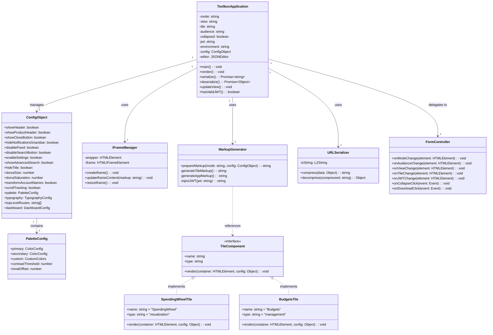

### Reflecting on the Class Structure

Now that we've seen the class diagram, let's ask some important questions:

1. **Why is the ToolboxApplication class central to the design?**
   - It serves as the main controller, orchestrating all other components
   - It maintains the application state (mode, view, tile selection, etc.)
   - This centralized approach makes it easier to manage state changes

2. **What pattern do you notice with the TileComponent interface?**
   - This is the Strategy pattern in action
   - Each tile type implements the same interface, allowing for polymorphic behavior
   - This makes it easy to add new tile types without modifying existing code

3. **How does separation of concerns manifest in this design?**
   - IFrameManager handles iframe-specific operations
   - MarkupGenerator focuses on HTML generation
   - URLSerializer deals with compression/decompression
   - Each class has a single, well-defined responsibility

## UML Sequence Diagrams

### Understanding Sequence Diagrams: The Dynamic Interactions

What story does a sequence diagram tell us? It shows how objects interact over time, revealing:
- The order of method calls
- The flow of control between objects
- The lifecycle of operations

Let's examine key workflows in the toolbox:

### 1. Application Initialization Sequence

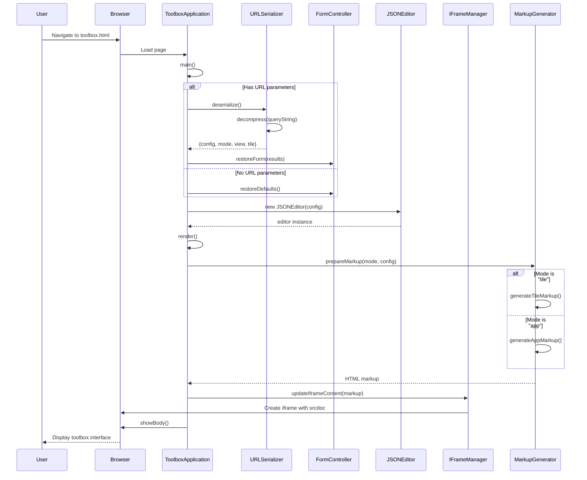

### 2. Configuration Change Sequence

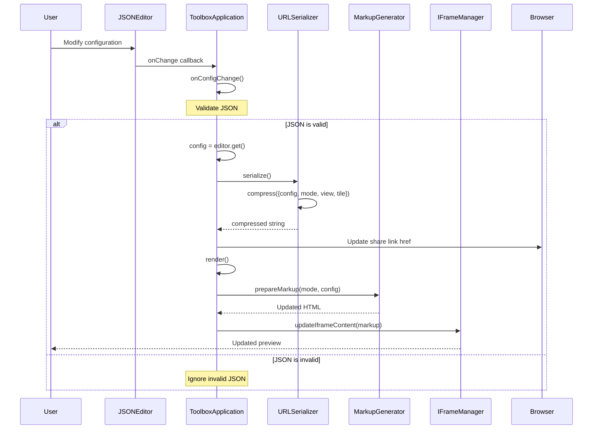

### 3. JWT Authentication Flow

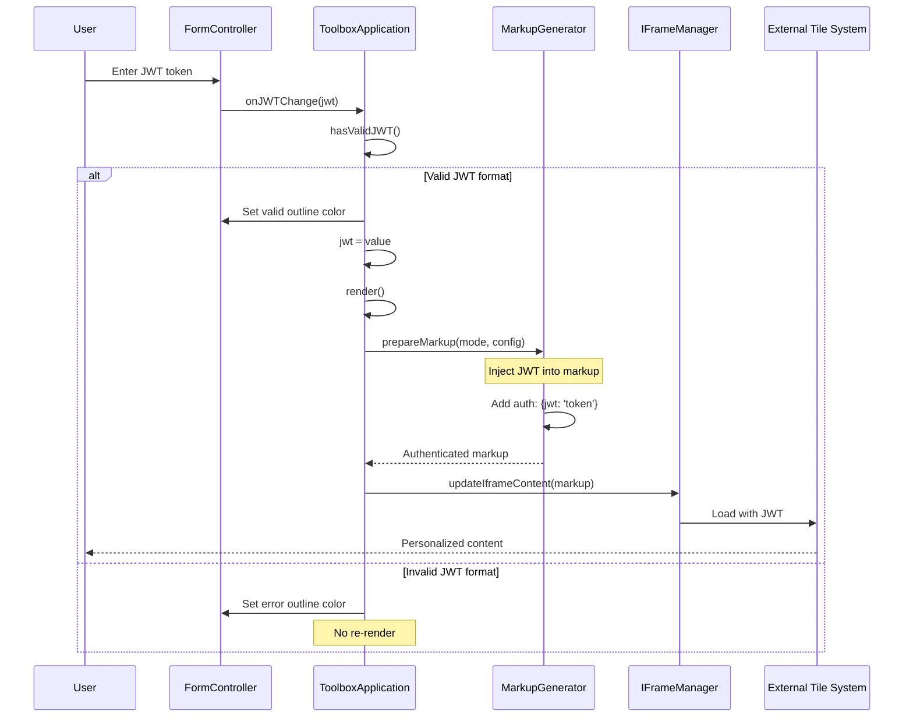

### Reflecting on the Sequence Diagrams

Let's consider what these sequences reveal:

1. **Why does the initialization sequence check for URL parameters first?**
   - This enables configuration sharing between developers
   - It maintains state across page refreshes
   - It supports deep linking to specific configurations

2. **What's the significance of the validation step in configuration changes?**
   - It prevents the application from entering an invalid state
   - It provides immediate feedback to the developer
   - It maintains system stability despite user input

3. **How does the JWT flow enhance the testing experience?**
   - It allows testing with real user contexts
   - It validates tokens before sending them to the tile system
   - It provides visual feedback for token validity

## UML State Diagrams

### Understanding State Diagrams: The Behavioral States

What questions should we ask when looking at a state diagram?
- What are the possible states of the system?
- What triggers transitions between states?
- Are there any constraints on state transitions?

Let's examine the state behavior of our toolbox:

### 1. Application Mode State Machine

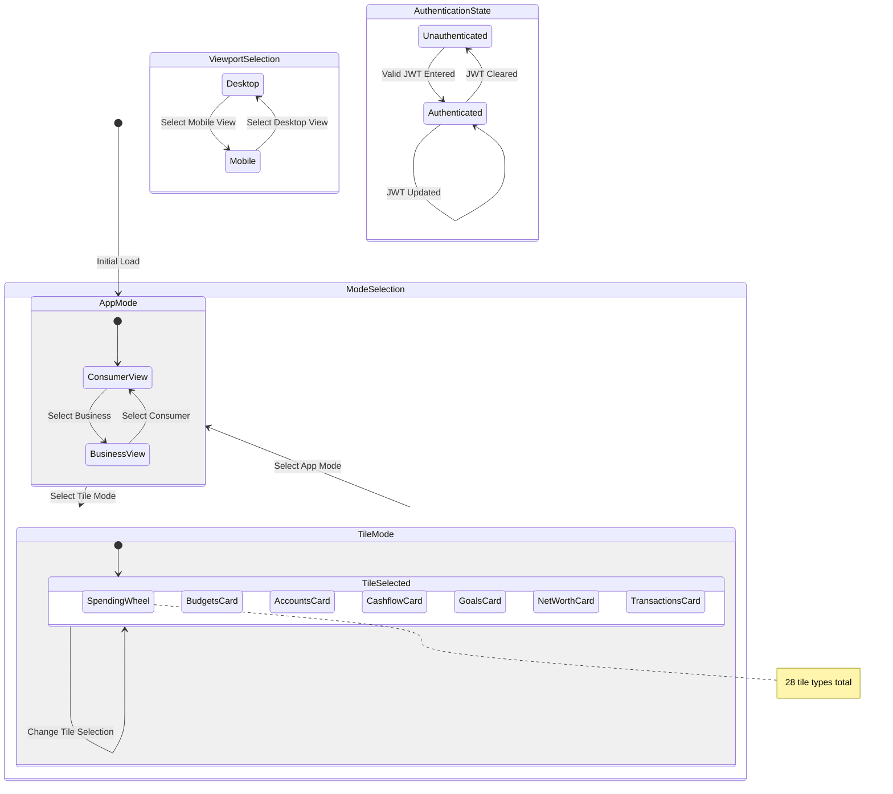

### 2. Configuration Editor State Machine

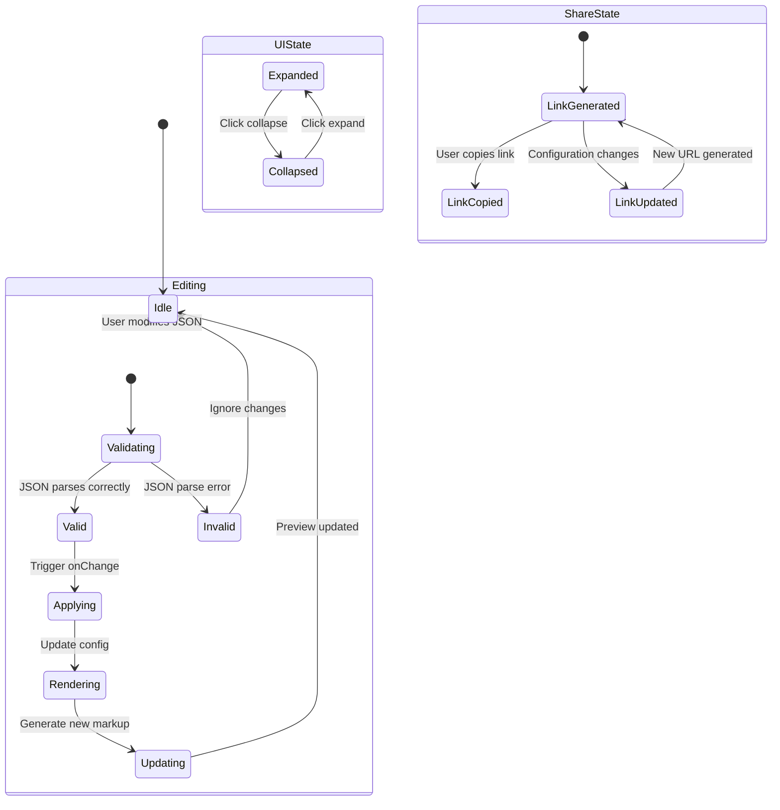

### 3. Tile Lifecycle State Machine

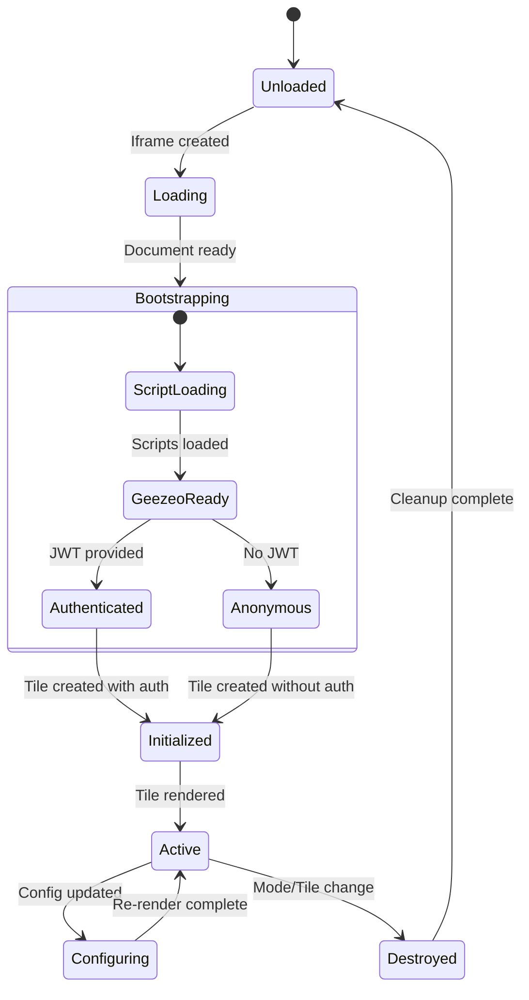

### Reflecting on the State Diagrams

Consider these insights:

1. **Why are there parallel state regions?**
   - Mode, viewport, and authentication can change independently
   - This reflects the orthogonal nature of these concerns
   - Users can be in "Tile Mode + Mobile View + Authenticated" simultaneously

2. **What does the configuration editor state machine tell us about error handling?**
   - Invalid JSON doesn't crash the system
   - The system maintains the last valid state
   - This provides a safe editing experience

3. **How does the tile lifecycle support hot reloading?**
   - Tiles can transition from Active to Configuring and back
   - This enables real-time configuration updates
   - The state machine ensures proper cleanup and initialization

## UML Component Diagrams

### Understanding Component Diagrams: The System Architecture

What architectural questions do component diagrams answer?
- How is the system decomposed into components?
- What are the interfaces between components?
- What are the dependencies?

Let's visualize the component architecture:

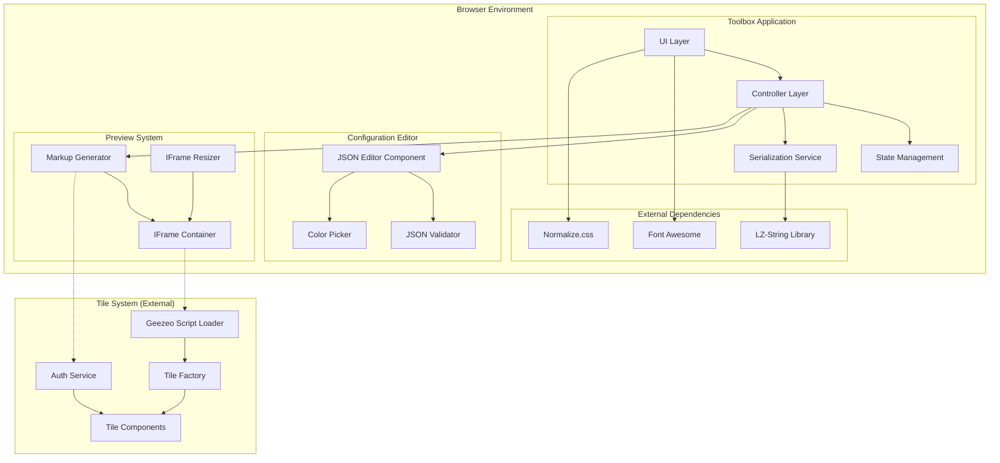

### Component Interface Specifications

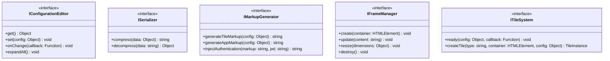

### Reflecting on the Component Architecture

Let's analyze the component structure:

1. **Why is the Preview System isolated in its own component group?**
   - It encapsulates all iframe-related functionality
   - This separation allows for easy replacement with alternative preview mechanisms
   - It minimizes security concerns by isolating cross-origin content

2. **What does the dotted line between components signify?**
   - These represent runtime dependencies rather than compile-time
   - The iframe content is loaded dynamically
   - This loose coupling allows for independent deployment

3. **How does the interface design support technology migration?**
   - Each interface defines a contract independent of implementation
   - You can swap implementations without changing the overall architecture
   - This is crucial for your technology stack migration

## UML Activity Diagrams

### Understanding Activity Diagrams: The User Workflows

Activity diagrams answer the question: "What is the flow of activities from the user's perspective?"

Let's map out key user workflows:

### 1. Developer Testing Workflow

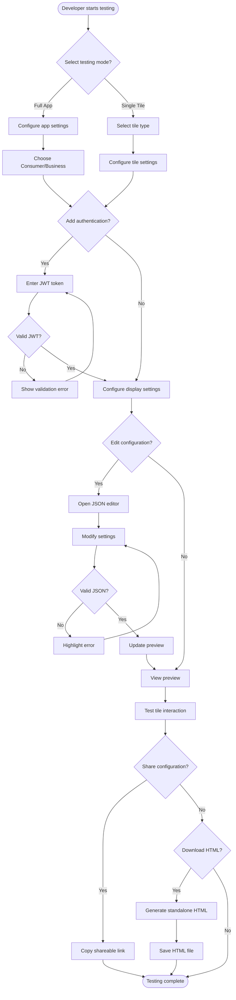

### 2. Configuration Sharing Workflow

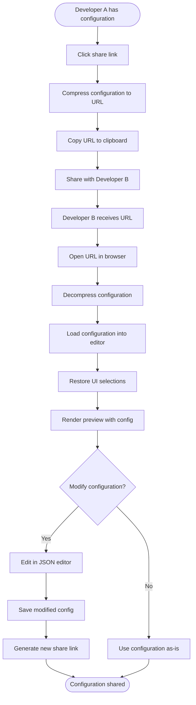

### Reflecting on the Activity Diagrams

Consider these workflow insights:

1. **What decisions points reveal about the user experience?**
   - Multiple decision nodes show flexibility in the testing approach
   - Validation steps prevent errors from propagating
   - The workflow supports both simple and advanced use cases

2. **How does the sharing workflow promote collaboration?**
   - Compressed URLs make sharing lightweight
   - Recipients can immediately see the same configuration
   - Modifications create new links, preserving the original

3. **What would change in these workflows with a new technology stack?**
   - The activities remain the same, but the implementation details change
   - This activity diagram serves as a requirements specification
   - Focus on maintaining the same user experience flow

## UML Deployment Diagram

### Understanding Deployment Diagrams: The Physical Architecture

Deployment diagrams answer: "How is the system deployed and what are the runtime dependencies?"

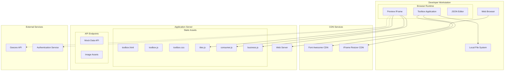

### Deployment Configuration Details

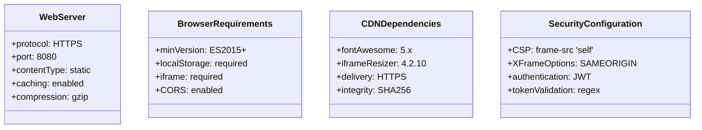

### Reflecting on the Deployment Architecture

Key deployment considerations:

1. **Why are some connections solid and others dashed?**
   - Solid lines show compile-time dependencies
   - Dashed lines indicate runtime, conditional dependencies
   - This distinction helps identify what's required vs. optional

2. **What does the CDN usage tell us about performance priorities?**
   - Common libraries are loaded from CDNs for caching benefits
   - This reduces initial load time and server bandwidth
   - Migration should consider similar optimization strategies

3. **How does the deployment support development vs. production?**
   - The architecture uses environment variables for API endpoints
   - Mock data can replace real services during development
   - This flexibility should be preserved in the new stack

## Data Flow Analysis

### Understanding Data Flow: The Information Journey

Let's trace how data flows through the system:

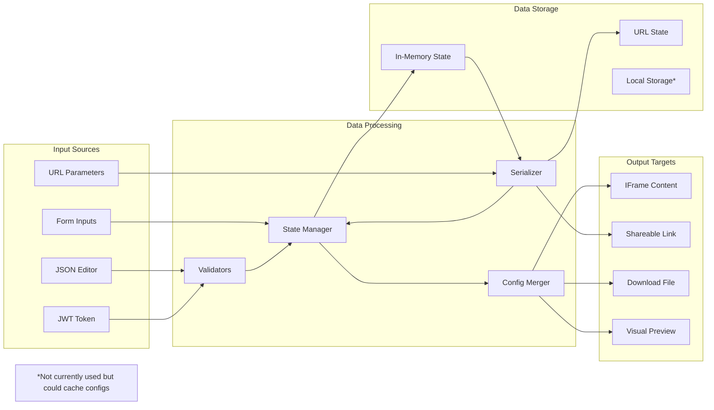

### Data Transformation Pipeline

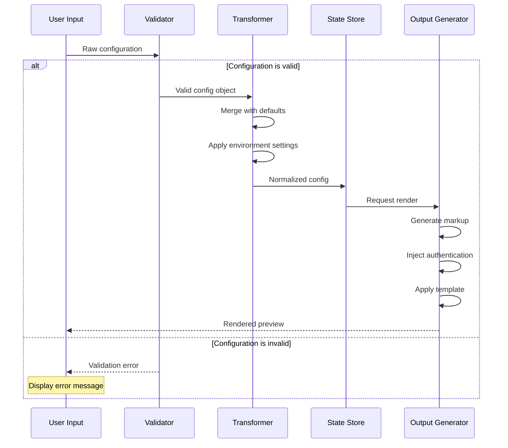

## Technology Migration Considerations

### Current Technology Stack Analysis

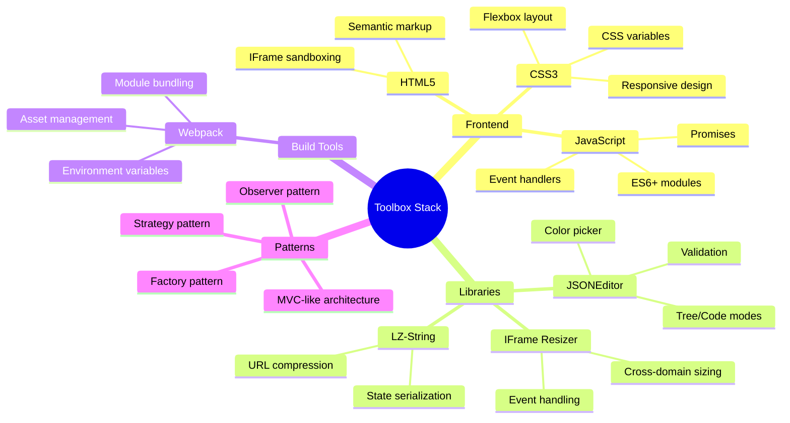

### Migration Strategy Framework

Based on our analysis, here are the key architectural patterns to preserve:

1. **State Management Pattern**
   - Centralized state store
   - Immutable state updates
   - State serialization/deserialization

2. **Component Isolation**
   - Clear boundaries between components
   - Interface-based contracts
   - Dependency injection where applicable

3. **Configuration-Driven Behavior**
   - JSON-based configuration
   - Runtime configuration updates
   - Configuration validation

4. **Preview Isolation**
   - Sandboxed preview environment
   - Cross-origin communication
   - Dynamic content generation

### Migration Decision Matrix

| Aspect | Current Implementation | Migration Options | Considerations |
|--------|----------------------|-------------------|----------------|
| UI Framework | Vanilla JS + DOM manipulation | React, Vue, Angular, Svelte | Need reactive updates, component reusability |
| State Management | Custom state object | Redux, MobX, Zustand, Pinia | Must support serialization, time-travel |
| Configuration Editor | JSONEditor library | Monaco Editor, CodeMirror, Custom | Need schema validation, syntax highlighting |
| Preview System | IFrame with srcdoc | Shadow DOM, Micro-frontends, Module Federation | Security isolation, hot reloading |
| Serialization | LZ-String compression | Native compression API, custom encoding | URL length limits, backward compatibility |
| Build System | Webpack | Vite, Parcel, ESBuild, Rollup | Development speed, tree shaking, HMR |
| Type Safety | None | TypeScript, Flow, JSDoc | Catch configuration errors at compile time |
| Testing | Manual | Jest, Vitest, Playwright, Cypress | Test configuration permutations |

### Recommended Architecture for Migration

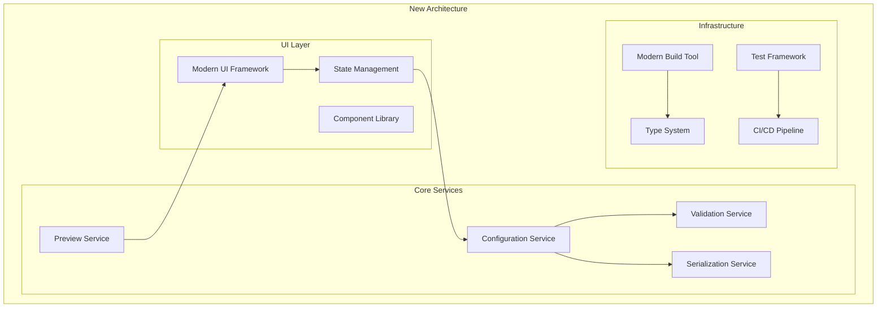

## Conclusion

This comprehensive analysis provides a deep understanding of the Responsive Tiles Toolbox architecture through multiple UML perspectives. The Socratic approach we've taken—asking "why" and "what if" at each step—helps you not just understand the current system but also make informed decisions for your technology migration.

Key takeaways for migration:
1. **Preserve the separation of concerns** evident in the class structure
2. **Maintain the workflow patterns** shown in the activity diagrams
3. **Respect the state management approach** revealed in the state diagrams
4. **Consider the deployment topology** when choosing new technologies
5. **Keep the data flow patterns** that enable configuration sharing

Remember: A successful migration isn't just about changing technologies—it's about preserving what works while improving what doesn't. Use these diagrams as your guide to ensure you maintain the essential behaviors and interactions that make the toolbox valuable to its users.