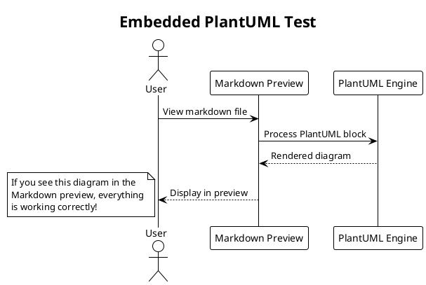
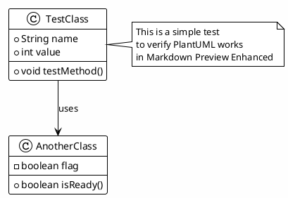

# PlantUML in Markdown Test

This file tests PlantUML diagrams embedded in Markdown.

## Simple Sequence Diagram

## Class Diagram Example

## Testing Instructions

1. Open this file in VS Code
2. Right-click and select "Markdown Preview Enhanced: Open Preview to the Side"
3. You should see the diagrams rendered above 