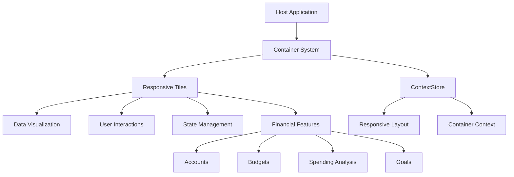
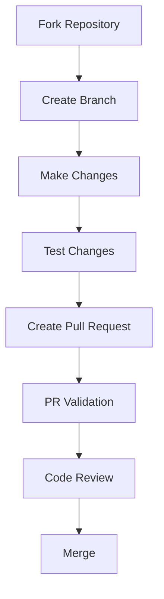

# Responsive Tiles

<div align="center">


[](https://github.com/Banno/responsive-tiles/actions)
[](https://playwright.dev)
[](LICENSE)

**A modular, responsive system for financial data visualization and management**

</div>

## 📋 Overview

Responsive Tiles is an advanced framework for building modular, embeddable financial UI components. Each "tile" is a self-contained feature that can be independently integrated into any host application while maintaining responsive design principles through our container-based approach.



## ✨ Key Features

- **Container-Based Responsiveness**: Class components adapt to their container context via MobX observables
- **Modular Architecture**: Independent, self-contained tiles for each financial feature
- **MobX State Management**: Reactive state updates with efficient store architecture
- **Comprehensive Testing Tools**: Built-in Toolbox and Test Harness for development
- **Production-Ready CI/CD**: Automated deployment pipeline for multiple environments
- **Accessibility Focused**: WCAG 2.1 compliant components that adapt to user preferences
- **Code Validation**: Type checking during PR validation for improved code quality
- **Theming Support**: Customizable appearance to match any brand identity

## 🔄 Release Process

Responsive Tiles follows a trunk-based development approach with automated deployments. As a developer, you need to perform these steps to create a release:

```bash
# Ensure you're on the master branch with latest changes
git checkout master
git pull

# Update version (choose one based on changes)
npm version patch -m "Bump version to %s"  # For bug fixes
# OR
npm version minor -m "Bump version to %s"  # For new features
# OR
npm version major -m "Bump version to %s"  # For breaking changes

# Push changes with tags
git push && git push --tags
```

This will:
1. Update the version in package.json
2. Create a commit with the version change
3. Create a git tag with the version
4. Trigger the CI/CD pipeline to build and deploy to all environments

For detailed information on the complete release process, see [Release Process Documentation](docs/deployment/release-process.md).

## 🚀 Quick Start

### Prerequisites

- Node.js >=20.18.0 <21 (as specified in package.json)
- npm 9+

### Installation

```bash
# Clone the repository
git clone https://github.com/Banno/responsive-tiles.git
cd responsive-tiles

# Install dependencies
npm install
```

### Development

```bash
# Start development server
npm start

# Open in browser
open http://localhost:8080/
```

### Testing

Run Playwright tests with:

```bash
# Run all Playwright tests
npm test

# Run tests in UI mode
npm run playwright:test:local

# Run tests for specific environments
npm run playwright:test:development
npm run playwright:test:staging
npm run playwright:test:production
```

Learn more about [Test Tools](docs/architecture/testing/test-tools.md).

## 📦 Deployment

Responsive Tiles uses a multi-environment deployment strategy through GitHub Actions workflows:

- **PR Validation**: Automated testing on PR creation with immediate feedback
- **Caching Strategy**: Multi-level caching for faster builds (50-70% improvement)
- **Build Once, Deploy Many**: Single artifact deployed to all environments

### Build and Deployment Process

The deployment pipeline progressively promotes changes through three environments:

```mermaid
flowchart TD
    subgraph "CI/CD Pipeline"
        A[Code Push<br>to Master] --> B[Tests & Build<br>with Caching]
        B --> C[Single<br>Versioned Artifact]
        
        C --> D[Deploy to<br>Development]
        D --> E[Verify<br>Development]
        E --> F[Deploy to<br>Staging]
        F --> G[Verify<br>Staging]
        G --> H[Deploy to<br>Production]
        H --> I[Verify<br>Production]
        I --> J[Deployment<br>Report]
    end
    
    subgraph "PR Validation"
        PR[Pull Request<br>Created] --> Tests[Run Tests<br>& Validations]
        Tests --> Feedback[Results Posted<br>as PR Comments]
    end
```



### Automatic Deployment

Deployments are handled automatically by GitHub Actions workflows when code is merged to the master branch. The deployment process is defined in:

- `.github/workflows/main-deployment.yml` (primary deployment workflow)
- `.github/workflows/reusable-build.yml` (reusable build process)

Manual builds can be initiated with:

```bash
# Build for production
npm run build

# Build documentation
npm run build:docs
```

### Environment Configuration

Each environment uses dedicated Google Cloud Platform buckets:

| Environment | Triggered By | GCP Bucket |
|-------------|--------------|------------|
| Development | Push to master | `dev-digital-gzo-geezeo-tiles-zwwst63n` |
| Staging | Successful dev deployment | `stage-digital-gzo-geezeo-tiles-nyjcof9v` |
| Production | Successful staging deployment | `prod-digital-gzo-geezeo-tiles-gvf7byup` |

For detailed workflow configuration, see [GitHub Workflows Documentation](docs/github-workflows/README.md).

## 📚 Documentation

### Architecture

- [Architecture Overview](docs/architecture/overview.md) - System design and high-level concepts
- [Bootstrap Process](docs/architecture/bootstrap/index.md) - Application initialization flow
  - [Configuration Loading](docs/architecture/bootstrap/configuration-loading.md) - Managing application configuration
  - [Container System](docs/architecture/bootstrap/container-system.md) - Container context and MobX integration
  - [Error Handling](docs/architecture/bootstrap/error-handling.md) - Handling errors during bootstrap
  - [Store Initialization](docs/architecture/bootstrap/store-initialization.md) - MobX store setup and management
  - [State Management](docs/architecture/bootstrap/state-management.md) - State management approach
- [Testing Architecture](docs/architecture/testing/test-tools.md) - Toolbox and Test Harness

### Development Guides

- [Getting Started](docs/development/getting-started.md) - Developer setup and workflow
- [Using the Container System](docs/CONTAINER-LAYOUT.md) - Working with responsive containers
- [GitHub Workflow](docs/github-workflows/README.md) - CI/CD workflow documentation
- [Test Tools](docs/architecture/testing/test-tools.md) - Using Toolbox and Test Harness

### GitHub Workflows

- [Implementation Summary](docs/github-workflows/IMPLEMENTATION-SUMMARY.md) - Overview of implemented workflows
- [PR Validation Workflow](docs/github-workflows/pr-validation-workflow.md) - PR testing with feedback
- [Caching Strategy](docs/github-workflows/caching-strategy.md) - Multi-level caching implementation
- [Build Once Deploy Many](docs/github-workflows/build-once-deploy-many.md) - Single-artifact deployment

### API Reference

- [Tile API Reference](docs/api/tile-api-reference.md) - Complete API documentation

## 🛠️ Technology Stack

| Category | Technologies |
|----------|-------------|
| **Frontend Framework** | React (Class Components) |
| **State Management** | MobX with inject/observer pattern |
| **UI Components** | Material UI |
| **Visualization** | D3.js |
| **Build Tools** | Webpack, Babel |
| **Testing** | Jest, Playwright, Enzyme |
| **CI/CD** | GitHub Actions |
| **Hosting** | Google Cloud Platform |

## 🧩 Tile Components

Responsive Tiles includes a variety of financial components:

- **Accounts** - Account management and summaries
- **Transactions** - Transaction lists and search
- **Budgets** - Budget planning and tracking
- **Spending Analysis** - Spending patterns visualization
- **Cash Flow** - Cash flow forecasting and management
- **Goals** - Financial goal setting and tracking
- **Net Worth** - Net worth calculation and history

## 🤝 Contributing

We welcome contributions to Responsive Tiles! Please see our [Contributing Guide](docs/CONTRIBUTING.md) for details on the development process, coding standards, and how to submit pull requests.

### Development Flow



## 📄 License

ISC License - See [LICENSE](LICENSE) file for details.

---

<div align="center">
  <sub>Built with ❤️ by the Financial Experience team at Jack Henry</sub>
</div>