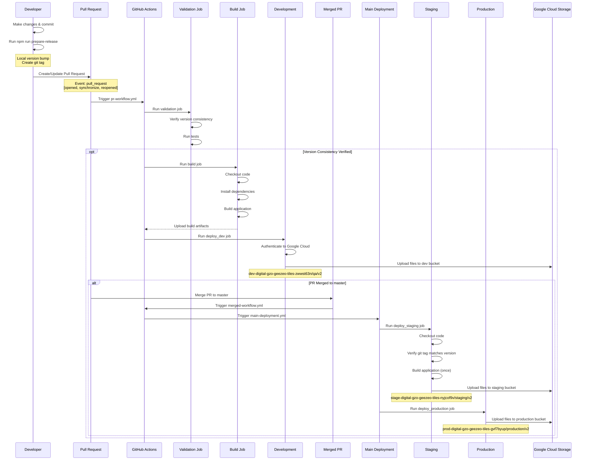
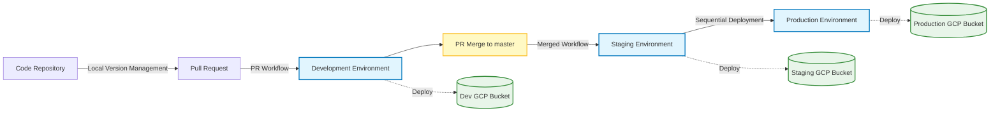

# GitHub Workflow Documentation

## GitHub Actions Workflow Overview

This document provides comprehensive information about the simplified GitHub Actions workflows used in this project for continuous integration and deployment. These workflows support the local version management approach adopted by the project.

### Workflow Structure (Updated May 2025)

The project uses three essential GitHub Actions workflow files:

1. **PR Workflow** (`.github/workflows/pr-workflow.yml`)
   - Validates PRs
   - Ensures version consistency
   - Deploys to development environment

2. **Main Deployment** (`.github/workflows/main-deployment.yml`)
   - Handles deployment to staging and production
   - Verifies git tags match package version
   - Sequential environment deployment

3. **Merged Workflow** (`.github/workflows/merged-workflow.yml`)
   - Triggers after PR merge
   - Automates the main deployment workflow

### Deployment Flow

This repository uses a streamlined "build-once-deploy-many" approach with the following deployment pattern:

1. **PR Creation/Update** → Validate version consistency → Deploy to development environment
2. **PR Merge to Master** → Automatically trigger deployment to staging and production

Key aspects of this workflow:
- Local version management using the prepare-release script
- Version consistency verification in PR workflow
- Git tag verification in main deployment workflow
- Strict environment separation with dedicated GCP buckets
- Build-once-deploy-many approach for consistent deployments

## Local Version Management

The project uses a local version management approach where developers control version bumping:

1. Make code changes and commit using [Conventional Commits](https://www.conventionalcommits.org/) format
2. Run the prepare-release script to bump version and create tag:
   ```bash
   npm run prepare-release
   ```
3. Push changes and tags to GitHub
4. Create a PR to trigger the deployment workflow

### The prepare-release Script

The prepare-release script (`scripts/prepare-release.js`) handles all version management tasks:

1. Analyzes commit messages since the last tag
2. Determines the appropriate version bump (patch, minor, or major)
3. Updates version in package.json and package-lock.json
4. Creates or updates src/version.js with the new version
5. Updates documentation references to version numbers
6. Creates a git commit and tag with the new version

## Workflow Implementation

Our GitHub Actions workflows are defined in YAML files in the `.github/workflows/` directory.



### Workflow File Structure

The project uses three essential GitHub Actions workflow files:

#### 1. PR Workflow (`pr-workflow.yml`)

This workflow runs when a PR is created or updated:

```yaml
name: PR Validation and Development Deployment

on:
  pull_request:
    branches: [ master ]
    types: [ opened, synchronize, reopened ]

jobs:
  pr-validation:
    runs-on: ubuntu-latest
    steps:
      - uses: actions/checkout@v4
      
      - name: Get version from package.json
        id: get-version
        run: echo "version=$(node -p "require('./package.json').version")" >> $GITHUB_OUTPUT
      
      - name: Verify basic version consistency
        run: |
          # Check if version.js exists
          if [ -f "src/version.js" ]; then
            VERSION_JS=$(grep -o "'[0-9]\+\.[0-9]\+\.[0-9]\+'" src/version.js | tr -d "'")
            echo "✅ Found version in version.js: $VERSION_JS"
          else
            echo "⚠️ src/version.js not found"
            exit 1
          fi
      
      # Build and test steps...
      
  deploy-dev:
    needs: [pr-validation]
    runs-on: ubuntu-latest
    steps:
      # Deployment steps to dev environment...
```

This workflow ensures version consistency by verifying that the version in `package.json` matches the version in `src/version.js`, which should have been updated by the developer using the `prepare-release` script.

#### 2. Main Deployment (`main-deployment.yml`)

This workflow handles deployments to staging and production:

```yaml
name: Main Deployment

on:
  workflow_dispatch:

jobs:
  deploy-staging:
    runs-on: ubuntu-latest
    steps:
      - uses: actions/checkout@v4
      
      - name: Get version from package.json
        id: get-version
        run: echo "version=$(node -p "require('./package.json').version")" >> $GITHUB_OUTPUT
      
      - name: Check git tag matches package version
        run: |
          CURRENT_VERSION="${{ steps.get-version.outputs.version }}"
          TAG_EXISTS=$(git tag -l "v$CURRENT_VERSION")
          
          if [ -z "$TAG_EXISTS" ]; then
            echo "❌ No git tag found for version v$CURRENT_VERSION"
            echo "Please run 'npm run prepare-release' locally to create the git tag"
            exit 1
          fi
      
      # Build and deployment steps...
      
  deploy-production:
    needs: [deploy-staging]
    runs-on: ubuntu-latest
    steps:
      # Deployment steps to production environment...
```

This workflow verifies that a git tag exists for the current version, which would have been created by the developer using the `prepare-release` script.

#### 3. Merged Workflow (`merged-workflow.yml`)

This simple workflow triggers after a PR is merged to master:

```yaml
name: Post-Merge Deployment

on:
  pull_request:
    branches: [ master ]
    types: [ closed ]

jobs:
  trigger-deployment:
    if: github.event.pull_request.merged == true
    runs-on: ubuntu-latest
    steps:
      - name: Trigger main deployment workflow
        uses: actions/github-script@v7
        with:
          github-token: ${{ secrets.GITHUB_TOKEN }}
          script: |
            github.rest.actions.createWorkflowDispatch({
              owner: context.repo.owner,
              repo: context.repo.repo,
              workflow_id: 'main-deployment.yml',
              ref: 'master'
            });
```

This workflow simply triggers the main deployment workflow when a PR is merged to master.

## GCP Deployment Architecture

The deployment uses a sequential promotion model with three distinct environments:



### Environment Details

The project uses three distinct environments with dedicated GCP buckets:

#### Development Environment
- **Purpose**: Early testing and verification of changes
- **Trigger**: Automatic deployment on PR creation/update
- **GCP Bucket**: `dev-digital-gzo-geezeo-tiles-zwwst63n`
- **Path**: `qa/v2/`
- **URL**: https://geezeo.geezeo.banno-development.com/assets/tiles/v2/

#### Staging Environment
- **Purpose**: Pre-production validation
- **Trigger**: Automatic deployment after PR merge to master
- **GCP Bucket**: `stage-digital-gzo-geezeo-tiles-nyjcof9v`
- **Path**: `staging/v2/`
- **URL**: https://geezeo.geezeo.banno-qa.com/assets/tiles/v2/

#### Production Environment
- **Purpose**: Live environment for end users
- **Trigger**: Automatic deployment after staging deployment completes
- **GCP Bucket**: `prod-digital-gzo-geezeo-tiles-gvf7byup`
- **Path**: `production/v2/`
- **URL**: https://geezeo.geezeo.banno.com/assets/tiles/v2/

### Deployment Process

The "build-once-deploy-many" approach ensures that the same code artifact is deployed to all environments, eliminating environment-specific build differences:

1. Code is built once during the PR workflow
2. The same build artifact is deployed to development
3. After PR merge, the main deployment workflow:
   - Builds the application again (fresh from the merged code)
   - Deploys to staging first
   - Then deploys to production

This ensures:
1. **Consistent Deployments**: Same code in all environments
2. **Sequential Promotions**: Changes follow a predictable path
3. **Version Consistency**: All files have matching versions
4. **Reliable Process**: Simplified workflow with fewer points of failure

## Implementation Details

### Key Workflow Components

#### 1. GCP Authentication and Deployment

The workflows use Google Cloud Platform's `upload-cloud-storage` action for deployment:

```yaml
- name: Deploy to development
  uses: "google-github-actions/upload-cloud-storage@v2"
  with:
    path: ./dist
    destination: "${{ env.GCP_HOSTING_BUCKET }}/${{ env.DEPLOY_FOLDER }}/v2"
```

This action handles:
- Authentication to Google Cloud
- Recursive file uploads
- Preserving file permissions and structure
- Setting appropriate MIME types

#### 2. Version Verification

The workflow includes basic checks to verify the existence of version files without strict version matching:

```yaml
- name: Verify basic version consistency
  run: |
    # Check if version.js exists
    if [ -f "src/version.js" ]; then
      VERSION_JS=$(grep -o "'[0-9]\+\.[0-9]\+\.[0-9]\+'" src/version.js | tr -d "'")
      echo "✅ Found version in version.js: $VERSION_JS"
    else
      echo "⚠️ src/version.js not found"
      exit 1
    fi
```

This ensures that critical version files exist without enforcing strict version matching, which simplifies maintenance for this sunsetted application.

#### 3. Git Tag Verification

The main deployment workflow verifies that git tags match the package version:

```yaml
- name: Check git tag matches package version
  run: |
    CURRENT_VERSION="${{ steps.get-version.outputs.version }}"
    TAG_EXISTS=$(git tag -l "v$CURRENT_VERSION")
    
    if [ -z "$TAG_EXISTS" ]; then
      echo "❌ No git tag found for version v$CURRENT_VERSION"
      echo "Please run 'npm run prepare-release' locally to create the git tag"
      exit 1
    fi
```

This ensures that version tags created by the `prepare-release` script are properly pushed to GitHub.

## Best Practices

### Local Version Management

1. **Version Consistency**: Always run `npm run prepare-release` before creating a PR
2. **Push Tags**: Remember to push tags with `git push --tags`
3. **Use Conventional Commits**: Format commit messages to follow the [Conventional Commits](https://www.conventionalcommits.org/) standard for automated versioning

### Workflow Triggering

1. **PR Creation/Update**: The PR workflow runs automatically when:
   - A new PR is created
   - Code is pushed to a PR branch
   - A closed PR is reopened

2. **PR Merge**: The merged workflow runs automatically when:
   - A PR is merged to master
   - It then triggers the main deployment workflow

### Troubleshooting

#### Version Mismatch Issues

If the PR workflow fails with a version mismatch error:

1. Run `npm run prepare-release` locally
2. Commit the changes with a message like "chore: update version consistency"
3. Push changes to your branch
4. The workflow will re-run automatically

#### Git Tag Issues

If the main deployment workflow fails with a git tag error:

1. Check existing tags with `git tag -l`
2. If the tag exists locally but not remotely, push it with `git push --tags`
3. If the tag doesn't exist, run `npm run prepare-release` to create it

#### Deployment Verification

The workflows now include simplified deployment verification that checks for the existence of key files without checking version content:

```yaml
- name: Verify deployment
  run: |
    echo "Verifying deployment to development environment"
    
    # Initialize verification statuses
    VERIFY_HTML="❌"
    VERIFY_JS="❌"
    VERIFY_DOCS="❌"
    
    # Simply verify that key files exist without checking version content
    if gsutil ls "gs://${{ env.GCP_HOSTING_BUCKET }}/${{ env.DEPLOY_FOLDER }}/v2/index.html"; then
      echo "✅ index.html found in development environment"
      VERIFY_HTML="✅"
    else
      echo "⚠️ index.html not found in development environment"
    fi
      
    # Check for JavaScript files in both possible locations
    if gsutil ls "gs://${{ env.GCP_HOSTING_BUCKET }}/${{ env.DEPLOY_FOLDER }}/v2/tiles.js"; then
      echo "✅ tiles.js found in development environment"
      VERIFY_JS="✅"
    elif gsutil ls "gs://${{ env.GCP_HOSTING_BUCKET }}/${{ env.DEPLOY_FOLDER }}/v2/develop/v2/tiles.js"; then
      echo "✅ tiles.js found in alternate location in development environment"
      VERIFY_JS="✅"
    else
      echo "⚠️ tiles.js not found in expected locations"
    fi
```

To verify a successful deployment, check the following URLs:

- Development: https://geezeo.geezeo.banno-development.com/assets/tiles/v2/
- Staging: https://geezeo.geezeo.banno-qa.com/assets/tiles/v2/
- Production: https://geezeo.geezeo.banno.com/assets/tiles/v2/

## Security Considerations

The workflows implement several security best practices:

1. **Workload Identity Federation**: Secure authentication to Google Cloud
2. **Minimal Permissions**: Each workflow uses only the permissions it requires
3. **Version Consistency**: Strict verification prevents inconsistent deployments
4. **Environment Separation**: Clear separation between development, staging, and production environments