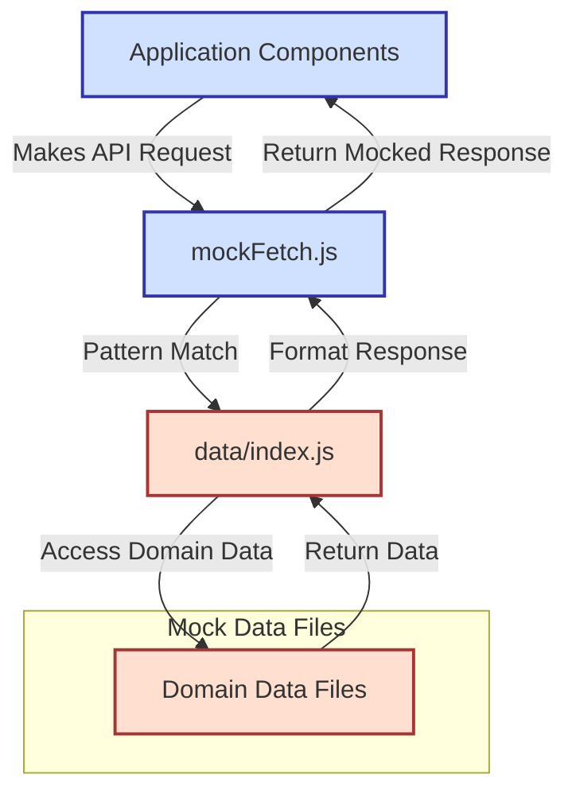
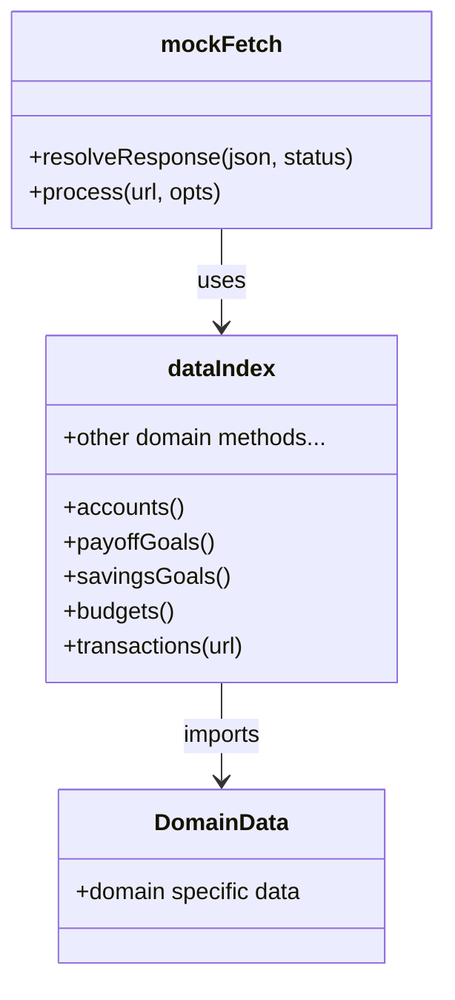
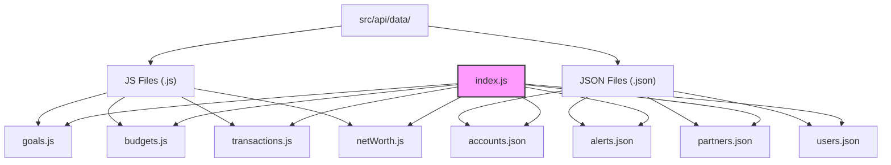
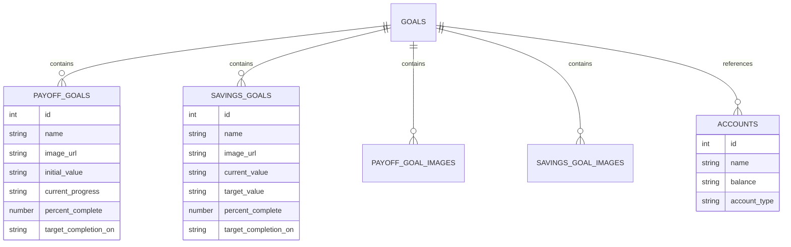
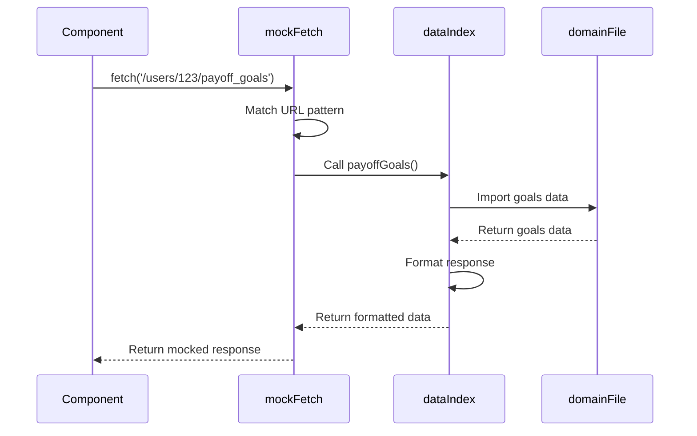
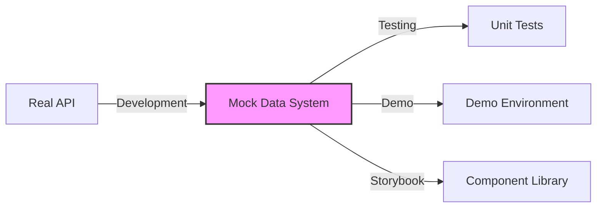

# Mock Data System Documentation

## Overview

The responsive-tiles application implements a comprehensive mock data system that simulates API responses during development and testing. This document describes how the mock data system is structured, how it functions, and best practices for extending or modifying mock data.



## Table of Contents

1. [System Architecture](#system-architecture)
2. [Mock Data Organization](#mock-data-organization)
3. [How Mock Data is Consumed](#how-mock-data-is-consumed)
4. [Extending Mock Data](#extending-mock-data)
5. [Best Practices](#best-practices)

## System Architecture

The mock data system consists of the following key components:

- **Mock Data Files**: Static JSON and JS files containing structured data that mimics API responses
- **Mock Fetch System**: A fetch interceptor that returns mock data instead of making actual API calls
- **Data Access Layer**: Utility functions that provide access to the mock data

The system is designed to mimic real API responses with minimal code changes when switching between real and mock data environments.



### Key Files

- `src/api/mockFetch.js`: The central mock fetch implementation that intercepts API calls
- `src/api/data/index.js`: The main entry point for accessing mock data
- `src/api/data/*.js` and `src/api/data/*.json`: Individual mock data files for specific domains

## Mock Data Organization

The mock data is organized by domain area, with separate files for different types of data:



### Data File Types

1. **JS Files**: Used for complex data structures or when logic is needed to generate data
   - Example: `src/api/data/goals.js` - Contains goals data with related objects

2. **JSON Files**: Used for simpler, static data structures
   - Example: `src/api/data/accounts.json` - Contains account data

### Data Structure

Most mock data files follow a similar pattern:

```javascript
// Example structure from goals.js
const data = {
  accounts: [{...}],         // Related account data
  payoff_goals: [{...}],     // Payoff goal data
  savings_goals: [{...}],    // Savings goal data
  payoff_goal_images: [{...}], // Images for payoff goals
  savings_goal_images: [{...}]  // Images for savings goals
};

export default data;
```



## How Mock Data is Consumed

The mock data system is used through the following flow:



1. **API Request**: Components make API requests as they would in production
2. **Request Interception**: `mockFetch.js` intercepts these requests
3. **URL Pattern Matching**: The request URL is matched against patterns to determine the appropriate response
4. **Data Retrieval**: The appropriate data is retrieved from mock data files
5. **Response Formatting**: Data is formatted to match the expected API response structure
6. **Response Return**: The formatted data is returned to the component

### Example Flow

```javascript
// Component makes a request
fetch('/users/123/payoff_goals')

// mockFetch.js intercepts and processes
if (url.match(/\/users\/\w+\/payoff_goals/) && opts.method === 'get') {
  resolveResponse(demoData.payoffGoals());
}

// demoData.payoffGoals() (from src/api/data/index.js) returns formatted data
export function payoffGoals() {
  return JSON.parse(JSON.stringify({
    payoff_goals : goals.payoff_goals,
    accounts     : goals.accounts,
  }))
}
```

## Extending Mock Data

To extend or modify the mock data system:

```mermaid
flowchart TD
    A[Start] --> B{New or Existing?}
    B -->|New Data Type| C[Create new data file]
    B -->|Modify Existing| D[Locate existing file]
    
    C --> E[Export data structure]
    D --> F[Modify data structure]
    
    E --> G[Import in data/index.js]
    F --> H{Structure Changed?}
    
    G --> I[Create accessor function]
    H -->|Yes| J[Update accessor function]
    H -->|No| K[No changes needed]
    
    I --> L[Add URL pattern in mockFetch.js]
    J --> L
    K --> M[End]
    L --> M
    
    classDef start fill:#green,stroke:#333,stroke-width:2px;
    classDef decision fill:#ffcc00,stroke:#333,stroke-width:2px;
    classDef process fill:#00ccff,stroke:#333,stroke-width:2px;
    classDef end fill:#ff9999,stroke:#333,stroke-width:2px;
    
    class A start;
    class B,H decision;
    class C,D,E,F,G,I,J,K,L process;
    class M end;
```

### Adding New Mock Data Files

1. Create a new file in `src/api/data/` with your mock data
2. Export the data as either a default export or named exports
3. Import the file in `src/api/data/index.js` and create accessor functions
4. Add URL pattern matching in `src/api/mockFetch.js` to return the data

### Modifying Existing Mock Data

1. Find the appropriate file in `src/api/data/`
2. Modify the data structure as needed
3. If changing response structure, ensure the corresponding mock fetch handler returns the data correctly

## Best Practices

When working with the mock data system:

```mermaid
mindmap
  root((Mock Data<br>Best Practices))
    Consistency
      ::icon(fa fa-check)
      Match real API structure
      Use correct data types
    Deep Cloning
      ::icon(fa fa-clone)
      Prevent unintended modification
      Use JSON.parse(JSON.stringify())
    Simulate Behavior
      ::icon(fa fa-spinner)
      Add appropriate delays
      Simulate errors
      Match real response codes
    Global Overrides
      ::icon(fa fa-wrench)
      global.DEMO_ACCOUNTS
      Test specific scenarios
    TypeScript Integration
      ::icon(fa fa-code)
      Match interface definitions
      Add proper typing
```

1. **Maintain Consistency**: Ensure mock data structure matches the real API response structure
2. **Use Deep Cloning**: When returning mock data, clone it to prevent modification (e.g., `JSON.parse(JSON.stringify(data))`)
3. **Simulate Behavior**: Add appropriate delays and errors to simulate real API behavior
4. **Global Overrides**: Use global variables like `global.DEMO_ACCOUNTS` for temporary testing overrides
5. **TypeScript Integration**: For TypeScript projects, ensure mock data adheres to interface definitions

### Example of Adding a New Mock Data Type

```javascript
// 1. Create file: src/api/data/newFeature.js
const data = {
  items: [
    { id: 1, name: 'Item 1' },
    { id: 2, name: 'Item 2' }
  ]
};
export default data;

// 2. Update src/api/data/index.js
import newFeatureData from './newFeature';

export function newFeature() {
  return JSON.parse(JSON.stringify({
    items: newFeatureData.items
  }));
}

// 3. Update src/api/mockFetch.js
else if (url.match(/\/users\/\w+\/new-feature/) && opts.method === 'get') {
  resolveResponse(demoData.newFeature());
}
```

## Conclusion

The mock data system provides a flexible and maintainable way to develop and test the application without requiring a backend connection. By following the patterns established in the codebase, you can easily extend the system to support new features and data types.


