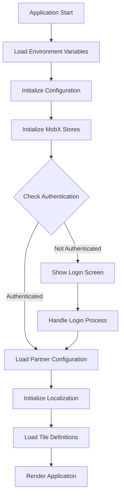
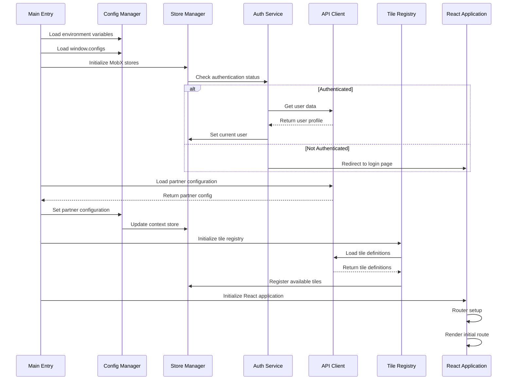

# Bootstrap Sequence

This document details the sequence of steps that occur when the Responsive Tiles application initializes.

## High-Level Bootstrap Flow

The bootstrap process follows this high-level sequence:



## Detailed Bootstrap Sequence



## Bootstrap Process Timeline

The bootstrap process has several distinct phases:

1. **Pre-initialization Phase** (0-100ms)
   - Load environment variables
   - Setup error handlers
   - Initialize logging

2. **Core Initialization Phase** (100-300ms)
   - Initialize configuration
   - Setup MobX stores
   - Initialize API client

3. **Authentication Phase** (300-500ms)
   - Check authentication status
   - Load user data if authenticated
   - Setup authentication listeners

4. **Configuration Loading Phase** (500-700ms)
   - Load partner configuration
   - Apply user preferences
   - Merge configurations

5. **Component Initialization Phase** (700-1000ms)
   - Initialize tile registry
   - Load tile definitions
   - Setup event listeners

6. **Rendering Phase** (1000ms+)
   - Initialize React application
   - Setup routes
   - Render initial components

## Bootstrap Entry Point

The main entry point for the bootstrap process is in `index.js`:

```javascript
import React from 'react'
import ReactDOM from 'react-dom'
import { configure } from 'mobx'
import { Provider } from 'mobx-react'

import App from './App'
import { initStores } from './stores'
import { loadPartnerConfig } from './api/partner'
import { checkAuthentication } from './services/auth'
import { initTileRegistry } from './services/tileRegistry'

// Initialize the application
async function bootstrap() {
  console.log('Starting bootstrap process...')
  
  // Initialize MobX stores
  const stores = initStores()
  
  // Check authentication status
  const isAuthenticated = await checkAuthentication()
  if (isAuthenticated) {
    await stores.usersStore.loadCurrentUser()
  }
  
  // Load partner configuration
  try {
    const partnerConfig = await loadPartnerConfig()
    stores.contextStore.setPartnerConfig(partnerConfig)
  } catch (error) {
    console.error('Failed to load partner configuration:', error)
    // Continue with default configuration
  }
  
  // Initialize tile registry
  await initTileRegistry(stores.tilesRegistryStore)
  
  // Render the application
  ReactDOM.render(
    <Provider {...stores}>
      <App isAuthenticated={isAuthenticated} />
    </Provider>,
    document.getElementById('root')
  )
  
  console.log('Bootstrap process completed')
}

// Start the bootstrap process
bootstrap().catch(error => {
  console.error('Bootstrap process failed:', error)
  // Render error page
  ReactDOM.render(
    <div className="bootstrap-error">
      <h1>Application failed to start</h1>
      <p>Please refresh the page or contact support.</p>
    </div>,
    document.getElementById('root')
  )
})
```

## Error Handling During Bootstrap

The bootstrap process includes comprehensive error handling:

```javascript
// Error boundary for the entire application
class BootstrapErrorBoundary extends React.Component {
  constructor(props) {
    super(props)
    this.state = { hasError: false, error: null }
  }
  
  static getDerivedStateFromError(error) {
    return { hasError: true, error }
  }
  
  componentDidCatch(error, errorInfo) {
    console.error('Bootstrap error caught:', error, errorInfo)
    // Send error to monitoring service
    sendErrorToMonitoring(error, errorInfo)
  }
  
  render() {
    if (this.state.hasError) {
      return (
        <div className="bootstrap-error">
          <h1>Application Error</h1>
          <p>The application encountered an error during startup.</p>
          <button onClick={() => window.location.reload()}>
            Restart Application
          </button>
        </div>
      )
    }
    
    return this.props.children
  }
}

// Wrap the application with error boundary
ReactDOM.render(
  <BootstrapErrorBoundary>
    <Provider {...stores}>
      <App isAuthenticated={isAuthenticated} />
    </Provider>
  </BootstrapErrorBoundary>,
  document.getElementById('root')
)
```

## Initialization Events

The bootstrap process fires events that other parts of the application can listen to:

```javascript
// Bootstrap event system
const bootstrapEvents = new EventEmitter()

// Event constants
export const BOOTSTRAP_EVENTS = {
  STARTED: 'bootstrap:started',
  CONFIG_LOADED: 'bootstrap:config_loaded',
  STORES_INITIALIZED: 'bootstrap:stores_initialized',
  AUTH_CHECKED: 'bootstrap:auth_checked',
  PARTNER_CONFIG_LOADED: 'bootstrap:partner_config_loaded',
  TILES_LOADED: 'bootstrap:tiles_loaded',
  COMPLETED: 'bootstrap:completed',
  ERROR: 'bootstrap:error'
}

// Emit events during bootstrap
async function bootstrap() {
  bootstrapEvents.emit(BOOTSTRAP_EVENTS.STARTED)
  
  try {
    // Initialize stores
    const stores = initStores()
    bootstrapEvents.emit(BOOTSTRAP_EVENTS.STORES_INITIALIZED, stores)
    
    // Check authentication
    const isAuthenticated = await checkAuthentication()
    bootstrapEvents.emit(BOOTSTRAP_EVENTS.AUTH_CHECKED, isAuthenticated)
    
    // ... other initialization steps
    
    bootstrapEvents.emit(BOOTSTRAP_EVENTS.COMPLETED)
  } catch (error) {
    bootstrapEvents.emit(BOOTSTRAP_EVENTS.ERROR, error)
    throw error
  }
}
```

## Lazy-Loading and Performance Optimizations

The bootstrap process implements performance optimizations:

```javascript
// Lazy-load non-critical components and functionality
const LazyDashboard = React.lazy(() => import('./components/Dashboard'))
const LazySettings = React.lazy(() => import('./components/Settings'))

// Use React Suspense to handle lazy-loaded components
const App = () => (
  <Router>
    <React.Suspense fallback={<LoadingSpinner />}>
      <Switch>
        <Route path="/dashboard" component={LazyDashboard} />
        <Route path="/settings" component={LazySettings} />
        <Route path="/" component={HomePage} />
      </Switch>
    </React.Suspense>
  </Router>
)
``` 
