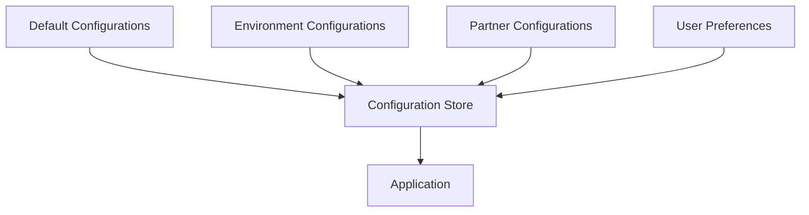
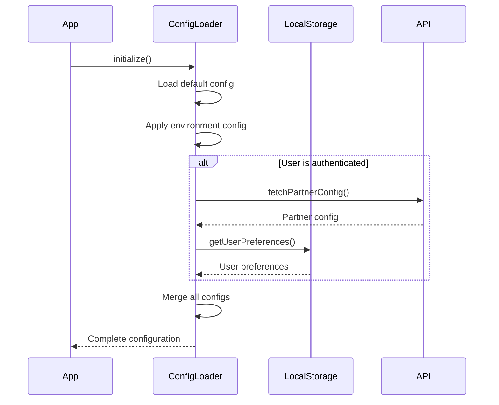

# Configuration Loading

This document explains how configurations are loaded and managed during the bootstrap process of the Responsive Tiles application.

## Configuration Architecture

The Responsive Tiles application uses a layered configuration approach, where configurations from multiple sources are merged together with appropriate precedence rules.



## Configuration Sources

The configuration system uses the following sources, listed in order of increasing precedence:

1. **Default Configurations**: Base configurations provided with the application code
2. **Environment Configurations**: Environment-specific settings (dev, staging, production)
3. **Partner Configurations**: Configurations specific to the integration partner
4. **User Preferences**: Personal configurations stored for individual users

## Configuration Loading Sequence

During the bootstrap process, configurations are loaded in a specific sequence:



## Configuration Store Implementation

The application uses a Configuration Store implemented with MobX to manage and access configuration values.

```typescript
// src/stores/ConfigurationStore.ts
import { makeAutoObservable } from 'mobx';
import { mergeDeep } from '../utils/merge';
import defaultConfig from '../config/default';
import envConfig from '../config/environment';

export class ConfigurationStore {
  private config: Record<string, any> = {};
  private isLoaded: boolean = false;
  private error: Error | null = null;

  constructor() {
    makeAutoObservable(this);
    // Initialize with default and environment configs
    this.config = mergeDeep({}, defaultConfig, envConfig);
  }

  async initialize() {
    try {
      // Apply default and environment configurations
      this.config = mergeDeep({}, defaultConfig, envConfig);
      
      // Load partner configuration if appropriate
      const partnerConfig = await this.loadPartnerConfig();
      if (partnerConfig) {
        this.config = mergeDeep(this.config, partnerConfig);
      }
      
      // Load user preferences if available
      const userPreferences = this.loadUserPreferences();
      if (userPreferences) {
        this.config = mergeDeep(this.config, userPreferences);
      }
      
      this.isLoaded = true;
    } catch (err) {
      this.error = err instanceof Error ? err : new Error(String(err));
      // Still mark as loaded but with error state
      this.isLoaded = true;
    }
  }

  private async loadPartnerConfig() {
    // Implementation of partner config loading
    try {
      // This might be an API call or other external data source
      return { /* partner specific config */ };
    } catch (err) {
      console.error('Failed to load partner config:', err);
      return null;
    }
  }

  private loadUserPreferences() {
    try {
      const savedPreferences = localStorage.getItem('userPreferences');
      return savedPreferences ? JSON.parse(savedPreferences) : null;
    } catch (err) {
      console.error('Failed to load user preferences:', err);
      return null;
    }
  }

  get<T>(path: string, defaultValue?: T): T {
    return this.getValueByPath(this.config, path, defaultValue);
  }

  private getValueByPath<T>(obj: Record<string, any>, path: string, defaultValue?: T): T {
    const parts = path.split('.');
    let current = obj;
    
    for (const part of parts) {
      if (current === undefined || current === null) {
        return defaultValue as T;
      }
      current = current[part];
    }
    
    return (current === undefined) ? (defaultValue as T) : (current as T);
  }

  // Methods to update configurations (typically only user preferences)
  updateUserPreference(key: string, value: any) {
    // Update in-memory config
    const userPreferencesPath = 'user.preferences';
    const userPreferences = this.get(userPreferencesPath, {});
    const updatedPreferences = { ...userPreferences, [key]: value };
    
    // Create a patch just for user preferences
    const patch = { user: { preferences: updatedPreferences } };
    this.config = mergeDeep(this.config, patch);
    
    // Persist to localStorage
    try {
      localStorage.setItem('userPreferences', JSON.stringify(updatedPreferences));
    } catch (err) {
      console.error('Failed to save user preferences:', err);
    }
  }
}
```

## Using the Configuration Store

Components and services can access the configuration through the Configuration Store:

```typescript
// Example of using the ConfigurationStore in a component
import React from 'react';
import { observer } from 'mobx-react-lite';
import { useStores } from '../hooks/useStores';

const ConfigDependentComponent = observer(() => {
  const { configStore } = useStores();
  
  // Access configuration values
  const apiUrl = configStore.get('api.baseUrl', 'https://api.default.com');
  const theme = configStore.get('ui.theme', 'light');
  
  return (
    <div className={`theme-${theme}`}>
      <p>API URL: {apiUrl}</p>
      {/* Component implementation */}
    </div>
  );
});
```

## Feature Flags

The configuration system also supports feature flags to conditionally enable or disable features:

```typescript
// Example of using feature flags
const FeatureComponent = observer(() => {
  const { configStore } = useStores();
  
  // Check if feature is enabled
  const isFeatureEnabled = configStore.get('features.newDashboard', false);
  
  if (!isFeatureEnabled) {
    return null; // Don't render if feature is disabled
  }
  
  return (
    <div className="new-dashboard">
      {/* New dashboard implementation */}
    </div>
  );
});
```

## Configuration Schema

The configuration system uses a standardized schema to organize different types of settings:

```typescript
// Example configuration schema
interface ConfigSchema {
  api: {
    baseUrl: string;
    timeout: number;
    retryAttempts: number;
  };
  ui: {
    theme: 'light' | 'dark' | 'auto';
    density: 'comfortable' | 'compact';
    animations: boolean;
  };
  features: {
    [featureName: string]: boolean;
  };
  tiles: {
    defaultLayout: string;
    availableTiles: string[];
    refreshInterval: number;
  };
  user: {
    preferences: Record<string, any>;
  };
}
```

## Error Handling in Configuration Loading

The configuration system is designed to be resilient to errors in configuration loading:

1. **Graceful Degradation**: If a configuration source is unavailable, the system continues with the available configurations
2. **Default Values**: APIs for accessing configuration always support default values
3. **Logging**: Configuration loading errors are logged for debugging
4. **Recovery Mechanisms**: The system can attempt to reload configurations if initial loading fails

## Configuration Validation

To ensure configuration correctness, validation is performed during loading:

```typescript
// Simplified configuration validation example
function validateConfig(config: Record<string, any>): boolean {
  // Required fields must exist
  if (!config.api?.baseUrl) {
    console.error('Configuration missing required field: api.baseUrl');
    return false;
  }
  
  // Value type validation
  if (typeof config.api.timeout !== 'number') {
    console.error('Configuration field api.timeout must be a number');
    return false;
  }
  
  // Additional validation rules...
  
  return true;
}
```

## Dynamic Configuration Updates

Some configurations can be updated at runtime:

1. **User Preferences**: Can be changed by the user and are persisted
2. **Remote Configurations**: May be updated from a remote source periodically
3. **A/B Testing**: May change based on experiments

The Configuration Store provides observable values that automatically update UI components when configurations change.

## Configuration Best Practices

When working with the configuration system, follow these guidelines:

1. **Categorize Properly**: Place new configuration items in the appropriate category
2. **Use Default Values**: Always provide sensible defaults when reading configuration
3. **Subscribe to Changes**: Use mobx's reactivity to respond to configuration changes
4. **Document New Settings**: Add documentation for any new configuration options
5. **Validate Inputs**: Validate configuration values to prevent runtime errors
6. **Consider Security**: Do not store sensitive information in client-side configurations

## Testing the Configuration System

Strategies for testing the configuration system include:

1. **Unit Tests**: Test the ConfigurationStore methods and validation logic
2. **Integration Tests**: Test the interaction between the configuration system and other parts of the application
3. **Mock Configurations**: Use mock configurations for testing specific scenarios
4. **Test Feature Flags**: Test both enabled and disabled states for feature-flagged functionality 
