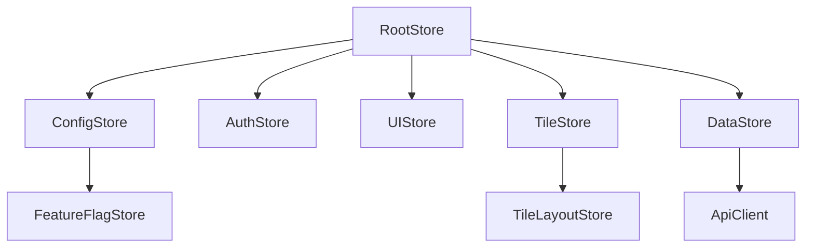
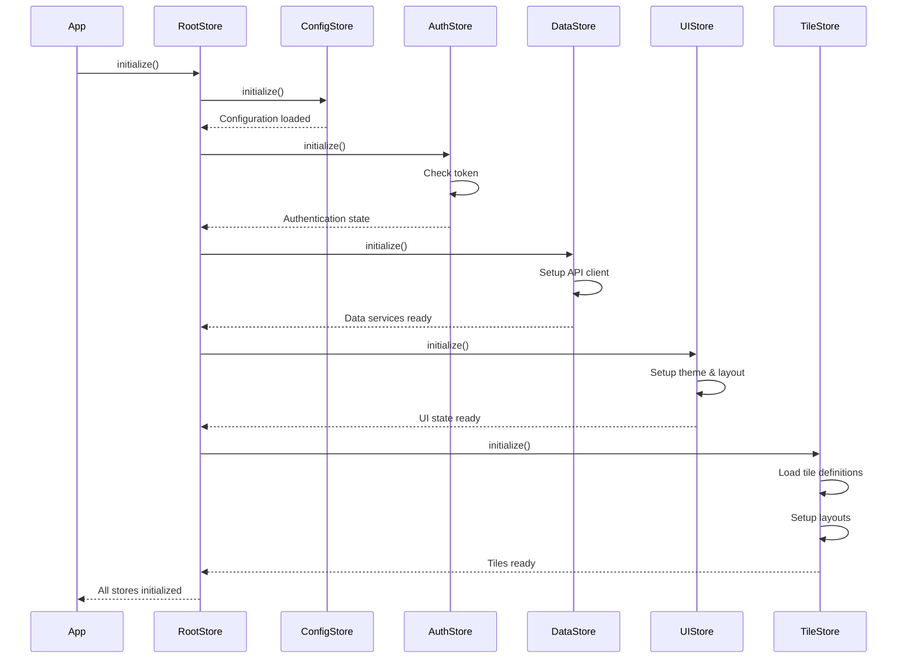

# Store Initialization

This document explains how the MobX stores are initialized during the bootstrap process of the Responsive Tiles application.

## Store Architecture Overview

The Responsive Tiles application uses MobX for state management, with a hierarchical store structure. The store initialization process ensures that all stores are properly created, configured, and connected before the application UI renders.



## Store Initialization Sequence

The store initialization follows a specific sequence to ensure dependencies are properly resolved:



## RootStore Implementation

The RootStore serves as the container for all other stores and handles their initialization:

```typescript
// src/stores/RootStore.ts
import { makeAutoObservable } from 'mobx';
import { ConfigStore } from './ConfigStore';
import { AuthStore } from './AuthStore';
import { UIStore } from './UIStore';
import { TileStore } from './TileStore';
import { DataStore } from './DataStore';

export class RootStore {
  configStore: ConfigStore;
  authStore: AuthStore;
  uiStore: UIStore;
  tileStore: TileStore;
  dataStore: DataStore;
  
  initialized: boolean = false;
  error: Error | null = null;
  
  constructor() {
    makeAutoObservable(this);
    
    // Create store instances
    this.configStore = new ConfigStore(this);
    this.authStore = new AuthStore(this);
    this.dataStore = new DataStore(this);
    this.uiStore = new UIStore(this);
    this.tileStore = new TileStore(this);
  }
  
  async initialize() {
    try {
      // Initialize config store first
      await this.configStore.initialize();
      
      // Initialize authentication
      await this.authStore.initialize();
      
      // Initialize data store (API clients, etc.)
      await this.dataStore.initialize();
      
      // Initialize UI store
      await this.uiStore.initialize();
      
      // Initialize tile store (depends on other stores)
      await this.tileStore.initialize();
      
      this.initialized = true;
    } catch (err) {
      this.error = err instanceof Error ? err : new Error(String(err));
      console.error('Failed to initialize stores:', err);
    }
  }
  
  get isInitialized() {
    return this.initialized;
  }
  
  get hasError() {
    return this.error !== null;
  }
  
  get initializationError() {
    return this.error;
  }
}
```

## Store Context Provider

The stores are made available to components through a React context provider:

```typescript
// src/stores/StoreContext.tsx
import React, { createContext, useContext, ReactNode } from 'react';
import { RootStore } from './RootStore';

const StoreContext = createContext<RootStore | null>(null);

interface StoreProviderProps {
  children: ReactNode;
}

export const StoreProvider: React.FC<StoreProviderProps> = ({ children }) => {
  // Create RootStore instance only once
  const [rootStore] = React.useState(() => new RootStore());
  
  // Initialize stores when component mounts
  React.useEffect(() => {
    rootStore.initialize().catch(err => {
      console.error('Failed to initialize stores:', err);
    });
  }, [rootStore]);
  
  return (
    <StoreContext.Provider value={rootStore}>
      {children}
    </StoreContext.Provider>
  );
};

// Custom hook for accessing stores
export function useStores() {
  const context = useContext(StoreContext);
  if (context === null) {
    throw new Error('useStores must be used within a StoreProvider');
  }
  return context;
}

// Specialized hooks for individual stores
export function useConfigStore() {
  return useStores().configStore;
}

export function useAuthStore() {
  return useStores().authStore;
}

export function useUIStore() {
  return useStores().uiStore;
}

export function useTileStore() {
  return useStores().tileStore;
}

export function useDataStore() {
  return useStores().dataStore;
}
```

## Individual Store Implementation

Below are examples of how individual stores are implemented:

### ConfigStore

```typescript
// src/stores/ConfigStore.ts
import { makeAutoObservable, runInAction } from 'mobx';
import { RootStore } from './RootStore';
import { mergeDeep } from '../utils/merge';
import defaultConfig from '../config/default';
import envConfig from '../config/environment';

export class ConfigStore {
  private rootStore: RootStore;
  private config: Record<string, any> = {};
  private isLoaded: boolean = false;
  private error: Error | null = null;

  constructor(rootStore: RootStore) {
    this.rootStore = rootStore;
    makeAutoObservable(this, {
      rootStore: false // Don't make rootStore observable
    });
  }

  async initialize() {
    try {
      // Apply default and environment configurations
      this.config = mergeDeep({}, defaultConfig, envConfig);
      
      // Load partner configuration if appropriate
      const partnerConfig = await this.loadPartnerConfig();
      if (partnerConfig) {
        runInAction(() => {
          this.config = mergeDeep(this.config, partnerConfig);
        });
      }
      
      // Load user preferences if available
      const userPreferences = this.loadUserPreferences();
      if (userPreferences) {
        runInAction(() => {
          this.config = mergeDeep(this.config, userPreferences);
        });
      }
      
      runInAction(() => {
        this.isLoaded = true;
      });
    } catch (err) {
      runInAction(() => {
        this.error = err instanceof Error ? err : new Error(String(err));
        this.isLoaded = true; // Still mark as loaded but with error state
      });
    }
  }

  // ... other methods
}
```

### AuthStore

```typescript
// src/stores/AuthStore.ts
import { makeAutoObservable, runInAction } from 'mobx';
import { RootStore } from './RootStore';

export class AuthStore {
  private rootStore: RootStore;
  user: any = null;
  isAuthenticated: boolean = false;
  token: string | null = null;
  isInitialized: boolean = false;
  isLoading: boolean = false;
  error: Error | null = null;

  constructor(rootStore: RootStore) {
    this.rootStore = rootStore;
    makeAutoObservable(this, {
      rootStore: false
    });
  }

  async initialize() {
    this.isLoading = true;
    
    try {
      // Check for existing token in localStorage
      const savedToken = localStorage.getItem('auth_token');
      
      if (savedToken) {
        // Validate token and get user info
        await this.validateToken(savedToken);
      }
      
      runInAction(() => {
        this.isInitialized = true;
        this.isLoading = false;
      });
    } catch (err) {
      runInAction(() => {
        this.error = err instanceof Error ? err : new Error(String(err));
        this.isAuthenticated = false;
        this.token = null;
        this.user = null;
        this.isInitialized = true;
        this.isLoading = false;
      });
    }
  }

  // ... other authentication methods
}
```

### TileStore

```typescript
// src/stores/TileStore.ts
import { makeAutoObservable, runInAction, observable, action } from 'mobx';
import { RootStore } from './RootStore';
import { TileDefinition, TileLayout } from '../types/tiles';

export class TileStore {
  private rootStore: RootStore;
  
  // Observables
  tileDefinitions: TileDefinition[] = [];
  currentLayout: TileLayout | null = null;
  availableLayouts: TileLayout[] = [];
  isInitialized: boolean = false;
  isLoading: boolean = false;
  error: Error | null = null;

  constructor(rootStore: RootStore) {
    this.rootStore = rootStore;
    makeAutoObservable(this, {
      rootStore: false
    });
  }

  async initialize() {
    this.isLoading = true;
    
    try {
      // Load tile definitions
      await this.loadTileDefinitions();
      
      // Load layouts
      await this.loadLayouts();
      
      // Set current layout
      this.setDefaultLayout();
      
      runInAction(() => {
        this.isInitialized = true;
        this.isLoading = false;
      });
    } catch (err) {
      runInAction(() => {
        this.error = err instanceof Error ? err : new Error(String(err));
        this.isInitialized = true;
        this.isLoading = false;
      });
    }
  }

  // ... other methods
}
```

## Store Dependencies and Circular Reference Handling

When stores depend on each other, care must be taken to avoid circular dependencies. The RootStore pattern helps manage these dependencies:

```typescript
// Example of inter-store dependency
class UIStore {
  private rootStore: RootStore;
  
  constructor(rootStore: RootStore) {
    this.rootStore = rootStore;
    makeAutoObservable(this, {
      rootStore: false
    });
  }
  
  // Using another store
  get currentTheme() {
    // Access config store through rootStore
    return this.rootStore.configStore.get('ui.theme', 'light');
  }
  
  // Method that depends on auth state
  get showAdminControls() {
    const user = this.rootStore.authStore.user;
    return user && user.role === 'admin';
  }
}
```

## Lazy Loading Stores

For performance optimization, some stores or parts of stores can be lazily initialized:

```typescript
// src/stores/LazyStore.ts
import { makeAutoObservable, runInAction } from 'mobx';
import { RootStore } from './RootStore';

export class LazyStore {
  private rootStore: RootStore;
  private _isInitialized: boolean = false;
  private _data: any = null;
  
  constructor(rootStore: RootStore) {
    this.rootStore = rootStore;
    makeAutoObservable(this, {
      rootStore: false
    });
  }
  
  async ensureInitialized() {
    if (!this._isInitialized) {
      await this.initialize();
    }
    return this._isInitialized;
  }
  
  private async initialize() {
    try {
      // Perform expensive initialization
      const data = await this.fetchData();
      
      runInAction(() => {
        this._data = data;
        this._isInitialized = true;
      });
    } catch (err) {
      console.error('Failed to initialize lazy store:', err);
    }
  }
  
  private async fetchData() {
    // Fetch data from API or other source
    return {};
  }
  
  get data() {
    if (!this._isInitialized) {
      // Trigger initialization if accessed before initialized
      this.ensureInitialized();
      return null; // Return default value until initialized
    }
    return this._data;
  }
}
```

## Store Initialization Error Handling

The store initialization process includes robust error handling:

```typescript
// Error boundary component for store initialization
import React from 'react';
import { observer } from 'mobx-react-lite';
import { useStores } from '../stores/StoreContext';

export const StoreInitializationErrorBoundary: React.FC<{ children: React.ReactNode }> = observer(({ children }) => {
  const rootStore = useStores();
  
  if (rootStore.hasError) {
    return (
      <div className="store-initialization-error">
        <h2>Failed to initialize application</h2>
        <p>An error occurred during application initialization:</p>
        <pre>{rootStore.initializationError?.message}</pre>
        <button onClick={() => window.location.reload()}>
          Reload Application
        </button>
      </div>
    );
  }
  
  if (!rootStore.isInitialized) {
    return <div className="loading-stores">Initializing application...</div>;
  }
  
  return <>{children}</>;
});
```

## Testing Stores

The store architecture is designed to be testable:

```typescript
// Example store test
import { RootStore } from '../stores/RootStore';
import { ConfigStore } from '../stores/ConfigStore';

// Mock dependencies
jest.mock('../api/apiClient');

describe('ConfigStore', () => {
  let rootStore: RootStore;
  let configStore: ConfigStore;
  
  beforeEach(() => {
    rootStore = new RootStore();
    configStore = rootStore.configStore;
  });
  
  it('should initialize with default configuration', async () => {
    await configStore.initialize();
    
    expect(configStore.get('api.baseUrl')).toBe('https://api.example.com');
    expect(configStore.get('ui.theme')).toBe('light');
  });
  
  it('should merge user preferences', async () => {
    // Mock localStorage
    const localStorageMock = {
      getItem: jest.fn().mockReturnValue(JSON.stringify({
        ui: { theme: 'dark' }
      }))
    };
    Object.defineProperty(window, 'localStorage', {
      value: localStorageMock
    });
    
    await configStore.initialize();
    
    expect(configStore.get('ui.theme')).toBe('dark');
  });
});
```

## Store Reset and Cleanup

The stores implement cleanup methods to properly release resources:

```typescript
// Example cleanup implementation
class DataStore {
  private subscriptions: Array<() => void> = [];
  
  // Register cleanup function
  registerCleanup(cleanup: () => void) {
    this.subscriptions.push(cleanup);
  }
  
  // Cleanup method
  cleanup() {
    // Call all registered cleanup functions
    this.subscriptions.forEach(cleanup => cleanup());
    this.subscriptions = [];
  }
  
  // Reset store to initial state
  reset() {
    this.cleanup();
    // Reset store state to defaults
  }
}

// Usage in application for logout
function logout() {
  const rootStore = useStores();
  
  // Clean up stores
  rootStore.dataStore.cleanup();
  
  // Reset authentication
  rootStore.authStore.logout();
  
  // Reinitialize stores
  rootStore.initialize();
}
```

## Best Practices for Store Development

When working with the store architecture, follow these guidelines:

1. **Single Responsibility**: Each store should have a clear, single responsibility
2. **Proper Dependencies**: Always pass the rootStore to child stores to manage dependencies
3. **Error Handling**: Implement proper error handling in all async operations
4. **Transactions**: Use MobX transactions for batched updates
5. **Computed Values**: Prefer computed values over redundant state
6. **Proper Actions**: Mark all methods that modify state as actions
7. **Testing**: Write comprehensive tests for store behavior
8. **Persistence**: Implement clear persistence strategies for stores that need it

## Performance Considerations

To optimize store performance:

1. **Selective Observability**: Make only necessary fields observable
2. **Use Computed Properties**: Leverage computed properties for derived values
3. **Proper Reactions**: Use reactions carefully and dispose them when not needed
4. **Batched Updates**: Use transactions for batched updates
5. **Lazy Initialization**: Implement lazy loading for expensive operations
6. **Proper Subscription Management**: Always clean up subscriptions
