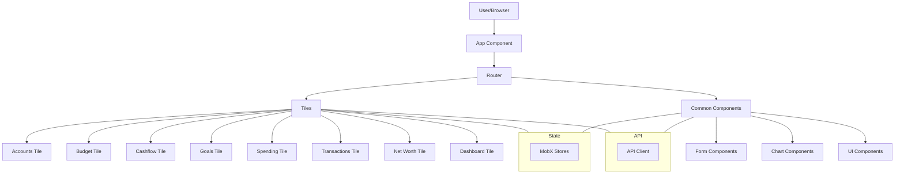
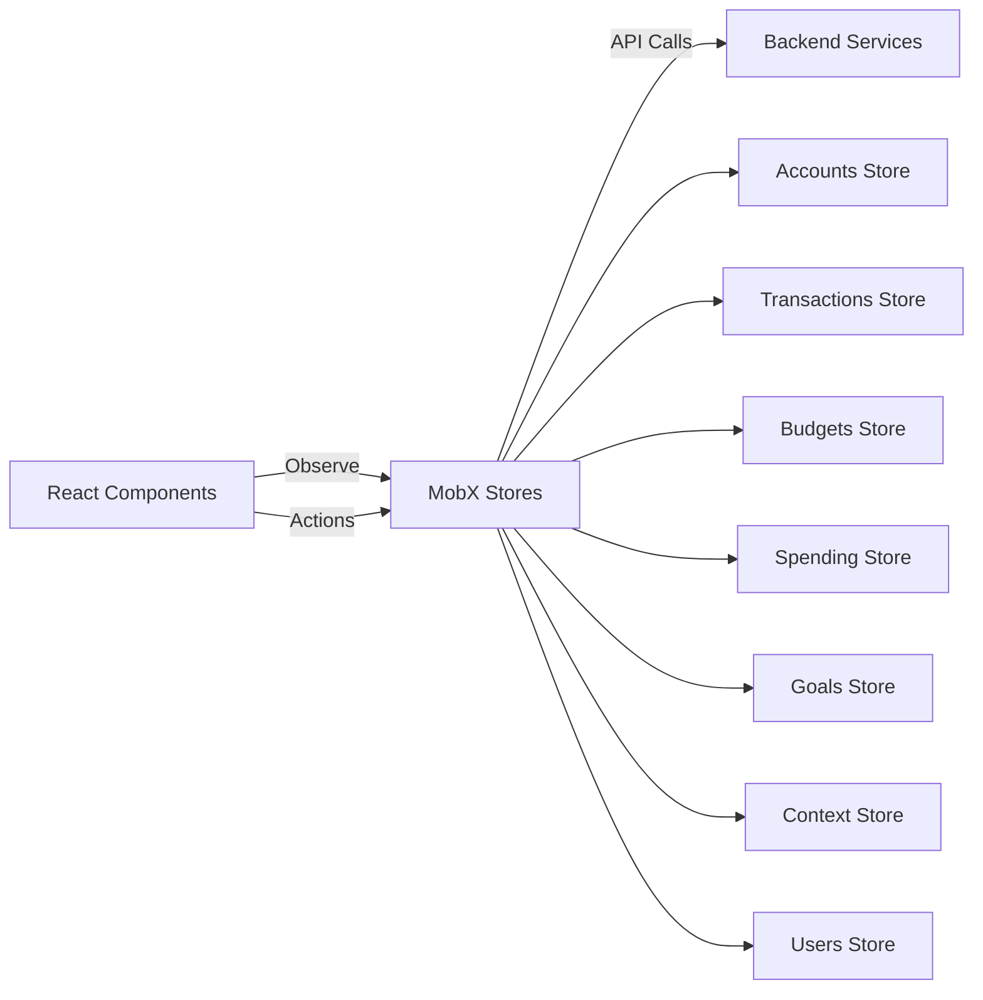
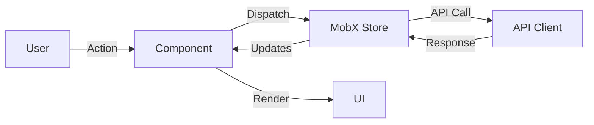
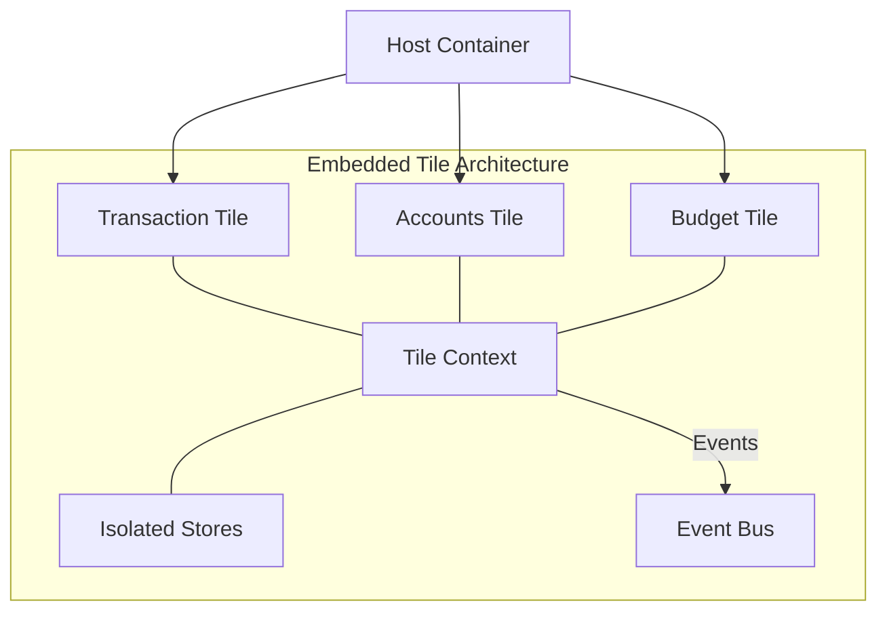
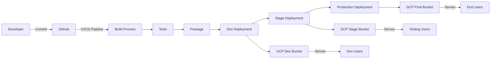
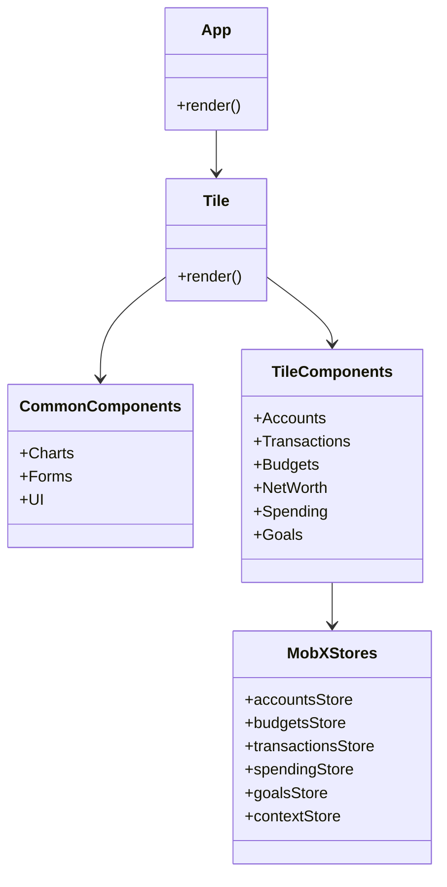

# Responsive Tiles Architecture Overview

This document provides a high-level overview of the Responsive Tiles application architecture.

## Component Architecture

The Responsive Tiles project is a React-based application that provides modular, embeddable UI components (tiles) for financial data visualization and management.

## State Management

The application uses MobX for state management with a store-based approach where each domain area has its own dedicated store.

## Data Flow

The application follows a unidirectional data flow pattern using MobX:

## Tile System Architecture

Responsive Tiles allows for embedding individual "tiles" into various pages:

## Deployment Architecture

The application is deployed through a CI/CD pipeline to different GCP environments:

## Component Structure

The project organizes components into reusable common components and feature-specific tile components:

## Technology Stack

The application is built using the following technologies:

- **React**: UI component library
- **MobX**: State management
- **Material UI**: UI framework
- **D3.js**: Data visualization
- **Webpack**: Module bundler
- **Babel**: JavaScript compiler
- **Jest/Cypress**: Testing
- **GitHub Actions**: CI/CD pipeline
- **Google Cloud Platform**: Hosting 
