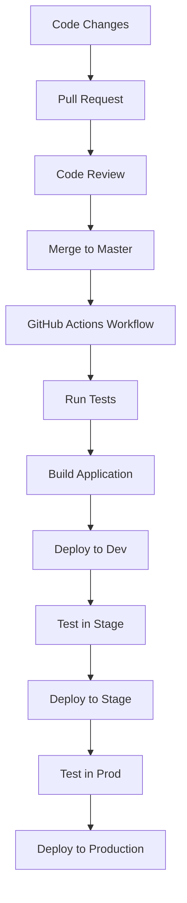
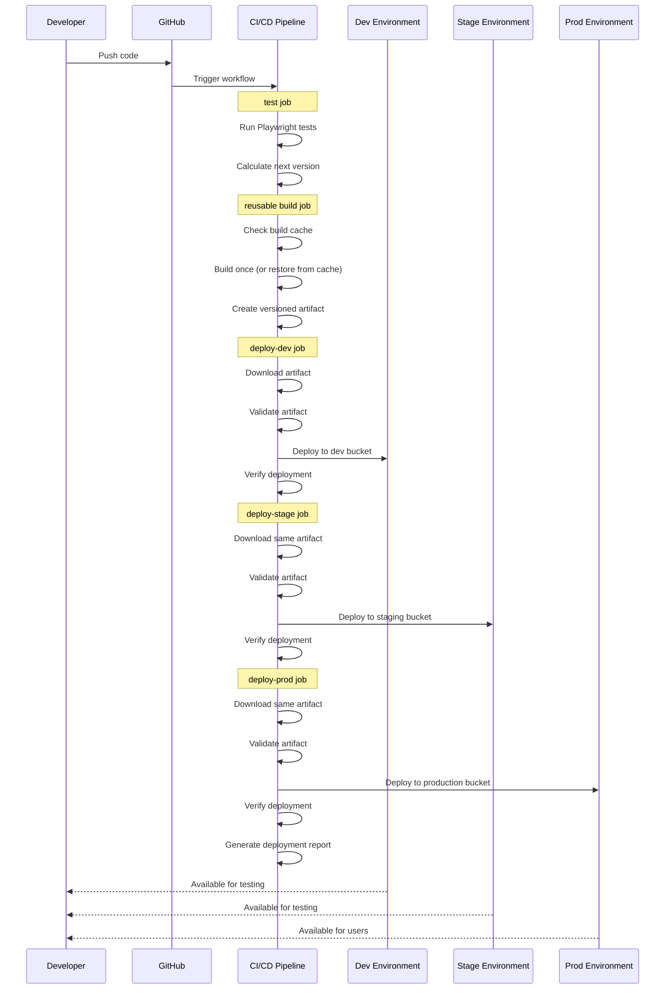
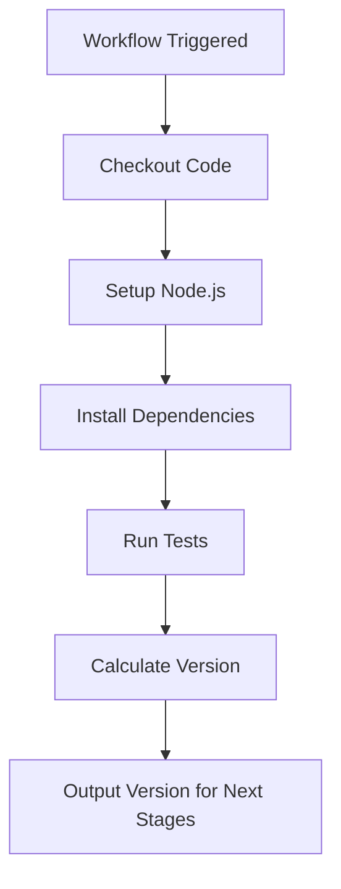
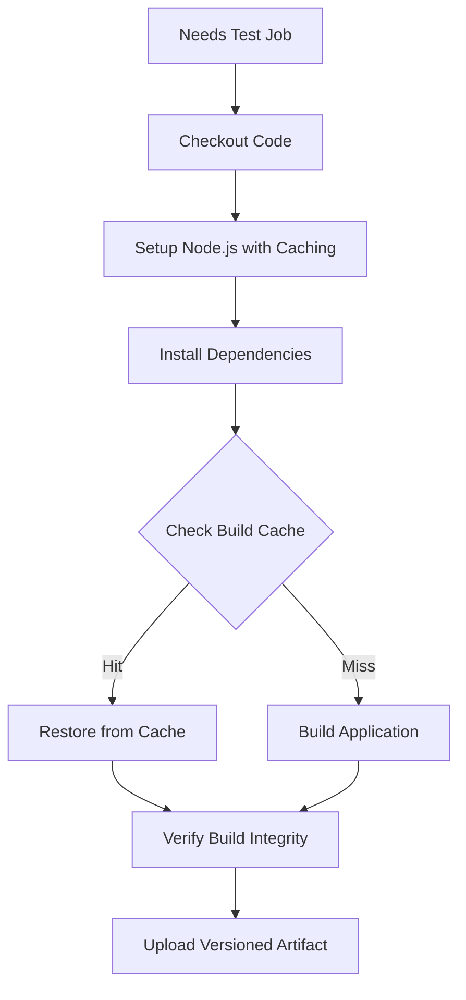
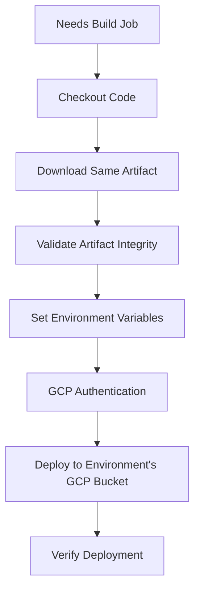
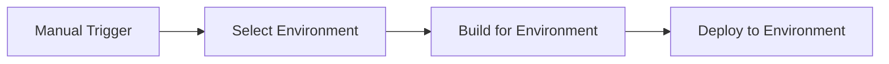

# CI/CD Workflow for Responsive Tiles

This document details the continuous integration and deployment workflow for the Responsive Tiles project.

## Overview

The Responsive Tiles project uses GitHub Actions for automated CI/CD pipeline. The workflow automates testing, building, and deploying the application to different GCP environments (development, staging, production).

## Workflow Files

The CI/CD process is defined in several workflow files:

### GitHub Actions Workflows
1. **pr-validation.yml**: Runs tests and validations on PR creation/update
2. **reusable-build.yml**: Reusable workflow for building the application
3. **main-deployment.yml**: Main deployment workflow using Build-Once-Deploy-Many pattern

## Complete CI/CD Pipeline

The following diagram shows the complete pipeline including all steps:

## Deployment Environments

The application is deployed to three different GCP environments:

| Environment | GCP Bucket | Purpose |
|-------------|------------|---------|
| Dev | dev-digital-gzo-geezeo-tiles-zwwst63n | Development testing |
| Stage | stage-digital-gzo-geezeo-tiles-nyjcof9v | Pre-production testing |
| Production | prod-digital-gzo-geezeo-tiles-gvf7byup | Live user-facing environment |

## Workflow Steps in Detail

### 1. CI Test Stage

The CI test stage:
- Runs automated tests across different browsers
- Calculates the next version number for the application
- Passes version information to subsequent stages

### 2. Build Once Stage

The build stage (using the reusable workflow):
- Checks for cached build artifacts 
- Only builds if cache doesn't exist
- Creates a single versioned artifact
- Uploads the artifact for use by all deployment stages

### 3. Deployment Stages

All deployment stages (dev, stage, prod) follow this same pattern:
- Download the same artifact built in the build stage
- Validate artifact integrity
- Set environment-specific variables
- Deploy to the appropriate environment
- Verify successful deployment

## Manual Deployment

Manual deployment can be performed through GitHub Actions interface:

To manually trigger deployment:
1. Go to the GitHub Actions tab
2. Select "Main Deployment" workflow
3. Click "Run workflow"
4. Run the workflow
5. The workflow will deploy to all environments in sequence

## Troubleshooting

If deployment fails, check:

1. GitHub Actions logs for specific errors
2. GCP authentication issues
3. Build errors in the workflow logs
4. Test failures in the CI stage

Common issues include:
- Missing environment variables
- Authentication problems with GCP
- Build failures due to dependencies
- Test failures in CI

## Workflow Optimization

The workflow is optimized for:

1. **Reliability**: Sequential deployment ensures stability
2. **Efficiency**: Reuses built artifacts where possible
3. **Safety**: Test stages prevent broken deployments
4. **Speed**: Parallel test execution reduces CI time 
