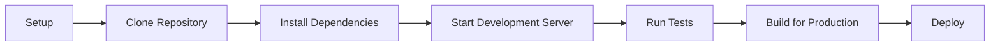
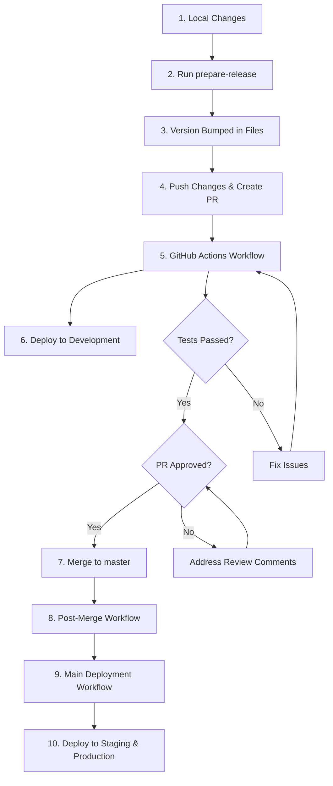
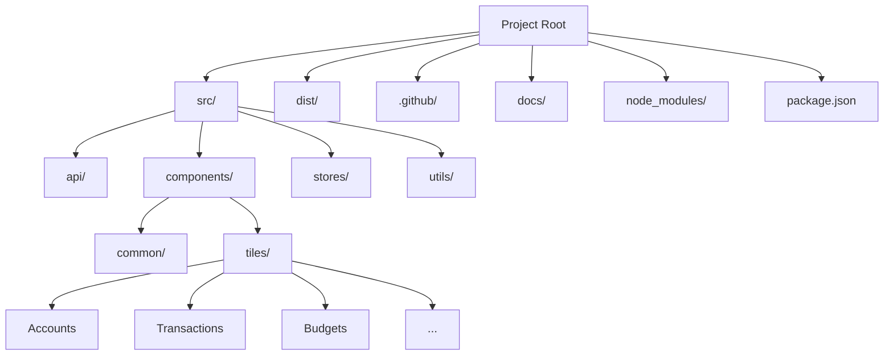
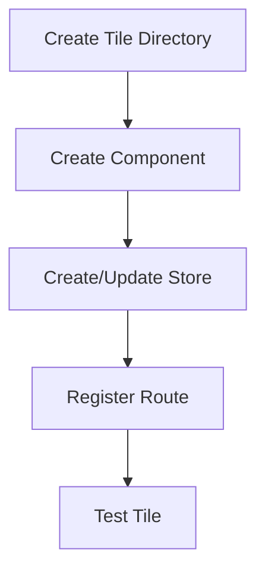

# Getting Started with Responsive Tiles Development

This guide will help you set up your development environment and understand the development workflow for the Responsive Tiles project.

## Prerequisites

Before you begin, make sure you have the following installed:

- Node.js (version 20.18.0 or later)
- npm (version 9 or later)
- Git

## Development Environment Setup



### 1. Clone the Repository

```bash
git clone https://github.com/Banno/responsive-tiles.git
cd responsive-tiles
```

### 2. Install Dependencies

```bash
npm install
```

### 3. Start the Development Server

```bash
npm run start
```

This will start the development server at `http://localhost:8080`.

## Workflow Commands

The following commands are available for common development tasks:

| Command | Description |
|---------|-------------|
| `npm run build` | Build the project for production |
| `npm run start` | Start the development server |
| `npm run lint` | Run linting on the codebase |
| `npm test` | Run all Playwright tests |
| `npm run playwright:test:local` | Run Playwright tests with UI |
| `npm run docs:serve` | Build and serve documentation |
| `npm run prepare-release` | Prepare a new version release |

## Version Management and Deployment Process

Responsive Tiles uses a **local version management** approach. Version numbers are managed locally by developers before creating a PR, rather than being automatically bumped by CI/CD systems.

### Version Management Workflow

The following steps illustrate the version management workflow:



### Version Bumping Process

To manage versions in the project:

1. Make your changes and commit them using [Conventional Commits](https://www.conventionalcommits.org/) format
2. Run `npm run prepare-release` to:
   - Analyze commit messages since the last tag
   - Determine the appropriate version bump (patch, minor, or major)
   - Update version in package.json and package-lock.json
   - Create/update src/version.js
   - Update documentation references
   - Create a git commit and tag
3. Push your changes: `npm run push-release` (pushes both commits and tags)
4. Create a PR for review

You can also specify the version bump type manually:

```bash
# For patch version (2.52.5 -> 2.52.6)
npm run release:patch  

# For minor version (2.52.5 -> 2.53.0)
npm run release:minor

# For major version (2.52.5 -> 3.0.0)
npm run release:major
```

### Deployment Process

The deployment process uses GitHub Actions workflows and follows these steps:

#### 1. Development Environment (PR Workflow)

After creating a PR with a version bump:

- GitHub Actions runs validation, tests, and builds the project
- Deploys to the development environment:
- GCP Bucket: `gs://dev-digital-gzo-geezeo-tiles-zwwst63n/qa/v2/`
- Development URL: `https://dev-digital-gzo-geezeo-tiles-zwwst63n.storage.googleapis.com/qa/v2/index.html`

#### 2. Staging and Production Environments (Post-Merge Workflow)

After the PR is merged to master:

- Post-Merge workflow triggers the Main Deployment workflow
- Validates version consistency across files and git tags
- Deploys to staging first, then production if successful:
- Staging GCP Bucket: `gs://stage-digital-gzo-geezeo-tiles-nyjcof9v/staging/v2/`
- Production GCP Bucket: `gs://prod-digital-gzo-geezeo-tiles-gvf7byup/production/v2/`
- Staging URL: `https://stage-digital-gzo-geezeo-tiles-nyjcof9v.storage.googleapis.com/staging/v2/index.html`
- Production URL: `https://prod-digital-gzo-geezeo-tiles-gvf7byup.storage.googleapis.com/production/v2/index.html`

> **Tip**: You can use the verify-versions script to check version consistency across your codebase and GCP environments:
> 
> ```bash
> npm run verify-versions
> ```
> 
> This will show if there are any version mismatches between package.json, version.js, documentation, and deployed environments.

## Project Structure



The project structure follows these key directories:

- **src/**: Contains all source code
  - **api/**: API client and data interfaces
  - **components/**: React components
    - **common/**: Reusable components
    - **tiles/**: Feature-specific tile components
  - **stores/**: MobX state stores
  - **utils/**: Utility functions and helpers
- **dist/**: Built output (generated when running build)
- **.github/**: GitHub Actions workflows
  - **workflows/**: Contains three essential workflow files:
    - **pr-workflow.yml**: PR validation and development deployment
    - **main-deployment.yml**: Staging and production deployment
    - **merged-workflow.yml**: Triggers main deployment after PR merge
- **docs/**: Project documentation

## Tile Development

### Creating a New Tile

To create a new tile component:

1. Create a new directory under `src/components/tiles/`
2. Create your React component files
3. Add any necessary MobX store in `src/stores/`
4. Register the tile route in `src/tiles.js`



### Tile API

Tiles are accessed through the geezeo API:

```javascript
// Example of creating a tile
geezeo.tiles.createAccounts(domElement, options);
```

Available tile creation methods:

- `createAccounts(el, opts)`
- `createBudgets(el, opts)`
- `createTransactions(el, opts)`
- `createSpending(el, opts)`
- `createNetWorth(el, opts)`
- `createGoals(el, opts)`
- `createDashboard(el, opts)`

## Troubleshooting Common Issues

### Version Inconsistencies

If you encounter version inconsistencies:

1. Run `npm run verify-versions` to identify mismatches
2. Run `npm run prepare-release` to fix inconsistencies
3. If only version.js needs updating:
   ```bash
   echo "export const VERSION = '$(node -p "require('./package.json').version")'" > src/version.js
   
   # Commit and push
   git add src/version.js
   git commit -m "fix: update version.js to match package.json"
   git push
   ```

### GCP Deployment Issues

If deployments to GCP buckets aren't working:

1. Check the PR comments for deployment status
2. Ensure PR tests have passed (deployment only happens with passing tests)
3. Verify the correct GCP paths:
   - Development: `gs://dev-digital-gzo-geezeo-tiles-zwwst63n/qa/v2/`
   - Staging: `gs://stage-digital-gzo-geezeo-tiles-nyjcof9v/staging/v2/`
   - Production: `gs://prod-digital-gzo-geezeo-tiles-gvf7byup/production/v2/`
4. Contact the DevOps team if you suspect authentication issues

### Common Development Issues

If you encounter issues during development:

1. Check the console for errors
2. Verify that all dependencies are installed
3. Ensure you're using the correct Node.js version (20.18.0 or later)
4. Clear the node_modules folder and reinstall dependencies
5. Check GitHub issues for similar problems 

## Best Practices

- Follow the existing code style
- Write tests for new functionality
- Use MobX for state management
- Keep components small and focused
- Reuse common components when possible
- Document complex logic
- Use Material UI components for consistent UI
- Always run `npm run prepare-release` before creating a PR to ensure proper versioning
- Use conventional commit messages to help with automatic version determination