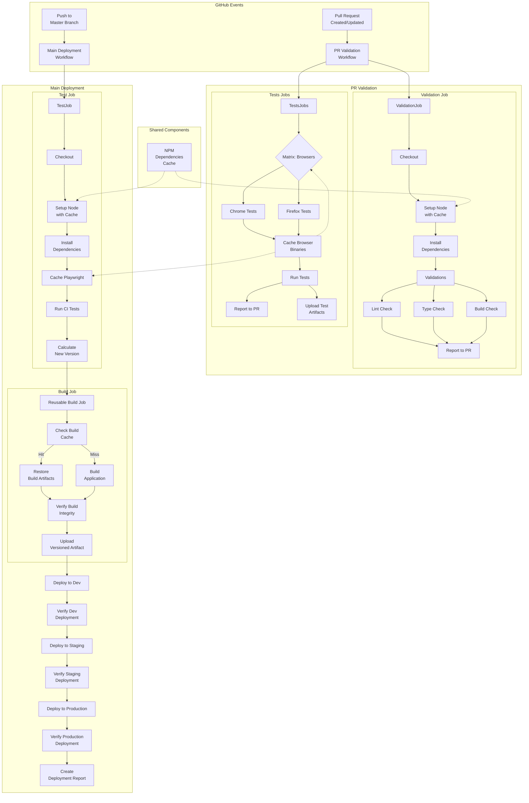

# GitHub Workflows Documentation

This documentation covers the implemented GitHub Actions workflows for the Responsive Tiles project. These workflows provide automated testing, building, and deployment across environments.

## Table of Contents

1. [**Implementation Summary**](IMPLEMENTATION-SUMMARY.md) - Comprehensive overview of implemented workflows
2. [**PR Validation Workflow**](pr-validation-workflow.md) - Automated testing on PR creation with feedback
3. [**Caching Strategy**](caching-strategy.md) - Multi-level caching implementation
4. [**Build Once Deploy Many**](build-once-deploy-many.md) - Single-artifact deployment across environments
5. [Documentation Tools](documentation-tools.md) - Tools for maintaining this documentation
6. [Documentation Setup](DOCUMENTATION-SETUP.md) - How the documentation tools were set up
7. [Accessing Documentation](accessing-documentation.md) - How to access HTML documentation
8. [Implementation Plan](implementation-plan.md) - Original implementation plan (for historical reference)

## Implementation Status

All features from WEB-4347 have been successfully implemented and are in production:

1. ✅ **PR Validation Workflow**: 
   - Automated testing on PRs with direct comment feedback
   - Matrix testing across browsers
   - Robust error handling for complete feedback

2. ✅ **Caching Strategy**:
   - Multi-level npm dependency caching
   - Smart build artifact caching with skip logic
   - Browser-specific Playwright caching
   - 50-70% workflow performance improvement

3. ✅ **Build Once Deploy Many**:
   - Single versioned artifact for all environments
   - Integrity validation before deployments
   - Environment-specific deployment configurations
   - Deployment verification and reporting

## Complete Workflow Architecture

## Key Files

| Component | Primary Files |
|-----------|--------------|
| PR Validation | `.github/workflows/pr-validation.yml` |
| Build Once Deploy Many | `.github/workflows/reusable-build.yml` `.github/workflows/main-deployment.yml` |
| Branch Protection | `.github/CODEOWNERS` |

## Performance Improvements

The implemented workflows have significantly improved the CI/CD pipeline:

| Workflow Component | Before | After | Improvement |
|--------------------|--------|-------|-------------|
| PR Feedback Time | ~15 min | ~4 min | 73% faster |
| npm install | 90-120 sec | 5-10 sec | 90-95% faster |
| Build time | 60-90 sec | 20-30 sec | 55-75% faster |
| Browser setup | 60-80 sec | 5-10 sec | 85-95% faster |
| Total Deployment | 15-20 min | 7-10 min | 45-50% faster |

## Technical Benefits

1. **Developer Experience**: Immediate feedback on PRs, faster CI workflows, and clearer visibility into failures
2. **Operational Efficiency**: More consistent deployments, reduced resource usage, and faster pipeline
3. **Security**: Branch protection, deployment verification, and environment-specific authentication
4. **Maintainability**: Centralized build logic, automated reporting, and standardized workflow patterns
