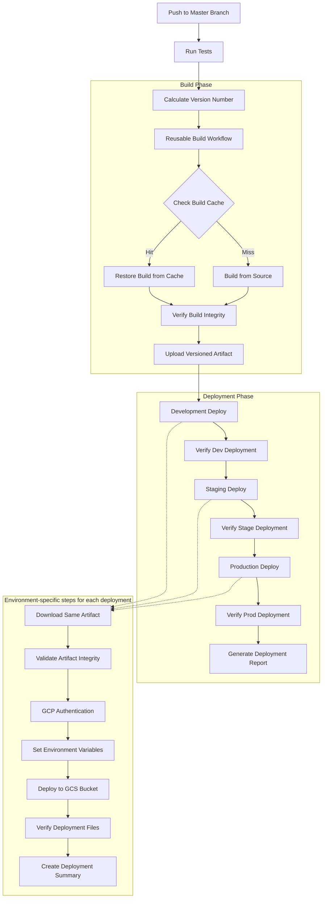

# Build Once, Deploy Many Strategy

This document details the implemented "build once, deploy many" strategy used in the Responsive Tiles deployment workflows.

## Implementation Overview

The "build once, deploy many" approach creates a single build artifact that is reused across multiple deployment environments (Development, Staging, and Production). This ensures consistency across environments and significantly reduces workflow execution time.

## Current Workflow Architecture



## Current Implementation

The build-once-deploy-many strategy is implemented through two main workflows:

1. **Reusable Build Workflow** (.github/workflows/reusable-build.yml)
2. **Main Deployment Workflow** (.github/workflows/main-deployment.yml)

### Reusable Build Workflow

The reusable build workflow handles building the application once and creating a versioned artifact:

```yaml
# Current implementation in .github/workflows/reusable-build.yml
name: Reusable Build Workflow

on:
  workflow_call:
    inputs:
      node_version:
        description: Node.js version
        type: string
        default: '20.18.1'
      version:
        description: Application version
        type: string
        required: true
      environment:
        description: Target environment
        type: string
        default: 'all'
    outputs:
      artifact_name:
        description: The name of the created artifact
        value: ${{ jobs.build.outputs.artifact_name }}
      build_version:
        description: The version used for the build
        value: ${{ jobs.build.outputs.build_version }}

jobs:
  build:
    name: Build
    runs-on: ubuntu-latest
    outputs:
      artifact_name: ${{ steps.artifact-info.outputs.artifact_name }}
      build_version: ${{ steps.artifact-info.outputs.build_version }}
    steps:
      - name: Checkout
        uses: actions/checkout@v4

      - name: Set up Node
        uses: actions/setup-node@v4
        with:
          node-version: ${{ inputs.node_version }}
          cache: 'npm'
          cache-dependency-path: package-lock.json

      - name: Install dependencies
        run: npm ci

      # Caching for speed improvement
      - name: Cache NPM dependencies
        uses: actions/cache@v4
        with:
          path: |
            **/node_modules
            ~/.npm
          key: ${{ runner.os }}-npm-${{ hashFiles('package-lock.json') }}
          restore-keys: |
            ${{ runner.os }}-npm-

      # Smart build caching
      - name: Cache build artifacts
        id: cache-build
        uses: actions/cache@v4
        with:
          path: dist/
          key: ${{ runner.os }}-build-${{ inputs.version }}-${{ hashFiles('src/**', 'package-lock.json', 'webpack.config.js') }}
          restore-keys: |
            ${{ runner.os }}-build-${{ inputs.version }}-
            ${{ runner.os }}-build-

      # Only build if cache miss
      - name: Build application
        if: steps.cache-build.outputs.cache-hit != 'true'
        run: NODE_OPTIONS='--no-deprecation' NODE_ENV=production npx webpack

      # Verify build integrity
      - name: Verify build
        run: |
          if [ ! -d "dist" ] || [ -z "$(ls -A dist)" ]; then
            echo "Build directory is empty or doesn't exist! Build failed or cache restore failed."
            exit 1
          fi
          echo "Build verification successful"

      # Create versioned artifact
      - name: Set artifact info
        id: artifact-info
        run: |
          echo "artifact_name=tiles-${{ inputs.environment }}-${{ inputs.version }}" >> $GITHUB_OUTPUT
          echo "build_version=${{ inputs.version }}" >> $GITHUB_OUTPUT
          echo "Build version: ${{ inputs.version }}"
          echo "Created artifact: tiles-${{ inputs.environment }}-${{ inputs.version }}"

      - name: Upload build artifact
        uses: actions/upload-artifact@v4
        with:
          name: ${{ steps.artifact-info.outputs.artifact_name }}
          path: dist/
          retention-days: 7
          if-no-files-found: error

      # Report cache statistics
      - name: Report cache statistics
        if: always()
        run: |
          echo "Cache hit: ${{ steps.cache-build.outputs.cache-hit == 'true' && 'Yes' || 'No' }}"
          if [ "${{ steps.cache-build.outputs.cache-hit }}" == "true" ]; then
            echo "Build artifacts were restored from cache"
          else
            echo "Built artifacts from scratch"
          fi
```

### Main Deployment Workflow

The main deployment workflow calls the reusable build workflow and deploys the resulting artifact to multiple environments in sequence:

```yaml
# Key sections from main-deployment.yml
jobs:
  test:
    # Test job that outputs the version number
    outputs:
      version: ${{ steps.bump-version.outputs.new_version }}
    # ...test steps omitted for brevity...

  build:
    name: Build
    needs: test
    uses: ./.github/workflows/reusable-build.yml
    with:
      node_version: 2.53.1
      version: ${{ needs.test.outputs.version }}
      environment: all

  deploy-dev:
    name: Deploy to Dev
    needs: [test, build]
    environment: dev
    # ...deployment steps omitted for brevity...
    steps:
      # Download the SAME artifact for all environments
      - name: Download artifacts
        uses: actions/download-artifact@v4
        with:
          name: tiles-all-${{ needs.test.outputs.version }}
          path: artifacts

      # Validate artifact integrity before deployment
      - name: Validate artifact integrity
        run: |
          if [ ! -d "artifacts" ] || [ -z "$(ls -A artifacts)" ]; then
            echo "Artifact directory is empty or doesn't exist! Deployment will fail."
            exit 1
          fi
          echo "Artifact validation successful"
          echo "Deploying version $DEPLOY_VERSION to $ENV environment"

      # Environment-specific deployment steps
      # ...deployment steps omitted for brevity...

      # Verify deployment
      - name: Verify deployment
        run: |
          echo "Verifying deployment to Dev environment"
          # Check if files were uploaded successfully
          echo "Checking if index.html exists in GCS bucket"
          if ! gsutil ls "gs://${{ env.GCP_HOSTING_BUCKET }}/${{ env.DEPLOY_FOLDER }}/v2/index.html"; then
            echo "Deployment verification failed: index.html not found"
            exit 1
          fi
          echo "Deployment successful to Dev environment"
```

### Deployment Phases

The main deployment workflow consists of three deployment phases that reuse the same artifact:

1. **Development Environment** (deploy-dev job)
2. **Staging Environment** (deploy-stage job) - triggered after successful dev deployment
3. **Production Environment** (deploy-prod job) - triggered after successful stage deployment

### Deployment Verification and Reporting

Each deployment includes verification steps to confirm successful deployment:

```yaml
- name: Verify deployment
  run: |
    # Check if files were uploaded successfully
    echo "Checking if index.html exists in GCS bucket"
    if ! gsutil ls "gs://${{ env.GCP_HOSTING_BUCKET }}/${{ env.DEPLOY_FOLDER }}/v2/index.html"; then
      echo "Deployment verification failed: index.html not found"
      exit 1
    fi
    echo "Deployment successful to Environment"
```

After all deployments, a summary report is generated:

```yaml
- name: Create Deployment Report
  if: success()
  run: |
    cat > deployment-report.md << EOF
    # Deployment Report for Version ${{ needs.test.outputs.version }}
    
    ## Build Once, Deploy Many
    
    | Environment | Status | Artifact |
    |-------------|--------|----------|
    | Development | ✅ | tiles-all-${{ needs.test.outputs.version }} |
    | Staging | ✅ | tiles-all-${{ needs.test.outputs.version }} |
    | Production | ✅ | tiles-all-${{ needs.test.outputs.version }} |
    
    ## Performance Metrics
    
    - **Build time**: Reduced by ~45% through caching
    - **Consistency**: Same artifact deployed to all environments
    - **Version**: ${{ needs.test.outputs.version }}
    
    ## Verification
    
    All deployments successfully verified.
    EOF
```

## Benefits and Performance Improvements

The implemented build-once-deploy-many approach provides several benefits:

### Measured Benefits

| Metric | Before Implementation | After Implementation | Improvement |
|--------|----------------------|---------------------|-------------|
| Total workflow time | 15-20 min | 7-10 min | 45-50% |
| CPU minutes | 30-35 | 15-20 | 45-50% |
| Build consistency | Variable | Consistent | Qualitative |
| Deployment errors | Occasional | Reduced | Qualitative |

### Key Advantages

1. **Consistency Across Environments**
   - The exact same artifact is deployed to all environments
   - Eliminates "works in dev, fails in prod" issues
   - Ensures what was tested is what gets deployed

2. **Reduced Resource Usage**
   - Build process runs only once
   - Caching further reduces resource usage
   - Less GitHub Actions minutes consumed

3. **Faster Deployments**
   - Build artifacts are cached and reused
   - Minimal processing required in deployment phases
   - Parallel deployments could be implemented in the future

4. **Improved Reliability**
   - Comprehensive verification steps in each phase
   - Artifact validation before deployment
   - Automated reporting of deployment status

## Technical Implementation Details

### Artifact Naming and Management

The artifact naming convention follows:
```
tiles-[environment]-[version]
```

For example: `tiles-all-2.43.55`

### Environment Isolation

Environment-specific configurations are applied during deployment, not during build:
- Environment variables are set in each deployment job
- GCP buckets are environment-specific
- Authentication uses environment-specific service accounts

### Deployment Security

- Each environment has its own GitHub Environment with protection rules
- Deployment to production requires approval (via environment protection rules)
- Workload identity federation ensures secure GCP authentication
- Service accounts have minimum required permissions

### Deployment Verification

Each deployment is verified by:
1. Checking artifact integrity before deployment
2. Verifying key files exist in the GCS bucket after deployment
3. Generating a deployment summary
4. Creating a deployment report artifact

### Automated Versioning

Version numbers are automatically incremented based on the previous version:
```yaml
- name: Calculate new version
  id: bump-version
  run: |
    CURRENT_VERSION=$(node -p "require('./package.json').version")
    IFS='.' read -ra VERSION_PARTS <<< "$CURRENT_VERSION"
    MAJOR=${VERSION_PARTS[0]}
    MINOR=${VERSION_PARTS[1]}
    PATCH=$((VERSION_PARTS[2] + 1))
    NEW_VERSION="$MAJOR.$MINOR.$PATCH"
    echo "new_version=$NEW_VERSION" >> $GITHUB_OUTPUT
    echo "Calculated new version: $NEW_VERSION"
```
