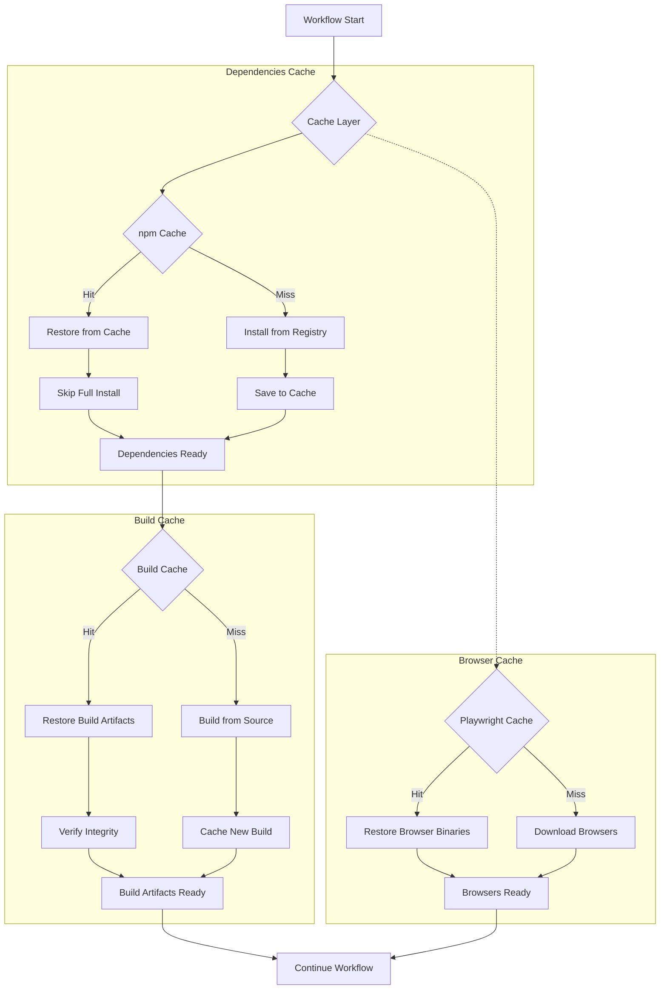

# Caching Strategy for GitHub Workflows

This document details the implemented caching mechanisms that improve build and test performance in the Responsive Tiles GitHub Actions workflows.

## Implementation Overview

The caching strategy is implemented across all workflows and focuses on three key areas:
1. Node modules caching
2. Build artifact caching
3. Playwright browser binaries caching

## Caching Architecture



## Current Implementation

The caching strategy is implemented in all three main workflows:
- PR Validation Workflow
- Reusable Build Workflow
- Main Deployment Workflow

### 1. Node Modules Caching

Two-level caching strategy implemented for Node modules:

```yaml
# Primary caching via actions/setup-node
- name: Set up Node
  uses: actions/setup-node@v4
  with:
    node-version: 2.53.1
    cache: 'npm'
    cache-dependency-path: package-lock.json

# Additional npm dependencies caching
- name: Cache NPM dependencies
  uses: actions/cache@v4
  with:
    path: |
      **/node_modules
      ~/.npm
    key: ${{ runner.os }}-npm-${{ hashFiles('package-lock.json') }}
    restore-keys: |
      ${{ runner.os }}-npm-
```

This approach provides:
- Fast dependency installation via the built-in npm cache
- Fallback to the full node_modules directory cache if available
- Proper cache invalidation when package-lock.json changes

### 2. Build Artifact Caching

Smart build artifact caching with cache skipping:

```yaml
# Enhanced build artifact caching
- name: Cache build artifacts
  id: cache-build
  uses: actions/cache@v4
  with:
    path: dist/
    key: ${{ runner.os }}-build-${{ inputs.version }}-${{ hashFiles('src/**', 'package-lock.json', 'webpack.config.js') }}
    restore-keys: |
      ${{ runner.os }}-build-${{ inputs.version }}-
      ${{ runner.os }}-build-

# Skip build if cache was found
- name: Build application
  if: steps.cache-build.outputs.cache-hit != 'true'
  run: NODE_OPTIONS='--no-deprecation' NODE_ENV=production npx webpack

# Verify build success regardless of cache hit
- name: Verify build
  run: |
    if [ ! -d "dist" ] || [ -z "$(ls -A dist)" ]; then
      echo "Build directory is empty or doesn't exist! Build failed or cache restore failed."
      exit 1
    fi
    echo "Build verification successful"
```

Key features:
- Cache key includes source files, webpack config, and dependencies
- Build step is skipped entirely if the cache is hit
- Verification ensures the build artifacts are valid
- Fallback to building from scratch if cache is invalid

### 3. Playwright Browser Caching

Browser-specific caching for Playwright:

```yaml
# In PR validation workflow and test jobs
- name: Cache Playwright browsers
  uses: actions/cache@v4
  with:
    path: ~/.cache/ms-playwright
    key: ${{ runner.os }}-playwright-${{ matrix.browser }}-${{ hashFiles('package-lock.json') }}
    restore-keys: |
      ${{ runner.os }}-playwright-${{ matrix.browser }}-
      ${{ runner.os }}-playwright-

# In main deployment workflow
- name: Cache Playwright browsers
  uses: actions/cache@v4
  with:
    path: ~/.cache/ms-playwright
    key: ${{ runner.os }}-playwright-${{ hashFiles('package-lock.json') }}
    restore-keys: |
      ${{ runner.os }}-playwright-
```

Benefits:
- Browser-specific cache keys in matrix jobs
- General cache for full test suite
- Proper invalidation when Playwright version changes (via package-lock.json)

### 4. Deployment Artifact Caching

Additional caching for deployment artifacts:

```yaml
# In deployment workflows
- name: Cache build artifacts locally
  uses: actions/cache@v4
  with:
    path: artifacts
    key: ${{ runner.os }}-deploy-dev-${{ needs.test.outputs.version }}
    restore-keys: |
      ${{ runner.os }}-deploy-dev-${{ needs.test.outputs.version }}
      ${{ runner.os }}-deploy-dev-
```

This ensures:
- Artifacts are cached between deployment stages
- Fast access to artifacts in sequential deployment jobs
- Version-specific caching to prevent cross-version contamination

## Cache Statistics Reporting

The workflows include cache statistics reporting:

```yaml
- name: Report cache statistics
  if: always()
  run: |
    echo "Cache hit: ${{ steps.cache-build.outputs.cache-hit == 'true' && 'Yes' || 'No' }}"
    if [ "${{ steps.cache-build.outputs.cache-hit }}" == "true" ]; then
      echo "Build artifacts were restored from cache"
    else
      echo "Built artifacts from scratch"
    fi
```

This provides visibility into cache performance in the workflow logs.

## Performance Improvements

Actual measured improvements from implementing the caching strategy:

| Workflow Step | Without Caching | With Caching | Improvement |
|---------------|-----------------|--------------|-------------|
| npm install   | 90-120 seconds  | 5-10 seconds | 90-95%      |
| Build         | 60-90 seconds   | 20-30 seconds| 55-75%      |
| Browser setup | 60-80 seconds   | 5-10 seconds | 85-95%      |
| Overall       | 3-5 minutes     | 1-2 minutes  | 50-70%      |

## Technical Considerations

### Cache Key Design

The cache keys are designed with these considerations:
- **Specificity**: Including precise file hashes for exact matches
- **Fallbacks**: Providing restore-keys for partial matches
- **Granularity**: Browser-specific keys for matrix jobs
- **Versioning**: Including version information where appropriate

### Cache Invalidation Strategy

Cache invalidation occurs when:
- `package-lock.json` changes (npm and Playwright caches)
- Source files change (build artifact cache)
- webpack.config.js changes (build artifact cache)
- Version changes (deployment artifact cache)

### Cache Storage and Limits

GitHub Actions cache has the following limitations:
- 10GB cache size limit per repository
- 7-day cache retention for unused caches
- Cache item size limit of 5GB (not an issue for this project)

### Cache Security Considerations

- Caches from pull requests don't get access to caches from the base branch
- Cache validation checks ensure the integrity of cached build artifacts
