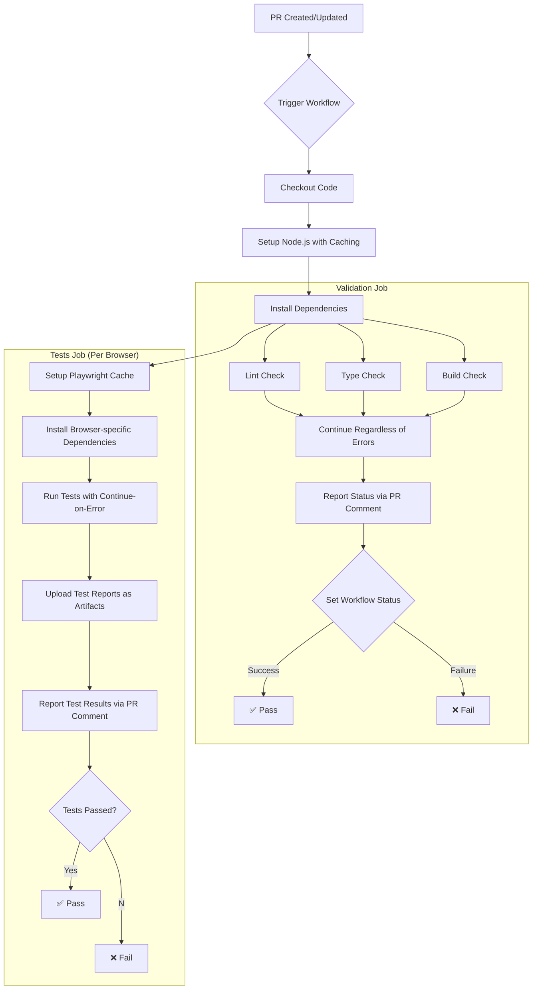

# PR Validation Workflow

This document details the implemented automated testing for pull requests, providing immediate feedback to developers through PR comments rather than waiting for merges to master.

## Implementation Overview

The PR validation workflow runs automatically when a pull request is created or updated against the master branch. It provides fast feedback by adding comments directly to the PR with detailed validation and test results, highlighting any issues before code review.

## Workflow Diagram



## Actual Implementation

The PR validation workflow includes:

1. **Validation job**: Runs lint, type check, and build validation
2. **Tests job**: Runs browser tests using Playwright for multiple browsers
3. **PR Comment Integration**: Posts results directly to the PR for immediate feedback
4. **Caching Strategy**: Caches npm dependencies and Playwright browsers for faster runs
5. **Error Handling**: Continues on errors to provide complete feedback

### Current Workflow YAML Configuration

```yaml
# .github/workflows/pr-validation.yml (actual implementation)
name: PR Validation

on:
  pull_request:
    branches: [master]
    types: [opened, synchronize, reopened]

permissions:
  contents: read
  pull-requests: write
  checks: write

jobs:
  validation:
    name: Validation
    runs-on: ubuntu-latest
    steps:
      - name: Checkout
        uses: actions/checkout@v4

      - name: Set up Node
        uses: actions/setup-node@v4
        with:
          node-version: 2.53.1
          cache: 'npm'
          cache-dependency-path: package-lock.json

      - name: Install dependencies
        run: npm ci

      - name: Lint
        id: lint
        run: npm run lint
        continue-on-error: true

      - name: Type check
        id: typecheck
        run: npx tsc --noEmit
        continue-on-error: true

      - name: Build check
        id: build
        run: NODE_ENV=production npx webpack --dry-run
        continue-on-error: true

      - name: Report Status
        if: always()
        uses: actions/github-script@v7
        with:
          github-token: ${{ secrets.GITHUB_TOKEN }}
          script: |
            const lintStatus = "${{ steps.lint.outcome }}" === "success" ? "✅" : "❌";
            const typeStatus = "${{ steps.typecheck.outcome }}" === "success" ? "✅" : "❌";
            const buildStatus = "${{ steps.build.outcome }}" === "success" ? "✅" : "❌";
            
            const body = `## Validation Results

| Check | Status |
| ----- | ------ |
| Lint | ${lintStatus} |
| Type Check | ${typeStatus} |
| Build | ${buildStatus} |

[View detailed logs](${process.env.GITHUB_SERVER_URL}/${process.env.GITHUB_REPOSITORY}/actions/runs/${process.env.GITHUB_RUN_ID})`;
            
            github.rest.issues.createComment({
              issue_number: context.issue.number,
              owner: context.repo.owner,
              repo: context.repo.repo,
              body: body
            });
            
            // Fail the workflow if any checks failed
            if ("${{ steps.lint.outcome }}" !== "success" || 
                "${{ steps.typecheck.outcome }}" !== "success" || 
                "${{ steps.build.outcome }}" !== "success") {
              core.setFailed("One or more validation checks failed");
            }

  tests:
    name: Tests
    runs-on: ubuntu-latest
    strategy:
      matrix:
        browser: [chromium, firefox]
    steps:
      - name: Checkout
        uses: actions/checkout@v4

      - name: Set up Node
        uses: actions/setup-node@v4
        with:
          node-version: 2.53.1
          cache: 'npm'
          cache-dependency-path: package-lock.json

      - name: Install dependencies
        run: npm ci

      - name: Cache Playwright browsers
        uses: actions/cache@v4
        with:
          path: ~/.cache/ms-playwright
          key: ${{ runner.os }}-playwright-${{ matrix.browser }}-${{ hashFiles('package-lock.json') }}
          restore-keys: |
            ${{ runner.os }}-playwright-${{ matrix.browser }}-
            ${{ runner.os }}-playwright-

      - name: Install Playwright
        run: npx playwright install --with-deps ${{ matrix.browser }}

      - name: Run tests
        id: run_tests
        run: npx playwright test --project=${{ matrix.browser }}
        continue-on-error: true

      - name: Upload test results
        if: always()
        uses: actions/upload-artifact@v4
        with:
          name: playwright-report-${{ matrix.browser }}
          path: playwright-report/
          retention-days: 30

      - name: Report Test Results
        if: always()
        uses: actions/github-script@v7
        with:
          github-token: ${{ secrets.GITHUB_TOKEN }}
          script: |
            const testStatus = "${{ steps.run_tests.outcome }}" === "success" ? "✅" : "❌";
            
            const body = `## Browser Test Results: ${{ matrix.browser }}

| Test | Status |
| ---- | ------ |
| ${{ matrix.browser }} | ${testStatus} |

[View test report](${process.env.GITHUB_SERVER_URL}/${process.env.GITHUB_REPOSITORY}/actions/runs/${process.env.GITHUB_RUN_ID})`;
            
            github.rest.issues.createComment({
              issue_number: context.issue.number,
              owner: context.repo.owner,
              repo: context.repo.repo,
              body: body
            });
            
            if ("${{ steps.run_tests.outcome }}" !== "success") {
              core.setFailed("Browser tests failed");
            }
```

## Key Features

### 1. PR Comment Integration

The workflow uses `actions/github-script` to post formatted comments to the PR with detailed results of:
- Validation checks (Lint, Type Check, Build)
- Browser test results for each browser in the matrix

### 2. Error Handling

The workflow uses `continue-on-error: true` for all validation and test steps to ensure:
- All checks run to completion regardless of individual failures
- Complete results are reported even if some steps fail
- The workflow fails properly at the end if any tests failed

### 3. Caching Strategy

The workflow implements efficient caching for:
- npm dependencies via `actions/setup-node` with `cache: 'npm'`
- Playwright browser binaries with browser-specific cache keys
- Proper cache invalidation based on package-lock.json changes

### 4. Artifact Generation

Test reports are uploaded as artifacts for each browser:
- Available for 30 days
- Accessible from the workflow run page
- Links provided directly in PR comments

## Example PR Comment Output

When the workflow runs on a PR, developers see comments like:

```markdown
## Validation Results

| Check | Status |
| ----- | ------ |
| Lint | ✅ |
| Type Check | ✅ |
| Build | ✅ |

[View detailed logs](https://github.com/Banno/responsive-tiles/actions/runs/1234567890)
```

And for each browser:

```markdown
## Browser Test Results: chromium

| Test | Status |
| ---- | ------ |
| chromium | ✅ |

[View test report](https://github.com/Banno/responsive-tiles/actions/runs/1234567890)
```

## Benefits

- **Immediate Visibility**: Developers see test results directly in the PR interface
- **Faster Feedback**: No need to check GitHub Actions separately
- **Reduced CI Load**: Caching reduces resource usage and speeds up workflows
- **Comprehensive Reporting**: All validation and test results in one place
- **Improved Developer Experience**: Clear pass/fail indicators with links to detailed logs
