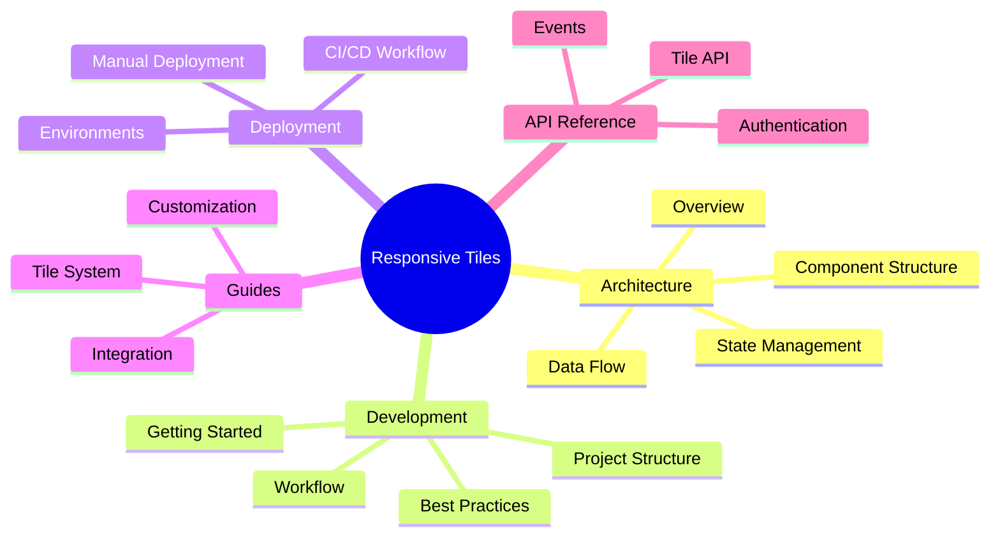

# Responsive Tiles Documentation

Welcome to the Responsive Tiles documentation. This documentation provides comprehensive information about the architecture, development, deployment, and usage of the Responsive Tiles system.

## Documentation Overview



## Table of Contents

### Architecture
- [Architecture Overview](architecture/overview.md) - High-level architecture of the Responsive Tiles system

### Development
- [Getting Started](development/getting-started.md) - Setting up your development environment and workflow

### Deployment
- [CI/CD Workflow](deployment/ci-cd-workflow.md) - Continuous integration and deployment process

### Guides
- [Tile System](guides/tile-system.md) - Understanding and using the tile system

### API Reference
- [Tile API Reference](api/tile-api-reference.md) - Complete API documentation

## Core Concepts

Responsive Tiles is built around these core concepts:

1. **Modularity**: Each tile is a self-contained component that can be embedded independently
2. **Reactivity**: MobX provides reactive state management for real-time updates
3. **Embeddability**: Tiles can be embedded in any web application
4. **Extensibility**: The system can be extended with custom tiles and functionality

## Quick Start

```javascript
// Initialize the system
geezeo.init();

// Set authentication
geezeo.setAuth('your-jwt-token');

// Create a tile
const container = document.getElementById('accounts-container');
geezeo.tiles.createAccounts(container, {
  showHeader: true,
  navigationMode: 'menu'
});
```

## Contributing

Please refer to the [Getting Started](development/getting-started.md) guide for information on how to contribute to the Responsive Tiles project. 
