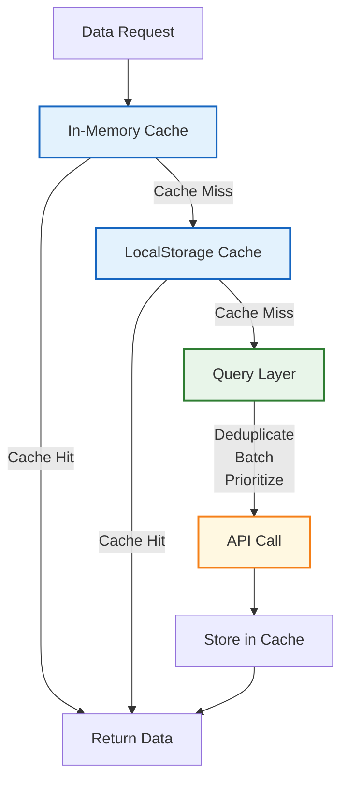

# Performance Optimization

## Overview

Performance is a critical aspect of the Responsive Tiles application, particularly because it handles complex financial data visualization and interactions. This document provides a comprehensive guide to performance optimization strategies implemented in the codebase and best practices for maintaining optimal performance.

## Performance Metrics

The application tracks several key performance metrics:

```mermaid
flowchart TD
    classDef primary fill:#e3f2fd,stroke:#1565c0,stroke-width:2px
    classDef secondary fill:#e8f5e9,stroke:#2e7d32,stroke-width:2px
    classDef tertiary fill:#fff8e1,stroke:#f57f17,stroke-width:2px
    
    FCP[First Contentful Paint]:::primary
    TTI[Time to Interactive]:::primary
    CLS[Cumulative Layout Shift]:::primary
    LCP[Largest Contentful Paint]:::primary
    
    API[API Response Time]:::secondary
    JS[JavaScript Execution]:::secondary
    Bundle[Bundle Size]:::secondary
    
    Memory[Memory Usage]:::tertiary
    CPU[CPU Utilization]:::tertiary
    Network[Network Requests]:::tertiary
    
    FCP --> UX[User Experience]
    TTI --> UX
    CLS --> UX
    LCP --> UX
    
    API --> Runtime[Runtime Performance]
    JS --> Runtime
    
    Bundle --> Load[Load Performance]
    
    Memory --> Resources[Resource Usage]
    CPU --> Resources
    Network --> Resources
```



### Core Web Vitals Targets

| Metric | Target | Description |
|--------|--------|-------------|
| First Contentful Paint (FCP) | < 1.8s | Time until first content is painted |
| Largest Contentful Paint (LCP) | < 2.5s | Time until largest content element is visible |
| Cumulative Layout Shift (CLS) | < 0.1 | Measure of layout stability |
| Time to Interactive (TTI) | < 3.5s | Time until page is fully interactive |
| First Input Delay (FID) | < 100ms | Time from first interaction to response |

## Rendering Optimization

### Component Rendering

The application implements several strategies to optimize component rendering:

#### MobX Optimization

```javascript
// Optimized MobX component
import { observer } from 'mobx-react';
import { useEffect } from 'react';

const OptimizedComponent = observer(({ store }) => {
  // Only re-renders when observed properties change
  const { data, loading } = store;
  
  // Use computed value instead of derived in render
  const processedData = store.processedData;
  
  useEffect(() => {
    // Side effects isolated in useEffect
    store.fetchData();
  }, [store]);
  
  return (
    <div>
      {loading ? (
        <Loading />
      ) : (
        <DataDisplay data={processedData} />
      )}
    </div>
  );
});
```

Key MobX optimizations:
1. **Use `observer` HOC**: Automatically optimizes re-renders based on observed state
2. **Computed Properties**: Use computed values for derived data
3. **Action Boundaries**: Keep state modifications within actions
4. **Selective Observation**: Only observe necessary properties

#### React Optimization

```javascript
// React performance optimization example
import React, { memo, useCallback, useMemo } from 'react';

// Memoize component to prevent unnecessary re-renders
const MemoizedChildComponent = memo(({ data, onItemClick }) => {
  return (
    <ul>
      {data.map(item => (
        <li key={item.id} onClick={() => onItemClick(item.id)}>
          {item.name}
        </li>
      ))}
    </ul>
  );
});

const ParentComponent = ({ items }) => {
  // Memoize derived data
  const processedItems = useMemo(() => {
    return items.map(item => ({
      id: item.id,
      name: `${item.firstName} ${item.lastName}`
    }));
  }, [items]);
  
  // Memoize callback functions
  const handleItemClick = useCallback((id) => {
    console.log(`Item clicked: ${id}`);
  }, []);
  
  return (
    <MemoizedChildComponent 
      data={processedItems} 
      onItemClick={handleItemClick} 
    />
  );
};
```

Key React optimizations:
1. **Component Memoization**: Use `React.memo()` to prevent unnecessary re-renders
2. **Callback Memoization**: Use `useCallback()` for event handlers
3. **Data Memoization**: Use `useMemo()` for expensive computations
4. **Proper Key Usage**: Use stable, unique keys for list items

### Virtualization

For long lists and large datasets, virtualization is employed:

```javascript
// Example of list virtualization
import React from 'react';
import { inject, observer } from 'mobx-react';
import withStyles from '@material-ui/core/styles/withStyles';
import TransactionItem from '@geezeo/common/TransactionItem';

const styles = theme => ({
  virtualized: {
    height: 400,
    overflow: 'auto'
  }
});

class VirtualizedTransactionList extends React.Component {
  constructor(props) {
    super(props);
    this.listRef = React.createRef();
    this.visibleItems = 20; // Visible items in viewport
    this.itemHeight = 60; // Estimated height of each item
    this.state = {
      startIndex: 0,
      endIndex: this.visibleItems
    };
  }

  componentDidMount() {
    this.updateVisibleRange();
    if (this.listRef.current) {
      this.listRef.current.addEventListener('scroll', this.handleScroll);
    }
  }

  componentWillUnmount() {
    if (this.listRef.current) {
      this.listRef.current.removeEventListener('scroll', this.handleScroll);
    }
  }

  handleScroll = () => {
    this.updateVisibleRange();
  }

  updateVisibleRange = () => {
    if (!this.listRef.current) return;
    
    const scrollTop = this.listRef.current.scrollTop;
    const startIndex = Math.floor(scrollTop / this.itemHeight);
    const endIndex = Math.min(
      startIndex + this.visibleItems * 2, // 2x buffer for smooth scrolling
      this.props.transactions.length
    );
    
    this.setState({ startIndex, endIndex });
  }

  render() {
    const { classes, transactions } = this.props;
    const { startIndex, endIndex } = this.state;
    
    // Only render visible items plus buffer
    const visibleTransactions = transactions.slice(startIndex, endIndex);
    
    // Calculate padding to maintain scroll position
    const topPadding = startIndex * this.itemHeight;
    const bottomPadding = (transactions.length - endIndex) * this.itemHeight;
    
    return (
      <div 
        className={classes.virtualized} 
        ref={this.listRef}
      >
        <div style={{ height: topPadding }} />
        {visibleTransactions.map(transaction => (
          <TransactionItem 
            key={transaction.id}
            transaction={transaction}
          />
        ))}
        <div style={{ height: bottomPadding }} />
      </div>
    );
  }
}
```

Virtualization benefits:
1. **Reduced DOM Nodes**: Only renders visible items
2. **Improved Scrolling Performance**: Maintains smooth scrolling with large datasets
3. **Lower Memory Usage**: Reduces memory required for large lists
4. **Initial Render Speed**: Faster initial rendering with large datasets

## Data Management

### Data Normalization

Data is normalized in stores to prevent redundancy and improve access patterns:

```javascript
// Example of normalized data structure
const normalizedState = {
  accounts: {
    byId: {
      'acct_1': { id: 'acct_1', name: 'Checking', balance: 1000 },
      'acct_2': { id: 'acct_2', name: 'Savings', balance: 5000 }
    },
    allIds: ['acct_1', 'acct_2']
  },
  transactions: {
    byId: {
      'txn_1': { id: 'txn_1', accountId: 'acct_1', amount: -50 },
      'txn_2': { id: 'txn_2', accountId: 'acct_1', amount: -25 },
      'txn_3': { id: 'txn_3', accountId: 'acct_2', amount: 1000 }
    },
    allIds: ['txn_1', 'txn_2', 'txn_3'],
    byAccount: {
      'acct_1': ['txn_1', 'txn_2'],
      'acct_2': ['txn_3']
    }
  }
};
```

Benefits of data normalization:
1. **Reduced Redundancy**: Data is stored without duplication
2. **Consistent Updates**: Updates are applied consistently across the application
3. **Efficient Access**: Optimized access patterns for different views
4. **Relational Integrity**: Relationships are maintained through references

### Selective Data Loading

Data is loaded selectively to minimize initial load time:

```javascript
// Example of selective data loading
class DashboardStore {
  loadPriority1Data = async () => {
    // High-priority data needed for initial render
    await Promise.all([
      this.accountsStore.fetchSummary(),
      this.spendingStore.fetchTopCategories()
    ]);
  };
  
  loadPriority2Data = async () => {
    // Secondary data loaded after initial render
    await Promise.all([
      this.budgetsStore.fetchBudgets(),
      this.goalsStore.fetchGoals()
    ]);
  };
  
  loadPriority3Data = async () => {
    // Lower-priority data loaded after critical paths
    await Promise.all([
      this.transactionsStore.fetchRecentTransactions(),
      this.netWorthStore.fetchHistory()
    ]);
  };
  
  initializeDashboard = async () => {
    // Sequentially load data by priority
    await this.loadPriority1Data();
    
    // Allow UI to render before loading more data
    setTimeout(async () => {
      await this.loadPriority2Data();
      
      setTimeout(() => {
        this.loadPriority3Data();
      }, 500);
    }, 0);
  };
}
```

This approach:
1. **Prioritizes Critical Data**: Loads essential data first
2. **Improves Perceived Performance**: Shows useful content quickly
3. **Distributes Network Load**: Spreads API requests over time
4. **Optimizes Main Thread**: Allows rendering between data loading phases

## Network Optimization

### Request Batching

API requests are batched where possible to reduce network overhead:

```javascript
// Example of request batching
class APIBatcher {
  queue = {};
  timeouts = {};
  
  batchRequest = (endpoint, id, data, timeout = 300) => {
    // Initialize queue for this endpoint if needed
    if (!this.queue[endpoint]) {
      this.queue[endpoint] = {};
    }
    
    // Add request to queue
    this.queue[endpoint][id] = data;
    
    // Clear existing timeout for this endpoint
    if (this.timeouts[endpoint]) {
      clearTimeout(this.timeouts[endpoint]);
    }
    
    // Set new timeout to process batch
    this.timeouts[endpoint] = setTimeout(() => {
      this.processBatch(endpoint);
    }, timeout);
    
    // Return promise that will resolve when batch is processed
    return new Promise((resolve, reject) => {
      this.queue[endpoint][id].resolve = resolve;
      this.queue[endpoint][id].reject = reject;
    });
  };
  
  processBatch = async (endpoint) => {
    const batch = this.queue[endpoint];
    this.queue[endpoint] = {};
    this.timeouts[endpoint] = null;
    
    try {
      // Send batch request
      const results = await api.batchRequest(endpoint, Object.keys(batch).map(id => batch[id].payload));
      
      // Resolve individual promises with their results
      results.forEach((result, index) => {
        const id = Object.keys(batch)[index];
        batch[id].resolve(result);
      });
    } catch (error) {
      // Reject all promises in the batch
      Object.keys(batch).forEach(id => {
        batch[id].reject(error);
      });
    }
  };
}

// Usage example
const batcher = new APIBatcher();

// These calls will be batched together
batcher.batchRequest('transactions/update', 'txn_1', { amount: 50 });
batcher.batchRequest('transactions/update', 'txn_2', { amount: 75 });
batcher.batchRequest('transactions/update', 'txn_3', { amount: 100 });
```

### Caching Strategy

The application implements a multi-level caching strategy:



Implementation example:

```javascript
// Simplified cache implementation
class DataCache {
  memoryCache = new Map();
  
  constructor() {
    // Initialize by loading from localStorage
    this.loadPersistedCache();
  }
  
  loadPersistedCache() {
    try {
      const persistedCache = localStorage.getItem('data_cache');
      if (persistedCache) {
        const parsed = JSON.parse(persistedCache);
        
        // Only load non-expired items
        Object.entries(parsed).forEach(([key, item]) => {
          if (item.expiry > Date.now()) {
            this.memoryCache.set(key, item);
          }
        });
      }
    } catch (error) {
      console.error('Error loading persisted cache:', error);
    }
  }
  
  saveToPersistedCache() {
    const cache = {};
    
    this.memoryCache.forEach((value, key) => {
      cache[key] = value;
    });
    
    localStorage.setItem('data_cache', JSON.stringify(cache));
  }
  
  get(key) {
    const cached = this.memoryCache.get(key);
    
    if (!cached) {
      return null;
    }
    
    // Check if item has expired
    if (cached.expiry < Date.now()) {
      this.memoryCache.delete(key);
      return null;
    }
    
    return cached.data;
  }
  
  set(key, data, ttlSeconds = 300) {
    this.memoryCache.set(key, {
      data,
      expiry: Date.now() + (ttlSeconds * 1000)
    });
    
    // Debounced persist to localStorage
    this.debouncedSave();
  }
  
  debouncedSave = debounce(() => {
    this.saveToPersistedCache();
  }, 2000);
  
  invalidate(key) {
    this.memoryCache.delete(key);
    this.debouncedSave();
  }
  
  invalidatePattern(pattern) {
    const regex = new RegExp(pattern);
    
    this.memoryCache.forEach((_, key) => {
      if (regex.test(key)) {
        this.memoryCache.delete(key);
      }
    });
    
    this.debouncedSave();
  }
}
```

## Bundle Optimization

### Code Splitting

The application uses code splitting to reduce initial bundle size:

```javascript
// Route-based code splitting example
import React, { Suspense, lazy } from 'react';
import { Route, Switch } from 'react-router-dom';
import Loading from './components/common/Loading';

// Lazy-load components
const Dashboard = lazy(() => import('./components/tiles/Dashboard'));
const Accounts = lazy(() => import('./components/tiles/Accounts'));
const Transactions = lazy(() => import('./components/tiles/Transactions'));
const Budgets = lazy(() => import('./components/tiles/Budgets'));
const Goals = lazy(() => import('./components/tiles/Goals'));
const Spending = lazy(() => import('./components/tiles/Spending'));

const AppRoutes = () => (
  <Suspense fallback={<Loading />}>
    <Switch>
      <Route exact path="/" component={Dashboard} />
      <Route path="/accounts" component={Accounts} />
      <Route path="/transactions" component={Transactions} />
      <Route path="/budgets" component={Budgets} />
      <Route path="/goals" component={Goals} />
      <Route path="/spending" component={Spending} />
    </Switch>
  </Suspense>
);

export default AppRoutes;
```

### Tree Shaking

Webpack configuration is optimized for tree shaking:

```javascript
// webpack.config.js excerpt for tree shaking
module.exports = {
  // ... other configuration
  mode: 'production',
  optimization: {
    usedExports: true,
    sideEffects: true,
    minimize: true,
    splitChunks: {
      chunks: 'all',
      maxInitialRequests: Infinity,
      minSize: 0,
      cacheGroups: {
        vendor: {
          test: /[\\/]node_modules[\\/]/,
          name(module) {
            // Get the name of the npm package
            const packageName = module.context.match(
              /[\\/]node_modules[\\/](.*?)([\\/]|$)/
            )[1];
            
            // Create separate chunks for larger packages
            return `vendor.${packageName.replace('@', '')}`;
          }
        }
      }
    }
  }
};
```

### Dynamic Imports

Components and libraries are loaded dynamically when needed:

```javascript
// Example of dynamic import for a heavy component
import React, { useState } from 'react';

const HeavyComponentLoader = () => {
  const [HeavyComponent, setHeavyComponent] = useState(null);
  const [isLoading, setIsLoading] = useState(false);
  
  const loadComponent = async () => {
    if (!HeavyComponent && !isLoading) {
      setIsLoading(true);
      
      try {
        // Dynamically import component
        const { default: Component } = await import('./HeavyComponent');
        setHeavyComponent(() => Component);
      } catch (error) {
        console.error('Failed to load HeavyComponent:', error);
      } finally {
        setIsLoading(false);
      }
    }
  };
  
  return (
    <div>
      <button onClick={loadComponent}>
        Load Advanced Analysis
      </button>
      
      {isLoading && <div>Loading...</div>}
      
      {HeavyComponent && <HeavyComponent />}
    </div>
  );
};
```

## D3.js Optimizations

The application uses D3.js for data visualization with specific optimizations:

### Virtual DOM Integration

D3 visualizations are integrated with React's virtual DOM:

```javascript
// Example of optimized D3 and React integration
import React, { useRef, useEffect } from 'react';
import { select } from 'd3-selection';
import { pie, arc } from 'd3-shape';
import { scaleOrdinal } from 'd3-scale';

const DonutChart = ({ data, width, height }) => {
  const svgRef = useRef(null);
  
  useEffect(() => {
    if (!data || !svgRef.current) return;
    
    const svg = select(svgRef.current);
    const radius = Math.min(width, height) / 2;
    
    // Clear previous chart
    svg.selectAll('*').remove();
    
    // Create chart group
    const g = svg
      .append('g')
      .attr('transform', `translate(${width / 2}, ${height / 2})`);
    
    // Generate pie data
    const pieGenerator = pie()
      .value(d => d.value)
      .sort(null);
    
    const arcs = pieGenerator(data);
    
    // Generate arcs
    const arcGenerator = arc()
      .innerRadius(radius * 0.6)
      .outerRadius(radius * 0.9);
    
    // Color scale
    const color = scaleOrdinal()
      .domain(data.map(d => d.name))
      .range(['#f7e000', '#c585d5', '#ff5b69', '#00c7b6', '#008f80']);
    
    // Draw arcs
    g.selectAll('path')
      .data(arcs)
      .join('path')
      .attr('d', arcGenerator)
      .attr('fill', d => color(d.data.name))
      .attr('stroke', 'white')
      .style('stroke-width', '2px');
    
  }, [data, width, height]);
  
  return (
    <svg ref={svgRef} width={width} height={height} />
  );
};
```

### D3 Performance Techniques

Specific D3.js performance optimizations include:

1. **Selective Updates**: Using D3's enter/update/exit pattern efficiently
2. **Throttled Transitions**: Limiting animation complexity
3. **Simplified Geometries**: Reducing path complexity for better performance
4. **Canvas Rendering**: Using Canvas instead of SVG for large datasets
5. **Data Decimation**: Reducing data points for complex visualizations

```javascript
// Example of data decimation for time series
const decimateTimeSeries = (data, maxPoints = 100) => {
  if (data.length <= maxPoints) return data;
  
  // Calculate sampling interval
  const interval = Math.floor(data.length / maxPoints);
  
  // Select evenly spaced points
  return data.filter((_, i) => i % interval === 0);
};

// Example of canvas-based rendering for large datasets
import React, { useRef, useEffect } from 'react';
import * as d3 from 'd3';

const ScatterPlotCanvas = ({ data, width, height }) => {
  const canvasRef = useRef(null);
  
  useEffect(() => {
    if (!data || !canvasRef.current) return;
    
    const canvas = canvasRef.current;
    const context = canvas.getContext('2d');
    
    // Clear canvas
    context.clearRect(0, 0, width, height);
    
    // Set up scales
    const xScale = d3.scaleLinear()
      .domain(d3.extent(data, d => d.x))
      .range([30, width - 30]);
      
    const yScale = d3.scaleLinear()
      .domain(d3.extent(data, d => d.y))
      .range([height - 30, 30]);
    
    // Draw points
    context.fillStyle = 'steelblue';
    context.beginPath();
    
    data.forEach(d => {
      context.moveTo(xScale(d.x), yScale(d.y));
      context.arc(xScale(d.x), yScale(d.y), 3, 0, 2 * Math.PI);
    });
    
    context.fill();
    
    // Draw axes
    context.strokeStyle = '#333';
    context.lineWidth = 1;
    context.beginPath();
    
    // X-axis
    context.moveTo(30, height - 30);
    context.lineTo(width - 30, height - 30);
    
    // Y-axis
    context.moveTo(30, height - 30);
    context.lineTo(30, 30);
    
    context.stroke();
    
  }, [data, width, height]);
  
  return (
    <canvas 
      ref={canvasRef} 
      width={width} 
      height={height} 
      style={{ display: 'block' }} 
    />
  );
};
```

## Browser Optimization

### Browser Rendering Optimization

The application implements several browser-specific optimizations:

```javascript
// Example of render optimizations in a component
import React, { useState, useLayoutEffect } from 'react';

const OptimizedRenderComponent = () => {
  const [items, setItems] = useState([]);
  
  const addItems = () => {
    // Create batch of 1000 new items
    const newItems = Array.from({ length: 1000 }, (_, i) => ({
      id: `item-${Date.now()}-${i}`,
      value: Math.random()
    }));
    
    // Batch DOM updates with requestAnimationFrame
    requestAnimationFrame(() => {
      setItems(prev => [...prev, ...newItems]);
    });
  };
  
  // Use passive event listeners
  useLayoutEffect(() => {
    const handleScroll = () => {
      // Scroll handling logic
    };
    
    window.addEventListener('scroll', handleScroll, { passive: true });
    
    return () => {
      window.removeEventListener('scroll', handleScroll);
    };
  }, []);
  
  return (
    <div>
      <button onClick={addItems}>Add 1000 Items</button>
      <div style={{ willChange: 'transform' }}>
        {items.map(item => (
          <div key={item.id} className="item">
            {item.value.toFixed(4)}
          </div>
        ))}
      </div>
    </div>
  );
};
```

Key browser optimizations:
1. **Avoid Layout Thrashing**: Batch DOM reads and writes
2. **Use requestAnimationFrame**: Schedule visual updates
3. **Optimize Event Listeners**: Use passive event listeners
4. **Layer Promotion Hints**: Use `will-change` for complex animations
5. **Reduce Paint Areas**: Minimize areas that need repainting

### Web Worker Utilization

Computationally intensive tasks are offloaded to Web Workers:

```javascript
// Web worker for data processing
// dataWorker.js
self.addEventListener('message', event => {
  const { data, operation } = event.data;
  
  switch (operation) {
    case 'filter':
      const { predicate } = event.data;
      const filtered = data.filter(item => {
        // Parsing the predicate function from string
        const filterFn = new Function('item', `return ${predicate}`);
        return filterFn(item);
      });
      self.postMessage({ result: filtered, operation });
      break;
    
    case 'aggregate':
      const { groupBy, aggregateFn } = event.data;
      const grouped = data.reduce((acc, item) => {
        const key = item[groupBy];
        if (!acc[key]) {
          acc[key] = [];
        }
        acc[key].push(item);
        return acc;
      }, {});
      
      const aggregated = Object.entries(grouped).map(([key, items]) => {
        return {
          key,
          value: items.reduce((sum, item) => sum + item.value, 0),
          count: items.length
        };
      });
      
      self.postMessage({ result: aggregated, operation });
      break;
      
    default:
      self.postMessage({ error: 'Unknown operation', operation });
  }
});

// Usage in React component
import React, { useState, useEffect } from 'react';

const DataProcessorComponent = ({ rawData }) => {
  const [processedData, setProcessedData] = useState(null);
  const [worker, setWorker] = useState(null);
  
  // Initialize worker
  useEffect(() => {
    const dataWorker = new Worker('./dataWorker.js');
    
    dataWorker.addEventListener('message', event => {
      const { result, operation } = event.data;
      
      if (operation === 'aggregate') {
        setProcessedData(result);
      }
    });
    
    setWorker(dataWorker);
    
    return () => {
      dataWorker.terminate();
    };
  }, []);
  
  // Process data when it changes
  useEffect(() => {
    if (worker && rawData) {
      worker.postMessage({
        data: rawData,
        operation: 'aggregate',
        groupBy: 'category',
      });
    }
  }, [worker, rawData]);
  
  if (!processedData) {
    return <div>Processing data...</div>;
  }
  
  return (
    <div>
      <h2>Processed Data</h2>
      <ul>
        {processedData.map(item => (
          <li key={item.key}>
            {item.key}: {item.value} ({item.count} items)
          </li>
        ))}
      </ul>
    </div>
  );
};
```

## Testing and Monitoring

### Performance Testing

Performance testing is an integral part of the development workflow:

```javascript
// Example performance test
import { performance } from 'perf_hooks';
import { mount } from 'enzyme';
import SpendingWheel from '../components/tiles/Spending/Wheel';
import createTestStores from '../tests/mocks/stores/createTestStores';
import TestProvider from '../tests/helpers/components/TestProvider';

describe('SpendingWheel Performance', () => {
  it('renders efficiently with large datasets', () => {
    // Generate large test dataset
    const largeDataset = Array.from({ length: 1000 }, (_, i) => ({
      id: `category-${i}`,
      name: `Category ${i}`,
      amount: Math.random() * 10000,
      color: `#${Math.floor(Math.random() * 16777215).toString(16)}`
    }));
    
    // Create test store with data
    const spendingStore = {
      wheel: {
        data: largeDataset
      }
    };
    
    const stores = createTestStores({
      spendingStore
    });
    
    // Measure render time
    const start = performance.now();
    
    const wrapper = mount(
      <TestProvider stores={stores}>
        <SpendingWheel />
      </TestProvider>
    );
    
    const end = performance.now();
    const renderTime = end - start;
    
    // Assert render time is within acceptable limits
    expect(renderTime).toBeLessThan(100); // render should take less than 100ms
    
    // Check number of DOM nodes to ensure efficient rendering
    const domNodes = wrapper.find('*').length;
    
    // Assert DOM size is reasonable
    expect(domNodes).toBeLessThan(2000);
    
    wrapper.unmount();
  });
});
```

### Runtime Performance Monitoring

The application includes runtime performance monitoring:

```javascript
// Performance monitoring utility
class PerformanceMonitor {
  metrics = {};
  
  measureRender(componentName) {
    return {
      start: () => {
        this.metrics[componentName] = {
          startTime: performance.now()
        };
      },
      end: () => {
        if (this.metrics[componentName]) {
          const endTime = performance.now();
          const duration = endTime - this.metrics[componentName].startTime;
          
          this.metrics[componentName].duration = duration;
          this.metrics[componentName].timestamp = new Date().toISOString();
          
          // Report if exceeds threshold
          if (duration > 50) {
            console.warn(`Slow render detected: ${componentName} took ${duration.toFixed(2)}ms`);
            this.reportMetric(componentName, duration);
          }
          
          return duration;
        }
      }
    };
  }
  
  measureOperation(name) {
    const start = performance.now();
    
    return {
      end: () => {
        const duration = performance.now() - start;
        this.metrics[name] = {
          duration,
          timestamp: new Date().toISOString()
        };
        
        return duration;
      }
    };
  }
  
  reportMetric(name, value) {
    // In a real implementation, this would send data to a monitoring service
    if (process.env.NODE_ENV === 'production') {
      // Send to monitoring service
      console.log(`Reporting metric: ${name} = ${value}`);
    }
  }
  
  getMetrics() {
    return this.metrics;
  }
}

const performanceMonitor = new PerformanceMonitor();
export default performanceMonitor;

// Usage in a component
import React from 'react';
import { observable, makeObservable } from 'mobx';
import { inject, observer } from 'mobx-react';
import withStyles from '@material-ui/core/styles/withStyles';
import performanceMonitor from '../utils/performanceMonitor';

const styles = theme => ({
  root: {
    padding: theme.spacing(2)
  }
});

class MonitoredComponent extends React.Component {
  _measure = null;
  _processedData = null;

  constructor(props) {
    super(props);
    
    makeObservable(this, {
      _processedData: observable
    });
    
    // Start performance measurement in constructor
    this._measure = performanceMonitor.measureRender('MonitoredComponent');
    this._measure.start();
  }
  
  componentDidMount() {
    // Process data on mount
    this._processedData = this.processData(this.props.data);
  }
  
  componentWillUnmount() {
    // End performance measurement when component unmounts
    if (this._measure) {
      this._measure.end();
    }
  }
  
  processData = (data) => {
    const measure = performanceMonitor.measureOperation('processData');
    
    // Expensive operation
    const result = data.map(item => ({
      ...item,
      processed: true
    }));
    
    const duration = measure.end();
    console.log(`Data processing took ${duration}ms`);
    
    return result;
  }
  
  render() {
    const { classes } = this.props;
    
    return (
      <div className={classes.root}>
        {/* Component rendering using _processedData */}
        {this._processedData && (
          <div>
            Processed {this._processedData.length} items
          </div>
        )}
      </div>
    );
  }
}

export default withStyles(styles)(
  inject('dataStore')(
    observer(MonitoredComponent)
  )
);
```

## Performance Best Practices

When developing for the Responsive Tiles application, follow these best practices:

### Component Development

1. **Use Memoization**: Memoize expensive calculations and components
2. **Avoid Prop Drilling**: Use context or stores for deeply nested data
3. **Implement Pure Components**: Ensure components only re-render when necessary
4. **Lazy Load Components**: Load components only when needed
5. **Virtualize Lists**: Use virtualization for long lists

### State Management

1. **Normalize Data**: Keep data normalized in stores
2. **Use Computed Properties**: Derive data with MobX computed values
3. **Batch Updates**: Combine multiple state updates
4. **Selective Observation**: Only observe the properties you need
5. **Transaction Boundaries**: Use transactions for related updates

### API and Data Handling

1. **Implement Caching**: Cache API responses appropriately
2. **Batch Requests**: Combine related API requests
3. **Prioritize Data Loading**: Load critical data first
4. **Use Pagination**: Paginate large datasets
5. **Implement Debouncing**: Debounce rapid user inputs

### Rendering Optimization

1. **Avoid Layout Thrashing**: Don't mix DOM reads and writes
2. **Use CSS Transitions**: Prefer CSS transitions over JS animations
3. **Optimize Event Handlers**: Use debouncing and throttling
4. **Reduce DOM Size**: Keep DOM tree size manageable
5. **Optimize Images**: Use appropriate image formats and sizes

## Related Documentation

- [State Management](STATE-MANAGEMENT.md): Details on MobX implementation
- [Component Architecture](COMPONENTS.md): Component design principles
- [Development Workflow](DEVELOPMENT.md): Development practices
- [Testing](TESTING.md): Testing methodologies
- [Troubleshooting](TROUBLESHOOTING.md): Debugging performance issues