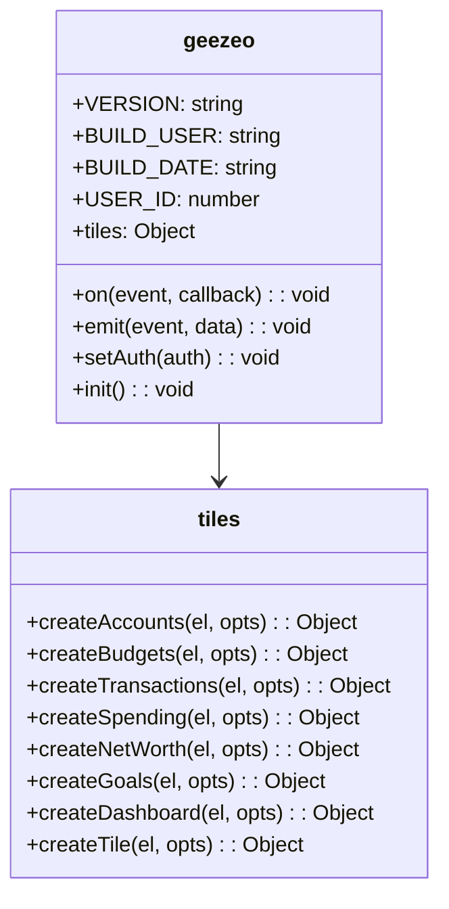
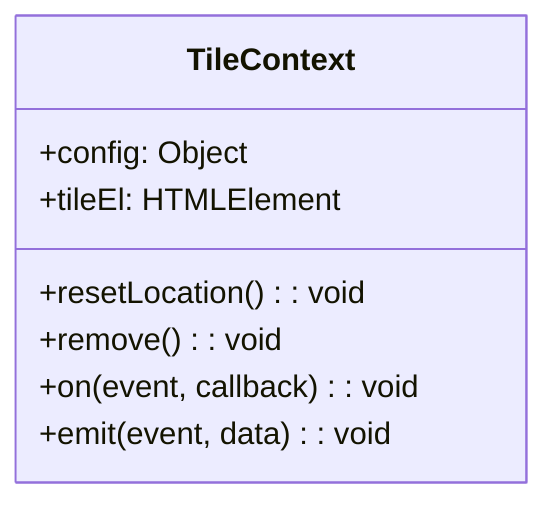

# Responsive Tiles API Reference

This document provides a comprehensive reference for the Responsive Tiles API.

## Global Object

The Responsive Tiles system exposes a global `geezeo` object with the following structure:



## Initialization

### geezeo.init()

Initializes the Responsive Tiles system.

```javascript
// Auto-initialize on script load
geezeo.init();
```

### geezeo.ready(callback)

Executes a callback function when the system is ready.

```javascript
geezeo.ready(function() {
  // System is ready
  console.log('Geezeo is ready!');
});

// With options
geezeo.ready({
  // Options
  onJwtExpired: function() { /* handle JWT expiration */ }
}, function() {
  // System is ready with options
});
```

## Authentication

### geezeo.setAuth(auth)

Sets the authentication details for API requests.

```javascript
// Using JWT object
geezeo.setAuth({
  jwt: 'your-jwt-token',
  useSsl: true,
  host: 'api.example.com'
});

// Using JWT string
geezeo.setAuth('your-jwt-token');
```

**Parameters:**

| Parameter | Type | Description |
|-----------|------|-------------|
| `auth` | Object/String | Authentication details |
| `auth.jwt` | String | JWT token |
| `auth.useSsl` | Boolean | Use SSL for requests (default: true) |
| `auth.host` | String | API host domain |

## Tile Creation

### geezeo.tiles.createTile(el, opts)

Creates a custom tile with the specified route.

```javascript
const container = document.getElementById('custom-tile');
const tile = geezeo.tiles.createTile(container, {
  route: '/custom-route'
});
```

**Parameters:**

| Parameter | Type | Description |
|-----------|------|-------------|
| `el` | HTMLElement | DOM element to contain the tile |
| `opts` | Object | Tile options |
| `opts.route` | String | Route path (required) |

**Returns:** Tile context object

### Specific Tile Creation Methods

Each tile type has a dedicated creation method:

#### geezeo.tiles.createAccounts(el, opts)

Creates an Accounts tile.

```javascript
const container = document.getElementById('accounts-container');
const accountsTile = geezeo.tiles.createAccounts(container, {
  // Options
});
```

#### geezeo.tiles.createBudgets(el, opts)

Creates a Budgets tile.

```javascript
const container = document.getElementById('budgets-container');
const budgetsTile = geezeo.tiles.createBudgets(container, {
  // Options
});
```

#### geezeo.tiles.createTransactions(el, opts)

Creates a Transactions tile.

```javascript
const container = document.getElementById('transactions-container');
const transactionsTile = geezeo.tiles.createTransactions(container, {
  // Options
});
```

#### geezeo.tiles.createSpending(el, opts)

Creates a Spending analysis tile.

```javascript
const container = document.getElementById('spending-container');
const spendingTile = geezeo.tiles.createSpending(container, {
  // Options
});
```

#### geezeo.tiles.createGoals(el, opts)

Creates a Goals management tile.

```javascript
const container = document.getElementById('goals-container');
const goalsTile = geezeo.tiles.createGoals(container, {
  // Options
});
```

#### geezeo.tiles.createNetWorth(el, opts)

Creates a Net Worth tracking tile.

```javascript
const container = document.getElementById('networth-container');
const netWorthTile = geezeo.tiles.createNetWorth(container, {
  // Options
});
```

#### geezeo.tiles.createDashboard(el, opts)

Creates a Dashboard overview tile.

```javascript
const container = document.getElementById('dashboard-container');
const dashboardTile = geezeo.tiles.createDashboard(container, {
  // Options
});
```

## Common Tile Options

All tile creation methods accept a common set of options:

| Option | Type | Default | Description |
|--------|------|---------|-------------|
| `showHeader` | Boolean | `true` | Show the tile header |
| `navigationMode` | String | `'menu'` | Navigation mode: 'menu', 'modal', or 'hidden' |
| `showNavigation` | Boolean | `false` | Show navigation controls |
| `hideNotificationsSnackbar` | Boolean | `true` | Hide the notifications snackbar |
| `disableHarvests` | Boolean | `false` | Disable account harvesting |
| `transformAccountNames` | Boolean | `false` | Transform account names |
| `theme` | Object | `{}` | Custom theme options |
| `dateRange` | Array | `[]` | Date range for data filtering |

## Event System

### geezeo.on(eventName, callback)

Registers an event listener.

```javascript
geezeo.on('transaction:created', function(transaction) {
  console.log('New transaction:', transaction);
});
```

**Parameters:**

| Parameter | Type | Description |
|-----------|------|-------------|
| `eventName` | String | Event name to listen for |
| `callback` | Function | Callback function invoked when event is emitted |

### geezeo.emit(eventName, data)

Emits an event with optional data.

```javascript
geezeo.emit('transaction:create', {
  amount: 100,
  description: 'Grocery shopping'
});
```

**Parameters:**

| Parameter | Type | Description |
|-----------|------|-------------|
| `eventName` | String | Event name to emit |
| `data` | Any | Data to pass with the event |

### geezeo.onGlobal(eventName, callback)

Registers a global event listener that remains active across all tiles.

```javascript
geezeo.onGlobal('user:login', function(user) {
  console.log('User logged in:', user);
});
```

### geezeo.emitGlobal(eventName, data)

Emits a global event that is delivered to all registered global listeners.

```javascript
geezeo.emitGlobal('system:ready', { version: '1.0.0' });
```

## Tile Context Object

Each tile creation method returns a tile context object with the following properties and methods:



### tileContext.config

Object containing the tile's configuration options.

### tileContext.tileEl

Reference to the DOM element containing the tile.

### tileContext.resetLocation()

Resets the tile's location and re-renders it.

```javascript
const tile = geezeo.tiles.createAccounts(container);
tile.resetLocation();
```

### tileContext.remove()

Removes the tile from the DOM.

```javascript
const tile = geezeo.tiles.createAccounts(container);
// Later...
tile.remove();
```

## Standard Events

The following events are standardized across the tile system:

### Account Events

- `account:created` - An account was created
- `account:updated` - An account was updated
- `account:deleted` - An account was deleted
- `accounts:refreshed` - Accounts data was refreshed

### Transaction Events

- `transaction:created` - A transaction was created
- `transaction:updated` - A transaction was updated
- `transaction:deleted` - A transaction was deleted
- `transactions:refreshed` - Transactions data was refreshed

### Budget Events

- `budget:created` - A budget was created
- `budget:updated` - A budget was updated
- `budget:deleted` - A budget was deleted
- `budgets:refreshed` - Budgets data was refreshed

### System Events

- `system:ready` - The system is initialized and ready
- `system:error` - A system error occurred
- `auth:expired` - Authentication token expired
- `navigation:changed` - Navigation state changed

## Error Handling

Errors in the tile system can be handled through events or try-catch blocks:

```javascript
// Error event handling
geezeo.on('system:error', function(error) {
  console.error('Geezeo error:', error);
});

// Try-catch
try {
  const tile = geezeo.tiles.createAccounts(container);
} catch (error) {
  console.error('Error creating tile:', error);
}
```

## Version Information

The current version of the Responsive Tiles system can be accessed via:

```javascript
console.log('Version:', geezeo.VERSION);
console.log('Build User:', geezeo.BUILD_USER);
console.log('Build Date:', geezeo.BUILD_DATE);
```

## Custom Tile Development API

For custom tile development, the internal API provides these methods:

### geezeo.tiles.register(options)

Registers custom tiles with the system.

```javascript
geezeo.tiles.register({
  routeMapping: {
    createCustomTile: '/custom-tile-route'
  },
  getRoutes: customGetRoutesFunction,
  stores: customStores
});
```

**Parameters:**

| Parameter | Type | Description |
|-----------|------|-------------|
| `options` | Object | Registration options |
| `options.routeMapping` | Object | Map of function names to routes |
| `options.getRoutes` | Function | Function to get routes |
| `options.stores` | Object | Custom stores object | 
