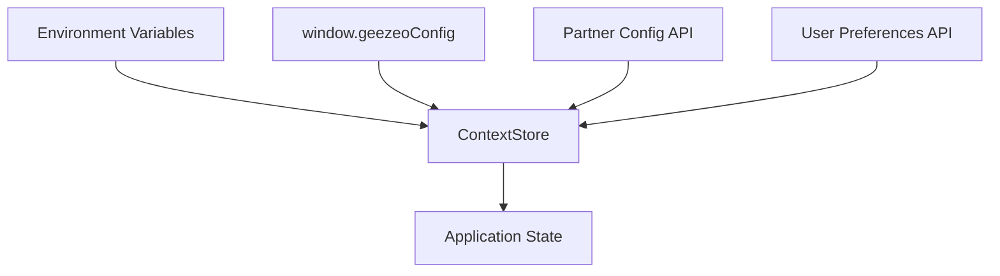
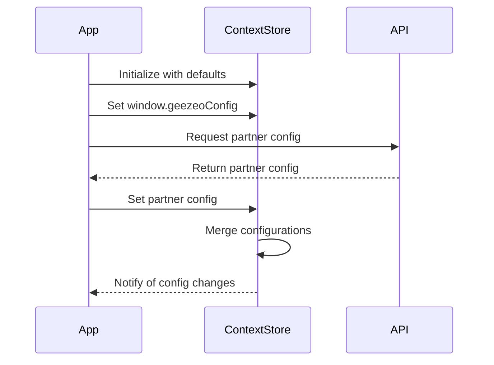

# Configuration Management

This document explains how the Responsive Tiles system manages configurations during the bootstrap process.

## Configuration Sources

The Responsive Tiles system sources configuration from multiple places:

1. **Environment variables** - Base configuration values set during build time
2. **Window object configurations** - Client-side configurations set via the `window.geezeoConfig` object
3. **Partner configurations** - Server-side configurations retrieved from the API
4. **User preferences** - User-specific settings retrieved from the API



## Partner Configuration Loading

Partner configurations are loaded from the server using the `getPartnerConfig()` function:

```javascript
const getPartnerConfig = () => {
  const { contextStore, usersStore } = stores
  
  // Skip if no JWT is available
  if (!usersStore.jwt) {
    return Promise.resolve()
  }
  
  return _fetch('/partner', { cache: 'no-store' })
    .then(json => {
      // Store partner config in global object and context store
      geezeo._partnerConfig = json
      contextStore.setPartnerConfig(json)
      return json
    })
    .catch(error => {
      console.error('Error loading partner config:', error)
    })
}
```

This function:
1. Checks for JWT authentication
2. Makes an API request to the `/partner` endpoint
3. Stores the configuration in both the global object and context store
4. Handles any errors during the loading process

## Context Store Configuration

The Context Store is responsible for managing and merging configurations from different sources:

```javascript
class ContextStore {
  @observable config = {}
  @observable partnerConfig = {}
  
  @action
  setPartnerConfig (partnerConfig) {
    this.partnerConfig = partnerConfig || {}
    this.mergeConfigurations()
  }
  
  @action
  setConfig (config) {
    this.config = config || {}
    this.mergeConfigurations()
  }
  
  @action
  mergeConfigurations () {
    // Merge configurations in priority order
    const merged = {
      ...defaultConfig,
      ...this.partnerConfig,
      ...window.geezeoConfig,
      ...this.config
    }
    
    // Apply merged configuration
    this.effectiveConfig = merged
    
    // Notify subscribers about configuration changes
    this.emit('configChanged', merged)
  }
}
```

## Configuration Priority

When configurations are merged, they follow this priority order (highest priority last):

1. Default configurations hardcoded in the application
2. Partner configurations from the server API
3. Window-level configurations (`window.geezeoConfig`)
4. User-specific configurations

This ensures that user preferences take precedence over partner configurations, and partner configurations take precedence over defaults.

## Configuration Usage

Configurations are used throughout the application through the Context Store:

```javascript
// Access configuration in a component
@observer
class ConfigAwareComponent extends React.Component {
  render() {
    const { contextStore } = this.props
    const { theme, featureFlags } = contextStore.effectiveConfig
    
    // Use configuration values
    return (
      <ThemeProvider theme={theme}>
        {featureFlags.newFeature && <NewFeatureComponent />}
      </ThemeProvider>
    )
  }
}
```

## Configuration Update Flow



## User Authentication Configuration

Authentication configuration is managed separately through the `setAuth()` function:

```javascript
const setAuth = (auth) => {
  const { usersStore } = stores
  
  if (!auth) return
  
  // Set JWT if provided
  if (auth.jwt) {
    usersStore.setJwt(auth.jwt)
  }
  
  // Set user ID if provided
  if (auth.userId) {
    geezeo.USER_ID = auth.userId
  }
  
  // Set API endpoint if provided
  if (auth.apiUrl) {
    usersStore.setApiUrl(auth.apiUrl)
  }
}
```

This function configures:
1. The JWT token for API authentication
2. User ID for tracking and personalization
3. API URL for server communications 
