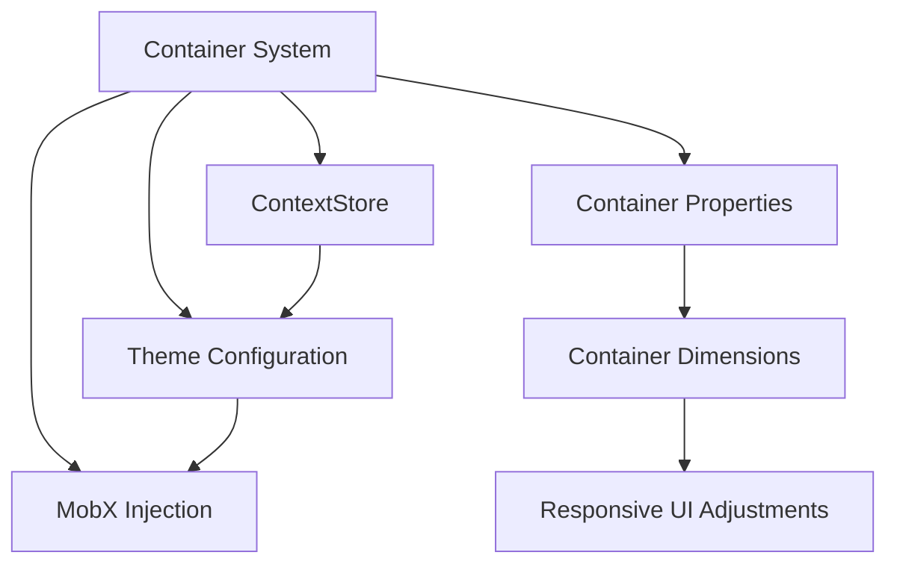

# Container System

This document explains the container system used in the Responsive Tiles application, with a detailed focus on how it works with class-based React components and MobX state management.

## Container System Overview

The Responsive Tiles application uses a container-based approach to responsive design rather than relying solely on media queries and viewport sizes. This approach allows tiles to respond to their immediate container context, enabling more flexible layouts and better component composition.



## Container Architecture

At the heart of the container system is the ContextStore, which provides information about the container's dimensions, breakpoints, and settings to class components via MobX's `inject` and `observer` patterns.

```mermaid
flowchart TB
    subgraph ContainerSystem
        CS[ContextStore] -->|provides| CD[Container Dimensions]
        CS -->|provides| CB[Container Breakpoints]
        CS -->|provides| CT[Container Theme]
    end
    
    subgraph MobX
        INJ[inject('contextStore')] -->|injects into| CMP[Class Components]
        OBS[observer] -->|observes| CMP
    end
    
    subgraph Components
        Tile1[Tile Component] -->|receives| CS
        Tile2[Tile Component] -->|receives| CS
        Tile3[Tile Component] -->|receives| CS
    end
    
    INJ --> Tile1
    INJ --> Tile2
    INJ --> Tile3
    OBS --> Tile1
    OBS --> Tile2
    OBS --> Tile3
```

## MobX Integration with Container System

The container system is tightly integrated with MobX for state management. Class components access container information through the injected `contextStore`.

### ContextStore Implementation

The ContextStore serves as the primary provider of container information:

```javascript
// src/stores/contextStore/index.js
import { action, observable, computed, makeObservable } from 'mobx';

class ContextStore {
  @observable width;
  @observable height;
  @observable scrollTop;
  @observable iframeHeight;
  @observable offsetTop;
  
  constructor() {
    makeObservable(this);
    // Initialize container properties
  }
  
  @action
  setContainerDimensions(width, height) {
    this.width = width;
    this.height = height;
  }
  
  @computed
  get currentBreakpoint() {
    // Calculate breakpoint based on width
    if (this.width < 600) return 'xs';
    if (this.width < 960) return 'sm';
    if (this.width < 1280) return 'md';
    if (this.width < 1920) return 'lg';
    return 'xl';
  }
  
  @computed
  get isMobile() {
    return this.currentBreakpoint === 'xs' || this.currentBreakpoint === 'sm';
  }
  
  @computed
  get isTablet() {
    return this.currentBreakpoint === 'md';
  }
  
  @computed
  get isDesktop() {
    return this.currentBreakpoint === 'lg' || this.currentBreakpoint === 'xl';
  }
  
  @computed
  get contentHeight() {
    // Calculate available content height
    return this.height - (this.config.hasAppBar ? 64 : 0);
  }
}
```

### Using Container Context in Class Components

Class components access container information through MobX's `inject` and `observer` higher-order components:

```javascript
// Example of a container-aware component
import React from 'react';
import PropTypes from 'prop-types';
import { inject, observer } from 'mobx-react';
import { withStyles } from '@material-ui/core/styles';

const styles = theme => ({
  root: {
    padding: theme.spacing(2),
    // Use container-specific styling
    fontSize: theme.useContainer ? '14px' : '16px'
  }
});

class ResponsiveComponent extends React.Component {
  static propTypes = {
    contextStore: PropTypes.object.isRequired,
    classes: PropTypes.object.isRequired
  };
  
  _getContainerHeight() {
    const { contextStore } = this.props;
    const { contentHeight } = contextStore;
    // Calculate height based on container context
    return contentHeight - 24; // Subtract padding
  }
  
  render() {
    const { contextStore, classes } = this.props;
    const { isMobile } = contextStore;
    const height = this._getContainerHeight();
    
    return (
      <div 
        className={classes.root}
        style={{ 
          height: height,
          flexDirection: isMobile ? 'column' : 'row'
        }}
      >
        {/* Component content */}
      </div>
    );
  }
}

// Connect component to container context
export default inject('contextStore')(
  withStyles(styles, { withTheme: true })(
    observer(ResponsiveComponent)
  )
);
```

## Theme Integration with Container Context

The Material-UI theme system is extended to include container-specific properties:

```javascript
// src/components/common/withRoot.js
const styles = theme => ({
  '@global': {
    // Global styles
  },
  root: {
    position: 'relative',
    fontFamily: theme.typography.fontFamily,
    minHeight: 180,
    height: theme.useContainer ? '100cqh' : '100%',
    overflowY: 'hidden',
    backgroundColor: theme.palette.background.default,
    scrollbarWidth: 'none'
  }
});
```

The `theme.useContainer` property determines whether components should adapt to their container context or use fixed dimensions.

## FabButton Example

The FabButton component is a good example of container-aware component implementation:

```javascript
// src/components/common/FabButton/index.js
import React from 'react';
import PropTypes from 'prop-types';
import { inject, observer } from 'mobx-react';
import classNames from 'classnames';
import withStyles from '@material-ui/core/styles/withStyles';

const styles = theme => ({
  wrapper: {
    display: 'flex',
    justifyContent: 'flex-end',
    position: theme.useContainer ? 'relative' : theme.disableFixed ? 'inherit' : 'fixed',
    width: theme.useContainer ? '100cqw' : '100%',
    maxWidth: theme.disableFixed ? 'inherit' : theme.contentMaxWidth,
    zIndex: theme.zIndex.modal,
    top: theme.useContainer ? '-45px' : 'auto',
    bottom: theme.useContainer ? 'auto' : '0'
  }
  // Other styles
});

class FabButton extends React.Component {
  static propTypes = {
    contextStore: PropTypes.object.isRequired,
    classes: PropTypes.object.isRequired,
    container: PropTypes.any.isRequired,
    children: PropTypes.any,
    ButtonProps: PropTypes.object,
    iconComponent: PropTypes.element
  };

  constructor(props) {
    super(props);
    const { contextStore, theme } = props;
    this._model = contextStore.getFabButton(theme.useContainer ? '100cqw' : theme.contentMaxWidth);
  }

  // Component lifecycle methods and render function
}

export default inject('contextStore')(
  withStyles(styles, { withTheme: true })(
    observer(FabButton)
  )
);
```

## Container Sizing Methods

Class components commonly include methods to access and calculate container dimensions:

```javascript
// Common pattern in tile components
_getContainerHeight() {
  const { contextStore } = this.props;
  const { contentHeight } = contextStore;
  const aboveHeight = 48; // Height of elements above the container

  return contentHeight - aboveHeight;
}
```

## Responsive Layout with Container Context

Container-aware components adapt their layout based on container properties:

```javascript
// Example from a tile component
render() {
  const { contextStore, classes } = this.props;
  const { isMobile, currentBreakpoint } = contextStore;
  
  // Adapt layout based on container properties
  const layoutStyle = {
    flexDirection: isMobile ? 'column' : 'row',
    padding: isMobile ? 8 : 16,
    overflow: currentBreakpoint === 'xs' ? 'auto' : 'hidden'
  };
  
  return (
    <div className={classes.root} style={layoutStyle}>
      {isMobile ? (
        <MobileLayout {...this.props} />
      ) : (
        <DesktopLayout {...this.props} />
      )}
    </div>
  );
}
```

## Integration with MobX Stores

The container system works closely with other MobX stores to provide a comprehensive solution:

```javascript
// Example of cross-store interaction
@inject('contextStore', 'uiStore')
@observer
class ResponsiveTile extends React.Component {
  render() {
    const { contextStore, uiStore } = this.props;
    const { isMobile } = contextStore;
    const { theme } = uiStore;
    
    return (
      <div className={`tile theme-${theme} ${isMobile ? 'mobile' : 'desktop'}`}>
        {/* Tile content */}
      </div>
    );
  }
}
```

## Container Sizing and Nesting

The container system supports nested containers, where a component can be a container itself while also being contained by a parent container:

```javascript
// Parent container component
@inject('contextStore')
@observer
class ParentContainer extends React.Component {
  render() {
    const { contextStore, children } = this.props;
    const { contentHeight, width } = contextStore;
    
    // Create subcontainer dimensions
    const chartHeight = contentHeight * 0.6;
    const tableHeight = contentHeight * 0.4;
    
    return (
      <div className="parent-container">
        <div className="chart-container" style={{ height: chartHeight, width }}>
          {/* Chart component that will receive these dimensions via contextStore */}
        </div>
        <div className="table-container" style={{ height: tableHeight, width }}>
          {/* Table component that will receive these dimensions via contextStore */}
        </div>
      </div>
    );
  }
}
```

## Performance Considerations

When working with the container system, there are several performance considerations:

1. **Minimize Renders** - Use MobX's `@computed` for derived values to avoid unnecessary calculations
2. **Component Structure** - Break down large components into smaller ones to minimize render impact
3. **Selective Updates** - Use `shouldComponentUpdate` to prevent unneeded re-renders
4. **Virtualization** - Implement virtualized lists for large data sets to maintain performance

## Testing Container-Aware Components

Testing components that use the container context requires proper setup in tests:

```javascript
// Example test for a container-aware component
import React from 'react';
import { mount } from 'enzyme';
import { Provider } from 'mobx-react';
import ResponsiveComponent from './ResponsiveComponent';

describe('ResponsiveComponent', () => {
  it('renders correctly with mobile dimensions', () => {
    // Mock the contextStore
    const contextStore = {
      width: 375,
      height: 667,
      contentHeight: 603,
      isMobile: true,
      isTablet: false,
      isDesktop: false,
      currentBreakpoint: 'xs'
    };
    
    const wrapper = mount(
      <Provider contextStore={contextStore}>
        <ResponsiveComponent />
      </Provider>
    );
    
    // Test component renders correctly for mobile
    expect(wrapper.find('.mobile-view').exists()).toBe(true);
    expect(wrapper.find('.desktop-view').exists()).toBe(false);
  });
  
  it('renders correctly with desktop dimensions', () => {
    // Mock the contextStore with desktop dimensions
    const contextStore = {
      width: 1200,
      height: 800,
      contentHeight: 736,
      isMobile: false,
      isTablet: false,
      isDesktop: true,
      currentBreakpoint: 'lg'
    };
    
    const wrapper = mount(
      <Provider contextStore={contextStore}>
        <ResponsiveComponent />
      </Provider>
    );
    
    // Test component renders correctly for desktop
    expect(wrapper.find('.desktop-view').exists()).toBe(true);
    expect(wrapper.find('.mobile-view').exists()).toBe(false);
  });
});
```

## Container System in Test Tools

The container system is particularly important in the Responsive Tiles test tools:

### Toolbox Integration

The Toolbox tool provides a way to test components with different container dimensions:

```javascript
// Example of how Toolbox injects container dimensions
class ToolboxPreview extends React.Component {
  static propTypes = {
    contextStore: PropTypes.object.isRequired,
    viewMode: PropTypes.string.isRequired
  };
  
  componentDidMount() {
    const { contextStore, viewMode } = this.props;
    
    // Set container dimensions based on view mode
    if (viewMode === 'mobile') {
      contextStore.setContainerDimensions(375, 667);
    } else {
      contextStore.setContainerDimensions(1200, 800);
    }
  }
  
  render() {
    const { children } = this.props;
    return (
      <div className="preview-container">
        {children}
      </div>
    );
  }
}

export default inject('contextStore')(observer(ToolboxPreview));
```

### Test Harness Integration

The Test Harness uses MobX and the container system to create a realistic testing environment:

```javascript
// Example of Test Harness container layout
class TestHarnessLayout extends React.Component {
  static propTypes = {
    contextStore: PropTypes.object.isRequired
  };
  
  componentDidMount() {
    // Initialize container dimensions
    const mainElement = document.querySelector('.main-content');
    const sidebarElement = document.querySelector('.sidebar');
    
    if (mainElement) {
      const { width, height } = mainElement.getBoundingClientRect();
      this.props.contextStore.setMainContentDimensions(width, height);
    }
    
    if (sidebarElement) {
      const { width, height } = sidebarElement.getBoundingClientRect();
      this.props.contextStore.setSidebarDimensions(width, height);
    }
  }
  
  render() {
    const { contentTile, sidebarTile } = this.props;
    
    return (
      <div className="test-harness-layout">
        <main className="main-content">
          {contentTile}
        </main>
        <aside className="sidebar">
          {sidebarTile}
        </aside>
      </div>
    );
  }
}

export default inject('contextStore')(observer(TestHarnessLayout));
```

## Best Practices

When working with the container system in class components, follow these best practices:

1. **Always Use Observer** - Wrap container-aware components with `observer` to ensure they respond to container changes
2. **Inject Only What's Needed** - Only inject the stores your component actually needs
3. **Use Computed Methods** - Create methods for calculating derived values from container dimensions
4. **Break Down Components** - Use smaller, focused components for better performance
5. **Test Different Containers** - Test components with various container dimensions
6. **Document Container Requirements** - Document minimum container dimensions for components

## Conclusion

The container system in Responsive Tiles enables class-based React components to adapt to their container context rather than just the viewport size. By injecting the ContextStore into components via MobX, components can respond to their immediate container dimensions, creating a truly responsive UI that works well in various layout scenarios.

This approach is particularly valuable in a tiles-based interface where components need to work in various layout positions and sizes. The combination of MobX for state management and container context awareness creates a powerful system for building flexible, responsive UIs. 
