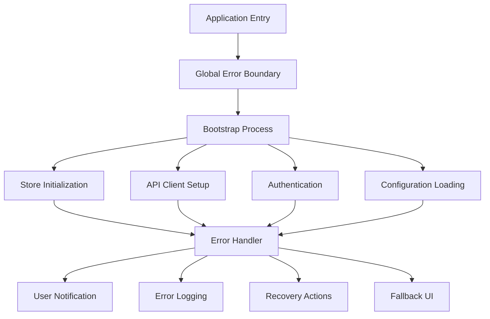
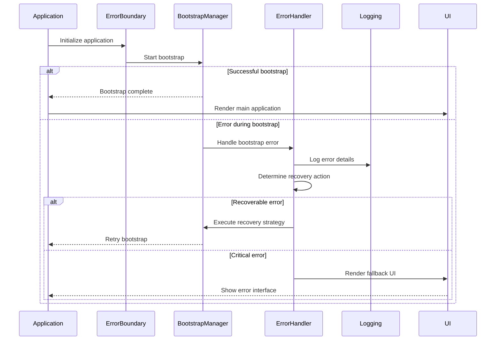

# Bootstrap Error Handling

This document explains how errors are handled during the bootstrap process of the Responsive Tiles application.

## Error Handling Architecture

Error handling during bootstrap follows a layered approach, with specialized handlers at each level of the application initialization process.



## Error Handling Sequence

The error handling process follows a specific sequence to ensure proper capture and recovery:



## Global Error Boundary

The application uses React Error Boundaries to catch and handle errors:

```tsx
// src/components/ErrorBoundary.tsx
import React, { Component, ErrorInfo, ReactNode } from 'react';
import { ErrorFallback } from './ErrorFallback';
import { errorHandler } from '../error/errorHandler';

interface Props {
  children: ReactNode;
  fallback?: ReactNode;
}

interface State {
  hasError: boolean;
  error: Error | null;
}

export class ErrorBoundary extends Component<Props, State> {
  constructor(props: Props) {
    super(props);
    this.state = {
      hasError: false,
      error: null
    };
  }

  static getDerivedStateFromError(error: Error): State {
    return {
      hasError: true,
      error
    };
  }

  componentDidCatch(error: Error, errorInfo: ErrorInfo): void {
    // Log error to service
    errorHandler.logError(error, {
      componentStack: errorInfo.componentStack,
      context: 'ErrorBoundary'
    });
  }

  render(): ReactNode {
    if (this.state.hasError) {
      // Render fallback UI or default error component
      return this.props.fallback || <ErrorFallback error={this.state.error} />;
    }

    return this.props.children;
  }
}
```

## Bootstrap Error Handler

A specialized error handler manages bootstrap-specific errors:

```typescript
// src/bootstrap/bootstrapErrorHandler.ts
import { ErrorHandler, ErrorSeverity, ErrorContext } from '../error/errorHandler';
import { logger } from '../utils/logger';

export class BootstrapErrorHandler {
  private static instance: BootstrapErrorHandler;
  private errorHandler: ErrorHandler;
  
  private constructor() {
    this.errorHandler = new ErrorHandler();
  }
  
  public static getInstance(): BootstrapErrorHandler {
    if (!BootstrapErrorHandler.instance) {
      BootstrapErrorHandler.instance = new BootstrapErrorHandler();
    }
    return BootstrapErrorHandler.instance;
  }
  
  /**
   * Handle bootstrap errors with appropriate severity and context
   */
  public handleError(
    error: Error, 
    context: string, 
    severity: ErrorSeverity = ErrorSeverity.CRITICAL
  ): void {
    logger.error(`Bootstrap error in ${context}:`, error);
    
    // Create error context with bootstrap-specific information
    const errorContext: ErrorContext = {
      phase: 'bootstrap',
      component: context,
      timestamp: new Date().toISOString(),
      recoverable: severity !== ErrorSeverity.CRITICAL
    };
    
    this.errorHandler.handleError(error, errorContext, severity);
  }
  
  /**
   * Handle configuration errors with specialized recovery
   */
  public handleConfigError(error: Error): boolean {
    logger.warn('Configuration error detected, attempting recovery', error);
    
    try {
      // Attempt to load default configurations
      // If successful, app can continue with limited functionality
      return true; // Recovered
    } catch (secondaryError) {
      logger.error('Failed to recover from configuration error', secondaryError);
      
      // Handle as critical error since recovery failed
      this.handleError(
        error, 
        'configuration', 
        ErrorSeverity.CRITICAL
      );
      return false; // Could not recover
    }
  }
  
  /**
   * Handle authentication errors specially
   */
  public handleAuthError(error: Error): void {
    // Auth errors during bootstrap can usually be recovered from
    // by proceeding in unauthenticated mode
    this.handleError(
      error,
      'authentication',
      ErrorSeverity.WARNING
    );
  }
  
  /**
   * Handle network errors during bootstrap
   */
  public handleNetworkError(error: Error): boolean {
    logger.warn('Network error during bootstrap', error);
    
    // Check if offline mode is possible
    if (this.canOperateOffline()) {
      // Enable offline mode
      logger.info('Enabling offline mode due to network error');
      return true;
    }
    
    // Network error is critical if offline mode is not possible
    this.handleError(
      error,
      'network',
      ErrorSeverity.CRITICAL
    );
    return false;
  }
  
  /**
   * Determine if application can work offline
   */
  private canOperateOffline(): boolean {
    // Check cached data and offline capabilities
    return false; // Default implementation
  }
}
```

## Error Types and Categorization

Bootstrap errors are categorized to determine the appropriate handling strategy:

```typescript
// src/error/errorTypes.ts
export enum ErrorSeverity {
  CRITICAL = 'critical',  // Application cannot continue
  ERROR = 'error',        // Feature is broken but app can continue
  WARNING = 'warning',    // Non-critical issue, can be worked around
  INFO = 'info'           // Informational issue, no action needed
}

export enum ErrorCategory {
  CONFIGURATION = 'configuration',
  AUTHENTICATION = 'authentication',
  NETWORK = 'network',
  STORAGE = 'storage',
  RENDERING = 'rendering',
  UNKNOWN = 'unknown'
}

export interface ErrorContext {
  phase: 'bootstrap' | 'runtime';
  component: string;
  timestamp: string;
  recoverable: boolean;
  additionalInfo?: Record<string, any>;
}

export interface ErrorReport {
  error: {
    message: string;
    stack?: string;
    name: string;
  };
  context: ErrorContext;
  severity: ErrorSeverity;
  category: ErrorCategory;
  id: string; // Unique error ID
  timestamp: string;
}
```

## Fallback UI

When bootstrap fails, the application displays a specialized fallback UI:

```tsx
// src/components/BootstrapErrorFallback.tsx
import React from 'react';
import { ErrorReport } from '../error/errorTypes';
import { Button } from './Button';

interface BootstrapErrorFallbackProps {
  errorReport?: ErrorReport;
  onRetry?: () => void;
}

export const BootstrapErrorFallback: React.FC<BootstrapErrorFallbackProps> = ({ 
  errorReport, 
  onRetry 
}) => {
  const [showDetails, setShowDetails] = React.useState(false);
  
  return (
    <div className="bootstrap-error-fallback">
      <div className="error-container">
        <h1>Unable to Start Application</h1>
        
        <p className="error-message">
          {errorReport?.error.message || 'An unexpected error occurred during application startup.'}
        </p>
        
        <div className="error-actions">
          <Button 
            onClick={onRetry} 
            variant="primary"
          >
            Retry
          </Button>
          
          <Button
            onClick={() => setShowDetails(!showDetails)}
            variant="secondary"
          >
            {showDetails ? 'Hide Details' : 'Show Details'}
          </Button>
        </div>
        
        {showDetails && errorReport && (
          <div className="error-details">
            <h2>Error Details</h2>
            <p><strong>Type:</strong> {errorReport.category}</p>
            <p><strong>Component:</strong> {errorReport.context.component}</p>
            <p><strong>Time:</strong> {new Date(errorReport.timestamp).toLocaleString()}</p>
            
            {errorReport.error.stack && (
              <div className="error-stack">
                <h3>Stack Trace</h3>
                <pre>{errorReport.error.stack}</pre>
              </div>
            )}
          </div>
        )}
      </div>
    </div>
  );
};
```

## Application Entry Point with Error Handling

The application entry point incorporates the error handling strategy:

```tsx
// src/index.tsx
import React from 'react';
import ReactDOM from 'react-dom';
import { App } from './App';
import { ErrorBoundary } from './components/ErrorBoundary';
import { BootstrapErrorFallback } from './components/BootstrapErrorFallback';
import { bootstrapManager } from './bootstrap/bootstrapManager';
import { BootstrapErrorHandler } from './bootstrap/bootstrapErrorHandler';

const bootstrapErrorHandler = BootstrapErrorHandler.getInstance();

const startApplication = async () => {
  try {
    // Initialize core services and perform bootstrap
    await bootstrapManager.initialize();
    
    // Render the application
    ReactDOM.render(
      <React.StrictMode>
        <ErrorBoundary>
          <App />
        </ErrorBoundary>
      </React.StrictMode>,
      document.getElementById('root')
    );
  } catch (error) {
    console.error('Failed to bootstrap application:', error);
    
    // Handle bootstrap error and render fallback UI
    bootstrapErrorHandler.handleError(
      error instanceof Error ? error : new Error(String(error)),
      'bootstrap'
    );
    
    // Render error UI
    ReactDOM.render(
      <BootstrapErrorFallback 
        errorReport={bootstrapErrorHandler.getLatestErrorReport()}
        onRetry={() => window.location.reload()}
      />,
      document.getElementById('root')
    );
  }
};

// Start the application
startApplication();
```

## Store Initialization Error Handling

Handling errors during store initialization is a critical part of the bootstrap process:

```typescript
// src/bootstrap/storeBootstrap.ts
import { RootStore } from '../stores/RootStore';
import { BootstrapErrorHandler } from './bootstrapErrorHandler';
import { ErrorSeverity } from '../error/errorTypes';

export class StoreBootstrap {
  private rootStore: RootStore;
  private errorHandler: BootstrapErrorHandler;
  
  constructor() {
    this.rootStore = new RootStore();
    this.errorHandler = BootstrapErrorHandler.getInstance();
  }
  
  async initialize(): Promise<RootStore> {
    try {
      // 1. Initialize config store first - this is critical
      try {
        await this.rootStore.configStore.initialize();
      } catch (error) {
        // Special handling for config errors - attempt recovery
        if (this.errorHandler.handleConfigError(error instanceof Error ? error : new Error(String(error)))) {
          // If recovery successful, continue but log the issue
          console.warn('Continuing with default configuration due to error');
        } else {
          // Cannot recover from configuration error
          throw error;
        }
      }
      
      // 2. Initialize authentication with error handling
      try {
        await this.rootStore.authStore.initialize();
      } catch (error) {
        // Auth errors can be recovered from by continuing unauthenticated
        this.errorHandler.handleAuthError(error instanceof Error ? error : new Error(String(error)));
        // Continue bootstrap process - the user will need to log in
      }
      
      // 3. Initialize remaining stores in parallel
      const initializationPromises = [
        this.initializeStore('dataStore'),
        this.initializeStore('uiStore'),
        this.initializeStore('tileStore')
      ];
      
      await Promise.all(initializationPromises);
      
      return this.rootStore;
    } catch (error) {
      // Handle critical bootstrap error
      this.errorHandler.handleError(
        error instanceof Error ? error : new Error(String(error)),
        'store-initialization',
        ErrorSeverity.CRITICAL
      );
      throw error;
    }
  }
  
  private async initializeStore(storeName: keyof RootStore): Promise<void> {
    const store = this.rootStore[storeName];
    
    try {
      if (typeof (store as any).initialize === 'function') {
        await (store as any).initialize();
      }
    } catch (error) {
      // Handle store-specific initialization error
      this.errorHandler.handleError(
        error instanceof Error ? error : new Error(String(error)),
        `${storeName}-initialization`,
        ErrorSeverity.ERROR
      );
      
      // Rethrow if critical store, otherwise continue
      if (['dataStore', 'uiStore'].includes(storeName)) {
        throw error;
      }
    }
  }
}
```

## Retry Strategies

The bootstrap process includes sophisticated retry strategies for recoverable errors:

```typescript
// src/bootstrap/retryStrategy.ts
interface RetryOptions {
  maxRetries: number;
  initialDelay: number;
  maxDelay: number;
  backoffFactor: number;
  onRetry?: (attempt: number, error: Error) => void;
}

export class RetryStrategy {
  private options: RetryOptions;
  
  constructor(options: Partial<RetryOptions> = {}) {
    this.options = {
      maxRetries: 3,
      initialDelay: 1000,
      maxDelay: 10000,
      backoffFactor: 2,
      ...options
    };
  }
  
  /**
   * Execute function with retry
   */
  async execute<T>(fn: () => Promise<T>): Promise<T> {
    let lastError: Error | null = null;
    
    for (let attempt = 1; attempt <= this.options.maxRetries; attempt++) {
      try {
        return await fn();
      } catch (error) {
        lastError = error instanceof Error ? error : new Error(String(error));
        
        if (attempt < this.options.maxRetries) {
          // Calculate delay with exponential backoff
          const delay = Math.min(
            this.options.initialDelay * Math.pow(this.options.backoffFactor, attempt - 1),
            this.options.maxDelay
          );
          
          // Notify retry attempt
          if (this.options.onRetry) {
            this.options.onRetry(attempt, lastError);
          }
          
          // Wait before retry
          await new Promise(resolve => setTimeout(resolve, delay));
        }
      }
    }
    
    // All retries failed
    throw lastError || new Error('All retry attempts failed');
  }
}
```

## Offline Handling

The application can bootstrap in offline mode when network connectivity is unavailable:

```typescript
// src/bootstrap/offlineBootstrap.ts
import { NetworkStatus } from '../utils/networkStatus';
import { OfflineStorage } from '../storage/offlineStorage';
import { BootstrapErrorHandler } from './bootstrapErrorHandler';

export class OfflineBootstrap {
  private networkStatus: NetworkStatus;
  private offlineStorage: OfflineStorage;
  private errorHandler: BootstrapErrorHandler;
  
  constructor() {
    this.networkStatus = new NetworkStatus();
    this.offlineStorage = new OfflineStorage();
    this.errorHandler = BootstrapErrorHandler.getInstance();
  }
  
  /**
   * Check if offline bootstrap is needed and possible
   */
  async shouldUseOfflineBootstrap(): Promise<boolean> {
    // Check if we're offline
    const isOffline = !await this.networkStatus.isOnline();
    
    if (!isOffline) {
      return false; // Online, use normal bootstrap
    }
    
    // Check if we have cached data for offline bootstrap
    const hasCachedData = await this.offlineStorage.hasCachedBootstrapData();
    
    return hasCachedData;
  }
  
  /**
   * Perform offline bootstrap
   */
  async performOfflineBootstrap(): Promise<void> {
    try {
      // Load cached configuration
      const cachedConfig = await this.offlineStorage.getCachedConfig();
      
      // Load cached user data if any
      const cachedUserData = await this.offlineStorage.getCachedUserData();
      
      // Load cached tile definitions
      const cachedTileDefinitions = await this.offlineStorage.getCachedTileDefinitions();
      
      // Initialize offline mode in all services
      await this.initializeOfflineMode(cachedConfig, cachedUserData, cachedTileDefinitions);
      
      console.info('Application bootstrapped in offline mode');
    } catch (error) {
      this.errorHandler.handleError(
        error instanceof Error ? error : new Error(String(error)),
        'offline-bootstrap'
      );
      throw error;
    }
  }
  
  /**
   * Initialize services in offline mode
   */
  private async initializeOfflineMode(
    cachedConfig: any,
    cachedUserData: any,
    cachedTileDefinitions: any
  ): Promise<void> {
    // Set up services with cached data
    // ...
  }
}
```

## Logging and Monitoring

Bootstrap errors are logged for monitoring and debugging:

```typescript
// src/utils/logger.ts
import { ErrorReport } from '../error/errorTypes';

enum LogLevel {
  DEBUG = 0,
  INFO = 1,
  WARN = 2,
  ERROR = 3
}

interface LogEntry {
  level: LogLevel;
  message: string;
  data?: any;
  timestamp: string;
}

export class Logger {
  private logBuffer: LogEntry[] = [];
  private maxBufferSize: number = 1000;
  private consoleEnabled: boolean = true;
  private remoteLoggingEnabled: boolean = false;
  private remoteBatchSize: number = 50;
  private remoteLogEndpoint: string = '';
  
  constructor() {
    window.addEventListener('error', this.handleGlobalError.bind(this));
    window.addEventListener('unhandledrejection', this.handleUnhandledRejection.bind(this));
  }
  
  debug(message: string, data?: any): void {
    this.log(LogLevel.DEBUG, message, data);
  }
  
  info(message: string, data?: any): void {
    this.log(LogLevel.INFO, message, data);
  }
  
  warn(message: string, data?: any): void {
    this.log(LogLevel.WARN, message, data);
  }
  
  error(message: string, data?: any): void {
    this.log(LogLevel.ERROR, message, data);
  }
  
  private log(level: LogLevel, message: string, data?: any): void {
    const logEntry: LogEntry = {
      level,
      message,
      data,
      timestamp: new Date().toISOString()
    };
    
    // Store in buffer
    this.addToBuffer(logEntry);
    
    // Output to console in development
    if (this.consoleEnabled) {
      this.outputToConsole(logEntry);
    }
    
    // Potentially send to remote logging
    if (this.remoteLoggingEnabled && level >= LogLevel.ERROR) {
      this.sendToRemoteLogging([logEntry]);
    }
  }
  
  private addToBuffer(entry: LogEntry): void {
    this.logBuffer.push(entry);
    
    // Keep buffer size in check
    if (this.logBuffer.length > this.maxBufferSize) {
      this.logBuffer.shift();
    }
  }
  
  private outputToConsole(entry: LogEntry): void {
    const { level, message, data, timestamp } = entry;
    const formattedTime = timestamp.split('T')[1].split('.')[0];
    
    switch (level) {
      case LogLevel.DEBUG:
        console.debug(`[${formattedTime}] ${message}`, data);
        break;
      case LogLevel.INFO:
        console.info(`[${formattedTime}] ${message}`, data);
        break;
      case LogLevel.WARN:
        console.warn(`[${formattedTime}] ${message}`, data);
        break;
      case LogLevel.ERROR:
        console.error(`[${formattedTime}] ${message}`, data);
        break;
    }
  }
  
  private sendToRemoteLogging(entries: LogEntry[]): void {
    if (!this.remoteLogEndpoint) return;
    
    // Send logs to remote endpoint
    fetch(this.remoteLogEndpoint, {
      method: 'POST',
      headers: { 'Content-Type': 'application/json' },
      body: JSON.stringify(entries),
      // Use keepalive to ensure logs are sent even during page unload
      keepalive: true
    }).catch(error => {
      console.error('Failed to send logs to remote endpoint:', error);
    });
  }
  
  // Send any buffered logs to remote logging
  flushLogs(): void {
    if (!this.remoteLoggingEnabled || this.logBuffer.length === 0) return;
    
    // Batch logs to avoid large payloads
    for (let i = 0; i < this.logBuffer.length; i += this.remoteBatchSize) {
      const batch = this.logBuffer.slice(i, i + this.remoteBatchSize);
      this.sendToRemoteLogging(batch);
    }
    
    // Clear buffer after sending
    this.logBuffer = [];
  }
  
  // Handle global errors
  private handleGlobalError(event: ErrorEvent): void {
    this.error('Uncaught error', {
      message: event.message,
      filename: event.filename,
      lineno: event.lineno,
      colno: event.colno,
      stack: event.error?.stack
    });
  }
  
  // Handle unhandled promise rejections
  private handleUnhandledRejection(event: PromiseRejectionEvent): void {
    this.error('Unhandled promise rejection', {
      reason: event.reason,
      stack: event.reason?.stack
    });
  }
  
  // Get error logs during bootstrap for reporting
  getBootstrapErrorLogs(): LogEntry[] {
    return this.logBuffer.filter(entry => entry.level >= LogLevel.ERROR);
  }
}

// Singleton instance
export const logger = new Logger();
```

## Error Recovery Strategies

The application implements multiple recovery strategies for different error types:

```typescript
// src/error/recoveryStrategies.ts
import { ErrorCategory, ErrorSeverity } from './errorTypes';
import { logger } from '../utils/logger';
import { offlineStorage } from '../storage/offlineStorage';

export interface RecoveryStrategy {
  canRecover(error: Error, category: ErrorCategory): boolean;
  recover(error: Error): Promise<boolean>;
}

export class ConfigurationRecoveryStrategy implements RecoveryStrategy {
  canRecover(error: Error, category: ErrorCategory): boolean {
    return category === ErrorCategory.CONFIGURATION;
  }
  
  async recover(error: Error): Promise<boolean> {
    logger.info('Attempting to recover from configuration error', error);
    
    try {
      // Reset to default configuration
      await offlineStorage.resetToDefaultConfig();
      return true;
    } catch (recoveryError) {
      logger.error('Failed to recover from configuration error', recoveryError);
      return false;
    }
  }
}

export class NetworkRecoveryStrategy implements RecoveryStrategy {
  canRecover(error: Error, category: ErrorCategory): boolean {
    return category === ErrorCategory.NETWORK;
  }
  
  async recover(error: Error): Promise<boolean> {
    logger.info('Attempting to recover from network error', error);
    
    try {
      // Enable offline mode
      const offlineMode = await import('../bootstrap/offlineBootstrap');
      const offlineBootstrap = new offlineMode.OfflineBootstrap();
      
      if (await offlineBootstrap.shouldUseOfflineBootstrap()) {
        await offlineBootstrap.performOfflineBootstrap();
        return true;
      }
      
      return false;
    } catch (recoveryError) {
      logger.error('Failed to recover from network error', recoveryError);
      return false;
    }
  }
}

export class AuthenticationRecoveryStrategy implements RecoveryStrategy {
  canRecover(error: Error, category: ErrorCategory): boolean {
    return category === ErrorCategory.AUTHENTICATION;
  }
  
  async recover(error: Error): Promise<boolean> {
    logger.info('Attempting to recover from authentication error', error);
    
    try {
      // Continue in unauthenticated mode
      const authService = await import('../services/authService');
      await authService.default.clearAuth();
      return true;
    } catch (recoveryError) {
      logger.error('Failed to recover from authentication error', recoveryError);
      return false;
    }
  }
}

export class StorageRecoveryStrategy implements RecoveryStrategy {
  canRecover(error: Error, category: ErrorCategory): boolean {
    return category === ErrorCategory.STORAGE;
  }
  
  async recover(error: Error): Promise<boolean> {
    logger.info('Attempting to recover from storage error', error);
    
    try {
      // Clear local storage and try again
      localStorage.clear();
      sessionStorage.clear();
      return true;
    } catch (recoveryError) {
      logger.error('Failed to recover from storage error', recoveryError);
      return false;
    }
  }
}

// Recovery strategy factory
export class RecoveryStrategyFactory {
  private strategies: RecoveryStrategy[] = [
    new ConfigurationRecoveryStrategy(),
    new NetworkRecoveryStrategy(),
    new AuthenticationRecoveryStrategy(),
    new StorageRecoveryStrategy()
  ];
  
  getStrategy(error: Error, category: ErrorCategory): RecoveryStrategy | null {
    return this.strategies.find(strategy => strategy.canRecover(error, category)) || null;
  }
}
```

## Best Practices for Bootstrap Error Handling

When developing or extending the bootstrap process, follow these best practices:

1. **Layered Error Handling**: Implement error handling at multiple levels - global, component, and function-specific.

2. **Prioritize Critical Services**: Ensure essential services like configuration and authentication have specialized error handling.

3. **Meaningful Error Messages**: Make error messages user-friendly and actionable.

4. **Fallback Options**: Provide fallback options for critical functionality when primary methods fail.

5. **Offline Support**: Design the bootstrap process to work in offline scenarios.

6. **Telemetry**: Collect error telemetry to improve the application over time.

7. **Testing**: Explicitly test error scenarios during development.

8. **Circuit Breakers**: Implement circuit breakers to prevent repeated failures.

9. **Structured Logging**: Use structured logging with contextual information for all errors.

10. **Retry Management**: Implement smart retry logic with backoff for transient failures.

## Testing Bootstrap Error Handling

The error handling system is comprehensively tested:

```typescript
// src/bootstrap/__tests__/bootstrapErrorHandler.test.ts
import { BootstrapErrorHandler } from '../bootstrapErrorHandler';
import { ErrorSeverity, ErrorCategory } from '../../error/errorTypes';

// Mock dependencies
jest.mock('../../utils/logger', () => ({
  logger: {
    error: jest.fn(),
    warn: jest.fn(),
    info: jest.fn()
  }
}));

jest.mock('../../error/errorHandler', () => {
  return {
    ErrorHandler: jest.fn().mockImplementation(() => ({
      handleError: jest.fn(),
      getLatestErrorReport: jest.fn()
    })),
    ErrorSeverity: {
      CRITICAL: 'critical',
      ERROR: 'error',
      WARNING: 'warning',
      INFO: 'info'
    }
  };
});

describe('BootstrapErrorHandler', () => {
  let bootstrapErrorHandler: BootstrapErrorHandler;
  
  beforeEach(() => {
    jest.clearAllMocks();
    bootstrapErrorHandler = BootstrapErrorHandler.getInstance();
  });
  
  it('should handle general bootstrap errors', () => {
    const error = new Error('Test error');
    bootstrapErrorHandler.handleError(error, 'test-context');
    
    // Verify error was logged and handled
    expect(require('../../utils/logger').logger.error).toHaveBeenCalled();
    expect(bootstrapErrorHandler['errorHandler'].handleError).toHaveBeenCalledWith(
      error,
      expect.objectContaining({
        phase: 'bootstrap',
        component: 'test-context'
      }),
      ErrorSeverity.CRITICAL
    );
  });
  
  it('should attempt recovery for configuration errors', () => {
    // Mock the canOperateOffline method to return true
    const originalMethod = bootstrapErrorHandler['canOperateOffline'];
    bootstrapErrorHandler['canOperateOffline'] = jest.fn().mockReturnValue(true);
    
    const error = new Error('Config error');
    const result = bootstrapErrorHandler.handleConfigError(error);
    
    expect(result).toBe(true);
    expect(require('../../utils/logger').logger.warn).toHaveBeenCalled();
    
    // Restore original method
    bootstrapErrorHandler['canOperateOffline'] = originalMethod;
  });
  
  it('should handle network errors and enable offline mode when possible', () => {
    // Mock the canOperateOffline method to return true
    const originalMethod = bootstrapErrorHandler['canOperateOffline'];
    bootstrapErrorHandler['canOperateOffline'] = jest.fn().mockReturnValue(true);
    
    const error = new Error('Network error');
    const result = bootstrapErrorHandler.handleNetworkError(error);
    
    expect(result).toBe(true);
    expect(require('../../utils/logger').logger.warn).toHaveBeenCalled();
    expect(require('../../utils/logger').logger.info).toHaveBeenCalled();
    
    // Restore original method
    bootstrapErrorHandler['canOperateOffline'] = originalMethod;
  });
  
  it('should treat network errors as critical when offline mode is not possible', () => {
    // Mock the canOperateOffline method to return false
    const originalMethod = bootstrapErrorHandler['canOperateOffline'];
    bootstrapErrorHandler['canOperateOffline'] = jest.fn().mockReturnValue(false);
    
    const error = new Error('Network error');
    const result = bootstrapErrorHandler.handleNetworkError(error);
    
    expect(result).toBe(false);
    expect(bootstrapErrorHandler['errorHandler'].handleError).toHaveBeenCalledWith(
      error,
      'network',
      ErrorSeverity.CRITICAL
    );
    
    // Restore original method
    bootstrapErrorHandler['canOperateOffline'] = originalMethod;
  });
});
```

## Conclusion

Robust error handling during bootstrap is essential for the Responsive Tiles application. The layered approach with specialized handlers for different error types ensures that the application can recover from many failure scenarios and degrade gracefully when necessary. The combination of React Error Boundaries, specialized error handlers, comprehensive logging, and fallback UIs creates a resilient bootstrap process. 
