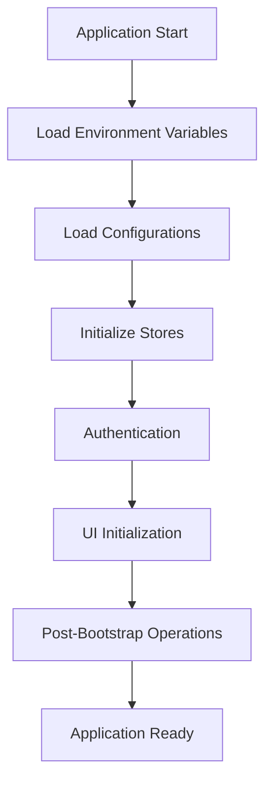
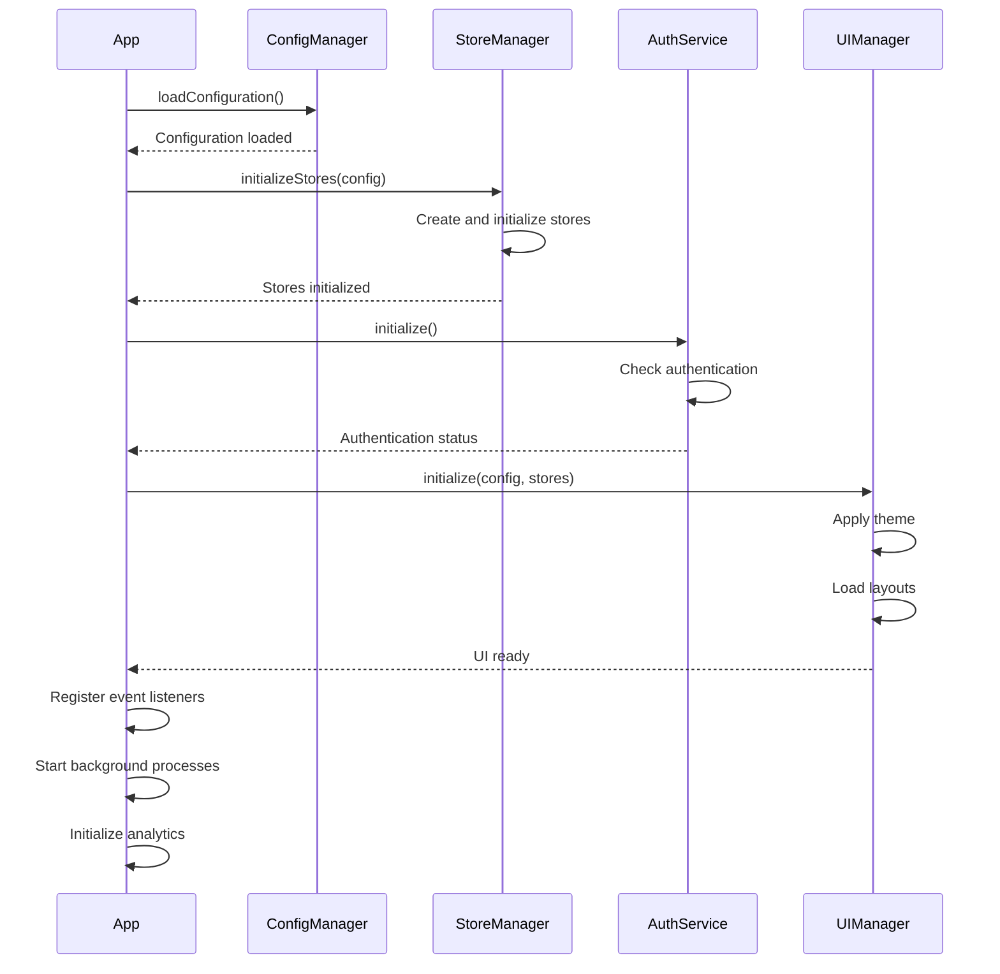
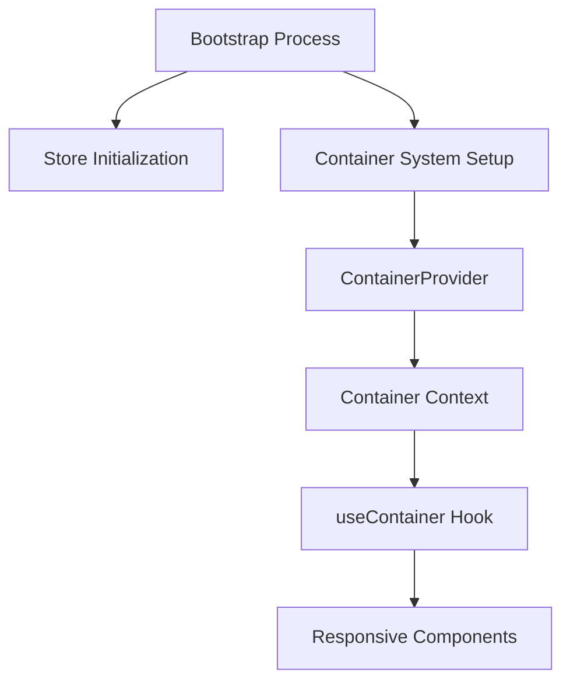
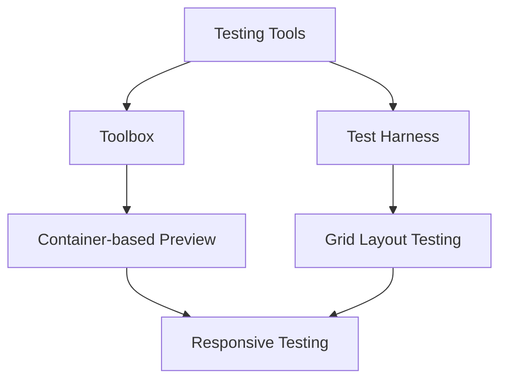

# Bootstrap Process Documentation

This document contains detailed documentation about the bootstrap process of the Responsive Tiles application. The bootstrap process is the sequence of operations that occurs when the application starts up, including configuration loading, store initialization, authentication, and rendering the initial UI.

## Available Documents

- [Configuration Loading](./configuration-loading.md) - Detailed documentation on how configurations are loaded and managed during the bootstrap process
- [Store Initialization](./store-initialization.md) - Documentation on how the application's state management stores are initialized
- [Error Handling](./error-handling.md) - Comprehensive guide to error handling during the bootstrap process
- [Container System](./container-system.md) - Detailed explanation of the container system and useContainer hook
- [Testing Tools](../testing/test-tools.md) - Documentation of the testing tools (Toolbox and Test Harness)

## Overview of the Bootstrap Process

The bootstrap process of the Responsive Tiles application follows these main steps:

1. **Application Initialization**
   - Load environment variables
   - Initialize error tracking and monitoring

2. **Configuration Loading**
   - Load default configurations
   - Apply environment-specific configurations
   - Load partner configurations (if applicable)
   - Load user preferences (if available)

3. **Store Initialization**
   - Initialize configuration store
   - Initialize API client and API store
   - Initialize authentication services
   - Initialize user store
   - Initialize other application stores

4. **Authentication**
   - Check for existing auth tokens
   - Validate tokens or redirect to login
   - Load user profile and preferences

5. **UI Initialization**
   - Initialize theme based on user preferences
   - Load layout configurations
   - Render initial UI components

6. **Post-Bootstrap Operations**
   - Start application background processes
   - Initialize analytics
   - Register event listeners

## Bootstrap Sequence Diagram

## Bootstrap Process Flow

The bootstrap process is designed to be efficient, resilient, and adaptable to different deployment environments. The configuration system allows for customization at various levels, from default application settings to user-specific preferences.

The store initialization follows a specific order to ensure that dependencies between stores are properly managed. For example, the API store must be initialized before stores that depend on API access.

Error handling during the bootstrap process is robust, with appropriate fallbacks and recovery mechanisms. If a non-critical part of the bootstrap process fails, the application will continue to function with reasonable defaults.

## Container System and Responsive Design

The Responsive Tiles application uses a container-based approach to responsive design, which is powered by the `useContainer` hook. This system allows components to adapt to their immediate container context rather than just the viewport size.

Refer to the [Container System](./container-system.md) documentation for more details on how the container system works and how to use the `useContainer` hook effectively.

## Testing Tools

The Responsive Tiles application includes specialized tools for testing and development:

1. **Toolbox** - A development environment for testing individual tiles or the entire application
2. **Test Harness** - A grid-based test environment for testing tile integration

These tools leverage the container system to simulate different container contexts for testing responsive behavior.

Refer to the [Testing Tools](../testing/test-tools.md) documentation for more details on how to use these tools effectively during development.

## Working with the Bootstrap Process

When extending the application with new features, it's important to understand where in the bootstrap process your code should be initialized. Consider the following guidelines:

- **Configuration Changes**: Modify the configuration system to add new configuration options. See the [Configuration Loading](./configuration-loading.md) document for details.

- **New Stores**: When adding new stores, ensure they are properly integrated into the store initialization sequence. See the [Store Initialization](./store-initialization.md) document for guidance.

- **UI Components**: Components that depend on configuration or store data should be designed to handle cases where that data is not yet available during the initial render.

- **Background Processes**: Long-running processes should be started only after the core bootstrap process is complete.

- **Container-Aware Components**: Components that need to be responsive to their container should use the `useContainer` hook. See the [Container System](./container-system.md) document for details.

## Testing the Bootstrap Process

The bootstrap process can be tested at various levels:

- **Unit tests** for individual components of the bootstrap process
- **Integration tests** for the interaction between components
- **End-to-end tests** for the complete bootstrap sequence
- **Container-based tests** for responsive behavior using the Toolbox and Test Harness

Mock implementations are provided for testing components in isolation, allowing you to simulate different bootstrap scenarios and edge cases.
