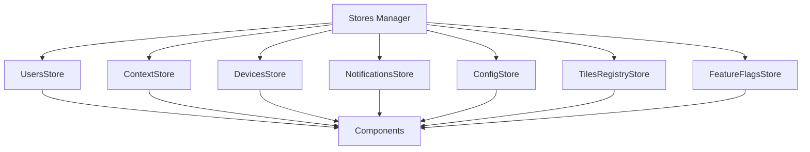
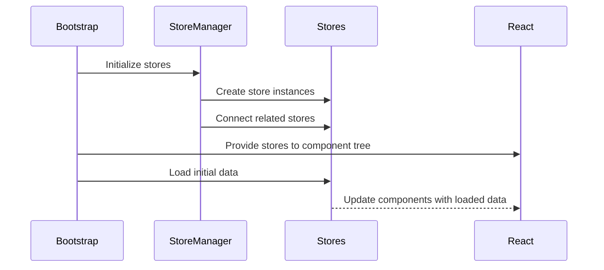

# State Management

This document outlines how the Responsive Tiles system manages application state during and after the bootstrap process.

## MobX Store Architecture

The Responsive Tiles application uses MobX for state management with a collection of specialized stores that manage different aspects of the application:



## Store Initialization

The stores are initialized during the bootstrap process:

```javascript
// Initialize MobX stores
const initStores = () => {
  // Configure MobX for optimal performance
  configure({
    enforceActions: 'never',
    useProxies: 'always',
    isolateGlobalState: true
  })
  
  // Create store instances
  const stores = {
    usersStore: new UsersStore(),
    contextStore: new ContextStore(),
    devicesStore: new DevicesStore(),
    notificationsStore: new NotificationsStore(),
    configStore: new ConfigStore(),
    tilesRegistryStore: new TilesRegistryStore(),
    featureFlagsStore: new FeatureFlagsStore()
  }
  
  // Connect stores that need references to each other
  Object.values(stores).forEach(store => {
    if (typeof store.connectStores === 'function') {
      store.connectStores(stores)
    }
  })
  
  return stores
}
```

## MobX Configuration

MobX is configured with these settings:

```javascript
configure({
  enforceActions: 'never',  // Allows state mutations outside actions for flexibility
  useProxies: 'always',     // Uses ES6 Proxies for better performance
  isolateGlobalState: true  // Isolates state to prevent conflicts with other MobX instances
})
```

## Store Connections

Stores can reference each other through a connection mechanism:

```javascript
// Example of a store that connects to other stores
class UsersStore {
  @observable currentUser = null
  @observable jwt = null
  
  connectStores(stores) {
    this.contextStore = stores.contextStore
    this.notificationsStore = stores.notificationsStore
  }
  
  @action
  setCurrentUser(user) {
    this.currentUser = user
    
    // Example of cross-store interaction
    if (user && this.contextStore) {
      this.contextStore.setUserContext(user.preferences)
    }
  }
}
```

## Store Provider

The stores are provided to React components using a provider pattern:

```javascript
// In the main application bootstrap
const stores = initStores()

// Provider component that injects stores into the React component tree
const App = () => (
  <Provider {...stores}>
    <Router>
      <AppRoutes />
    </Router>
  </Provider>
)
```

## Store Injection

Components can access stores using the `inject` and `observer` higher-order components:

```javascript
// Example component with store injection
@inject('usersStore', 'contextStore')
@observer
class UserProfile extends React.Component {
  componentDidMount() {
    const { usersStore } = this.props
    usersStore.loadUserProfile()
  }
  
  render() {
    const { usersStore, contextStore } = this.props
    const { currentUser } = usersStore
    const { theme } = contextStore.effectiveConfig
    
    if (!currentUser) return <LoadingIndicator />
    
    return (
      <ThemeProvider theme={theme}>
        <ProfileView user={currentUser} />
      </ThemeProvider>
    )
  }
}
```

## State Initialization Flow



## Reactive Updates

MobX provides reactive updates when state changes, automatically re-rendering components:

```javascript
// A store action that updates state
class TilesRegistryStore {
  @observable tiles = []
  
  @action
  registerTile(tileConfig) {
    this.tiles.push(tileConfig)
    
    // No explicit component updates needed - MobX handles this automatically
  }
}

// A component that reacts to state changes
@inject('tilesRegistryStore')
@observer
class TilesList extends React.Component {
  render() {
    const { tilesRegistryStore } = this.props
    const { tiles } = tilesRegistryStore
    
    return (
      <div>
        {tiles.map(tile => (
          <TileComponent key={tile.id} config={tile} />
        ))}
      </div>
    )
  }
}
```

## State Persistence

Some stores persist state to local storage or cookies for persistence across sessions:

```javascript
class PersistentStore {
  @observable savedData = null
  
  constructor() {
    // Load data from localStorage on initialization
    try {
      const saved = localStorage.getItem(this.storageKey)
      if (saved) {
        this.savedData = JSON.parse(saved)
      }
    } catch (e) {
      console.error('Failed to load persistent state:', e)
    }
  }
  
  @action
  updateData(newData) {
    this.savedData = newData
    
    // Persist to localStorage when data changes
    try {
      localStorage.setItem(this.storageKey, JSON.stringify(newData))
    } catch (e) {
      console.error('Failed to save persistent state:', e)
    }
  }
}
```

## State Reset

During logout or session changes, stores can be reset to their initial state:

```javascript
// Reset all stores to initial state
const resetStores = () => {
  Object.values(stores).forEach(store => {
    if (typeof store.reset === 'function') {
      store.reset()
    }
  })
}
``` 
