# Test Tools in Responsive Tiles

This document explains the testing tools available in the Responsive Tiles application, including their architecture, functionality, and usage patterns.

## Overview

The Responsive Tiles application includes specialized test tools that facilitate development, debugging, and testing of tile components in isolation and in various layouts. These tools are critical for ensuring the proper functioning of tiles across different environments and configurations.

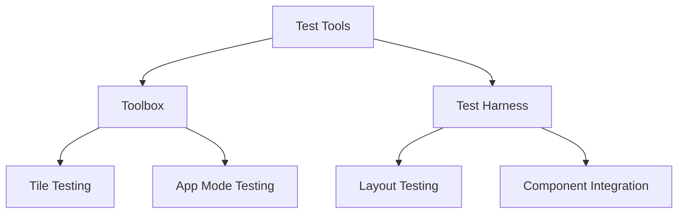

## Toolbox

The Toolbox is a specialized development environment that allows developers to test individual tiles or the entire application with various configurations and input data.

### Toolbox Architecture

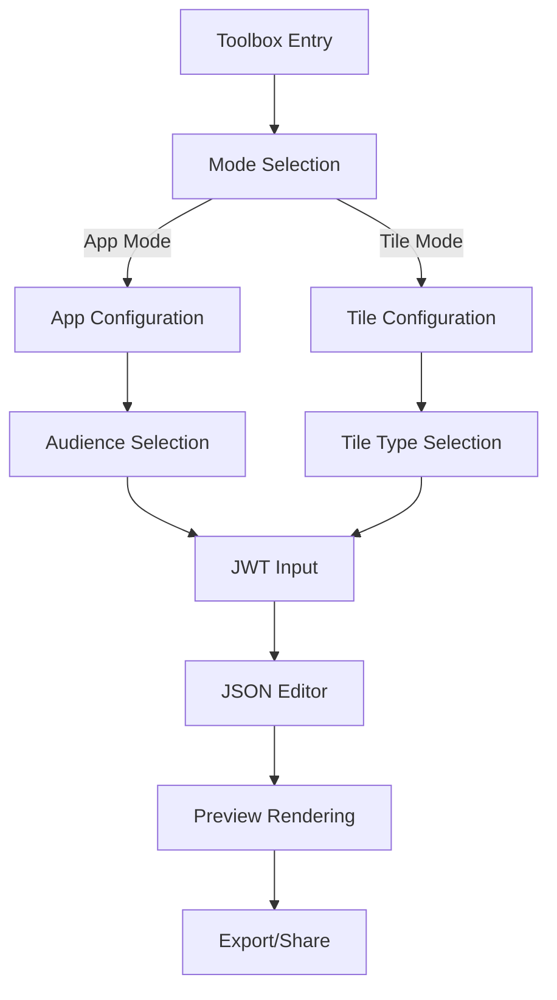

### Toolbox Components

The Toolbox consists of several key components:

1. **Header Controls** - For selecting modes and configurations
2. **JSON Editor** - For modifying the tile or app configuration
3. **Preview Area** - An iframe that renders the selected tile or application
4. **Export Functionality** - For sharing configurations or downloading HTML

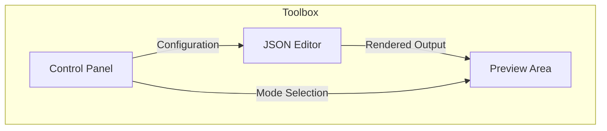

### Toolbox Implementation

The Toolbox is implemented in `toolbox.html` and its associated JavaScript. The HTML structure includes:

```html
<div class="logo">
  <!-- Logo content -->
</div>
<div id="controls" class="controls">
  <div class="header">
    <h1>Tiles Toolbox</h1>
    <!-- Mode selection, view selection, tile configuration, etc. -->
  </div>
  <div id="jsoneditor"></div>
  <!-- Collapse control -->
</div>
<div id="iframe-wrapper-border" class="iframe-wrapper-border">
  <div id="iframe-wrapper">
    <!-- Tile or app rendering area -->
  </div>
</div>
```

### User Interaction Flow

The interaction flow in the Toolbox follows this sequence:

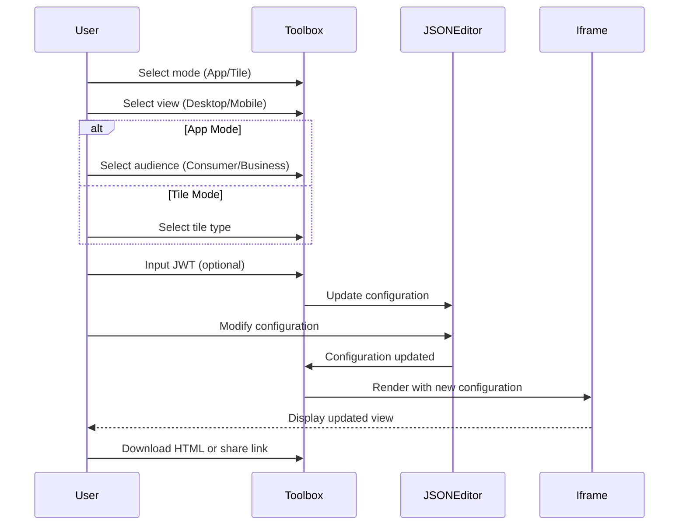

### Toolbox Event Handlers

The Toolbox includes several event handlers that manage user interactions:

1. **Mode Change** - Switches between app and tile modes
   ```javascript
   function onModeChange(input) {
     // Update mode and reconfigure UI
   }
   ```

2. **View Change** - Switches between desktop and mobile views
   ```javascript
   function onViewChange(input) {
     // Update view and resize iframe
   }
   ```

3. **Tile Change** - Changes the current tile being tested
   ```javascript
   function onTileChange(select) {
     // Update tile type and reload configuration
   }
   ```

4. **JWT Input** - Handles JWT token for authentication
   ```javascript
   function onJWTChange(textarea) {
     // Update JWT and reload with user data
   }
   ```

5. **Share/Export** - Generates shareable links or downloads HTML
   ```javascript
   function onDownloadClick(event) {
     // Export current configuration as HTML
   }
   ```

## Test Harness

The Test Harness provides a more comprehensive testing environment with grid layouts and multiple tile displays, allowing developers to test how tiles interact within a layout similar to the production environment.

### Test Harness Architecture

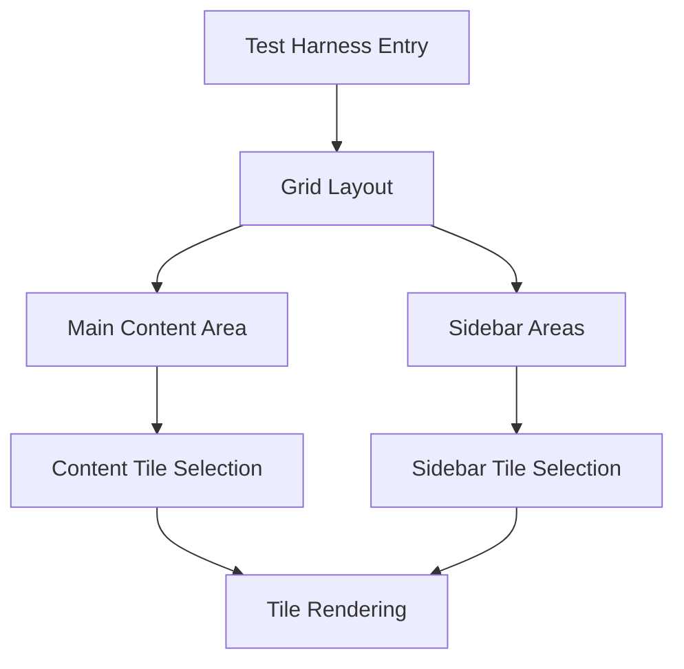

### Test Harness Components

The Test Harness consists of these main components:

1. **Header Controls** - For selecting tiles to display in different areas
2. **Main Content** - Primary area for displaying a selected tile
3. **Sidebar** - Secondary areas for displaying additional tiles
4. **Grid Layout** - CSS Grid layout for organizing the components

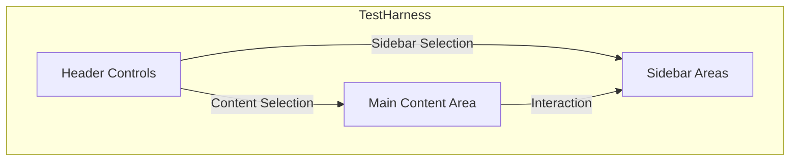

### Test Harness Implementation

The Test Harness is implemented in `test-harness.html` with a CSS Grid layout:

```html
<div class="site">
  <header class="masthead">
    <h2 class="site-title">Tiles Test Harness</h2>
    <!-- Tile selection controls -->
  </header>

  <main id="content" class="main-content tiles-container">
    <div id="content-tile"></div>
  </main>
  <aside class="sidebar">
    <div id="sidebar-tile" class="tile-top tiles-container"></div>
    <div id="sidebar-tile-bottom" class="tile-bottom tiles-container"></div>
  </aside>

  <footer class="colophon grid">
    <aside>Footer</aside>
  </footer>
</div>
```

### Test Harness CSS Grid

The Test Harness uses CSS Grid for responsive layouts:

```css
@media screen and (min-width: 600px) {
  @supports (display: grid) {
    .site {
      display: grid;
      grid-template-columns: 1fr repeat(6, minmax(auto, 10em)) 1fr;
      grid-template-rows: minmax(1em, auto) 1fr auto minmax(1em, auto);
    }

    .masthead,
    .colophon {
      grid-column: span 8;
    }

    .main-content {
      grid-column: 2/6;
    }

    .sidebar {
      grid-column: 6/8;
    }
  }
}
```

### Test Harness Initialization

The Test Harness initializes tiles through the `geezeo.ready` callback:

```javascript
geezeo.ready(function() {
  window.createContent(document.getElementById('content-tile'));
  window.createSidebar(document.getElementById('sidebar-tile'));
  window.createSidebarBottom(document.getElementById('sidebar-tile-bottom'));
});
```

### Tile Selection Flow

The tile selection flow in the Test Harness follows this pattern:

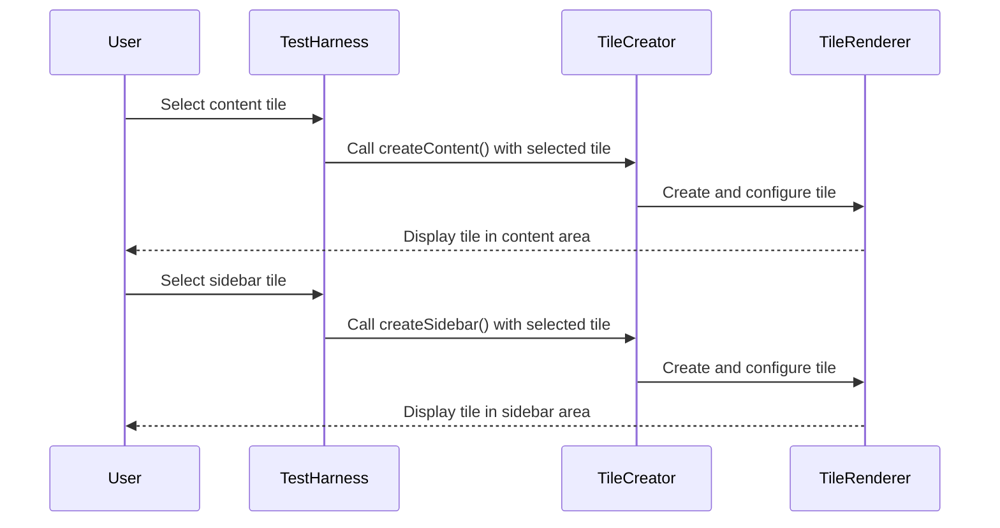

## Container Context System

Both the Toolbox and Test Harness make use of a container-based approach for rendering tiles, which is powered by MobX's `contextStore` and class-based React components.

### Container Architecture

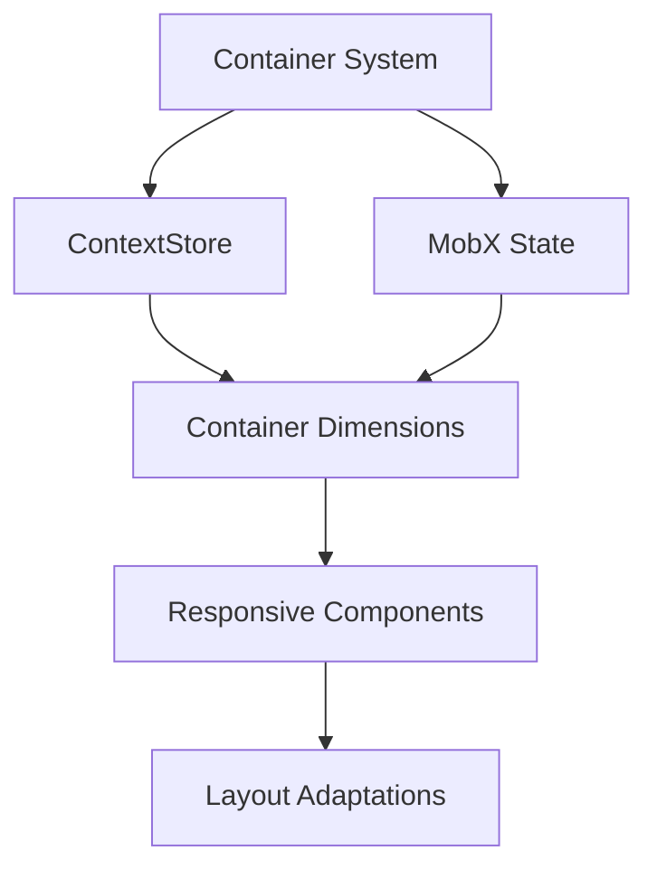

### Class-Based Container Awareness

The responsive tiles system uses MobX's `inject` and `observer` pattern to provide class components with access to their container context:

```javascript
import React from 'react';
import PropTypes from 'prop-types';
import { inject, observer } from 'mobx-react';
import { withStyles } from '@material-ui/core/styles';

class ResponsiveTile extends React.Component {
  static propTypes = {
    contextStore: PropTypes.object.isRequired,
    classes: PropTypes.object.isRequired
  };
  
  render() {
    const { contextStore, classes } = this.props;
    const { width, isMobile } = contextStore;
    
    // Adapt component based on container dimensions
    const tileStyle = {
      fontSize: isMobile ? '12px' : '16px',
      padding: width < 300 ? '8px' : '16px'
    };
    
    return (
      <div className={classes.root} style={tileStyle}>
        <h2>Responsive Tile</h2>
        <p>Container width: {width}px</p>
        <p>Is Mobile: {isMobile.toString()}</p>
      </div>
    );
  }
}

// Connect component to contextStore
export default inject('contextStore')(
  withStyles(styles)(
    observer(ResponsiveTile)
  )
);
```

### Container Context Properties

The ContextStore provides components with:

1. **Dimensions** - Width and height of the container
2. **Breakpoints** - Current responsive breakpoints
3. **Device Information** - Device type (mobile, tablet, desktop)
4. **Theme Settings** - Container-specific theme settings

```javascript
// Partial view of contextStore properties
class ContextStore {
  @observable width;
  @observable height;
  @observable scrollTop;
  @observable offsetTop;
  
  @computed get isMobile() {
    return this.width < 600;
  }
  
  @computed get isTablet() {
    return this.width >= 600 && this.width < 960;
  }
  
  @computed get isDesktop() {
    return this.width >= 960;
  }
  
  @computed get contentHeight() {
    return this.height - (this.config.hasAppBar ? 64 : 0);
  }
}
```

### Container Provider Implementation

Class components receive container context through the MobX provider pattern:

```javascript
import React from 'react';
import { Provider } from 'mobx-react';
import { ContextStore } from './stores/contextStore';

class ContainerProvider extends React.Component {
  constructor(props) {
    super(props);
    this.contextStore = new ContextStore();
    
    // Initialize container dimensions
    this.containerRef = React.createRef();
  }
  
  componentDidMount() {
    // Measure container and update context
    this.updateDimensions();
    
    // Set up resize observer
    this.resizeObserver = new ResizeObserver(this.updateDimensions);
    if (this.containerRef.current) {
      this.resizeObserver.observe(this.containerRef.current);
    }
  }
  
  componentWillUnmount() {
    // Clean up observer
    if (this.resizeObserver) {
      this.resizeObserver.disconnect();
    }
  }
  
  updateDimensions = () => {
    if (this.containerRef.current) {
      const { width, height } = this.containerRef.current.getBoundingClientRect();
      this.contextStore.setDimensions(width, height);
    }
  };
  
  render() {
    return (
      <Provider contextStore={this.contextStore}>
        <div ref={this.containerRef} className="tiles-container">
          {this.props.children}
        </div>
      </Provider>
    );
  }
}
```

### Using the Container Context

Class components use the injected contextStore to adapt to their container:

```javascript
// Example tile component using container context
@inject('contextStore')
@observer
class AccountsTile extends React.Component {
  _getContainerHeight() {
    const { contextStore } = this.props;
    const { contentHeight } = contextStore;
    const headerHeight = 48;
    
    return contentHeight - headerHeight;
  }
  
  render() {
    const { contextStore, classes } = this.props;
    const { isMobile } = contextStore;
    const containerHeight = this._getContainerHeight();
    
    return (
      <div className={classes.root} style={{ height: containerHeight }}>
        {isMobile ? (
          <MobileAccountsView />
        ) : (
          <DesktopAccountsView />
        )}
      </div>
    );
  }
}
```

### Container Resizing and Events

Container resize events are handled by the ContextStore and propagated to components through MobX's observer pattern:

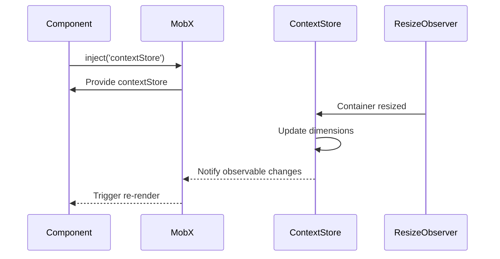

### Container and Context Store Integration

The container system integrates with the overall MobX state management:

```mermaid
graph TD
    A[Class Component] --> B[inject('contextStore')]
    A --> C[inject('otherStore')]
    B --> D[Container Awareness]
    C --> E[Application State]
    D --> F[Responsive UI]
    E --> F
```

## Testing with Toolbox and Test Harness

### Test Cases Implementation

Test cases can be implemented in both Toolbox and Test Harness:

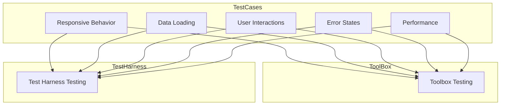

### Testing Workflow

The typical testing workflow involves:

1. Use Toolbox for isolated component testing and rapid iteration
2. Use Test Harness for integration testing and layout validation
3. Write automated tests based on discoveries from manual testing

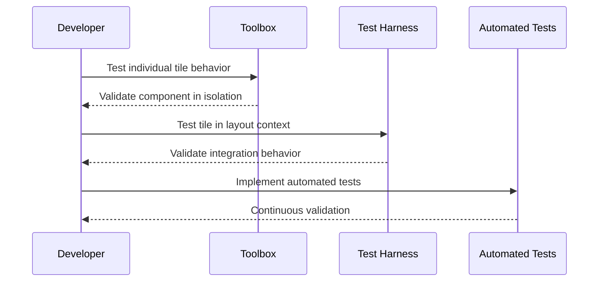

## Best Practices

When working with Toolbox and Test Harness, follow these best practices:

1. **Test Responsive Behavior** - Use both desktop and mobile views to verify responsive layouts
2. **Test with Real Data** - Use realistic data sets or JWT tokens to simulate production environments
3. **Test Edge Cases** - Verify behavior with minimal, empty, or excessive data
4. **Test Interactions** - Ensure all user interactions work as expected
5. **Test Performance** - Monitor rendering performance, especially with large data sets
6. **Document Test Cases** - Record successful test configurations for regression testing
7. **Use MobX Properly** - Ensure components are wrapped with `observer` to react to container changes

## Integration with CI/CD

The test tools can be integrated into CI/CD pipelines for automated testing:

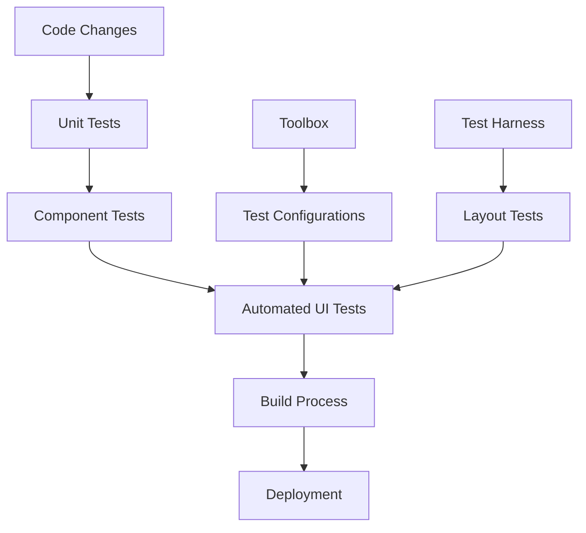

## Implementation Examples

### Container-Aware Class Component

```javascript
import React from 'react';
import PropTypes from 'prop-types';
import { inject, observer } from 'mobx-react';
import { withStyles } from '@material-ui/core/styles';

const styles = theme => ({
  root: {
    padding: theme.spacing(2)
  },
  chart: {
    height: '100%',
    width: '100%'
  }
});

class ResponsiveDataTile extends React.Component {
  static propTypes = {
    contextStore: PropTypes.object.isRequired,
    classes: PropTypes.object.isRequired,
    data: PropTypes.array.isRequired
  };
  
  _getChartConfig() {
    const { contextStore } = this.props;
    const { width, isMobile } = contextStore;
    
    // Create chart configuration based on container
    return {
      width: width,
      height: this._getContainerHeight(),
      fontSize: isMobile ? 10 : 14,
      showLegend: !isMobile,
      showGrid: width >= 300,
      animations: width >= 500 // Disable animations on small screens for performance
    };
  }
  
  _getContainerHeight() {
    const { contextStore } = this.props;
    const { contentHeight } = contextStore;
    return contentHeight - 40; // Subtract header height
  }
  
  render() {
    const { classes, data } = this.props;
    const chartConfig = this._getChartConfig();
    
    return (
      <div className={classes.root}>
        <div className={classes.chart}>
          <LineChart 
            data={data} 
            config={chartConfig} 
          />
        </div>
      </div>
    );
  }
}

export default inject('contextStore')(
  withStyles(styles)(
    observer(ResponsiveDataTile)
  )
);
```

### Container-Aware Layout Component

```javascript
import React from 'react';
import PropTypes from 'prop-types';
import { inject, observer } from 'mobx-react';
import { withStyles } from '@material-ui/core/styles';
import classNames from 'classnames';

const styles = theme => ({
  container: {
    display: 'flex',
    flexDirection: 'column',
    height: '100%'
  },
  row: {
    display: 'flex',
    flexDirection: 'row'
  },
  column: {
    display: 'flex',
    flexDirection: 'column'
  }
});

class ResponsiveLayout extends React.Component {
  static propTypes = {
    contextStore: PropTypes.object.isRequired,
    classes: PropTypes.object.isRequired,
    children: PropTypes.node.isRequired
  };
  
  render() {
    const { contextStore, classes, children } = this.props;
    const { isMobile } = contextStore;
    
    return (
      <div className={classNames(
        classes.container,
        isMobile ? classes.column : classes.row
      )}>
        {children}
      </div>
    );
  }
}

export default inject('contextStore')(
  withStyles(styles)(
    observer(ResponsiveLayout)
  )
);
```

## Conclusion

The Toolbox and Test Harness provide powerful tools for developing and testing responsive tiles. Combined with the container context system provided by the ContextStore and MobX, they enable the creation of truly responsive class components that adapt to their container context, rather than just the viewport. This approach allows tiles to be composed into complex layouts while maintaining appropriate responsive behavior regardless of their placement. 
