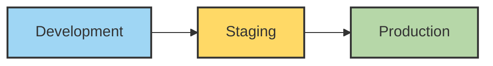

# Environment Configuration

This document details the environment configuration setup for the Responsive Tiles application across different deployment environments.

## Environment Overview

Responsive Tiles is deployed to three distinct environments, each serving a different purpose in the development lifecycle:



## Environment Variables

Responsive Tiles uses environment variables to configure behaviors specific to each environment. These variables are set during the build process and injected into the application.

### Core Environment Variables

| Variable | Description | Example |
|----------|-------------|---------|
| `NODE_ENV` | Node environment | `development`, `production` |
| `ENV` | Application environment | `development`, `staging`, `production` |
| `DEPLOY_FOLDER` | Deployment target folder | `qa`, `staging`, `production` |
| `BUCKET_SUFFIX` | GCP bucket suffix | `zwwst63n`, `nyjcof9v`, `gvf7byup` |
| `VERSION` | Application version | `1.2.3` |
| `GA_TRACKING_ID` | Google Analytics ID | `UA-123456789-1` |

### Environment-Specific Configurations

#### Development Environment

```json
{
  "ENV": "development",
  "DEPLOY_FOLDER": "qa",
  "BUCKET_SUFFIX": "zwwst63n",
  "API_URL": "https://dev-api.jackhenry.com",
  "FEATURE_FLAGS": {
    "enableNewDashboard": true,
    "enableExperimentalFeatures": true,
    "debugMode": true
  }
}
```

#### Staging Environment

```json
{
  "ENV": "staging",
  "DEPLOY_FOLDER": "staging",
  "BUCKET_SUFFIX": "nyjcof9v",
  "API_URL": "https://staging-api.jackhenry.com",
  "FEATURE_FLAGS": {
    "enableNewDashboard": true,
    "enableExperimentalFeatures": true,
    "debugMode": false
  }
}
```

#### Production Environment

```json
{
  "ENV": "production",
  "DEPLOY_FOLDER": "production",
  "BUCKET_SUFFIX": "gvf7byup",
  "API_URL": "https://api.jackhenry.com",
  "FEATURE_FLAGS": {
    "enableNewDashboard": false,
    "enableExperimentalFeatures": false,
    "debugMode": false
  }
}
```

## Configuration Injection

Environment configurations are injected into the application through different methods:

### 1. Build-Time Configuration

During the build process, environment variables are injected into the application using Webpack's DefinePlugin:

```javascript
// webpack.config.js
const webpack = require('webpack');
require('dotenv').config({ path: `.env.${process.env.ENV}` });

module.exports = {
  // ...
  plugins: [
    new webpack.DefinePlugin({
      'process.env': {
        NODE_ENV: JSON.stringify(process.env.NODE_ENV),
        ENV: JSON.stringify(process.env.ENV),
        DEPLOY_FOLDER: JSON.stringify(process.env.DEPLOY_FOLDER),
        BUCKET_SUFFIX: JSON.stringify(process.env.BUCKET_SUFFIX),
        VERSION: JSON.stringify(process.env.VERSION),
        GA_TRACKING_ID: JSON.stringify(process.env.GA_TRACKING_ID)
      }
    })
  ]
};
```

### 2. Environment-Specific .env Files

Each environment has its own `.env` file that contains environment-specific configurations:

```
# .env.development
ENV=development
DEPLOY_FOLDER=qa
BUCKET_SUFFIX=zwwst63n
API_URL=https://dev-api.jackhenry.com
GA_TRACKING_ID=UA-123456789-1
```

### 3. Runtime Configuration

Some configurations are loaded at runtime from the server, enabling dynamic changes without rebuilding the application:

```javascript
// Fetch runtime configuration
async function fetchRuntimeConfig() {
  const response = await fetch('/api/runtime-config');
  return response.json();
}

// Use runtime configuration
async function initializeApp() {
  const runtimeConfig = await fetchRuntimeConfig();
  
  // Merge with built-in config
  const config = {
    ...process.env,
    ...runtimeConfig
  };
  
  // Initialize application with merged config
  initApp(config);
}
```

## Google Cloud Platform Configuration

Responsive Tiles is deployed to Google Cloud Platform (GCP) buckets. Each environment has its own dedicated bucket.

### Bucket Structure

```
gs://[environment]-digital-gzo-geezeo-tiles-[bucket_suffix]/
├── [deploy_folder]/
│   ├── v2/
│   │   ├── index.html
│   │   ├── tiles.js
│   │   ├── tiles.css
│   │   └── ...
│   └── ...
└── ...
```

### Bucket Configuration

| Environment | GCP Project ID | Bucket Name |
|-------------|---------------|-------------|
| Development | `dev-digital-banno` | `dev-digital-gzo-geezeo-tiles-zwwst63n` |
| Staging | `stage-digital-banno` | `stage-digital-gzo-geezeo-tiles-nyjcof9v` |
| Production | `prod-digital-banno` | `prod-digital-gzo-geezeo-tiles-gvf7byup` |

## Access Control

Access to different environments is controlled through Google Cloud IAM:

| Role | Development | Staging | Production |
|------|------------|---------|------------|
| Developers | Read/Write | Read | No Access |
| QA | Read | Read/Write | No Access |
| DevOps | Read/Write | Read/Write | Read/Write |
| Release Managers | Read | Read/Write | Read/Write |

## CI/CD Environment Variables

The CI/CD pipeline (GitHub Actions) uses these environment variables for deployment:

```yaml
# GitHub Actions workflow environment variables
env:
  NODE_VERSION: '16'
  PROJECT_NAME: 'tiles'
  SERVICE_ACCOUNT_NAME: 'geezeo-tiles'
```

### Environment-Specific CI/CD Variables

#### Development

```yaml
env_vars: >
  DEPLOY_FOLDER:'qa',
  ENV:'development',
  BUCKET_SUFFIX:'zwwst63n',
  DEPLOY_BUCKET_SUFFIX:'zwwst63n',
  NODE_ENV:'production',
  VERSION:'${{ needs.tiles-ci-test.outputs.new_version }}'
gcp_bucket_project_id: dev-digital-banno
gcp_hosting_bucket: dev-digital-gzo-geezeo-tiles-zwwst63n
gcp_project_id: dev-digital-banno
```

#### Staging

```yaml
env_vars: >
  DEPLOY_FOLDER:'staging',
  ENV:'staging',
  BUCKET_SUFFIX:'nyjcof9v',
  DEPLOY_BUCKET_SUFFIX:'nyjcof9v',
  NODE_ENV:'production',
  VERSION:'${{ needs.tiles-ci-test.outputs.new_version }}'
gcp_bucket_project_id: stage-digital-banno
gcp_hosting_bucket: stage-digital-gzo-geezeo-tiles-nyjcof9v
gcp_project_id: stage-digital-banno
```

#### Production

```yaml
env_vars: >
  DEPLOY_FOLDER:'production',
  ENV:'production',
  BUCKET_SUFFIX:'gvf7byup',
  DEPLOY_BUCKET_SUFFIX:'gvf7byup',
  NODE_ENV:'production',
  VERSION:'${{ needs.tiles-ci-test.outputs.new_version }}'
gcp_bucket_project_id: prod-digital-banno
gcp_hosting_bucket: prod-digital-gzo-geezeo-tiles-gvf7byup
gcp_project_id: prod-digital-banno
```

## Environment Feature Flags

Feature flags are used to enable or disable features in different environments:

```javascript
// src/config/featureFlags.js
export const featureFlags = {
  development: {
    enableNewDashboard: true,
    enableExperimentalFeatures: true,
    debugMode: true
  },
  staging: {
    enableNewDashboard: true,
    enableExperimentalFeatures: true,
    debugMode: false
  },
  production: {
    enableNewDashboard: false,
    enableExperimentalFeatures: false,
    debugMode: false
  }
};

// Usage
const currentEnv = process.env.ENV || 'development';
const flags = featureFlags[currentEnv];

if (flags.enableNewDashboard) {
  // Initialize new dashboard
}
```

## Local Development Environment

For local development, developers can use `.env.local` to override environment variables:

```
# .env.local
ENV=development
DEPLOY_FOLDER=qa
API_URL=http://localhost:3000
MOCK_API=true
```

To use a specific environment configuration locally:

```bash
# Start with development config
ENV=development npm start

# Start with staging config
ENV=staging npm start

# Start with production config
ENV=production npm start
```

## Troubleshooting Environment Issues

### Common Issues and Solutions

1. **Incorrect Environment Variables**
   - Check `.env` files for proper configuration
   - Verify environment variables in CI/CD workflow
   
2. **Access Denied to GCP Resources**
   - Verify IAM permissions
   - Check service account credentials
   
3. **Feature Not Available in Environment**
   - Verify feature flag configuration
   - Check environment-specific configuration

### Environment Validation

Run the environment validation script to verify configuration:

```bash
npm run validate-env
```

This script checks:
- Required environment variables are set
- GCP bucket access
- API endpoint availability
- Feature flag configuration

## Conclusion

The environment configuration system for Responsive Tiles enables consistent deployments across development, staging, and production environments. By using environment variables, feature flags, and runtime configuration, the application can be configured appropriately for each stage of the development lifecycle. 
