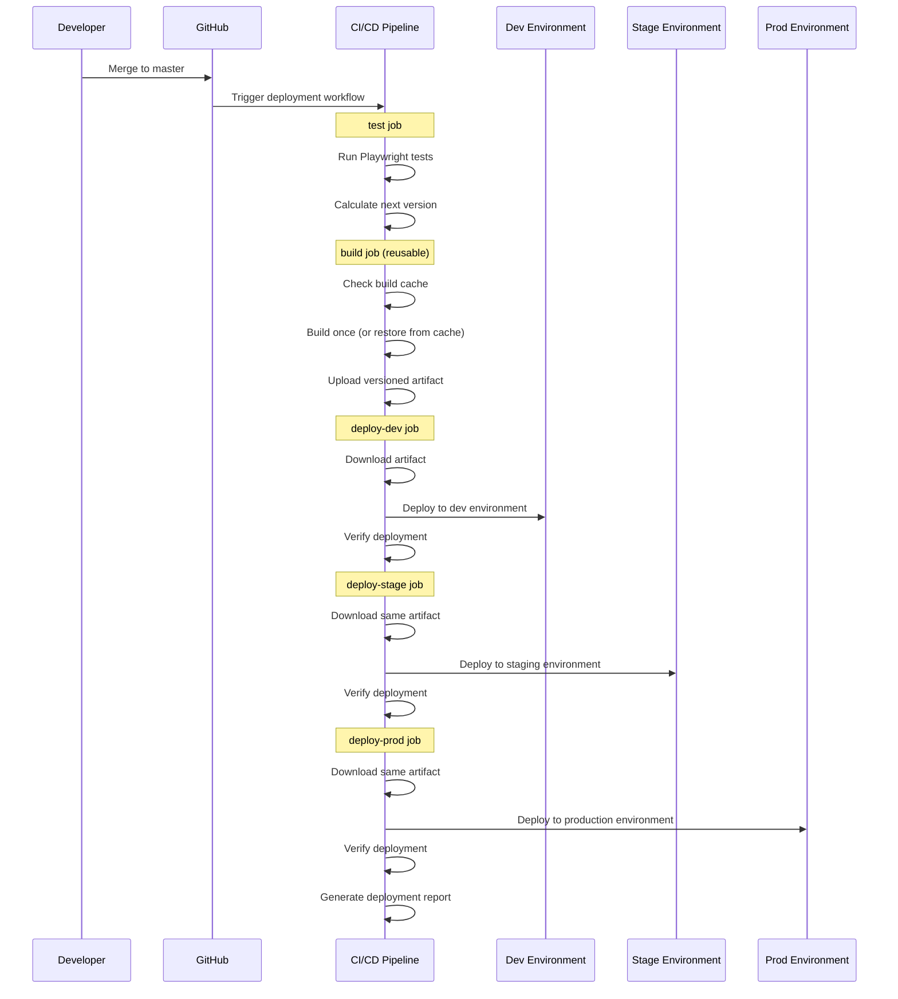

# Release Process

This document outlines the release process for the Responsive Tiles application, from feature development to production deployment.

## Release Lifecycle

The Responsive Tiles release process follows a trunk-based development approach with automated promotion through environments.

```mermaid
graph LR
    A[Feature Development] --> B[Pull Request]
    B --> C[Code Review]
    C --> D[Merge to Master]
    D --> E[Automated CI/CD Pipeline]
    E --> F[Dev Deployment]
    F --> G[Stage Deployment]
    G --> H[Production Deployment]
    H --> I[Post-Release Monitoring]
    
    style D fill:#d0e0ff,stroke:#333,stroke-width:2px
    style F fill:#ffd966,stroke:#333,stroke-width:2px
    style H fill:#b6d7a8,stroke:#333,stroke-width:2px
```



## Versioning Strategy

Responsive Tiles follows [Semantic Versioning (SemVer)](https://semver.org/) for version numbering:

```
MAJOR.MINOR.PATCH
```

- **MAJOR**: Incompatible API changes
- **MINOR**: Backward-compatible functionality
- **PATCH**: Backward-compatible bug fixes

Examples:
- `1.0.0`: Initial stable release
- `1.1.0`: New features added
- `1.1.1`: Bug fixes to the 1.1.0 release

## Development Process

### Feature Branches

1. Each feature is developed in a dedicated feature branch:
   ```
   feature/add-new-tile-type
   ```
2. Code is written, unit tested, and documented
3. Developer creates a pull request (PR) to the `master` branch

### Pull Request Process

1. Code review by at least two team members
2. Automated tests must pass in the PR check
3. Linting and code quality checks must pass
4. Documentation must be updated

## Continuous Integration and Deployment

The CI/CD process is defined in several workflow files:

### Workflow Implementation (WEB-4347)
1. **pr-validation.yml**: Runs tests and validations on PR creation/update
2. **reusable-build.yml**: Reusable workflow for building the application once
3. **main-deployment.yml**: Main deployment workflow using Build-Once-Deploy-Many pattern

### Automated Deployment Flow

When code is merged to the `master` branch, it triggers the following automated workflow:



### Version Calculation

The version is automatically calculated by the CI process:
- The `test` job determines the next version
- The version is passed to subsequent build and deployment jobs
- The version is included in the artifact name and environment variables

## Deployment Environments

| Environment | GCP Bucket | Purpose |
|-------------|------------|---------|
| Development | dev-digital-gzo-geezeo-tiles-zwwst63n | Development testing |
| Staging | stage-digital-gzo-geezeo-tiles-nyjcof9v | Pre-production testing |
| Production | prod-digital-gzo-geezeo-tiles-gvf7byup | Live user-facing environment |

### Environment Variables

Each environment uses specific configuration variables:

#### Development

```yaml
DEPLOY_FOLDER: 'qa'
ENV: 'development'
BUCKET_SUFFIX: 'zwwst63n'
DEPLOY_BUCKET_SUFFIX: 'zwwst63n'
NODE_ENV: 'production'
VERSION: '[calculated from CI]'
```

#### Staging

```yaml
DEPLOY_FOLDER: 'staging'
ENV: 'staging'
BUCKET_SUFFIX: 'nyjcof9v'
DEPLOY_BUCKET_SUFFIX: 'nyjcof9v'
NODE_ENV: 'production'
VERSION: '[calculated from CI]'
```

#### Production

```yaml
DEPLOY_FOLDER: 'production'
ENV: 'production'
BUCKET_SUFFIX: 'gvf7byup'
DEPLOY_BUCKET_SUFFIX: 'gvf7byup'
NODE_ENV: 'production'
VERSION: '[calculated from CI]'
```

## Testing Throughout the Pipeline

### PR Validation Tests

The `pr-validation.yml` workflow runs when a PR is created or updated:
- Automated Playwright tests (matrix of browsers)
- Linting and code quality checks
- Type checking
- Build validation
- Results are posted directly as PR comments

### Continuous Integration Tests

The `test` job in the main-deployment workflow includes:
- Playwright tests
- Calculation of the next version number

### Environment Verification Tests

After deployment to each environment, verification tests ensure proper functionality:
- File existence checks
- Artifact validation before deployment
- GCP bucket verification
- Deployment report generation

## Hotfix Process

For urgent fixes to production:

1. Create a hotfix branch from `master`:
   ```bash
   git checkout master
   git pull
   git checkout -b hotfix/critical-fix
   ```

2. Make the necessary changes and create a PR back to `master`

3. After review, merge to `master` to trigger the full deployment pipeline

4. The fix will be automatically deployed through all environments

## Post-Release Monitoring

After production deployment:

1. Monitor application performance metrics
2. Monitor error rates and logs
3. Monitor user feedback
4. Be prepared to implement hotfixes if issues are discovered

## Rollback Procedure

If issues are discovered in production:

1. Identify the severity and impact of the issue
2. For critical issues, consider deploying a previous version:
   - Create a PR reverting the problematic changes
   - Merge to `master` to trigger the deployment pipeline
   - Monitor the rollback deployment through all environments

3. For less critical issues, create a hotfix as described above

## Release Coordination

### Communication Plan

1. Development team is notified of deployments via GitHub notifications
2. End users are notified of significant updates via:
   - Release notes
   - In-app notifications (for major features)
   - Email communications (for major releases)

### Release Documentation

For each significant release:

1. Update user documentation if necessary
2. Document API changes (if applicable)
3. Update internal documentation
4. Create release notes highlighting new features and changes

## Integration with Other Documentation

This release process integrates with:
- [CI/CD Workflow](./ci-cd-workflow.md) for detailed CI/CD information
- [Environment Configuration](./environment-config.md) for environment-specific settings

## Conclusion

The Responsive Tiles release process follows a trunk-based development model with automated promotion through environments, ensuring consistent and reliable deployments while minimizing manual intervention. 