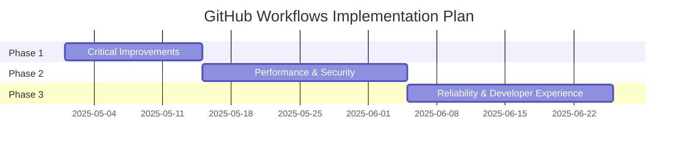
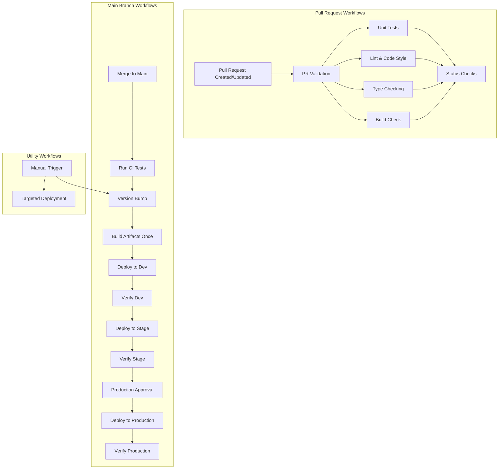
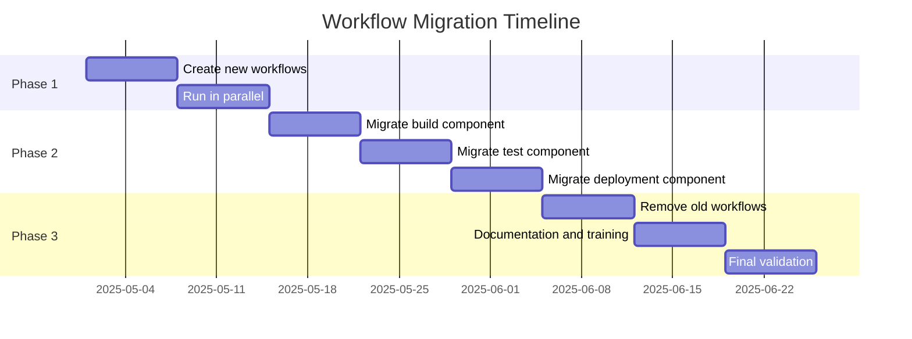

# GitHub Workflows Implementation Plan

This document provides a detailed implementation plan for improving the GitHub Workflows in the Responsive Tiles project based on the analysis in `workflow-analysis.md`.

## Table of Contents

1. [Overview](#overview)
2. [Target Workflow Architecture](#target-workflow-architecture)
3. [Phase 1: Critical Improvements](#phase-1-critical-improvements)
4. [Phase 2: Performance & Security](#phase-2-performance--security)
5. [Phase 3: Reliability & Developer Experience](#phase-3-reliability--developer-experience)
6. [Workflow File Examples](#workflow-file-examples)
7. [Migration Strategy](#migration-strategy)
8. [Testing and Validation](#testing-and-validation)

## Overview

This implementation plan outlines a phased approach to modernizing the GitHub Workflows for the Responsive Tiles project. Each phase introduces specific improvements that build upon the previous phase, ensuring that critical workflows remain functional throughout the migration.



## Target Workflow Architecture

The target architecture creates a modular, extensible system of workflows that separate concerns while maintaining efficient execution:



## Phase 1: Critical Improvements

Duration: 2 weeks

### Goals:
- Implement caching to improve build performance
- Create a PR validation workflow for early feedback
- Centralize redundant code into reusable components

### Deliverables:

1. **Implement PR validation workflow**
   - Create `.github/workflows/pr-validation.yml`
   - Run tests, linting, and build checks
   - Report status directly on PR

2. **Add caching to existing workflows**
   - Modify all workflows to cache node_modules
   - Implement build artifact caching

3. **Create reusable workflow components**
   - Extract common build logic into reusable component
   - Create common testing component

## Phase 2: Performance & Security

Duration: 3 weeks

### Goals:
- Restructure build process (build once, deploy many)
- Implement CODEOWNERS and branch protection
- Create comprehensive status checks
- Standardize workflow parameters and environment configurations

### Deliverables:

1. **Implement "build once" strategy**
   - Create a composite build job that outputs a single artifact
   - Modify deployment workflows to use this artifact
   - Refer to [Workflow Parameters Documentation](workflow-parameters.md) for standardized environment configuration

2. **Enhance branch protection**
   - Create `.github/CODEOWNERS` file
   - Configure branch protection rules

3. **Improve status checks**
   - Add detailed test reporting
   - Create unified status check reporting

## Phase 3: Reliability & Developer Experience

Duration: 3 weeks

### Goals:
- Implement automated rollback mechanism
- Add health checks for deployments
- Create enhanced deployment notifications
- Implement PR comment automation

### Deliverables:

1. **Create rollback mechanism**
   - Develop automated health check verification
   - Implement rollback logic for failed deployments

2. **Implement health checks**
   - Add post-deployment validation tests
   - Create health check monitoring

3. **Enhance notifications**
   - Implement detailed Slack notifications
   - Add deployment status reporting

4. **Add PR automation**
   - Create automated PR comments with feedback
   - Implement PR labeling and categorization

## Workflow File Examples

Here are examples of the key workflow files that will be created or modified:

### 1. PR Validation Workflow

```yaml
# .github/workflows/pr-validation.yml
name: PR Validation

on:
  pull_request:
    branches: [master]
    types: [opened, synchronize, reopened]

permissions:
  contents: read
  pull-requests: write
  checks: write

jobs:
  validation:
    name: Validation
    runs-on: ubuntu-latest
    steps:
      - name: Checkout
        uses: actions/checkout@v4

      - name: Set up Node
        uses: actions/setup-node@v4
        with:
          node-version: 2.53.1
          cache: 'npm'
          
      - name: Install dependencies
        run: npm ci
        
      - name: Lint
        run: npm run lint
        
      - name: Type check
        run: npx tsc --noEmit
        
      - name: Build check
        run: NODE_ENV=production npx webpack --dry-run
        
  tests:
    name: Tests
    runs-on: ubuntu-latest
    strategy:
      matrix:
        browser: [chromium, firefox]
    steps:
      - name: Checkout
        uses: actions/checkout@v4
        
      - name: Set up Node
        uses: actions/setup-node@v4
        with:
          node-version: 2.53.1
          cache: 'npm'
        
      - name: Install dependencies
        run: npm ci
        
      - name: Install Playwright
        run: npx playwright install --with-deps ${{ matrix.browser }}
        
      - name: Run tests
        run: npx playwright test --project=${{ matrix.browser }}
        
      - name: Upload test results
        if: always()
        uses: actions/upload-artifact@v4
        with:
          name: playwright-report-${{ matrix.browser }}
          path: playwright-report/
          retention-days: 30
```

### 2. Reusable Build Workflow

> Note: For a comprehensive inventory of all workflow parameters and environment-specific configurations, refer to [Workflow Parameters Documentation](workflow-parameters.md).

```yaml
# .github/workflows/reusable-build.yml
name: Reusable Build Workflow

on:
  workflow_call:
    inputs:
      node_version:
        description: Node.js version
        type: string
        default: '20.18.1'
      version:
        description: Application version
        type: string
        required: true
      environment:
        description: Target environment
        type: string
        required: true
    outputs:
      artifact_name:
        description: The name of the created artifact
        value: ${{ jobs.build.outputs.artifact_name }}

jobs:
  build:
    name: Build
    runs-on: ubuntu-latest
    outputs:
      artifact_name: ${{ steps.artifact-info.outputs.artifact_name }}
    steps:
      - name: Checkout
        uses: actions/checkout@v4
        
      - name: Set up Node
        uses: actions/setup-node@v4
        with:
          node-version: ${{ inputs.node_version }}
          cache: 'npm'
          
      - name: Install dependencies
        run: npm ci
        
      - name: Set environment variables
        id: set-env
        run: |
          if [[ "${{ inputs.environment }}" == "dev" ]]; then
            echo "DEPLOY_FOLDER=qa" >> $GITHUB_ENV
            echo "ENV=development" >> $GITHUB_ENV
            echo "BUCKET_SUFFIX=zwwst63n" >> $GITHUB_ENV
          elif [[ "${{ inputs.environment }}" == "stage" ]]; then
            echo "DEPLOY_FOLDER=staging" >> $GITHUB_ENV
            echo "ENV=staging" >> $GITHUB_ENV
            echo "BUCKET_SUFFIX=nyjcof9v" >> $GITHUB_ENV
          else
            echo "DEPLOY_FOLDER=production" >> $GITHUB_ENV
            echo "ENV=production" >> $GITHUB_ENV
            echo "BUCKET_SUFFIX=gvf7byup" >> $GITHUB_ENV
          fi
          echo "VERSION=${{ inputs.version }}" >> $GITHUB_ENV
          
      - name: Lint
        run: npm run lint
      
      - name: Build application
        run: NODE_OPTIONS='--no-deprecation' NODE_ENV=production npx webpack
        
      - name: Set artifact info
        id: artifact-info
        run: echo "artifact_name=tiles-${{ inputs.environment }}-${{ inputs.version }}" >> $GITHUB_OUTPUT
        
      - name: Upload build artifact
        uses: actions/upload-artifact@v4
        with:
          name: ${{ steps.artifact-info.outputs.artifact_name }}
          path: dist/
          retention-days: 7
```

### 3. Improved Main Workflow

```yaml
# .github/workflows/main-deployment.yml (updated)
name: Main Deployment Workflow

on:
  push:
    branches: ["master"]
  workflow_dispatch:

concurrency:
  group: ${{ github.repository }}-${{ github.event.push.number || github.ref }}
  cancel-in-progress: true

permissions:
  actions: read
  checks: write
  contents: write
  id-token: write
  pull-requests: write

jobs:
  test:
    name: Test
    runs-on: ubuntu-latest
    outputs:
      version: ${{ steps.bump-version.outputs.new_version }}
    steps:
      - name: Checkout
        uses: actions/checkout@v4
        
      - name: Set up Node
        uses: actions/setup-node@v4
        with:
          node-version: 2.53.1
          cache: 'npm'
          
      - name: Install dependencies
        run: npm ci
        
      - name: Install Playwright
        run: npx playwright install --with-deps
        
      - name: Run tests
        run: npx playwright test
        
      - name: Calculate new version
        id: bump-version
        run: |
          CURRENT_VERSION=$(node -p "require('./package.json').version")
          IFS='.' read -ra VERSION_PARTS <<< "$CURRENT_VERSION"
          MAJOR=${VERSION_PARTS[0]}
          MINOR=${VERSION_PARTS[1]}
          PATCH=$((VERSION_PARTS[2] + 1))
          NEW_VERSION="$MAJOR.$MINOR.$PATCH"
          echo "new_version=$NEW_VERSION" >> $GITHUB_OUTPUT
          
  build:
    name: Build
    needs: test
    uses: ./.github/workflows/reusable-build.yml
    with:
      node_version: 2.53.1
      version: ${{ needs.test.outputs.version }}
      environment: all
  
  deploy-dev:
    name: Deploy to Dev
    needs: [test, build]
    environment: dev
    runs-on: ubuntu-latest
    steps:
      - name: Checkout
        uses: actions/checkout@v4
        
      - name: Download artifacts
        uses: actions/download-artifact@v4
        with:
          name: tiles-all-${{ needs.test.outputs.version }}
          path: artifacts
          
      - name: Set environment variables
        run: |
          echo "DEPLOY_FOLDER=qa" >> $GITHUB_ENV
          echo "ENV=development" >> $GITHUB_ENV
          echo "BUCKET_SUFFIX=zwwst63n" >> $GITHUB_ENV
          echo "GCP_PROJECT_ID=dev-digital-banno" >> $GITHUB_ENV
          echo "GCP_HOSTING_BUCKET=dev-digital-gzo-geezeo-tiles-zwwst63n" >> $GITHUB_ENV
          
      - name: GCP Authentication
        uses: "google-github-actions/auth@v2"
        with:
          workload_identity_provider: "projects/423509969265/locations/global/workloadIdentityPools/gha-cldteam-pool-58a241b9/providers/gha-cldteam-provid-58a241b9"
          service_account: "geezeo-tiles@${{ env.GCP_PROJECT_ID }}.iam.gserviceaccount.com"
          token_format: "access_token"
          
      - name: Setup gcloud SDK
        uses: "google-github-actions/setup-gcloud@v2"
        
      - name: Deploy to GCS
        uses: "google-github-actions/upload-cloud-storage@v2"
        with:
          path: artifacts/qa
          destination: "${{ env.GCP_HOSTING_BUCKET }}/${{ env.DEPLOY_FOLDER }}/v2"
          parent: false
          process_gcloudignore: false
          
      - name: Verify deployment
        run: |
          echo "Verifying deployment to Dev environment"
          # Add verification steps here
          
  deploy-stage:
    name: Deploy to Stage
    needs: [test, build, deploy-dev]
    environment: staging
    runs-on: ubuntu-latest
    steps:
      # Similar steps to deploy-dev but for staging environment
      # ...
      
  deploy-prod:
    name: Deploy to Production
    needs: [test, build, deploy-stage]
    environment: production
    runs-on: ubuntu-latest
    steps:
      # Similar steps to deploy-dev but for production environment
      # ...
```

### 4. CODEOWNERS File

```
# .github/CODEOWNERS

# Global rule
*                   @Banno/responsive-tiles-team

# Workflow files
/.github/workflows/ @Banno/devops-team

# Configuration files
/webpack.config.js  @Banno/responsive-tiles-leads
/package.json       @Banno/responsive-tiles-leads

# Source code
/src/               @Banno/responsive-tiles-team

# Testing
/tests/             @Banno/responsive-tiles-team
/cypress/           @Banno/responsive-tiles-team
```

## Migration Strategy

To ensure a smooth transition to the improved workflow system, we'll follow a phased approach:

1. **Phase 1**: Implement critical improvements alongside existing workflows
   - Create new workflows without removing existing ones
   - Run both systems in parallel to validate results

2. **Phase 2**: Gradually migrate to new system
   - Switch to new components one at a time
   - Test each migration thoroughly before proceeding

3. **Phase 3**: Complete transition to new system
   - Remove deprecated workflows
   - Finalize documentation and training

### Migration Timeline



## Testing and Validation

To ensure the new workflows function correctly, we'll implement a comprehensive testing strategy:

1. **Workflow Simulation**: Test workflows in isolation using mock events
2. **Integration Testing**: Verify interaction between different workflows
3. **Performance Benchmarking**: Compare performance metrics before and after changes
4. **Security Validation**: Verify security controls and access patterns

### Validation Checklist:

- [ ] All workflows function correctly in isolation
- [ ] Workflow interactions are as expected
- [ ] Performance improvements are measurable
- [ ] Security controls are effective
- [ ] Team is trained on new workflow system
- [ ] Documentation is complete and accurate
