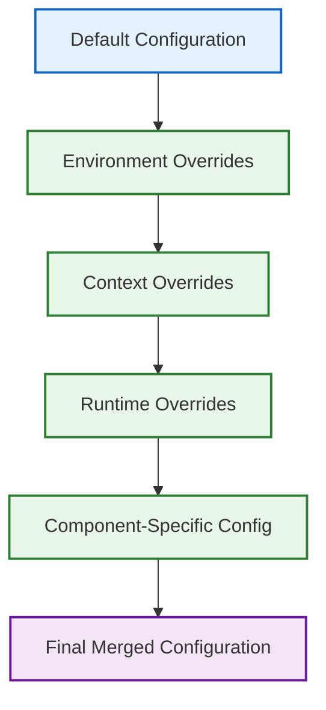
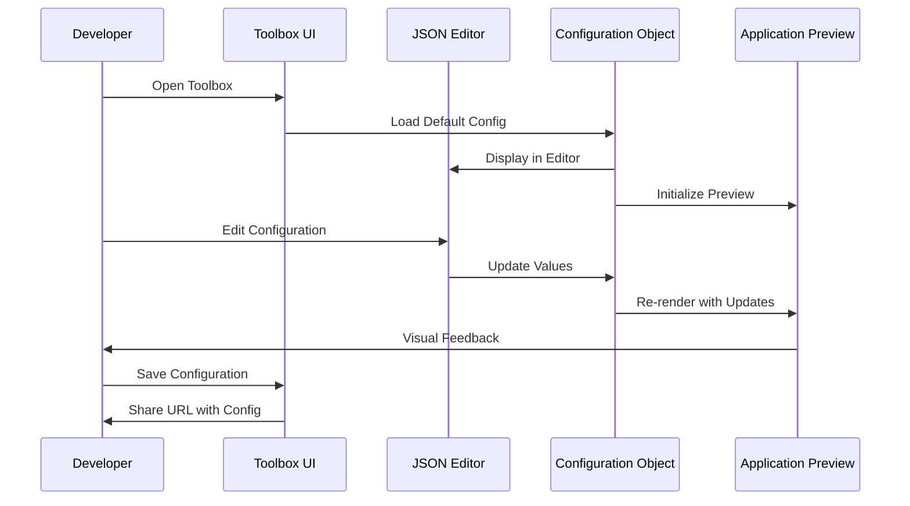

# Configuration System

## Overview

The Responsive Tiles application employs a comprehensive configuration system that allows for customization of appearance, behavior, and functionality. This document provides a detailed explanation of the configuration architecture and how to utilize it effectively.

## Configuration Architecture

The configuration system follows a hierarchical structure with multiple layers of overrides to enable flexibility while maintaining sensible defaults.



### Configuration Layers

1. **Default Configuration**: Base settings defined in `contextStore/defaults.json`
2. **Environment Overrides**: Settings defined at build time via environment variables
3. **Context Overrides**: User or institution-specific settings
4. **Runtime Overrides**: Settings modified during application execution
5. **Component-Specific Configuration**: Individual component configuration

## Core Configuration Structure

The core configuration object contains several key sections:

```javascript
// Simplified example from defaults.json
{
  "version": "2.0",
  "environment": "development",
  "api": {
    "baseUrl": "/api/v1",
    "timeout": 30000,
    "retryCount": 3
  },
  "ui": {
    "showHeader": true,
    "showProductHeader": false,
    "showCloseButton": true,
    "hideTitle": false
  },
  "features": {
    "spending": true,
    "budgets": true,
    "goals": true,
    "cashflow": true,
    "netWorth": true
  },
  "theme": {
    "palette": {
      "primary": {
        "main": "#2C6E9B"
      },
      "secondary": {
        "main": "#4caf50"
      },
      "custom": {
        "positive": "#43a047",
        "negative": "#e53935",
        "donut": [
          "#f7e000", "#c585d5", "#ff5b69", "#00c7b6",
          "#008f80", "#ffc04f", "#5a7576", "#8fdaff",
          "#42577d", "#ea9fe2"
        ]
      }
    },
    "typography": {
      "fontFamily": "'Roboto', 'Helvetica', 'Arial', sans-serif",
      "fontSize": 14
    }
  },
  "layout": {
    "breakpoints": {
      "values": {
        "xs": 0,
        "sm": 600,
        "md": 960,
        "lg": 1280,
        "xl": 1920
      }
    },
    "useContainer": false,
    "footerHeight": 56
  },
  "dashboard": {
    "cards": [
      "SpendingWheel", "Budgets", "CashOverview",
      "NetWorth", "Accounts", "Transactions", "Goals"
    ]
  }
}
```

## Configuration Access

The configuration is accessible through the Context Store which acts as a central configuration provider.

```javascript
// Example from contextStore/index.js
import { makeObservable, observable, action, computed } from 'mobx';
import defaultConfig from './defaults.json';
import { mergeDeep } from '../../utils/data';

class ContextStore {
  config = { ...defaultConfig };
  
  constructor() {
    makeObservable(this, {
      config: observable,
      updateConfig: action,
      theme: computed,
      features: computed
    });
  }
  
  updateConfig = (newConfig, options = { merge: true }) => {
    if (options.merge) {
      this.config = mergeDeep(this.config, newConfig);
    } else {
      this.config = { ...this.config, ...newConfig };
    }
  };
  
  get theme() {
    return this.config.theme;
  }
  
  get features() {
    return this.config.features;
  }
  
  // Additional getters and methods...
}

export default new ContextStore();
```

### Accessing Configuration in Components

Components can access configuration through the MobX store:

```javascript
// Example component using configuration
import React from 'react';
import { inject, observer } from 'mobx-react';

const ConfigurableComponent = inject('contextStore')(observer(
  ({ contextStore }) => {
    const { config } = contextStore;
    
    // Feature flag check
    if (!config.features.budgets) {
      return null; // Component hidden when feature disabled
    }
    
    return (
      <div style={{ color: config.theme.palette.primary.main }}>
        {config.ui.showHeader && <header>Header Content</header>}
        <main>Main Content</main>
      </div>
    );
  }
));

export default ConfigurableComponent;
```

## Configuration During Development

During development, you can use the Toolbox to experiment with different configuration values:



### Toolbox Configuration Example

```javascript
// From toolbox.js
let config = {
  // Visual configuration
  showHeader: false,
  showProductHeader: false,
  showCloseButton: true,
  hideTitle: false,
  
  // Component-specific settings
  donutSize: 250,
  donutSaturation: 0.15,
  
  // Theming
  palette: {
    primary: { main: '#2C6E9B' },
    secondary: { main: '#4caf50' },
    custom: {
      positive: '#43a047',
      negative: '#e53935',
      donut: [
        '#f7e000', '#c585d5', '#ff5b69', '#00c7b6',
        '#008f80', '#ffc04f', '#5a7576', '#8fdaff',
        '#42577d', '#ea9fe2'
      ]
    }
  }
};

// Update config and re-render
function updateConfig(newConfig) {
  config = mergeDeep(config, newConfig);
  render();
}
```

## Environment-Specific Configuration

Environment-specific configuration is managed through:

1. **Build-time Environment Variables**: Set during the build process
2. **Environment Detection**: Runtime environment detection
3. **Configuration Overrides File**: Environment-specific override files

```javascript
// Example of environment-specific configuration loading
import defaultConfig from './defaults.json';
import devConfig from './environments/dev.json';
import stagingConfig from './environments/staging.json';
import prodConfig from './environments/prod.json';
import { mergeDeep } from '../../utils/data';

const getEnvironmentConfig = () => {
  const env = process.env.NODE_ENV || 'development';
  
  switch (env) {
    case 'production':
      return prodConfig;
    case 'staging':
      return stagingConfig;
    case 'development':
    default:
      return devConfig;
  }
};

export const loadConfig = () => {
  const envConfig = getEnvironmentConfig();
  return mergeDeep(defaultConfig, envConfig);
};
```

## Feature Flags

Feature flags are a special category of configuration that control the availability of features:

```javascript
// Example feature flag configuration
const features = {
  spending: true,      // Spending analysis features
  budgets: true,       // Budget management features
  goals: true,         // Financial goals features
  cashflow: true,      // Cash flow planning features
  netWorth: true,      // Net worth tracking features
  experimental: {      // Experimental features
    predictive: false, // Predictive financial insights
    automation: false  // Automated financial actions
  }
};
```

### Using Feature Flags

Feature flags can be used at different levels:

1. **Component Rendering**: Conditionally render components
2. **Route Configuration**: Enable/disable routes
3. **API Integration**: Control API feature usage
4. **UI Elements**: Show/hide specific UI elements

```javascript
// Component-level feature flag example
const BudgetFeature = inject('contextStore')(observer(
  ({ contextStore }) => {
    // Early return if feature is disabled
    if (!contextStore.config.features.budgets) {
      return null;
    }
    
    return <BudgetComponent />;
  }
));

// Route-level feature flag example
const routes = [
  {
    path: '/budgets',
    component: Budget,
    enabled: config => config.features.budgets
  },
  {
    path: '/goals',
    component: Goals,
    enabled: config => config.features.goals
  }
];

// Filtered routes based on configuration
const getEnabledRoutes = (config) => {
  return routes.filter(route => 
    !route.enabled || route.enabled(config)
  );
};
```

## Theming Configuration

The theming system leverages Material-UI's theme provider with custom extensions:

```javascript
// Example theme configuration
const theme = {
  palette: {
    primary: {
      main: '#2C6E9B',
      light: '#6399ca',
      dark: '#00466d',
      contrastText: '#ffffff'
    },
    secondary: {
      main: '#4caf50',
      light: '#80e27e',
      dark: '#087f23',
      contrastText: '#ffffff'
    },
    custom: {
      positive: '#43a047',
      negative: '#e53935',
      donut: [
        '#f7e000', '#c585d5', '#ff5b69', '#00c7b6',
        '#008f80', '#ffc04f', '#5a7576', '#8fdaff',
        '#42577d', '#ea9fe2'
      ]
    }
  },
  typography: {
    fontFamily: "'Roboto', 'Helvetica', 'Arial', sans-serif",
    fontSize: 14,
    h1: {
      fontSize: '2.25rem',
      fontWeight: 500
    },
    h2: {
      fontSize: '1.75rem',
      fontWeight: 500
    }
    // Additional typography settings...
  },
  overrides: {
    MuiButton: {
      root: {
        textTransform: 'none'
      }
    }
    // Additional component overrides...
  }
};
```

### Theme Integration

The theme is integrated through the Material-UI ThemeProvider and augmented with custom properties:

```javascript
// From withRoot.js
import { createMuiTheme, ThemeProvider } from '@material-ui/core/styles';
import { inject, observer } from 'mobx-react';

const Root = inject('contextStore')(observer(
  ({ contextStore, children }) => {
    // Create theme from configuration
    const muiTheme = createMuiTheme({
      ...contextStore.theme,
      // Add runtime properties
      useContainer: contextStore.config.layout.useContainer
    });
    
    return (
      <ThemeProvider theme={muiTheme}>
        {children}
      </ThemeProvider>
    );
  }
));

// HOC for wrapping components with the themed provider
const withRoot = Component => props => (
  <Root>
    <Component {...props} />
  </Root>
);

export default withRoot;
```

## Layout Configuration

Layout configuration controls the structural aspects of the application:

```javascript
// Example layout configuration
const layout = {
  breakpoints: {
    values: {
      xs: 0,
      sm: 600,
      md: 960,
      lg: 1280,
      xl: 1920
    }
  },
  useContainer: false, // Use container query units
  footerHeight: 56,    // Height of the footer in pixels
  headerHeight: 64,    // Height of the header in pixels
  drawerWidth: 240,    // Width of the navigation drawer
  spacing: 8           // Base spacing unit
};
```

### Container Mode Configuration

The `useContainer` flag is particularly important for embedded applications:

```javascript
// Example of container-specific styling
const styles = theme => ({
  root: {
    height: theme.useContainer ? '100cqh' : '100%',
    position: 'relative',
    overflowY: 'auto'
  },
  fixedButton: {
    position: theme.useContainer ? 'absolute' : 'fixed',
    bottom: theme.useContainer ? '16px' : '16px',
    right: theme.useContainer ? '16px' : '16px'
  }
});
```

For more details, see the [Container Layout](CONTAINER-LAYOUT.md) documentation.

## Dashboard Configuration

The dashboard layout is configurable through card ordering and visibility:

```javascript
// Example dashboard configuration
const dashboard = {
  cards: [
    "SpendingWheel", // Spending analysis wheel
    "Budgets",       // Budget summary
    "CashOverview",  // Cash flow overview
    "NetWorth",      // Net worth summary
    "Accounts",      // Accounts summary
    "Transactions",  // Recent transactions
    "Goals"          // Financial goals
  ],
  layout: {
    xs: 1, // 1 column on extra small screens
    sm: 2, // 2 columns on small screens
    md: 3, // 3 columns on medium screens
    lg: 4  // 4 columns on large screens
  }
};
```

## Runtime Configuration Updates

Configuration can be dynamically updated at runtime:

```javascript
// Example of runtime configuration update
import contextStore from '../stores/contextStore';

// Update a specific configuration value
contextStore.updateConfig({
  ui: {
    showHeader: false
  }
});

// Update multiple configuration values
contextStore.updateConfig({
  ui: {
    showHeader: false,
    showCloseButton: true
  },
  theme: {
    palette: {
      primary: {
        main: '#1976d2'
      }
    }
  }
});

// Replace entire configuration section
contextStore.updateConfig({
  features: {
    spending: true,
    budgets: true,
    goals: false,
    cashflow: true,
    netWorth: true
  }
}, { merge: false });
```

## Configuration Persistence

Certain configuration settings can be persisted between sessions:

```javascript
// Example of configuration persistence
import { saveToLocalStorage, loadFromLocalStorage } from '../utils/storage';

// Save configuration to local storage
const saveUserConfig = (config) => {
  saveToLocalStorage('user_config', config);
};

// Load configuration from local storage
const loadUserConfig = () => {
  return loadFromLocalStorage('user_config');
};

// Apply saved configuration at startup
const initializeWithSavedConfig = () => {
  const savedConfig = loadUserConfig();
  if (savedConfig) {
    contextStore.updateConfig(savedConfig);
  }
};
```

## Configuration Validation

To ensure configuration integrity, validation is performed:

```javascript
// Example of configuration validation
import Ajv from 'ajv';
import configSchema from './configSchema.json';

const validateConfig = (config) => {
  const ajv = new Ajv();
  const validate = ajv.compile(configSchema);
  const valid = validate(config);
  
  if (!valid) {
    console.error('Configuration validation errors:', validate.errors);
    return false;
  }
  
  return true;
};

// Use validation before applying configuration
const safelyUpdateConfig = (newConfig) => {
  if (validateConfig(newConfig)) {
    contextStore.updateConfig(newConfig);
    return true;
  }
  return false;
};
```

## Testing Configuration

Testing configuration variations is supported through:

1. **Mock Configuration**: Predefined test configurations
2. **Configuration Overrides**: Test-specific overrides
3. **Feature Flag Testing**: Enabling/disabling features during tests

```javascript
// Example test configuration
const testConfig = {
  features: {
    budgets: true,
    goals: false  // Disable goals for this test
  },
  ui: {
    showHeader: true
  }
};

// Use in test
it('should render budget component when feature is enabled', () => {
  // Setup test with specific configuration
  const contextStore = createTestContextStore(testConfig);
  
  // Render component with test store
  const { getByTestId } = render(
    <TestProvider stores={{ contextStore }}>
      <App />
    </TestProvider>
  );
  
  // Verify budget component is rendered
  expect(getByTestId('budget-component')).toBeInTheDocument();
  
  // Verify goals component is not rendered (feature disabled)
  expect(queryByTestId('goals-component')).not.toBeInTheDocument();
});
```

## Configuration Best Practices

When working with the configuration system:

1. **Use Default Values**: Always provide sensible defaults
2. **Validate Configuration**: Validate configuration against a schema
3. **Feature Flags**: Use feature flags for experimental or in-progress features
4. **Minimize Runtime Changes**: Avoid frequent runtime configuration changes
5. **Document Configuration**: Maintain documentation for configuration options
6. **Test Configuration Variations**: Test components with different configurations

## Related Documentation

- [Container Layout](CONTAINER-LAYOUT.md): Details on the container layout system
- [State Management](STATE-MANAGEMENT.md): Information on MobX store integration
- [Theming](COMPONENTS.md#Theming): Component theming details
- [Development Workflow](DEVELOPMENT.md): Development practices