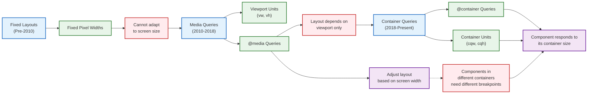
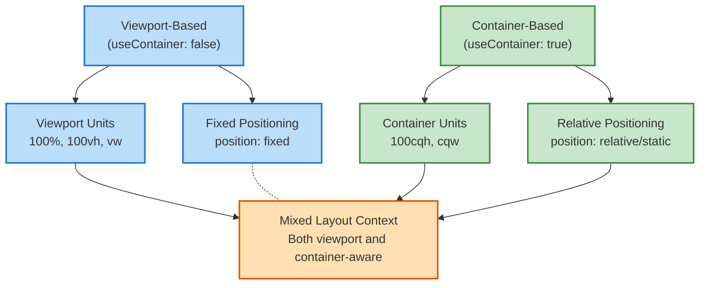
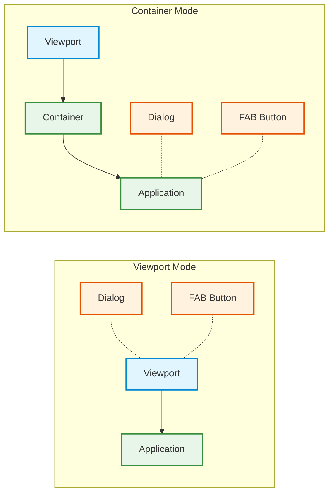
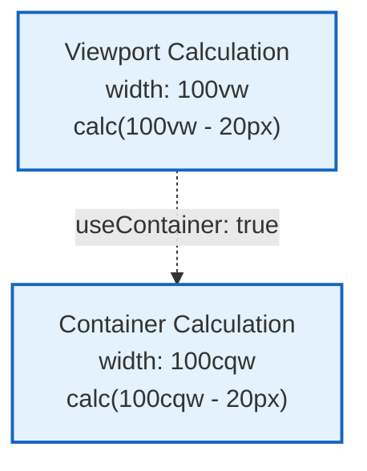
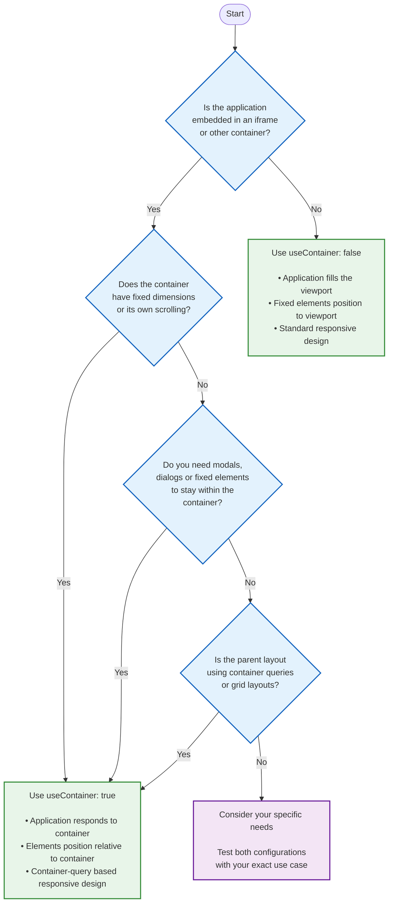
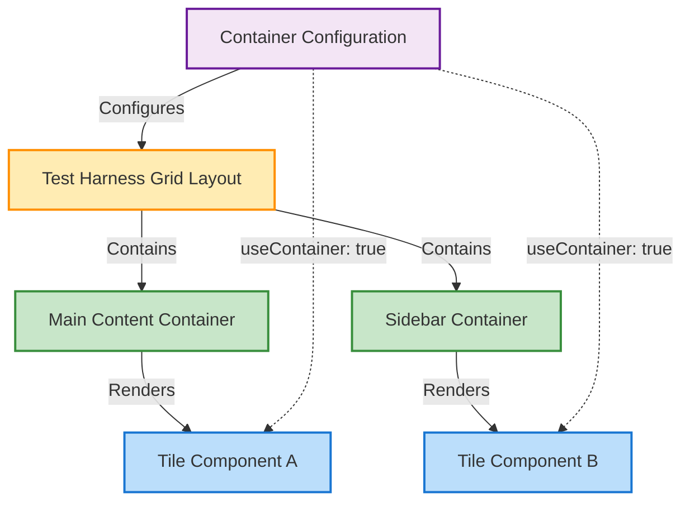

# Container Layout Configuration

## Understanding Container Layouts

In modern web applications, components often need to adapt not just to the viewport size (the browser window), but also to the size of their containing elements. This is especially important for embedded applications, widget-like components, and modular interfaces.

The Responsive Tiles framework includes a sophisticated container layout system that enables components to respond intelligently to their container dimensions rather than just the overall viewport. This foundational concept is critical for developing truly responsive and embeddable financial components.

### The Evolution of Responsive Design

To understand why container layouts matter, let's briefly explore the evolution of responsive design:



1. **Fixed Layouts Era**: Websites had fixed-width designs that couldn't adapt to different screen sizes
2. **Media Queries Era**: Responsive design emerged using viewport-based queries (`@media`)
3. **Container Queries Era**: Components become container-aware, responding to their immediate parent's dimensions

### The Container Layout Concept

Container layouts introduce a paradigm shift from traditional responsive design:

| Traditional Responsive Design | Container-Based Design |
|-------------------------------|------------------------|
| Responds to viewport dimensions | Responds to container dimensions |
| Uses `@media` queries | Uses `@container` queries |
| Uses viewport units (`vw`, `vh`) | Uses container query units (`cqw`, `cqh`) |
| All components respond to the same breakpoints | Each component responds to its own container |
| Components look the same at a given viewport width | Components adapt to their specific context |

## The useContainer Flag

The `useContainer` flag is a configuration setting that determines how the responsive tiles application handles container sizing, element positioning, and layout behaviors. This flag is particularly important when the application needs to be embedded within iframes or other contained environments.

## Configuration

The `useContainer` flag can be set in the application configuration:

```javascript
// In contextStore/defaults.json
{
  "config": {
    "useContainer": false,  // Default value
    // ... other configuration options
  }
}
```

## Understanding the Impact

When the `useContainer` flag is set to `true`, the application undergoes several fundamental changes in how it calculates sizes, positions elements, and manages layouts. To fully appreciate these changes, let's explore each aspect in detail:

### Shifting from Viewport to Container Units

The most significant transformation involves a change in the units used for measuring and calculating dimensions:



### Height and Vertical Sizing Changes

When container mode is enabled, the application recalibrates all of its vertical measurements:

| Element | Default Behavior (useContainer: false) | Container Behavior (useContainer: true) | Why This Matters |
|---------|----------------------------------------|----------------------------------------|-----------------|
| **Root Element** | Uses `height: 100%` relative to parent | Uses `height: 100cqh` relative to container | Ensures the application fills exactly its container height |
| **Tile Component** | Height calculated as percentage | Height calculated using container height units | Tile components size themselves to their direct container, not the page |
| **Content Area** | Scrolling based on viewport | Scrolling contained within component | Prevents scrolling from affecting the entire page when embedded |

### Positioning System Transformation

The positioning system fundamentally changes to respect container boundaries:

| Component | Default Positioning | Container Positioning | Visual Impact |
|-----------|---------------------|----------------------|---------------|
| **FabButton** | `position: fixed` (relative to viewport) | `position: relative` (relative to container) | Button stays within its container instead of floating over other content |
| **SpeedDial** | `position: fixed` (relative to viewport) | `position: static` (flows with content) | Dialogs remain within their component boundaries |
| **Modal Elements** | Full screen overlays | Container-constrained overlays | Modals appear within their container context, not over the entire application |

This transformation is visualized below:



### Special Handling for Modal Dialogs

Modal dialogs receive special consideration in container mode to ensure they function properly within bounded contexts:

```javascript
if (useContainer) {
  overrides.MuiDialog = {
    root: {
      margin: 'auto',
      maxWidth: '25.8rem',
      maxHeight: '30.9rem'
    }
  }
}
```

This creates a dramatically different user experience:

| Aspect | Viewport Behavior | Container Behavior |
|--------|-------------------|-------------------|
| **Coverage** | Modals cover the entire screen | Modals remain within their parent container |
| **Scrolling** | Scrolling is disabled on the background content | Scrolling may still work outside the container |
| **Backdrop** | Full-page backdrop | Container-limited backdrop |
| **Sizing** | Size based on viewport | Size constrained by container dimensions |

### Width Calculation Transformation

Width calculations are particularly important for responsive layouts:



## Example Implementation

Here's how the `useContainer` flag affects styling in components:

```javascript
// In withRoot.js
const styles = theme => ({
  root: {
    position: 'relative',
    fontFamily: theme.typography.fontFamily,
    minHeight: 180,
    height: theme.useContainer ? '100cqh' : '100%',
    overflowY: 'hidden',
    backgroundColor: theme.palette.background.default,
    scrollbarWidth: 'none'
  }
});

// In Tile.js
const styles = theme => ({
  root: {
    height: theme.useContainer ? '100cqh' : '100%',
    position: 'relative',
    overflowY: 'auto',
    WebkitOverflowScrolling: 'touch',
    backgroundColor: theme.useDefaultBackground ? theme.palette.background.default : theme.palette.background.paper,
    color: theme.palette.text.primary,
    '-ms-overflow-style': '-ms-autohiding-scrollbar'
  }
});
```

## Decision Framework for Container Mode

Choosing the appropriate container configuration requires careful consideration of your deployment context and user experience goals. The diagram below illustrates a decision framework to help you determine when to enable or disable container mode:



### When to Enable Container Mode (useContainer: true)

Enable container mode in these scenarios:

1. **Iframe Embedding**: When the application is embedded within an iframe on another website or application
   - Ensures the application respects the iframe boundaries
   - Prevents elements from attempting to escape the iframe context

2. **Dashboard Widgets**: When the application functions as a widget or tile within a dashboard
   - Allows the widget to behave appropriately within its allocated space
   - Prevents modal dialogs from covering other dashboard elements

3. **Integration in Third-Party Applications**: When integrating with partner applications or platforms
   - Maintains clean boundaries between your component and the host application
   - Respects the host application's layout structure

4. **Complex Grid-Based Layouts**: When the application is part of a complex grid system
   - Ensures components respond to their grid cell dimensions
   - Works with CSS Grid or Flexbox-based panel systems

5. **Responsive Panels**: When the application lives in a resizable panel or pane
   - Adapts properly when users resize panels
   - Maintains usability at various panel sizes

### When to Disable Container Mode (useContainer: false)

Disable container mode in these scenarios:

1. **Standalone Applications**: When the application runs as a full webpage
   - Allows the application to utilize the entire viewport
   - Enables standard viewport-based responsive design

2. **Full-Page Experiences**: When you need immersive, full-screen modals and overlays
   - Modal dialogs can cover the entire viewport
   - Fixed elements position relative to the viewport

3. **Simple Integration Contexts**: When embedding in simple contexts without complex layout requirements
   - Reduces complexity when container-awareness isn't needed
   - Simplifies positioning and sizing calculations

## Related Configuration

The `useContainer` flag often works together with other configuration parameters:

- `footerHeight`: Defines the height of the footer area when using containers
- `breakpoints`: Can be adjusted for container-relative sizing
- `disableFixed`: Determines whether fixed positioning is disabled

## Practical Testing and Development Approach

Testing container-based layouts requires a methodical approach to ensure components behave correctly across various container sizes and contexts. The Responsive Tiles framework includes specialized tools for testing container layouts.

### The Test Harness Container Laboratory

The Test Harness serves as a controlled environment for experimenting with container layouts. It provides grid-based containers with configurable dimensions and properties:



### Configuration Setup for Container Testing

The test harness provides built-in support for container-aware components:

```javascript
// In test-harness.js
const useContainer = true;

const configurations = {
  'content': {
    'type': 'content',
    'useContainer': useContainer,
    'footerHeight': 150,
    'breakpoints': {
      'values': {
        'xs': 0,
        'sm': 'calc(cqw - 78)',  // Container query width based breakpoints
        'md': 'calc(cqw - 75)',
        'lg': 'calc(cqw - 66)',
        'xl': 'cqw'
      }
    },
    // ...other config options
  }
}
```

### Container Testing Methodology

For effective container testing, follow this step-by-step approach:

1. **Setup Test Environment**
   - Launch the Test Harness (`test-harness.html`)
   - Ensure `useContainer` is enabled in the configuration

2. **Test Component in Various Containers**
   - Place the component in the main content area (larger container)
   - Place the component in the sidebar area (smaller container)
   - Observe how the component adapts to each container size

3. **Test Responsive Behavior**
   - Resize the browser window to trigger container size changes
   - Verify that components respond correctly to their container, not just the viewport
   - Check container query breakpoints by inspecting elements

4. **Verify Special Elements**
   - Test modal dialogs to ensure they stay within their container
   - Verify floating action buttons position correctly
   - Check dropdown menus and popovers for proper containment

5. **Cross-Browser Testing**
   - Test in modern browsers that support container queries (Chrome, Firefox, Safari)
   - Verify fallback behavior in browsers without container query support

### Visual Testing Checklist

When testing container-aware components, verify these key aspects:

| Test Area | What to Check | Success Criteria |
|-----------|---------------|------------------|
| **Sizing** | Component dimensions | Uses container width/height appropriately |
| **Scrolling** | Internal scroll areas | Scrolls within its container, not the page |
| **Modals** | Dialog positioning | Stays within container boundaries |
| **Buttons** | Floating action buttons | Correctly positioned relative to container |
| **Fixed Elements** | Headers, footers | Positioned relative to container, not viewport |
| **Breakpoints** | Responsive behavior | Adapts based on container width, not viewport |
| **Nested Components** | Inner elements | Properly positioned within their parent containers |

### Common Issues and Solutions

| Issue | Possible Cause | Solution |
|-------|---------------|----------|
| Component overflows container | Using `position: fixed` | Switch to `position: relative` or `absolute` |
| Dialog appears full-screen | Not respecting container | Apply container-specific styling to dialog root |
| Scroll issues | Conflicting scroll containers | Ensure only one scrollable element in the hierarchy |
| Layout breaks at certain sizes | Breakpoint issues | Adjust container query breakpoints |
| Fixed elements misplaced | Using viewport positioning | Use container-relative positioning |