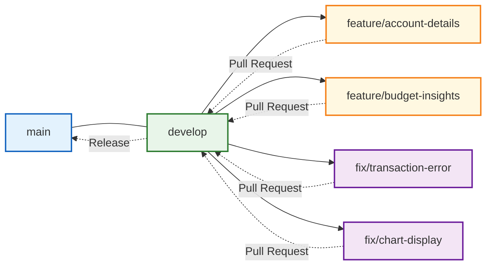

# Contributing Guidelines

This guide provides comprehensive information on how to contribute to the Responsive Tiles project, ensuring your contributions integrate smoothly with the existing codebase.

## Development Workflow

### Branch Organization



The project follows this branch structure:

1. **main**: Production-ready code
   - Thoroughly tested, stable code
   - Source for production deployments
   - Protected branch requiring approvals
   
2. **develop**: Integration branch
   - Main development branch
   - Features and fixes are merged here first
   - Regularly deployed to development environment
   
3. **feature/branch-name**: Feature branches
   - Created from `develop` for new features
   - Use descriptive names like `feature/cashflow-calendar`
   - Merged back to `develop` via Pull Request
   
4. **fix/branch-name**: Bugfix branches
   - Created from `develop` for bug fixes
   - Use descriptive names like `fix/transaction-loading`
   - Merged back to `develop` via Pull Request

### Git Workflow

When contributing to the project, follow these steps:

1. **Branch Creation**:
   ```bash
   # Ensure develop is up-to-date
   git checkout develop
   git pull origin develop
   
   # Create a new feature branch
   git checkout -b feature/your-feature-name
   ```

2. **Development**:
   - Make focused, logical commits
   - Write descriptive commit messages
   - Follow the code style guidelines
   
3. **Push Changes**:
   ```bash
   git push origin feature/your-feature-name
   ```
   
4. **Create Pull Request**:
   - Create a PR from your branch to `develop`
   - Fill out the PR template completely
   - Reference any related tickets
   
5. **Code Review**:
   - Address all review comments
   - Make requested changes in your branch
   - Re-request review when ready
   
6. **Merge**:
   - Merge can proceed after approval
   - Resolve any merge conflicts
   - Delete branch after successful merge

## Pull Request Process

### PR Template

All pull requests should follow this template:

```markdown
## Description
[Provide a clear description of the changes introduced by this PR]

## Related Ticket(s)
[Link to the JIRA/GitHub issue(s) this PR addresses]

## Type of Change
- [ ] Bug fix
- [ ] New feature
- [ ] Performance improvement
- [ ] Refactoring
- [ ] Documentation update
- [ ] Other (please describe)

## Test Plan
[Describe how you tested these changes]

## Screenshots (if applicable)
[Add screenshots showing the change]

## Checklist
- [ ] I have added tests that prove my fix/feature works
- [ ] I have updated documentation as needed
- [ ] My code follows the style guidelines
- [ ] I have run lint and tests locally
- [ ] I have made corresponding changes to documentation
```

### Review Process

Pull requests require:

1. **Code review** from at least one team member
2. **Passing CI checks** including:
   - Lint validation
   - Unit tests
   - Integration tests
   - Build verification
3. **Documentation** for any new features or changes

### Merging Strategy

We use the "Squash and Merge" strategy for most PRs:

- Combines all commits into a single, clean commit
- Preserves the full commit history in the PR
- Creates a cleaner project history
- Simplifies reverting changes if needed

For complex features with logical commit separation, "Rebase and Merge" may be used instead.

## Code Standards

### Coding Style

Follow these style guidelines for all code contributions:

#### JavaScript

```javascript
// Class-based components with descriptive names
class AccountDetails extends React.Component {
  // Private class properties start with underscore
  _loadPromise = null;
  
  // Initialize observables in constructor
  constructor(props) {
    super(props);
    
    makeObservable(this, {
      currentAccount: observable,
      setCurrentAccount: action
    });
  }
  
  // Use camelCase for methods
  loadAccountDetails = () => {
    // Implementation
  };
  
  // Use consistent JSX formatting
  render() {
    const { classes, accountId } = this.props;
    
    return (
      <div className={classes.root}>
        <Typography variant="h5">
          Account Details
        </Typography>
        {/* Additional JSX */}
      </div>
    );
  }
}

// Always export with HOCs properly ordered
export default withStyles(styles)(
  withRouter(
    inject('accountsStore')(
      observer(AccountDetails)
    )
  )
);
```

#### MobX Stores

```javascript
// Stores are singleton classes
class TransactionsStore {
  // Observable state
  transactions = [];
  isLoading = false;
  error = null;
  
  // Constructor with makeObservable
  constructor() {
    makeObservable(this, {
      transactions: observable,
      isLoading: observable,
      error: observable,
      filteredTransactions: computed,
      load: action,
      setFilter: action
    });
    
    // Initialize event listeners
    contextStore.onGlobal('accountSelected', this.loadAccountTransactions);
  }
  
  // Computed properties for derived data
  get filteredTransactions() {
    // Implementation
    return this.transactions.filter(/* criteria */);
  }
  
  // Action methods modify state
  load = () => {
    this.isLoading = true;
    this.error = null;
    
    return api
      .getTransactions()
      .then(action(response => {
        this.transactions = response.transactions;
        this.isLoading = false;
        return this.transactions;
      }))
      .catch(action(error => {
        this.error = error;
        this.isLoading = false;
        contextStore.handleRejection(error);
        throw error;
      }));
  };
}

// Export as singleton instance
export default new TransactionsStore();
```

#### Code Formatting Rules

1. **Indentation**: 2 spaces (no tabs)
2. **Line Length**: Maximum 100 characters
3. **Quotes**: Single quotes for strings
4. **Semicolons**: Required
5. **Trailing Commas**: Required for multiline arrays/objects
6. **Whitespace**: No trailing whitespace
7. **Parentheses**: Required around arrow function parameters even if single parameter
8. **Imports**: Group and sort imports:
   - React/Framework imports first
   - Third-party libraries second
   - Project imports third
   - Relative imports last

### Component Structure

Organize component files consistently:

```javascript
// 1. Imports section
import React from 'react';
import { observable, action, makeObservable } from 'mobx';
import { inject, observer } from 'mobx-react';
import { withRouter } from 'react-router-dom';
import withStyles from '@material-ui/core/styles/withStyles';
import Typography from '@material-ui/core/Typography';

// 2. Style definition
const styles = theme => ({
  root: {
    padding: theme.spacing(2),
    backgroundColor: theme.palette.background.paper
  },
  title: {
    marginBottom: theme.spacing(2)
  }
});

// 3. Component definition
class ComponentName extends React.Component {
  // 3.1 Class properties
  state = {
    // Local state if needed
  };
  
  // 3.2 Constructor with MobX setup
  constructor(props) {
    super(props);
    
    makeObservable(this, {
      // MobX decorations
    });
  }
  
  // 3.3 Lifecycle methods
  componentDidMount() {
    // Initialization
  }
  
  componentWillUnmount() {
    // Cleanup
  }
  
  // 3.4 Event handlers and methods
  handleClick = () => {
    // Implementation
  };
  
  // 3.5 Render method
  render() {
    const { classes } = this.props;
    
    return (
      <div className={classes.root}>
        {/* JSX */}
      </div>
    );
  }
}

// 4. Export with HOCs
export default withStyles(styles)(
  withRouter(
    inject('storeA', 'storeB')(
      observer(ComponentName)
    )
  )
);
```

### Store Structure

Organize store files consistently:

```javascript
// 1. Imports section
import { action, computed, observable, makeObservable } from 'mobx';
import * as api from '@geezeo/api';
import contextStore from '../contextStore';
import ComponentStore from './ComponentStore';

// 2. Store class definition
class FeatureStore {
  // 2.1 Observable properties
  items = [];
  isLoading = false;
  
  // 2.2 Private properties
  _component = null;
  
  // 2.3 Constructor
  constructor() {
    makeObservable(this, {
      items: observable,
      isLoading: observable,
      filteredItems: computed,
      load: action,
      reset: action
    });
    
    // Event subscriptions
    contextStore.onGlobal('eventName', this.handleEvent);
  }
  
  // 2.4 Computed properties
  get filteredItems() {
    // Implementation
    return this.items.filter(/* criteria */);
  }
  
  // 2.5 Component factory methods
  getComponent = () => {
    if (!this._component) {
      this._component = new ComponentStore({
        store: this
      });
    }
    return this._component;
  };
  
  // 2.6 Data actions
  load = () => {
    this.isLoading = true;
    
    return api
      .getItems()
      .then(action(response => {
        this.items = response.items;
        this.isLoading = false;
        return this.items;
      }))
      .catch(/* error handling */);
  };
  
  // 2.7 Utility methods
  reset = () => {
    this.items = [];
    this.isLoading = false;
    this._component = null;
  };
  
  // 2.8 Event handlers
  handleEvent = (eventData) => {
    // Implementation
  };
}

// 3. Export as singleton
export default new FeatureStore();
```

## Testing Standards

### Test Organization

Tests should be organized by type and component:

```
/tests
  /unit               # Unit tests
    /components       # Component unit tests
    /stores           # Store unit tests
    /utils            # Utility function tests
  /integration        # Integration tests
  /e2e                # End-to-end tests
  /a11y               # Accessibility tests
```

### Unit Test Structure

Follow this structure for unit tests:

```javascript
// 1. Imports
import React from 'react';
import { mount } from 'enzyme';
import TransactionList from '../../../src/components/tiles/Transactions/List';
import createTestStores from '../../mocks/stores/createTestStores';
import TestProvider from '../../helpers/components/TestProvider';

// 2. Setup mocks
jest.mock('@geezeo/api', () => ({
  getTransactions: jest.fn().mockResolvedValue({
    transactions: [
      { id: 'txn_1', description: 'Test Transaction', amount: 100 }
    ]
  })
}));

// 3. Test suite
describe('TransactionList Component', () => {
  // 3.1 Setup and teardown
  let wrapper;
  let stores;
  
  beforeEach(() => {
    // Create test stores with mock data
    stores = createTestStores({
      transactionsStore: {
        transactions: [
          { id: 'txn_1', description: 'Test Transaction', amount: 100 }
        ],
        isLoading: false
      }
    });
    
    // Mount component with test stores
    wrapper = mount(
      <TestProvider stores={stores}>
        <TransactionList />
      </TestProvider>
    );
  });
  
  afterEach(() => {
    // Clean up
    if (wrapper && wrapper.unmount) {
      wrapper.unmount();
    }
    jest.resetAllMocks();
  });
  
  // 3.2 Tests grouped by behavior or feature
  describe('Rendering', () => {
    it('renders transaction items for each transaction', () => {
      expect(wrapper.find('TransactionItem').length).toBe(1);
    });
    
    it('shows loading indicator when transactions are loading', () => {
      // Update store state
      stores.transactionsStore.isLoading = true;
      
      // Force rerender
      wrapper.update();
      
      expect(wrapper.find('CircularProgress').exists()).toBe(true);
    });
  });
  
  describe('Interactions', () => {
    it('calls load method on mount', () => {
      const loadSpy = jest.spyOn(stores.transactionsStore, 'load');
      
      // Mount a new instance to trigger componentDidMount
      const newWrapper = mount(
        <TestProvider stores={stores}>
          <TransactionList />
        </TestProvider>
      );
      
      expect(loadSpy).toHaveBeenCalled();
      
      newWrapper.unmount();
    });
    
    it('filters transactions when filter is applied', () => {
      // Test interaction logic
    });
  });
});
```

### Store Test Structure

```javascript
// 1. Imports
import TransactionsStore from '../../../src/stores/transactionsStore';
import * as api from '@geezeo/api';
import contextStore from '@geezeo/stores/contextStore';

// 2. Setup mocks
jest.mock('@geezeo/api');
jest.mock('@geezeo/stores/contextStore', () => ({
  handleRejection: jest.fn(),
  emitGlobal: jest.fn(),
  onGlobal: jest.fn()
}));

// 3. Test suite
describe('TransactionsStore', () => {
  // 3.1 Setup and teardown
  let store;
  
  beforeEach(() => {
    // Reset mocks
    jest.resetAllMocks();
    
    // Create fresh store instance
    store = new TransactionsStore();
  });
  
  // 3.2 Tests grouped by methods/actions
  describe('load', () => {
    it('sets isLoading to true while loading', async () => {
      // Set up API mock
      api.getTransactions.mockResolvedValue({ transactions: [] });
      
      // Start loading
      const promise = store.load();
      
      // Verify loading state
      expect(store.isLoading).toBe(true);
      
      // Wait for promise to resolve
      await promise;
    });
    
    it('updates transactions with API response data', async () => {
      // Mock data
      const mockTransactions = [
        { id: 'txn_1', description: 'Test', amount: 100 }
      ];
      
      // Set up API mock
      api.getTransactions.mockResolvedValue({ transactions: mockTransactions });
      
      // Execute method
      await store.load();
      
      // Verify state updates
      expect(store.transactions).toEqual(mockTransactions);
      expect(store.isLoading).toBe(false);
    });
    
    it('handles API errors properly', async () => {
      // Mock error
      const error = new Error('API Error');
      api.getTransactions.mockRejectedValue(error);
      
      // Execute method and catch error
      await expect(store.load()).rejects.toThrow('API Error');
      
      // Verify error handling
      expect(store.isLoading).toBe(false);
      expect(store.error).toBe(error);
      expect(contextStore.handleRejection).toHaveBeenCalledWith(error);
    });
  });
  
  describe('computed properties', () => {
    it('filteredTransactions returns transactions matching filter criteria', () => {
      // Setup test
      store.transactions = [
        { id: 'txn_1', description: 'Grocery', amount: 50 },
        { id: 'txn_2', description: 'Restaurant', amount: 100 }
      ];
      
      store.filter = 'Grocery';
      
      // Test computed property
      expect(store.filteredTransactions.length).toBe(1);
      expect(store.filteredTransactions[0].id).toBe('txn_1');
    });
  });
});
```

## Documentation Standards

### Code Documentation

Use consistent documentation for all code:

#### JSDoc for Functions and Methods

```javascript
/**
 * Retrieves transactions for a specific account
 * 
 * @param {string} accountId - The account identifier
 * @param {Object} options - Request options
 * @param {string} [options.startDate] - Start date for filtering (YYYY-MM-DD)
 * @param {string} [options.endDate] - End date for filtering (YYYY-MM-DD)
 * @param {number} [options.limit=50] - Maximum number of transactions to return
 * @returns {Promise<Array>} Promise resolving to array of transactions
 */
getAccountTransactions = (accountId, options = {}) => {
  // Implementation
};
```

#### Component Props Documentation

```javascript
/**
 * TransactionList component displays a list of financial transactions
 * with sorting and filtering capabilities.
 * 
 * @component
 */
class TransactionList extends React.Component {
  static propTypes = {
    /**
     * MobX store containing transaction data
     * @type {Object}
     */
    transactionsStore: PropTypes.object.isRequired,
    
    /**
     * Account ID to filter transactions by
     * @type {string}
     */
    accountId: PropTypes.string,
    
    /**
     * CSS classes provided by withStyles HOC
     * @type {Object}
     */
    classes: PropTypes.object.isRequired,
    
    /**
     * Number of transactions to show per page
     * @type {number}
     * @default 20
     */
    pageSize: PropTypes.number
  };
  
  static defaultProps = {
    pageSize: 20
  };
  
  // Component implementation
}
```

#### Store Documentation

```javascript
/**
 * Store managing transaction data, filtering, and operations
 * 
 * This store handles loading, filtering, and manipulating transaction data
 * from the backend API. It provides computed views of transactions based
 * on various filtering criteria.
 */
class TransactionsStore {
  /**
   * List of all loaded transactions
   * @type {Array<Object>}
   */
  transactions = [];
  
  /**
   * Current loading state
   * @type {boolean}
   */
  isLoading = false;
  
  // Store implementation
}
```

### File Headers

Include a standard header at the top of each file:

```javascript
/**
 * @file Transactions List Component
 * @description Displays a filterable, sortable list of financial transactions
 * @module components/transactions/List
 */
```

### README Files

Include README files in major directories to explain their purpose:

```markdown
# Components Directory

This directory contains all React components used in the application.

## Structure

- `App.js` - Main application component
- `Tile.js` - Base tile component
- `/common` - Reusable UI components
- `/tiles` - Feature-specific tile components

## Component Guidelines

1. All components should be class-based React components
2. Use MobX for state management
3. Use Material-UI for styling
4. Follow the design system guidelines
```

## Review Criteria

Pull requests are evaluated against these criteria:

### Functionality

- Does the code work as expected?
- Are edge cases handled properly?
- Is error handling implemented?
- Is the code performant and efficient?

### Quality

- Are tests included and comprehensive?
- Is the code well-structured and organized?
- Does it follow the established patterns?
- Is documentation included and accurate?

### Security

- Are inputs properly validated?
- Is authentication/authorization handled securely?
- Are potential security vulnerabilities addressed?
- Is sensitive data handled appropriately?

### Maintainability

- Is the code easy to understand?
- Are complex logic parts explained?
- Is there duplication that could be eliminated?
- Would another developer be able to maintain this code?

## Release Process

### Versioning

We follow Semantic Versioning (SemVer):

- **Major** (1.0.0): Breaking changes
- **Minor** (0.1.0): New features, backward compatible
- **Patch** (0.0.1): Bug fixes, backward compatible

### Release Steps

1. **Version Preparation**:
   - Update version in `package.json`
   - Update CHANGELOG.md
   - Ensure all tests pass

2. **Release Creation**:
   - Create a release branch `release/vX.Y.Z`
   - Final testing on release branch
   - Create a PR to `main`

3. **Tagging and Publishing**:
   - After PR approval, merge to `main`
   - Create a Git tag: `git tag vX.Y.Z`
   - Push tag: `git push origin vX.Y.Z`

4. **Deployment**:
   - Deploy to production via CI/CD pipeline
   - Verify deployment success

5. **Post-Release**:
   - Merge `main` back to `develop`
   - Begin next development cycle

## Getting Started

New contributors should follow these steps:

1. **Setup Development Environment**:
   - Clone repository
   - Install dependencies: `npm install`
   - Configure environment variables

2. **Run Locally**:
   - Start development server: `npm start`
   - Run tests: `npm test`
   - Build: `npm run build`

3. **First Contribution**:
   - Choose a good first issue
   - Follow the contribution workflow
   - Ask for help if needed

## Related Documentation

- [Development Guide](DEVELOPMENT.md)
- [Architecture Overview](ARCHITECTURE.md)
- [Testing Guide](TESTING.md)
- [Troubleshooting](TROUBLESHOOTING.md)