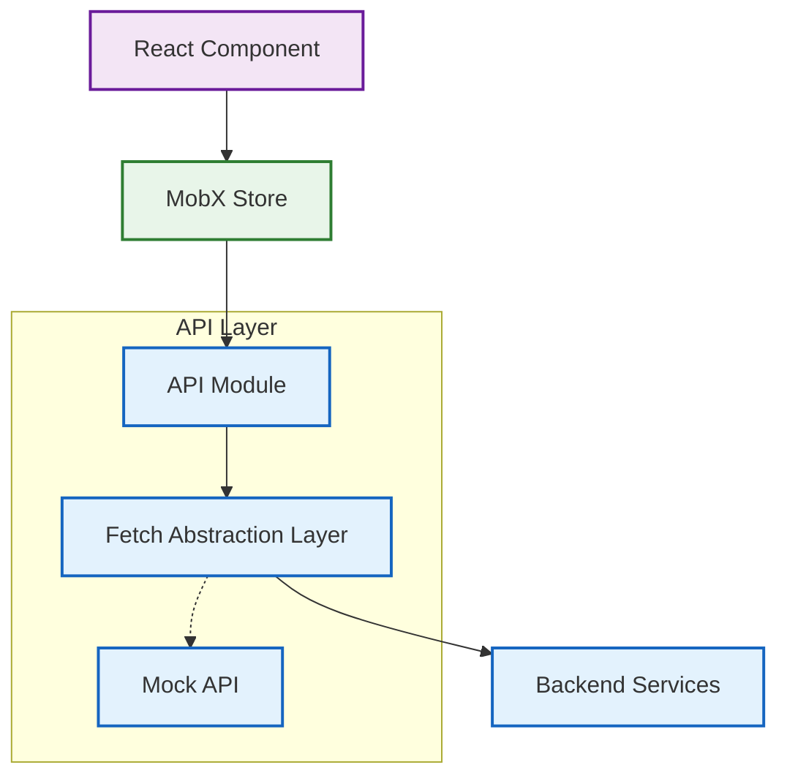

# API Integration

This guide provides comprehensive information about integrating with backend APIs in the Responsive Tiles application.

## Overview

The Responsive Tiles application follows a standardized approach to API integration that emphasizes consistency, error handling, and performance optimization.



### Key Components

The API integration stack consists of several key components:

1. **API Modules**: Domain-specific modules for each feature area (accounts, transactions, etc.)
2. **Fetch Abstraction Layer**: Central utilities for making HTTP requests
3. **Mock API System**: Local data providers for development and testing
4. **MobX Stores**: State containers that consume API data

## API Module Structure

Each API module follows a consistent structure to maintain developer ergonomics and code predictability:

```javascript
// Example from /src/api/accounts.js
import { get, post, put, del } from './fetch';

/**
 * Retrieves accounts for the authenticated user
 * @param {Object} options - Request options
 * @returns {Promise<Array>} - Array of account objects
 */
export const getAccounts = (options = {}) => {
  return get('/api/v1/accounts', options);
};

/**
 * Retrieves a specific account by ID
 * @param {string} accountId - The account identifier
 * @param {Object} options - Request options
 * @returns {Promise<Object>} - Account data
 */
export const getAccountById = (accountId, options = {}) => {
  return get(`/api/v1/accounts/${accountId}`, options);
};

// Additional API methods...
```

Each module exports individual functions that:
- Accept standardized parameters
- Return Promises
- Use the fetch abstraction layer
- Include JSDoc documentation

## Fetch Abstraction Layer

The fetch abstraction layer (`src/api/fetch.js`) provides a centralized point for handling HTTP requests with:

- Default headers and authentication
- Standardized error handling
- Response parsing
- Retry mechanisms
- Request cancellation
- Logging and telemetry

```javascript
// Simplified example from fetch.js
export const get = (url, options = {}) => {
  return fetchWithAuth(url, {
    method: 'GET',
    ...options
  });
};

export const post = (url, data, options = {}) => {
  return fetchWithAuth(url, {
    method: 'POST',
    body: JSON.stringify(data),
    headers: {
      'Content-Type': 'application/json',
      ...options.headers
    },
    ...options
  });
};

// Additional HTTP methods...
```

### Error Handling

API errors are processed through a standardized pipeline:


## Mock API System

For development and testing, the application includes a sophisticated mock API system:

```javascript
// Example from mockFetch.js
import accounts from './data/accounts.json';
import transactions from './data/transactions.js';

const ARTIFICIAL_DELAY = 300; // milliseconds

const mockEndpoints = {
  '/api/v1/accounts': () => [...accounts],
  '/api/v1/accounts/:id': (params) => {
    const account = accounts.find(a => a.id === params.id);
    return account || { error: 'Account not found', status: 404 };
  },
  // Additional endpoint mocks...
};

export default function mockFetch(url, options = {}) {
  // Parse URL and extract any path parameters
  const { endpoint, params } = parseUrl(url);
  
  // Find matching endpoint handler
  const handler = findMatchingHandler(endpoint, mockEndpoints);
  
  return new Promise((resolve, reject) => {
    setTimeout(() => {
      if (!handler) {
        reject({ error: 'Not Found', status: 404 });
        return;
      }
      
      try {
        const result = handler(params, options);
        resolve(result);
      } catch (err) {
        reject({ error: err.message, status: 500 });
      }
    }, ARTIFICIAL_DELAY);
  });
}
```

### Mock Data Files

The mock system uses a combination of static JSON files and dynamic JavaScript modules to generate representative data:

- `/src/api/data/accounts.json`: Static account data
- `/src/api/data/transactions.js`: Dynamically generated transaction data
- Additional data files for other domain objects

## API Integration with MobX Stores

MobX stores serve as the integration point between components and API modules:

```javascript
// Example from accountsStore/index.js
import { makeObservable, observable, action, runInAction } from 'mobx';
import * as api from '../../api/accounts';
import { handleRejection } from '../contextStore';

class AccountsStore {
  accounts = [];
  loading = false;
  error = null;

  constructor() {
    makeObservable(this, {
      accounts: observable,
      loading: observable,
      error: observable,
      fetchAccounts: action,
      setError: action
    });
  }

  fetchAccounts = async () => {
    this.loading = true;
    this.error = null;
    
    try {
      const accounts = await api.getAccounts();
      runInAction(() => {
        this.accounts = accounts;
        this.loading = false;
      });
    } catch (error) {
      handleRejection(error);
      runInAction(() => {
        this.error = error;
        this.loading = false;
      });
    }
  };
  
  // Additional methods...
}

export default new AccountsStore();
```

### Best Practices for Store-API Integration

1. **Loading States**: Always track loading states to display appropriate UI indicators
2. **Error Handling**: Use the central error handling system to maintain consistency
3. **Normalization**: Normalize complex data structures for efficient state management
4. **Derived Data**: Leverage MobX computed properties for derived data rather than re-fetching
5. **Optimistic Updates**: Implement optimistic updates for better perceived performance

## Authentication and Authorization

The API integration layer handles authentication through:

1. **JWT Management**: Automatic addition of JWT tokens to requests
2. **Token Refresh**: Transparent handling of token expiration and refresh
3. **Authorization Errors**: Special processing for 401/403 responses

```javascript
// From fetch.js
const fetchWithAuth = async (url, options = {}) => {
  // Add authentication headers
  const authHeaders = await getAuthHeaders();
  
  const response = await fetch(url, {
    ...options,
    headers: {
      ...authHeaders,
      ...options.headers
    }
  });
  
  // Handle 401 errors
  if (response.status === 401) {
    // Attempt token refresh and retry
    const refreshed = await refreshAuthToken();
    if (refreshed) {
      return fetchWithAuth(url, options); // Retry with new token
    } else {
      // Redirect to login if refresh fails
      redirectToLogin();
      throw new AuthError('Authentication failed');
    }
  }
  
  return processResponse(response);
};
```

## Performance Optimization

The API layer implements several strategies to improve performance:

### Caching

```javascript
// Simplified caching example
const cache = new Map();
const CACHE_TTL = 5 * 60 * 1000; // 5 minutes

export const getCached = async (url, options = {}) => {
  const cacheKey = `${url}|${JSON.stringify(options)}`;
  
  // Check cache and return if valid
  const cached = cache.get(cacheKey);
  if (cached && Date.now() - cached.timestamp < CACHE_TTL && !options.forceRefresh) {
    return cached.data;
  }
  
  // Fetch fresh data
  const data = await get(url, options);
  
  // Update cache
  cache.set(cacheKey, {
    data,
    timestamp: Date.now()
  });
  
  return data;
};
```

### Request Optimization

```javascript
// Request deduplication example
const inFlightRequests = new Map();

export const dedupedGet = (url, options = {}) => {
  const requestKey = `GET|${url}|${JSON.stringify(options)}`;
  
  // Return existing promise if request is in flight
  if (inFlightRequests.has(requestKey)) {
    return inFlightRequests.get(requestKey);
  }
  
  // Create new request
  const promise = get(url, options).finally(() => {
    // Remove from tracking when completed
    inFlightRequests.delete(requestKey);
  });
  
  // Track the request
  inFlightRequests.set(requestKey, promise);
  return promise;
};
```

## API Documentation Standards

All API integrations should be documented using:

1. **JSDoc Comments**: Function documentation with parameters and return types
2. **Type Definitions**: TypeScript-style interfaces for request/response objects
3. **Example Usage**: Code snippets demonstrating proper usage

```javascript
/**
 * Retrieves transaction history for an account
 * 
 * @param {string} accountId - The account identifier
 * @param {Object} options - Request options
 * @param {string} [options.startDate] - ISO date string for filtering start date
 * @param {string} [options.endDate] - ISO date string for filtering end date
 * @param {number} [options.limit=50] - Maximum number of transactions to return
 * @param {number} [options.offset=0] - Number of transactions to skip
 * @returns {Promise<TransactionResponse>} - Transaction data and pagination info
 * 
 * @example
 * // Get recent transactions
 * const txns = await getTransactions('acct_12345');
 * 
 * // Get transactions with date filtering
 * const pastTxns = await getTransactions('acct_12345', {
 *   startDate: '2023-01-01',
 *   endDate: '2023-03-31'
 * });
 */
export const getTransactions = (accountId, options = {}) => {
  // Implementation...
};
```

## Testing API Integrations

Testing strategy includes:

1. **Unit Tests**: Testing individual API functions with mocked fetch
2. **Integration Tests**: Testing API modules with the mock API system
3. **Store Integration Tests**: Testing stores with API dependencies
4. **End-to-End Tests**: Full testing of API flows in a browser environment

## Integrating New API Endpoints

When integrating new API endpoints, follow these steps:

1. Create or update the appropriate API module
2. Add mock endpoints and data for development and testing
3. Update or create MobX stores to utilize the new endpoints
4. Add appropriate unit and integration tests
5. Document the new API integration

## Troubleshooting

When troubleshooting API integration issues, check:

1. Network requests in browser developer tools
2. Authentication token validity and expiration
3. Request format and content
4. Response status codes and error messages
5. Mock data configuration for development environments