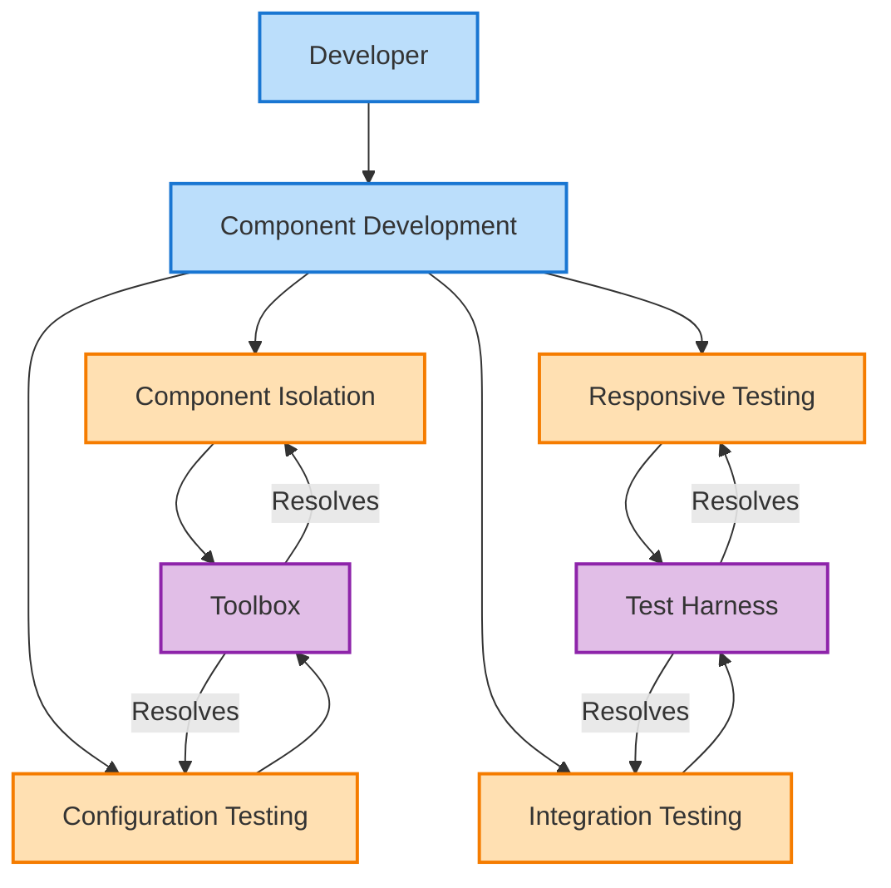
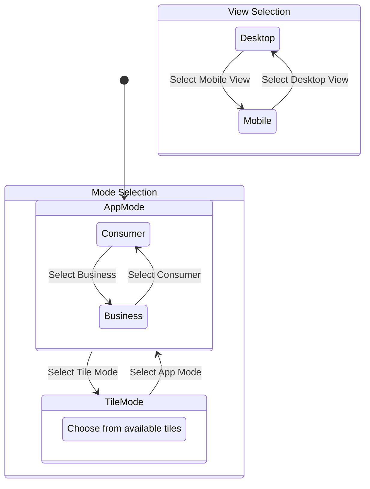
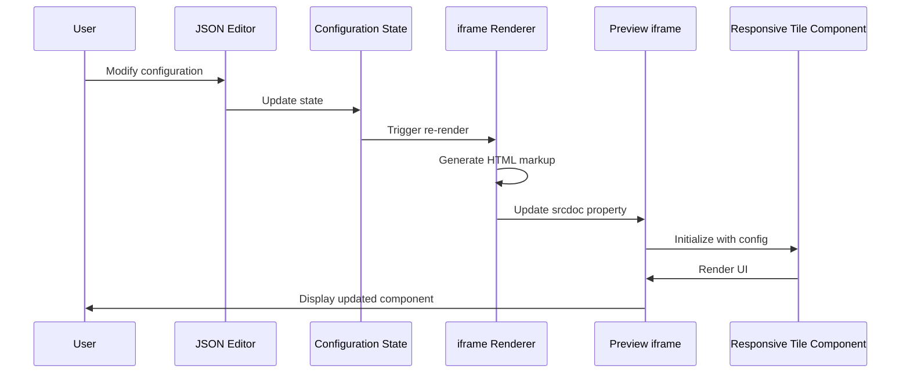
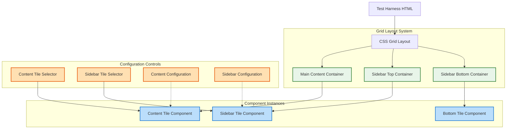
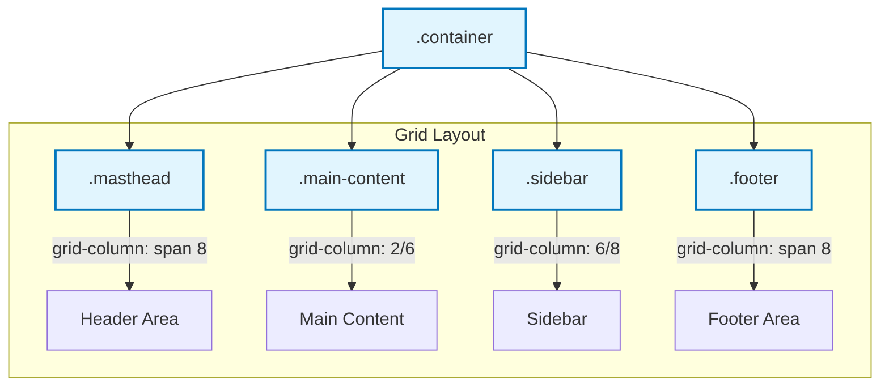
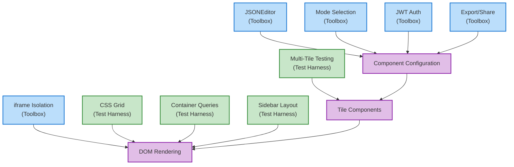
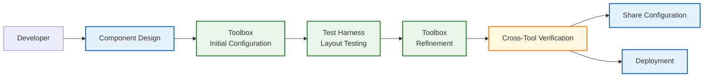

# Developer Tools

This document provides a comprehensive guide to the specialized development tools available in the Responsive Tiles application. Understanding these tools is essential for effective development as they provide controlled environments for testing, configuring, and visualizing components.

## Development Tools Overview

Before diving into the specific tools, let's understand why specialized development tools are necessary in a component-based application:



The development tools address these key challenges:

1. **Component Isolation**: Testing individual components without the full application context
2. **Configuration Testing**: Trying different configuration parameters to ensure components behave as expected
3. **Responsive Testing**: Verifying components adapt correctly to different container and viewport sizes
4. **Integration Testing**: Ensuring components work together properly in various layout combinations

Our solution includes two complementary tools, each with specific strengths:

| Challenge | Toolbox | Test Harness |
|-----------|---------|--------------|
| Component Isolation | ✅ (Primary focus) | ⚠️ (Limited) |
| Configuration Testing | ✅ (Comprehensive) | ✅ (Basic) |
| Responsive Testing | ✅ (Viewport-based) | ✅ (Container-based) |
| Integration Testing | ❌ (Not supported) | ✅ (Primary focus) |

## Toolbox

The Toolbox provides a specialized environment for previewing and configuring individual tiles and the complete application in isolation. It offers a comprehensive JSON editor for modifying component configuration in real-time.

[USE_Image-ToolboxUI] - *Screenshot of the Toolbox interface showing the JSON editor and preview panel*

### Architectural Principles

The Toolbox employs a sophisticated client-side architecture designed to provide maximum flexibility for developers. Understanding this architecture will help you leverage the tool more effectively during development.

At its core, the Toolbox implements a data-driven preview system that separates configuration from rendering. This separation creates a clean development environment where changes to component settings are immediately visible without requiring code modifications.

#### Data Flow Architecture

The diagram below illustrates how data flows through the Toolbox system:

```mermaid
flowchart LR
    classDef component fill:#bbdefb,stroke:#1976d2,stroke-width:2px
    classDef data fill:#c8e6c9,stroke:#388e3c,stroke-width:2px
    classDef ui fill:#e1bee7,stroke:#8e24aa,stroke-width:2px
    
    Editor[JSON Editor]:::ui
    Config[Configuration]:::data
    Mode[Mode Selection]:::ui
    View[View Selection]:::ui
    JWT[JWT Input]:::ui
    
    Preview[Preview Panel]:::ui
    Tile[Tile Component]:::component
    App[Application]:::component
    
    Share[Share Link]:::ui
    Download[Download HTML]:::ui
    
    Editor --> |Updates| Config
    Mode --> |Updates| Config
    View --> |Updates| Config
    JWT --> |Updates| Config
    
    Config --> |Configures| Preview
    Preview --> |Renders| Tile
    Preview --> |Renders| App
    
    Config --> |Serializes To| Share
    Config --> |Exports To| Download
    
    subgraph "Configuration Controls"
        Editor
        Mode
        View
        JWT
    end
    
    subgraph "Preview"
        Preview
        Tile
        App
    end
    
    subgraph "Sharing"
        Share
        Download
    end
```

This architecture consists of three main subsystems:

1. **Configuration Controls**: The inputs that allow developers to modify component behavior
2. **Preview System**: The rendering engine that displays components with applied configurations
3. **Sharing System**: Tools that enable collaboration and export of configurations

Let's examine each of these systems in detail to understand how they work together.

### Purpose and Benefits

The Toolbox serves several essential purposes in the development workflow:

1. **Visual Development**: Preview components and layouts during development
2. **Configuration Testing**: Test different configuration parameters in real-time
3. **Responsive Design Verification**: Toggle between desktop and mobile views
4. **Mode Testing**: Test both full application mode and standalone tile mode
5. **Shareable Configurations**: Generate shareable URLs with specific configurations
6. **Exportable HTML**: Download standalone HTML implementations for integration

### Technical Implementation

The Toolbox is built on these key technical principles:

#### 1. Configuration Management

The configuration system maintains a comprehensive state object that controls all aspects of component rendering:

```javascript
// Core configuration object (simplified from toolbox.js)
let config = {
  // Visual configuration
  showHeader: false,
  showProductHeader: false,
  showCloseButton: true,
  hideTitle: false,
  
  // Component-specific settings
  donutSize: 250,
  donutSaturation: 0.15,
  
  // Theming
  palette: {
    primary: { main: '#2C6E9B' },
    secondary: { main: '#4caf50' },
    custom: {
      positive: '#43a047',
      negative: '#e53935',
      donut: [
        '#f7e000', '#c585d5', '#ff5b69', '#00c7b6',
        '#008f80', '#ffc04f', '#5a7576', '#8fdaff',
        '#42577d', '#ea9fe2'
      ]
    }
  },
  
  // Routing/layout configuration
  topLevelRoutes: [
    '/', '/budgets', '/cashflow', '/goals', 
    '/networth', '/transactions/search', '/accounts'
  ],
  
  // Dashboard composition
  dashboard: {
    cards: [
      'SpendingWheel', 'Budgets', 'CashOverview',
      'NetWorth', 'Accounts', 'Transactions', 'Goals'
    ]
  }
}
```

This configuration drives all rendering decisions and can be modified in real-time through the JSON editor.

#### 2. Mode and View Systems

The Toolbox implements two independent yet related systems:



- **Mode**: Controls what is rendered (application or single tile)
- **View**: Controls how it's displayed (desktop or mobile viewport)
- **Audience**: Controls the user segment targeted (consumer or business)
- **Tile Selection**: Available only in tile mode, selects the specific component

#### 3. Rendering Architecture

The rendering system dynamically creates an iframe with the appropriate configuration:



This approach ensures complete isolation between the configuration UI and the preview, preventing any interference or style leakage.

### Accessing the Toolbox

The Toolbox is available at:

```
http://localhost:8080/toolbox.html
```

during local development, or at deployed URLs such as:

```
https://[environment-url]/toolbox.html
```

### Key Features

#### Mode Selection

The Toolbox supports two primary modes:

- **App Mode**: Displays the full application with all navigation and tiles
- **Tile Mode**: Displays a single tile component in isolation

#### View Selection

You can preview the application or individual tiles in different viewport sizes:

- **Desktop**: Standard desktop view
- **Mobile**: Mobile device simulation

#### Tile Selection

When in Tile Mode, you can select from all available tiles:

- Accounts (and specialized cards like Cash Reserves, Cash Summary)
- Budgets
- Cashflow
- Goals
- Net Worth
- Spending Analysis (including Wheel, Donut, etc.)
- Transactions
- And more specialized tiles

#### Audience Selection

When in App Mode, you can toggle between audience types:

- **Consumer**: Individual user interface
- **Business**: Business-focused interface

#### JWT Authentication

You can optionally provide a JWT token to load user-specific data:

1. Obtain a JWT token from your authentication system
2. Paste it into the JWT text area
3. The application will load with that user's actual data

#### Configuration Editor

The Toolbox includes a sophisticated JSON editor that allows you to:

- Modify any configuration parameter
- See changes reflected in real-time
- Edit in both tree and code views
- Use a color picker for theme colors

#### Sharing and Exporting

The Toolbox provides several ways to share and export configurations:

- **Share Link**: Generate a URL that includes the current configuration
- **Download HTML**: Download a standalone HTML file that includes the current configuration

### How to Use the Toolbox

#### Basic Usage

1. Select **Mode** (App or Tile)
2. Select **View** (Desktop or Mobile)
3. If in Tile mode, select a specific **Tile**
4. If in App mode, select an **Audience** type
5. Use the JSON editor to modify configuration parameters

#### Advanced Configuration

The JSON configuration allows for extensive customization:

- **Theme Customization**: Modify primary and secondary colors, typography, etc.
- **Feature Toggles**: Enable/disable specific features
- **Layout Configuration**: Adjust spacing, sizing, and display options
- **Data Display Options**: Configure how data is presented and formatted

#### Example: Customizing a Spending Wheel

1. Select "Tile" mode
2. Select "SpendingWheel" from the tile dropdown
3. In the JSON editor, navigate to `palette.custom.donut`
4. Modify the color array to change the wheel segments
5. Adjust `donutSize` and `donutSaturation` to change appearance
6. Test the changes in both Desktop and Mobile views
7. Generate a share link to send to team members

#### Example: Testing with Different User Data

1. Obtain a JWT token for a specific test user
2. Paste the token into the JWT text area
3. The application or tile will load with that user's actual data
4. Test different configurations with real user data

### Troubleshooting

#### Invalid JWT Format

If your JWT format is invalid, the JWT text area will highlight in red. Ensure your token:
- Contains three sections separated by periods
- Uses valid base64url encoding
- Has not expired

#### Configuration Errors

If your JSON configuration contains errors:
- The editor will highlight the problematic areas
- Changes may not be applied until errors are fixed
- Try using the "tree" view mode to avoid syntax errors

#### Loading Issues

If tiles or the application fail to load:
- Check browser console for errors
- Verify that API endpoints are accessible
- Ensure JWT token has necessary permissions

## Test Harness

The Test Harness provides a grid-based layout for testing how tiles interact in different container contexts, particularly for responsive design testing using container queries.

[USE_Image-TestHarnessUI] - *Screenshot of the Test Harness showing multiple tiles in a grid layout*

### Architecture

The Test Harness implements a container-query-based layout system for component testing:



### Purpose and Benefits

The Test Harness serves specific purposes distinct from the Toolbox:

1. **Component Interaction**: Test how multiple tiles interact within a page layout
2. **Container Queries Testing**: Verify responsive behavior using container queries
3. **Grid Layout Testing**: Test tile behavior in CSS grid layouts
4. **Multi-Tile Configuration**: Configure multiple tiles independently
5. **Layout Experimentation**: Try different content arrangements and combinations

### Technical Implementation

The Test Harness leverages several modern web technologies to create a realistic testing environment:

#### 1. Container Queries

Unlike the Toolbox which focuses on viewport-based responsive design, the Test Harness implements container queries for testing components within different container contexts:

```css
/* From test-harness.html */
.tiles-container {
  container-type: size;
}

/* Example usage in component configuration */
breakpoints: {
  values: {
    xs: 0,
    sm: 'calc(cqw - 78)',
    md: 'calc(cqw - 75)',
    lg: 'calc(cqw - 66)',
    xl: 'cqw'
  }
}
```

This approach offers several advantages:
- Components respond to their container size, not just the viewport
- Multiple components can be tested in different size contexts simultaneously
- Layout changes don't require browser resizing
- More accurately represents how components will behave when embedded in complex layouts

#### 2. CSS Grid Layout

The Test Harness uses CSS Grid to create a responsive layout structure:



The CSS grid implementation:
```css
/* From test-harness.html */
.site {
  display: grid;
  grid-template-columns: 1fr repeat(6, minmax(auto, 10em)) 1fr;
  grid-template-rows: minmax(1em, auto) 1fr auto minmax(1em, auto);
}

.masthead, .colophon {
  grid-column: span 8;
}

.main-content {
  grid-column: 2/6;
}

.sidebar {
  grid-column: 6/8;
}
```

#### 3. Dynamic Component Instantiation

The Test Harness dynamically creates tile instances based on user selection:

```javascript
// From test-harness.js
function createTile(element, tileType, currentTile) {
  if (window[currentTile]) {
    window[currentTile].remove();
  }

  // Get configuration based on location
  let config = currentConfig === 'left' ? configurations['sidebar'] : configurations['content'];

  // Create the tile instance
  window[currentTile] = window.geezeo.tiles[`create${tileType}`](element, config);
}

// Simplified Tiles creation
window.createContent = (element) => {
  const selectElement = document.getElementById('content-tiles');
  const selectedValue = selectElement.value.replace('create', '');
  createTile(element, selectedValue, 'contentTile');
}
```

This approach allows for quick swapping of components without page reloads.

### Accessing the Test Harness

The Test Harness is available at:

```
http://localhost:8080/test-harness.html
```

during local development, or at deployed URLs such as:

```
https://[environment-url]/test-harness.html
```

### Key Features

#### Layout Structure

The Test Harness provides a grid-based layout with:

- Main content area for primary tile display
- Sidebar area divided into upper and lower sections
- Responsive design that adapts to different screen sizes
- Container queries for component-specific responsive behavior

#### Tile Selection

You can independently select tiles for different layout sections:

- **Content Tile**: The main content area tile
- **Right Tile**: The tile for the upper sidebar area
- **Bottom Tile**: Fixed as a SpendingWheel in the lower sidebar area

#### Configuration Panels

The Test Harness includes configuration panels for each tile:

- Left sidebar for configuring the main content tile
- Right sidebar for configuring the sidebar tile
- JSON editors for detailed configuration
- Toggle buttons to show/hide configuration panels

### How to Use the Test Harness

#### Basic Usage

1. Select a tile for the main content area from the "Select Content Tile" dropdown
2. Select a tile for the right sidebar from the "Select Right Tile" dropdown
3. The bottom sidebar tile is fixed as a SpendingWheel
4. Resize your browser to see how the layout responds

#### Advanced Configuration

To access advanced configuration:

1. Click the gear icon (⚙️) next to "Select Content Tile" to open the left configuration panel
2. Click the gear icon (⚙️) next to "Select Right Tile" to open the right configuration panel
3. Modify the JSON configuration for each tile
4. Close the panel when finished

#### Testing Container Queries

The Test Harness is particularly useful for testing container queries:

1. Select tiles that use container queries for responsive design
2. Resize your browser to see how the container sizes change
3. Observe how tiles adapt to their container size, not just the viewport size
4. Test different combinations of tiles in different layout positions

#### Example: Testing Tile Combinations

1. Select "Cashflow" for the main content area
2. Select "Goals" for the right sidebar
3. Observe how they interact within the layout
4. Resize the browser to see responsive behavior
5. Open the configuration panels to adjust settings

## Comparing the Development Tools

While both the Toolbox and Test Harness serve as development aids, they address different aspects of component development. Understanding their strengths and limitations helps you choose the right tool for specific development tasks.

### Feature Comparison

The following table summarizes the key differences between both tools:

| Feature | Toolbox | Test Harness |
|---------|---------|--------------|
| Primary Focus | Individual component configuration | Layout and component interaction |
| Layout | Single component or full app | Grid-based multi-component layout |
| Configuration | Extensive JSON editor | Basic dropdown selection |
| View Options | Desktop/Mobile toggle | Responsive grid layout |
| Sharing | Share links and HTML export | Not available |
| JWT Support | Yes | No |
| Use Case | Component development and configuration | Layout testing and container queries |
| Responsive Testing | Viewport-based | Container-based |

### Technical Comparison

At a deeper technical level, the tools differ significantly in their implementation:



### When To Use Each Tool

Both tools excel at different tasks in the development workflow:

#### Use The Toolbox When:

- Developing a new component or refactoring an existing one
- Testing different configuration parameters
- Working with real user data via JWT
- Creating a shareable example for team members
- Exporting standalone implementations
- Testing mobile-specific behaviors

[USE_Image-ToolboxUsage] - *Screenshot showing a developer using the Toolbox to configure a financial component*

#### Use The Test Harness When:

- Testing how components interact in a layout
- Verifying container query behavior
- Evaluating space constraints in different layouts
- Testing component combinations for visual coherence
- Designing grid-based dashboard layouts
- Evaluating viewport-independent responsive behavior

[USE_Image-TestHarnessUsage] - *Screenshot showing multiple tiles arranged in the Test Harness grid layout*

### Integration in Development Workflow

For maximum effectiveness, incorporate both tools into your development workflow:

1. **Initial Development**: Use the Toolbox to develop and configure individual tiles
2. **Layout Testing**: Use the Test Harness to test tiles in layout contexts
3. **Configuration Refinement**: Return to Toolbox to fine-tune configurations
4. **Configuration Sharing**: Share Toolbox configurations with team members
5. **Integration Testing**: Export HTML from Toolbox for integration testing
6. **Final Verification**: Use both tools to verify responsive behavior before deployment



This integrated approach ensures components work well both in isolation and within complex layouts.

## Advanced Usage

### Custom Configurations

Both tools support extensive configuration options through their JSON editors. Common parameters include:

```json
{
  "showHeader": true,
  "showProductHeader": false,
  "donutSize": 250,
  "donutSaturation": 0.15,
  "palette": {
    "primary": {
      "main": "#2C6E9B"
    },
    "secondary": {
      "main": "#4caf50"
    },
    "custom": {
      "donut": [
        "#f7e000", "#c585d5", "#ff5b69", "#00c7b6",
        "#008f80", "#ffc04f", "#5a7576", "#8fdaff",
        "#42577d", "#ea9fe2"
      ]
    }
  }
}
```

### Integration with Container Queries

The Test Harness demonstrates how to use container queries with tiles:

```css
.tiles-container {
  container-type: size;
}

/* Example breakpoint usage in configuration */
"breakpoints": {
  "values": {
    "xs": 0,
    "sm": "calc(cqw - 78)",
    "md": "calc(cqw - 75)",
    "lg": "calc(cqw - 66)",
    "xl": "cqw"
  }
}
```

This allows tiles to respond to their container size rather than just the viewport size.

## Related Documentation

For more information on developing with Responsive Tiles, refer to:

- [Components Documentation](COMPONENTS.md): Details on individual components
- [Development Guide](DEVELOPMENT.md): General development workflow
- [Container Layout](CONTAINER-LAYOUT.md): Layout patterns used in the application