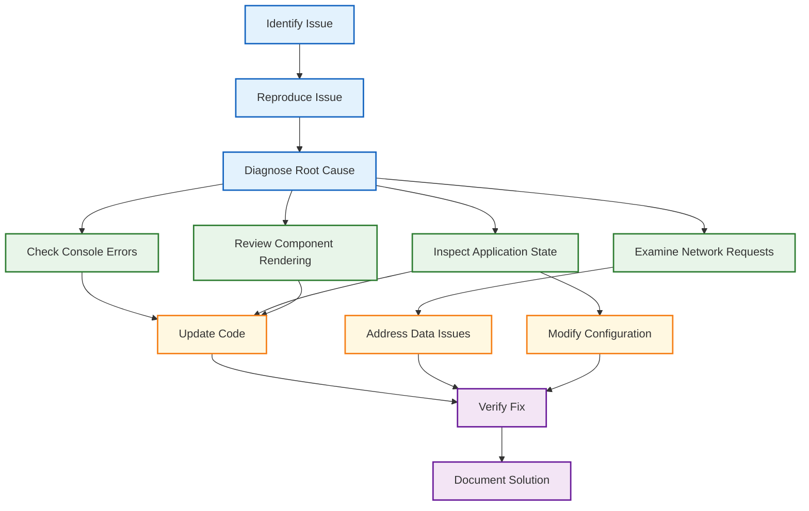

# Troubleshooting Guide

This guide provides solutions to common issues you might encounter when developing or using the Responsive Tiles application. Understanding these troubleshooting techniques will help you diagnose and resolve problems efficiently.

## Mock vs Real API Data

### Issue: Development environment always uses mock data

In development mode (`npm start`), the application will by default use mock data defined in `/src/api/data/*.js` instead of real API calls, even when API credentials are provided.

This is controlled by the following check in `src/api/fetch.js`:

```javascript
// Force mock fetch in development environment, but allow override with USE_REAL_API env var
if ((process.env.NODE_ENV === 'development' || window.location.hostname === 'localhost') && 
    process.env.USE_REAL_API !== 'true') {
  // For local development, use mockFetch by default
  return mockFetch(`${baseUrl}/api/v2${path}`, opts)
}
```

### Solution: Use the USE_REAL_API environment variable

To use real API data in development:

```bash
# Use the provided npm script
npm run start:real

# Or manually set the environment variable
USE_REAL_API=true npm start

# With specific API credentials
API_KEY=your_api_key PARTNER_DOMAIN='your.domain' PCID=your_pcid ENV=staging USE_REAL_API=true npm start
```

This allows you to test against real API endpoints while maintaining the convenience of mock data for general development.

## Diagnosing Issues

When troubleshooting issues in the application, follow this systematic diagnostic process:



## Common Issues and Solutions

### 1. Application Loading Issues

#### Blank Screen on Startup

**Symptoms:**
- Application shows a blank white page
- No visible error messages on screen
- Application fails to render any content

**Diagnostic Steps:**
1. Check browser console for errors
2. Verify that all required JavaScript files are loading
3. Check network requests for failed API calls
4. Ensure proper initialization of stores

**Common Causes and Solutions:**

| Cause | Solution |
|-------|----------|
| JavaScript errors during initialization | Check browser console for specific error messages; fix syntax or reference errors in initialization code |
| Failed API requests during bootstrap | Verify API endpoints are accessible; check authentication tokens |
| Missing or corrupted configuration | Ensure configuration files are properly loaded and formatted |
| CSS issues preventing visibility | Check if elements are rendered but hidden due to CSS issues |

**Example Error:**
```
Uncaught TypeError: Cannot read property 'map' of undefined
    at AccountsStore.load (index.js:283)
    at App.componentDidMount (App.js:42)
```

**Solution:**
```javascript
// Problematic code in AccountsStore
load = ({ force = false } = {}) => {
  this.isBusy = true;
  if (!this._loadPromise || force) {
    this._loadPromise = api
      .getAllAccounts()
      .then(action(response => {
        // Error occurs here when response.accounts is undefined
        this.list = response.accounts
          .map(account => this._transformAccount(account));
        this.isBusy = false;
        return this.list;
      }));
  }
  return this._loadPromise;
}

// Fixed implementation
load = ({ force = false } = {}) => {
  this.isBusy = true;
  if (!this._loadPromise || force) {
    this._loadPromise = api
      .getAllAccounts()
      .then(action(response => {
        // Safely handle missing accounts array
        this.list = (response.accounts || [])
          .map(account => this._transformAccount(account));
        this.isBusy = false;
        return this.list;
      }))
      .catch(error => {
        this.isBusy = false;
        contextStore.handleRejection(error);
        return [];
      });
  }
  return this._loadPromise;
}
```

### 2. MobX State Issues

#### Component Not Updating with State Changes

**Symptoms:**
- User actions don't cause UI updates
- State changes in the console but UI doesn't reflect changes
- Components appear "stuck" with stale data

**Diagnostic Steps:**
1. Verify the component is wrapped with `observer`
2. Check that state properties are properly marked as `observable`
3. Ensure actions are properly modifying observable state
4. Confirm that `makeObservable` is correctly configured in the constructor

**Common Causes and Solutions:**

| Cause | Solution |
|-------|----------|
| Missing `observer` HOC | Ensure component is wrapped with `observer` |
| Properties not marked observable | Mark state properties as observable in `makeObservable` |
| Mutating state outside actions | Ensure state modifications occur in action methods |
| Forgetting to call `makeObservable` | Add `makeObservable` call in constructor |

**Example Issue:**
```javascript
class BudgetStore {
  budgets = [];
  
  constructor() {
    // Missing makeObservable call
  }
  
  load() {
    api.getBudgets().then(response => {
      // Direct assignment without action wrapper
      this.budgets = response.budgets;
    });
  }
}
```

**Solution:**
```javascript
class BudgetStore {
  budgets = [];
  
  constructor() {
    makeObservable(this, {
      budgets: observable,
      load: action
    });
  }
  
  load = () => {
    api.getBudgets().then(action(response => {
      this.budgets = response.budgets;
    }));
  }
}
```

### 3. API and Data Loading Issues

#### Failed API Requests

**Symptoms:**
- Empty data in components
- Error states appearing in the UI
- Network errors in the browser console

**Diagnostic Steps:**
1. Check network requests in the browser developer tools
2. Verify API endpoint URLs and request parameters
3. Check authentication tokens and credentials
4. Review API response status codes and error messages

**Common HTTP Status Codes and Solutions:**

| Status Code | Meaning | Solution |
|-------------|---------|----------|
| 401 Unauthorized | Authentication failed | Refresh authentication token or re-login |
| 403 Forbidden | Insufficient permissions | Check user permissions or request access |
| 404 Not Found | Endpoint doesn't exist | Verify API endpoint path is correct |
| 500 Server Error | Backend error | Check server logs; might require backend fixes |

**Example Error Handling:**
```javascript
api.getTransactions = () => {
  return fetch('/api/v1/transactions')
    .then(response => {
      if (!response.ok) {
        // Create a standardized error object
        const error = new Error(`API Error ${response.status}: ${response.statusText}`);
        error.status = response.status;
        throw error;
      }
      return response.json();
    })
    .catch(error => {
      // Log error for debugging
      console.error('Transaction API Error:', error);
      
      // Use context store for centralized error handling
      contextStore.handleRejection(error);
      
      // Rethrow for promise chain
      throw error;
    });
};
```

### 4. Component Rendering Issues

#### Component Layout or Style Problems

**Symptoms:**
- Components appear misaligned or incorrectly sized
- Styles not applying as expected
- Responsive behavior not working properly

**Diagnostic Steps:**
1. Inspect element with browser developer tools
2. Check component class names and styles
3. Verify Material-UI theme and overrides
4. Test with different viewport sizes

**Common Causes and Solutions:**

| Cause | Solution |
|-------|----------|
| CSS class naming conflicts | Use more specific selectors or rename classes |
| Missing Material-UI theme | Ensure component is wrapped with `withStyles` |
| Incorrect JSS syntax | Fix style object format and property names |
| Z-index stacking issues | Adjust z-index values to fix layering problems |

**Example Issue:**
```javascript
const styles = {
  // Missing theme parameter
  root: {
    padding: 2, // Direct number instead of theme spacing
    margin: '10px' // Hard-coded instead of theme spacing
  }
};

// Component not using withStyles
class StyledComponent extends React.Component {
  // ...
}

export default StyledComponent;
```

**Solution:**
```javascript
const styles = theme => ({
  root: {
    padding: theme.spacing(2),
    margin: theme.spacing(1),
    backgroundColor: theme.palette.background.paper
  }
});

class StyledComponent extends React.Component {
  // ...
}

export default withStyles(styles)(StyledComponent);
```

### 5. MobX Store Interaction Issues

#### Stores Not Communicating

**Symptoms:**
- Actions in one store don't trigger updates in dependent stores
- Cross-component state updates fail
- Inconsistent state between related features

**Diagnostic Steps:**
1. Verify store event patterns and subscriptions
2. Check for circular dependencies between stores
3. Ensure global event handlers are registered correctly
4. Review store initialization order

**Solution Pattern - Event Communication:**
```javascript
// In contextStore/index.js
class ContextStore {
  _events = {};
  _globalEvents = {};
  
  constructor() {
    makeObservable(this, {
      emitEvent: action,
      emitGlobal: action
    });
  }
  
  on(event, callback) {
    if (!this._events[event]) {
      this._events[event] = [];
    }
    this._events[event].push(callback);
    
    // Return unsubscribe function
    return () => {
      this._events[event] = this._events[event].filter(cb => cb !== callback);
    };
  }
  
  onGlobal(event, callback) {
    if (!this._globalEvents[event]) {
      this._globalEvents[event] = [];
    }
    this._globalEvents[event].push(callback);
    
    // Return unsubscribe function
    return () => {
      this._globalEvents[event] = this._globalEvents[event].filter(cb => cb !== callback);
    };
  }
  
  emitEvent(event, data) {
    if (this._events[event]) {
      this._events[event].forEach(callback => callback(data));
    }
  }
  
  emitGlobal(event, data) {
    if (this._globalEvents[event]) {
      this._globalEvents[event].forEach(callback => callback(data));
    }
  }
}
```

**Store Subscription Example:**
```javascript
// In accountsStore/index.js
constructor() {
  makeObservable(this, { /* ... */ });
  
  // Subscribe to global events
  contextStore.onGlobal('userAuthenticated', () => {
    this.load({ force: true });
  });
  
  contextStore.onGlobal('accountsClassified', () => {
    this.load({ force: true });
  });
}
```

### 6. Memory Leaks and Performance Issues

#### Application Slows Down Over Time

**Symptoms:**
- Increasing memory usage
- Degrading performance with continued use
- Browser tabs becoming unresponsive

**Diagnostic Steps:**
1. Use Chrome DevTools Memory tab to capture heap snapshots
2. Look for growing arrays or object collections
3. Check for detached DOM nodes
4. Verify event listener cleanup in `componentWillUnmount`

**Common Causes and Solutions:**

| Cause | Solution |
|-------|----------|
| Event listeners not removed | Clean up listeners in `componentWillUnmount` |
| Growing arrays in stores | Implement pagination or data retention limits |
| Circular references | Break circular references, especially in store relationships |
| Cached data not expiring | Implement cache invalidation strategies |

**Example Fix:**
```javascript
class EventHandlingComponent extends React.Component {
  _eventUnsubscribers = [];
  
  componentDidMount() {
    // Store unsubscribe functions
    this._eventUnsubscribers.push(
      contextStore.on('dataUpdated', this.handleDataUpdate),
      contextStore.onGlobal('configurationChanged', this.handleConfigChange)
    );
    
    // DOM event listeners
    window.addEventListener('resize', this.handleResize);
  }
  
  componentWillUnmount() {
    // Clean up all contextStore subscriptions
    this._eventUnsubscribers.forEach(unsubscribe => unsubscribe());
    this._eventUnsubscribers = [];
    
    // Remove DOM event listeners
    window.removeEventListener('resize', this.handleResize);
  }
  
  handleDataUpdate = () => {
    // Handler implementation
  };
  
  handleConfigChange = () => {
    // Handler implementation
  };
  
  handleResize = () => {
    // Handler implementation
  };
}
```

### 7. Testing Issues

#### Tests Failing or Acting Inconsistently

**Symptoms:**
- Tests pass locally but fail in CI
- Intermittent test failures
- Tests passing individually but failing in suite

**Diagnostic Steps:**
1. Isolate failing tests by running them individually
2. Check for test environment differences
3. Look for time-dependent or order-dependent test behavior
4. Review test mocks and fixtures

**Common Causes and Solutions:**

| Cause | Solution |
|-------|----------|
| Shared state between tests | Reset state between test cases or use isolation |
| Improper test cleanup | Ensure afterEach/afterAll cleanup runs correctly |
| Timing issues | Use jest fake timers for deterministic timing |
| Missing mocks | Mock all external dependencies consistently |

**Example Test Fix:**
```javascript
// Before - potential shared state issues
describe('AccountsStore', () => {
  it('loads accounts', async () => {
    const store = new AccountsStore();
    await store.load();
    expect(store.list.length).toBeGreaterThan(0);
  });
  
  it('filters accounts', async () => {
    // This test might use state from previous test
    const store = new AccountsStore();
    // Missing await store.load();
    expect(store.openedAccounts.length).toBeGreaterThan(0);
  });
});

// After - proper isolation
describe('AccountsStore', () => {
  let store;
  
  beforeEach(() => {
    // Reset all mocks between tests
    jest.resetAllMocks();
    
    // Fresh store instance for each test
    store = new AccountsStore();
  });
  
  it('loads accounts', async () => {
    await store.load();
    expect(store.list.length).toBeGreaterThan(0);
  });
  
  it('filters accounts', async () => {
    // Explicit loading in each test that needs it
    await store.load();
    expect(store.openedAccounts.length).toBeGreaterThan(0);
  });
});
```

## Browser-Specific Issues

### Chrome

| Issue | Solution |
|-------|----------|
| CORS errors | Check API endpoints, add proper headers, or use a development proxy |
| Render performance | Use Chrome Performance tab to identify slow component renders |
| Memory issues | Use Chrome Memory tab to find memory leaks through snapshots |

### Firefox

| Issue | Solution |
|-------|----------|
| CSS flexbox rendering | Add vendor prefixes or use autoprefixer for Firefox-specific CSS |
| Network caching | Use network request "Disable Cache" option when debugging |
| Different error messages | Check Firefox-specific console messages for more details |

### Safari

| Issue | Solution |
|-------|----------|
| Date formatting | Use moment.js consistently for cross-browser date handling |
| CSS Grid support | Test layouts in Safari and add fallbacks if needed |
| WebKit-specific bugs | Apply specific fixes with targeted CSS for WebKit |

## Environment-Specific Issues

### Development Environment

| Issue | Solution |
|-------|----------|
| Hot reloading failures | Clear browser cache and restart webpack dev server |
| Webpack compilation errors | Check for syntax errors in recently modified files |
| Missing dependencies | Run `npm ci` to ensure exact dependency versions are installed |

### Production Environment

| Issue | Solution |
|-------|----------|
| Minification errors | Test production build locally before deployment |
| Environment variables | Verify environment variable configuration for production |
| Browser compatibility | Test in all target browsers before deploying to production |

## Debugging Techniques

### Browser Developer Tools

Effectively use browser developer tools for troubleshooting:

1. **Console Tab**:
   - Filter console by error level (errors, warnings)
   - Use `console.group()` to organize related log messages
   - Set breakpoints on exceptions

2. **Network Tab**:
   - Filter by XHR requests
   - Check request/response headers and bodies
   - Simulate slow connections for testing

3. **Elements Tab**:
   - Inspect component structure
   - Check applied styles and overrides
   - Modify styles temporarily to test fixes

4. **React DevTools**:
   - Examine component hierarchy
   - Check component props and state
   - Profile component renders

### MobX Debugging

For MobX-specific issues:

1. **Enable MobX Dev Tools**: 
   ```javascript
   // In development environment
   import { configure } from 'mobx';
   
   configure({
     enforceActions: 'observed',
     computedRequiresReaction: true,
     reactionRequiresObservable: true,
     observableRequiresReaction: true,
     disableErrorBoundaries: true
   });
   ```

2. **Trace Object Updates**:
   ```javascript
   import { trace } from 'mobx';
   
   // In problematic component
   trace(budgetsStore.budgets);
   ```

3. **Verify Observable Status**:
   ```javascript
   import { isObservable, isObservableProp } from 'mobx';
   
   console.log('Is store observable?', isObservable(budgetsStore));
   console.log('Is budgets property observable?', isObservableProp(budgetsStore, 'budgets'));
   ```

## Logging

Enhance application logging for better diagnosis:

```javascript
// In development environment
const DEBUG = process.env.NODE_ENV !== 'production';

export const logger = {
  debug(...args) {
    if (DEBUG) {
      console.debug('%c[DEBUG]', 'color: #6495ED', ...args);
    }
  },
  
  info(...args) {
    if (DEBUG) {
      console.info('%c[INFO]', 'color: #008000', ...args);
    }
  },
  
  warn(...args) {
    console.warn('%c[WARN]', 'color: #FFA500', ...args);
  },
  
  error(...args) {
    console.error('%c[ERROR]', 'color: #FF0000', ...args);
  },
  
  group(name) {
    if (DEBUG) {
      console.group(name);
    }
  },
  
  groupEnd() {
    if (DEBUG) {
      console.groupEnd();
    }
  }
};
```

## Common Error Messages and Solutions

| Error Message | Likely Cause | Solution |
|---------------|--------------|----------|
| "Cannot read property 'X' of undefined" | Accessing properties on null/undefined objects | Add null checks before property access |
| "Minified React error #X" | React runtime errors in production | Check React error reference or debug in development mode |
| "Uncaught (in promise)" | Unhandled promise rejection | Add proper catch handlers to all promises |
| "[MobX] Since strict-mode is enabled, changing observed observable values outside actions is not allowed" | Modifying observable outside action | Wrap state changes in action methods |
| "Maximum update depth exceeded" | Infinite update loops | Check for circular dependencies or infinite state updates |

## Recovery Strategies

When facing severe issues:

1. **Application Reset**:
   ```javascript
   // Reset all stores
   const resetAllStores = () => {
     Object.values(stores).forEach(store => {
       if (typeof store.reset === 'function') {
         store.reset();
       }
     });
     
     // Clear local storage if needed
     localStorage.clear();
     
     // Redirect to login or home
     window.location.href = '/';
   };
   ```

2. **Graceful Degradation**:
   ```javascript
   // Feature flagging for problematic features
   class App extends React.Component {
     render() {
       const { contextStore } = this.props;
       
       return (
         <div>
           {/* Always show core features */}
           <AccountsSection />
           
           {/* Conditionally enable features that might have issues */}
           {contextStore.config.features.budgets && <BudgetsSection />}
           
           {/* Fallback UI for disabled features */}
           {!contextStore.config.features.budgets && (
             <FallbackSection 
               title="Budgets"
               message="Budget feature is temporarily unavailable."
             />
           )}
         </div>
       );
     }
   }
   ```

3. **Error Boundaries**:
   ```javascript
   class ErrorBoundary extends React.Component {
     constructor(props) {
       super(props);
       this.state = { hasError: false, error: null };
     }
     
     static getDerivedStateFromError(error) {
       return { hasError: true, error };
     }
     
     componentDidCatch(error, errorInfo) {
       console.error('Component Error:', error, errorInfo);
       // Log to monitoring service
     }
     
     render() {
       if (this.state.hasError) {
         return (
           <div className="error-container">
             <h3>Component Error</h3>
             <p>We're sorry, something went wrong.</p>
             <button onClick={() => this.setState({ hasError: false })}>
               Try Again
             </button>
           </div>
         );
       }
       
       return this.props.children;
     }
   }
   ```

## Getting Help

When you need additional assistance:

1. **Check Existing Documentation**:
   - Review technical documentation in the `docs` directory
   - Check for known issues in JIRA or project management system

2. **Team Resources**:
   - Consult with team members who have worked on the relevant area
   - Use designated communication channels for technical questions

3. **External Resources**:
   - React documentation: [React 17 Documentation](https://react.dev/versions#react-17)
   - MobX documentation: [MobX Documentation](https://mobx.js.org/README.html)
   - Material-UI documentation: [Material-UI v4 Documentation](https://v4.mui.com/)

## Related Documentation

- [Development Workflow](DEVELOPMENT.md): General development practices
- [Testing](TESTING.md): Testing methodologies
- [Performance Optimization](PERFORMANCE.md): Performance tips and techniques
- [API Integration](API-INTEGRATION.md): API usage details