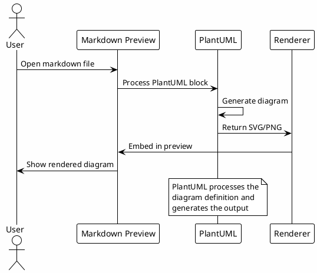
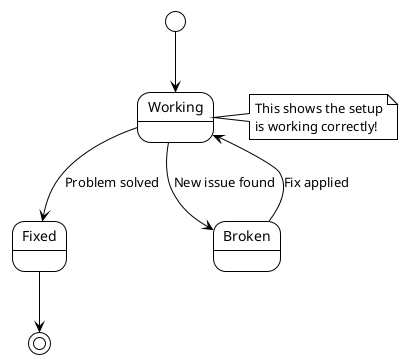

# PlantUML Test Document

This document tests PlantUML rendering in Markdown Preview Enhanced.

## Inline PlantUML Diagram

## Another Example - State Diagram

## Regular Markdown Content

This is regular markdown content that should render normally alongside the PlantUML diagrams. 